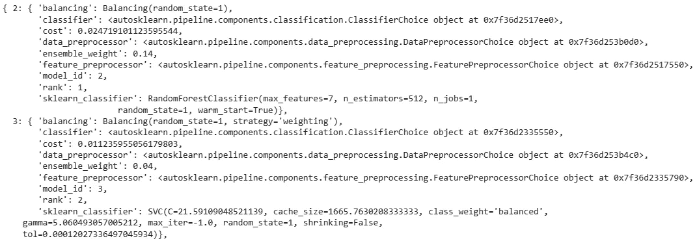

# Auto-Sklearn：如何通过自动化机器学习提升性能和效率

> 原文：[`towardsdatascience.com/auto-sklearn-how-to-boost-performance-and-efficiency-through-automated-machine-learning-2db116eafc8`](https://towardsdatascience.com/auto-sklearn-how-to-boost-performance-and-efficiency-through-automated-machine-learning-2db116eafc8)

## 了解如何利用 AutoML 来最大化你的机器学习工作流的结果

[](https://thomasdorfer.medium.com/?source=post_page-----2db116eafc8--------------------------------)[](https://towardsdatascience.com/?source=post_page-----2db116eafc8--------------------------------) [Thomas A Dorfer](https://thomasdorfer.medium.com/?source=post_page-----2db116eafc8--------------------------------)

·发布于 [数据科学前沿](https://towardsdatascience.com/?source=post_page-----2db116eafc8--------------------------------) ·阅读时间 6 分钟·2023 年 4 月 11 日

--


图片由作者提供。

由于选择合适的机器学习模型以完成特定的预测任务的挑战，[模型数量众多](https://machinelearningmastery.com/a-tour-of-machine-learning-algorithms/) 让我们感到熟悉。除此之外，我们还需要找到最佳的超参数，以最大化模型的性能。

这些挑战可以通过自动化机器学习，即[AutoML](https://www.automl.org/automl/)，在很大程度上得到解决。我说*在很大程度上*是因为，尽管名字中有“自动”一词，这个过程并不是*完全*自动化的，仍然需要用户进行一些手动调整和决策。

实质上，AutoML 使用户摆脱了数据预处理、模型选择、超参数优化和集成构建这些繁琐且耗时的任务。因此，这个工具包不仅节省了专家的宝贵时间，还使非技术用户能够进入机器学习领域。正如作者所说：

> 自动化机器学习提供了使机器学习对非机器学习专家可用的方法和过程，旨在提高机器学习的效率并加速机器学习领域的研究。

尽管市面上有许多 AutoML 包，例如 [AutoWEKA](http://www.cs.ubc.ca/labs/beta/Projects/autoweka/)、[Auto-PyTorch](https://github.com/automl/Auto-PyTorch) 或 [MLBoX](https://github.com/AxeldeRomblay/MLBox)，本文将重点关注 [**Auto-Sklearn**](https://automl.github.io/auto-sklearn/master/) —— 一个基于流行的 [scikit-learn](https://scikit-learn.org/stable/index.html) 包的库。

# 什么是 Auto-Sklearn？

Auto-Sklearn 是一个基于 Python 的开源库，它自动化了诸如数据和特征预处理、算法选择、超参数优化和集成构建等机器学习过程。为了实现这种高程度的自动化，该库利用了贝叶斯优化的最新进展，并考虑了在类似数据集上的过去表现。

更具体地说，它在三个关键方面改进了之前的方法。首先，它引入了**贝叶斯优化** [**Bayesian optimization**](https://en.wikipedia.org/wiki/Bayesian_optimization) 的概念，该概念通过利用从之前运行中获得的信息，允许在多个数据集上高效地调整超参数。此外，它还使**自动** [**集成构建**](https://en.wikipedia.org/wiki/Ensemble_learning)成为可能，这些模型通过贝叶斯优化被考虑，从而进一步提高模型性能。最后，Auto-Sklearn 配备了一个高度参数化的机器学习框架，集成了来自 [**scikit-learn**](https://scikit-learn.org/stable/) 的高性能分类器和预处理器，允许灵活且可定制的模型构建。

总的来说，Auto-Sklearn 包含 16 种分类器、14 种特征预处理方法和大量的数据预处理方法，这些方法共同形成了一个拥有 122 个超参数的假设空间。这些数字随着新版本的发布而不断变化。

这个库的实现非常简单。事实上，最棘手的部分是其 [安装](https://automl.github.io/auto-sklearn/master/installation.html)，因为它与 Windows 不兼容，并且在 Mac 上也报告了一些问题。因此，建议在 Linux 操作系统上运行它（提示： [Google Colab](https://colab.research.google.com/) 运行在 Linux 上，你可以将其作为实验的平台）。

安装完成后，Auto-Sklearn 只需四行代码即可运行：

```py
import autosklearn.classification

clf = autosklearn.classification.AutoSklearnClassifier()
clf.fit(X_train, y_train)
predictions = clf.predict(X_test)
```

然而，仍然建议进行一些手动调整和参数化，以使用户的意图与模型的输出保持一致。现在让我们看看 Auto-Sklearn 在实践中的使用方法。

# 实际示例

在这个例子中，我们将比较一个使用默认参数的单一分类器——在这种情况下，我选择了一个 [决策树分类器](https://scikit-learn.org/stable/modules/generated/sklearn.tree.DecisionTreeClassifier.html#sklearn.tree.DecisionTreeClassifier)——与 Auto-Sklearn 的分类器性能。为此，我们将使用公开的 *手写数字光学识别* [数据集](https://archive-beta.ics.uci.edu/dataset/80/optical+recognition+of+handwritten+digits)，每个样本由一个 8x8 的数字图像组成——因此，维度是 64。总的来说，这个数据集包含 1797 个样本，这些样本被分配到 10 个独特的类别（每个类别约 180 个样本）。

以下是这个数据集的一些样本：


图片由作者提供。数据使用的许可信息：[CC BY 4.0](https://creativecommons.org/licenses/by/4.0/legalcode)。

数据集可以加载到 Python 中，并按照以下方式划分为训练集和测试集：

```py
from sklearn import datasets
from sklearn.model_selection import train_test_split

X, y = datasets.load_digits(return_X_y=True)
X_train, X_test, y_train, y_test = train_test_split(X, y, random_state=42)
```

## 基准：决策树分类器

首先，让我们在这个数据集上训练一个具有默认参数的简单决策树，并查看在这些条件下它的表现如何。

```py
from sklearn.tree import DecisionTreeClassifier
from sklearn.metrics import accuracy_score

clf = DecisionTreeClassifier().fit(X_train, y_train)
y_pred = clf.predict(X_test)
accuracy_score(y_test, y_pred)
```

这个简单的方法得到了 86.67%的准确率——还不错，但并不特别出色。让我们看看是否可以用 Auto-Sklearn 超越这个结果。

## Auto-Sklearn

在运行之前，让我们先定义一些参数：

+   `time_left_for_this_task`：搜索总时长的时间限制（以秒为单位）。这个限制越高，找到更好模型的机会就越大。默认值为 3600，表示 1 小时。

+   `per_run_time_limit`：对机器学习模型单次调用的时间限制。如果算法超过这个限制，模型拟合将被终止。

+   `ensemble_size`：添加到集成中的模型数量。如果不需要集成拟合，可以设置为 1。

现在我们可以使用 Auto-Sklearn 拟合一个模型。我们将让任务运行 3 分钟，并将单次模型调用的时间限制设为 30 秒：

```py
import autosklearn.classification
from sklearn.metrics import accuracy_score

automl = autosklearn.classification.AutoSklearnClassifier(
    time_left_for_this_task = 3*60,
    per_run_time_limit = 30
)
automl.fit(X_train, y_train)
y_pred = automl.predict(X_test)
accuracy_score(y_test, y_pred)
```

这给了我们 98.67%的准确率——比我们简单的基准测试有了显著提升。

我们可以通过`sprint.statistics()`方法获取对训练过程的进一步见解：

```py
print(automl.sprint_statistics())
```


截图由作者提供。

例如，我们可以看到我们最佳的验证得分为 98.88%，其中 30 个算法中有 23 个成功运行，6 个超时，1 个超出了内存限制。基于此，我们可以增加时间限制参数，看看是否能进一步提高性能。

使用`leaderboard()`方法，我们还可以可视化所有评估模型的结果表（供参考：该表格在一张棒棒糖图中可视化，这也是本文的特色图片）：

```py
print(automl.leaderboard())
```


截图由作者提供。

关于进入集成模型的各个单独模型的更多细节，可以通过`show_models()`函数获取：

```py
from pprint import pprint
pprint(automl.show_models(), indent=2)
```



这里只展示了 15 个模型中的 2 个。截图由作者提供。

**注意：** 尽管集成模型确实可以提升模型的性能和鲁棒性，但它们也有一些缺点，如复杂性增加、训练时间增加以及缺乏可解释性。可以通过以下方式停用集成拟合：`ensemble_size=1`。

# Auto-Sklearn 2.0 —— 有什么新变化？

去年，Auto-Sklearn 进行了多项改进，并发布了一篇名为 *“Auto-Sklearn 2.0: 通过元学习实现无干预 AutoML”* 的[论文](https://www.jmlr.org/papers/volume23/21-0992/21-0992.pdf)。主要改进包括 (1) **早期停止**，提高了效率并确保即使训练超时也能得到结果，(2) **改进的模型选择策略**，包括多种方法来近似泛化误差以及添加 [贝叶斯优化和 Hyperband (BOHB)](https://www.automl.org/blog_bohb/)，这是一种用于大规模超参数优化的多功能工具，以及 (3) 通过元学习进行的自动策略选择，免除了用户选择 AutoML 系统配置的烦恼。

# 结论

总结来说，Auto-Sklearn 是一个强大且用户友好的库，免除了用户在数据和特征预处理、模型选择、超参数调整及（如果需要）集成构建中的繁琐和耗时的任务。这已被证明可以显著提高各种机器学习任务的性能和效率。尽管需要 *一些* 用户输入，Auto-Sklearn 仍然相当自动化，因此也允许新手和非技术用户用几行代码实现复杂的机器学习解决方案。

想自己尝试一下吗？查看由 AutoML 社区提供的[众多示例](https://automl.github.io/auto-sklearn/master/examples/index.html)。

## 更多资源

+   [AutoML | Auto-Sklearn](https://www.automl.org/automl/auto-sklearn/)

+   *文档:* [auto-sklearn — AutoSklearn 0.15.0 文档 (automl.github.io)](https://automl.github.io/auto-sklearn/master/)

+   *Auto-Sklearn 论文:* [高效且鲁棒的自动化机器学习 (neurips.cc)](https://proceedings.neurips.cc/paper_files/paper/2015/file/11d0e6287202fced83f79975ec59a3a6-Paper.pdf)

+   *Auto-Sklearn 2.0 论文:* [[2007.04074] Auto-Sklearn 2.0: 通过元学习实现无干预 AutoML (arxiv.org)](https://arxiv.org/abs/2007.04074)

+   *Auto-Sklearn 2.0 博客:* [AutoML | Auto-Sklearn 2.0: 下一代](https://www.automl.org/auto-sklearn-2-0-the-next-generation/)

## 喜欢这篇文章吗？

让我们联系吧！你可以在 [Twitter](https://twitter.com/ThomasADorfer)、[LinkedIn](https://www.linkedin.com/in/thomasdorfer/) 和 [Substack](https://thomasdorfer.substack.com/) 上找到我。

如果你想支持我的写作，可以通过 [Medium 会员](https://thomasdorfer.medium.com/membership)进行，这样你可以访问我的所有故事以及 Medium 上其他成千上万位作家的作品。

[](https://medium.com/@thomasdorfer/membership?source=post_page-----2db116eafc8--------------------------------) [## 通过我的推荐链接加入 Medium - Thomas A Dorfer

### 阅读 Thomas A Dorfer（以及 Medium 上成千上万位作家的）每一个故事。你的会员费用直接支持…

[medium.com](https://medium.com/@thomasdorfer/membership?source=post_page-----2db116eafc8--------------------------------)
