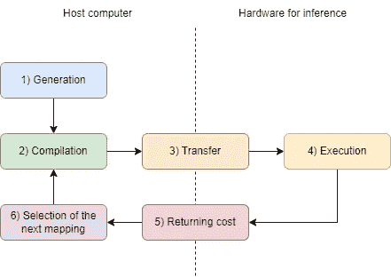

# 深度神经网络部署的自动调整

> 原文：[`towardsdatascience.com/auto-tuning-for-deep-neural-network-deployment-ff2324cb41d`](https://towardsdatascience.com/auto-tuning-for-deep-neural-network-deployment-ff2324cb41d)

## 什么，为什么，最重要的是……如何？

 [Federico Peccia](https://pecciaf.medium.com/?source=post_page-----ff2324cb41d--------------------------------)

·发表于 [Towards Data Science](https://towardsdatascience.com/?source=post_page-----ff2324cb41d--------------------------------) ·阅读时间 7 分钟·2023 年 9 月 1 日

--

图片由 [S. Tsuchiya](https://unsplash.com/@s_tsuchiya?utm_source=medium&utm_medium=referral) 提供，发布在 [Unsplash](https://unsplash.com/?utm_source=medium&utm_medium=referral)。

# 介绍

比较不同神经网络（NN）架构的指标之一是训练所需的时间。需要几个小时？几天？*几周*？通常，通过更新训练所用的硬件可以改善这一点。用更强大的 GPU 替换性能较差的 GPU，将训练过程并行化到多个 GPU 上等。推理步骤也会发生类似的情况。我们是否将训练好的网络部署到嵌入式设备上，如微控制器？还是运行在移动设备上？也许网络太大了，我们需要嵌入式 GPU 或甚至服务器级 GPU 才能执行。

让我们选择其中一个。我们将神经网络编译为我们的设备，并测试其运行速度。哦，不！它没有达到我们的延迟要求！我们需要神经网络的运行时间小于 1 秒，而我们的神经网络却需要 2 秒！现在有什么选择？

+   **用更强大的设备替换当前设备：** 这可能会非常麻烦，特别是在存在严格应用约束的情况下。也许你只能使用特定的、已认证的硬件。或者你有难以满足的能源约束。

+   **减少神经网络的复杂性：** 这可能也很困难，因为如果不小心，可能会损失神经网络的质量指标。

+   **为你的特定硬件自动调整神经网络。**

等等，这是什么？你所说的*自动调优*是什么意思？好吧，这就是本文的主题。继续阅读，了解这种令人着迷的技术。在这篇文章中，我将尝试从高层次的角度解释这个话题。如果你跟着我直到文章结束，你将会找到可以用来优化你的 NN 的软件框架示例，并附有它们教程的链接。

# 自动…为什么？

如果你阅读了[我上一篇文章](https://medium.com/towards-data-science/green-ai-methods-and-solutions-to-improve-ai-sustainability-861d69dec658)，你可能记得对计算机架构的一个非常简单的解释。在其中，我讨论了两个元素：计算单元和内存单元。

为了执行神经网络的一层，需要将数据在内存层次结构中传输，直到它到达计算单元。然后，计算单元将执行所需的数学操作，结果将存储在内存层次结构的某个级别。

我们将执行一个神经网络（NN）层的成本定义为表示推理质量的指标。例如，最常见的指标之一是延迟，即完成层执行所需的时间。另一个指标可能是能耗。

现在，有两个不同的方面会影响这个指标：

+   实际执行数学操作的成本

+   跨内存层次结构移动数据的成本

根据可用的硬件，计算单元可以非常复杂，也可以非常简单，或者在同一硬件上甚至可以有不同的计算单元。例如，第一个类型的例子是一个脉动阵列，它是一个复杂的数字电路，能够并行执行多个数学操作（如果你对这个话题感兴趣，可以查看[我的文章](https://medium.com/towards-data-science/accelerating-neural-networks-on-hardware-baa3c14cd5ba)）。一个简单的例子是一个算术逻辑单元（ALU），它能够在每个时间步长中仅执行两个元素之间的一个数学操作（例如，加法或乘法）。因此，第一个方面是选择在每个时间步长中需要插入到每个计算单元中的数据。

另一个方面是将数据从内存移动到计算单元。从最后一级内存级别到更接近的内存级别移动的数据越少越好。因此，主要的思想是尽可能少地移动数据，然后尽可能多地重用它。

让我们看一个例子来说明这一点，好吗？现在，我们想在这个硬件上执行以下数学操作，这被称为 1D 卷积：

如动画所示，基本思想是我们将滤波器叠加在输入上，每个时间步，我们将滤波器向右移动。在每个时间步，我们逐元素地将输入与滤波器相乘，并将结果累加在一起。这是一个典型的操作，在其 2D 版本中是卷积神经网络（CNN）中使用的基础操作。

我将提出一个理论硬件，*仅用于说明目的*，具有以下元素和成本（参考 1D 卷积所需的基本数学操作）：

+   计算单元 1：成本为 5。

+   计算单元 2：成本为 2。

+   内存级别 1：读取和写入每个元素的成本为 1，但我们只能在此处同时存储 8 个元素。

+   内存级别 2：读取和写入每个元素的成本为 4，我们可以在此处存储层所需的所有元素。

我们如何在这种理论硬件上运行 1D 卷积？例如，我们可以使用选项 A：

但我们也可以使用选项 B：

如你所见，**我们可以以不同的方式映射相同的操作，从而获得不同的成本**。选项 B 成本较低，不仅因为它使用了计算单元 2，还因为我改变了内存级别 1 中数据的重用方式。

# 自动…什么？

但如果没有硬件模型来获得成本，或者硬件太复杂而无法进行这种手动分析怎么办？我们需要一种方法来自动化特定操作在特定硬件上的最佳映射的搜索。这被称为 *自动调优*。这是一个我们**自动化**这种搜索的过程。

这对于整个神经网络如何工作？我们从预训练模型开始，并从中提取所有需要执行的不同操作。然后，对于每个操作，我们在主机计算机上运行搜索过程，方法是：

1.  为选定的数学操作生成新的映射提议

1.  为我们想运行推理的特定硬件编译映射提议

1.  将编译映射发送到硬件，在那里我们将测量其成本

1.  执行提议的编译映射

1.  读取执行成本

1.  选择下一个要测试的映射，并返回第 2 步

图片由作者提供。自动调优过程的示意图

这里一个有趣的点是：我们如何实际选择下一步测试的映射（第 6 点）？嗯，可以尝试网格搜索方法，测试所有可能的映射。但这通常太慢，因为可能的映射提议的搜索空间可能太大，无法测试所有的映射。

另一种可能性是使用某种算法来指导选择下一个要测试的映射提案，而不是盲目地测试所有内容。主要目标是减少实际执行的映射提案数量，并尽量使用最少的测量次数找到最佳解决方案。这可以通过使用遗传算法或强化学习等方法来实现，从过去的测量中学习并预测未来测量的性能，从而能够舍弃*可能*不好的映射提案，仅尝试最有前景的。等一下，我们是在用 AI 优化 AI 吗？是的！这不是很棒吗？

# 自动……怎么做？

好的，这听起来很有前途，但我们*实际上*该怎么做呢？我们需要一种软件，允许我们定义需要对操作应用的不同转换，以获取不同的映射提案。我们需要自己编写这个搜索程序吗？

当然不是！有很多论文提出了建模技术和方法来解决自动调优过程，这是一个非常活跃的研究领域。像 Bolt [1]、Lorien [2]、Ansor [3] 或 Chameleon [4] 等作品就是解决这个问题的例子。

如果你正在寻找一些**实用**的框架，这些框架建立在类似的工作基础上，并提供如何运行此过程的教程和文档，我建议你查看以下内容：

+   **TVM [5]:** 一个端到端的编译器，接受来自不同框架的模型作为输入（PyTorch、Tensorflow Lite、Tensorflow、Keras、ONNX 等），并能够优化和部署网络以支持越来越多的目标（GPU、微控制器、自定义加速器等）。可以使用其 [AutoTVM](https://tvm.apache.org/docs/tutorial/autotvm_relay_x86.html#sphx-glr-tutorial-autotvm-relay-x86-py) 或 [AutoScheduler](https://tvm.apache.org/docs/tutorial/auto_scheduler_matmul_x86.html#sphx-glr-tutorial-auto-scheduler-matmul-x86-py) 模块来优化程序。

+   **TensorComprehensions [6]:** 提供基于遗传算法的自动调优器，并与 [PyTorch](https://facebookresearch.github.io/TensorComprehensions/framework/pytorch_integration/writing_layers.html#autotuning) 集成。

+   **Tiramisu [7]:** 一个多面体编译器，能够针对 NVIDIA GPU、Xilinx FPGA 和多核 x86 CPU。教程可以在 [这里](https://github.com/Tiramisu-Compiler/tiramisu/tree/master/tutorials) 找到。

# 结论

如果你的神经网络在资源受限的硬件上未能达到所需的性能，不要放弃！有一些技术可以提高其性能，例如本文中描述的自动调优方法。这并不是仅在科学论文中出现的神秘技术；一些提供的软件框架已经包括了几乎即插即用的教程。

试试看，如果你觉得有用，请在评论中告诉我！

欢迎在[LinkedIn](https://www.linkedin.com/in/fpecc/)上关注我，并告诉我你对这篇文章的看法，或者如果你真的喜欢这篇文章，可以[请我喝咖啡](https://www.buymeacoffee.com/pecciaf)！

感谢阅读！

# 参考文献

+   [[1] Jiarong Xing, “Bolt: 架起自动调优器与硬件本地性能之间的桥梁”，2021.](https://arxiv.org/abs/2110.15238)

+   [[2] Cody Hao Yu, “Lorien: 高效的深度学习工作负载交付”，2021.](https://dl.acm.org/doi/abs/10.1145/3472883.3486973)

+   [[3] Lianmin Zheng, “Ansor: 为深度学习生成高性能张量程序”，2020.](https://arxiv.org/abs/2006.06762)

+   [[4] Byung Hoon Ahn, “Chameleon: 适应性代码优化以加速深度神经网络编译”，2019.](https://openreview.net/forum?id=rygG4AVFvH)

+   [[5] Tianqi Chen, “TVM: 一个自动化的端到端深度学习优化编译器”，2018.](https://arxiv.org/abs/1802.04799)

+   [[6] Nicolas Vasilache, “Tensor Comprehensions: 框架无关的高性能机器学习抽象”，2018.](https://arxiv.org/abs/1802.04730)

+   [[7] Riyadh Baghdadi, “Tiramisu: 一个用于表达快速且可移植代码的多面体编译器”，2018.](https://arxiv.org/abs/1804.10694)
