# 使用 GitHub Actions 自动化机器学习部署

> 原文：[`towardsdatascience.com/automate-machine-learning-deployment-with-github-actions-f752766981b1`](https://towardsdatascience.com/automate-machine-learning-deployment-with-github-actions-f752766981b1)

## 更快的市场推出时间和提高效率

[](https://khuyentran1476.medium.com/?source=post_page-----f752766981b1--------------------------------)[](https://towardsdatascience.com/?source=post_page-----f752766981b1--------------------------------) [Khuyen Tran](https://khuyentran1476.medium.com/?source=post_page-----f752766981b1--------------------------------)

·发表于 [Towards Data Science](https://towardsdatascience.com/?source=post_page-----f752766981b1--------------------------------) ·8 分钟阅读·2023 年 4 月 16 日

--

# 动机

设想这样一种情况：每个月都会开发出更准确的机器学习模型，并将其添加到主分支中。

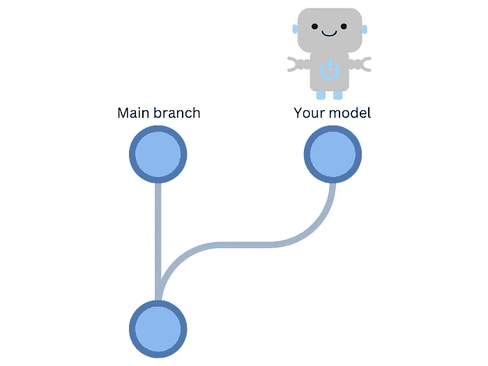

作者提供的图片

要部署模型，你必须将其下载到你的机器上，打包，并进行部署。

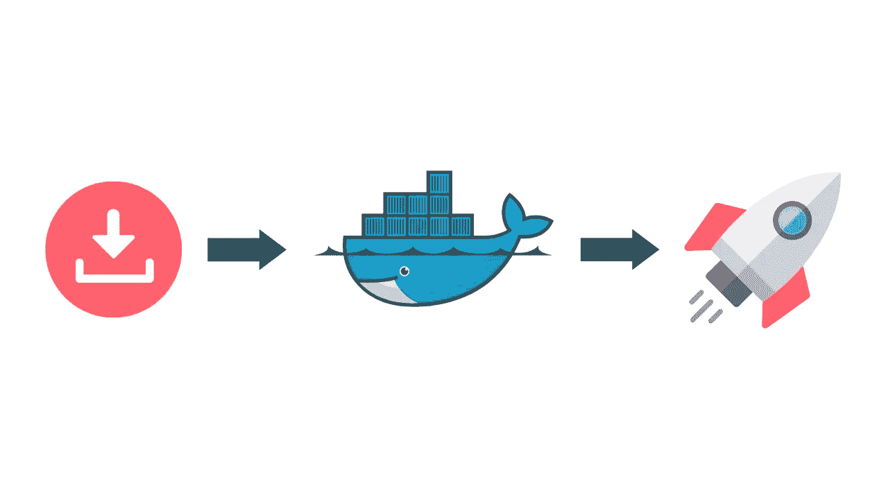

作者提供的图片

然而，由于你可能还有其他责任，完成部署可能需要几天甚至几周，这会减缓发布过程，并占用本可以用于其他任务的宝贵时间。

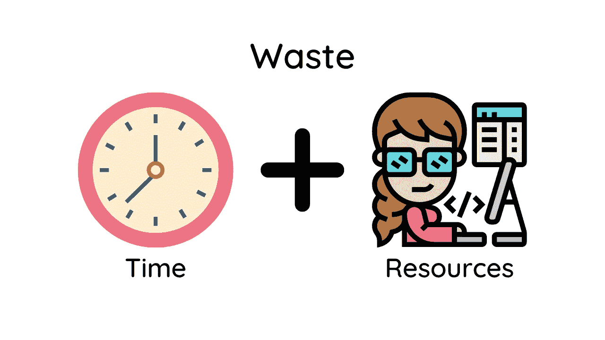

作者提供的图片

如果每次将新版本推送到主分支时，模型能够自动部署到生产环境，那该有多好呢？这就是持续部署派上用场的地方。

# 什么是持续部署？

在上一篇文章中，我们讨论了如何使用持续集成（CI）来测试代码更改，以便在合并到主分支之前进行验证。

[](/build-reliable-machine-learning-pipelines-with-continuous-integration-ea822eb09bf6?source=post_page-----f752766981b1--------------------------------) ## 使用持续集成构建可靠的机器学习管道

### 使用持续集成自动化机器学习工作流

towardsdatascience.com

在代码和模型经过成功测试后，可以利用持续部署（CD）自动将新模型部署到生产环境。自动化模型部署可以提供许多好处，包括：

1.  **更快的市场推出时间**：持续部署减少了将新的机器学习模型发布到生产环境所需的时间。

1.  **提高效率**：自动化部署过程减少了将机器学习模型部署到生产环境所需的资源。

本文将向你展示如何为机器学习项目创建一个 CD 管道。

随意在这里试玩和分叉本文的源代码：

[](https://github.com/khuyentran1401/cicd-mlops-demo/?source=post_page-----f752766981b1--------------------------------) [## GitHub - khuyentran1401/cicd-mlops-demo: 机器学习项目中的 CI/CD 演示]

### CI/CD（持续集成/持续部署）是任何软件开发项目中的一个重要实践……

github.com](https://github.com/khuyentran1401/cicd-mlops-demo/?source=post_page-----f752766981b1--------------------------------)

# 构建 CD 管道

要构建 CD 管道，我们将执行以下步骤：

1.  保存模型对象和模型元数据

1.  上传模型到远程存储

1.  设置一个平台以部署你的模型

1.  创建一个 GitHub 工作流，将模型部署到生产环境

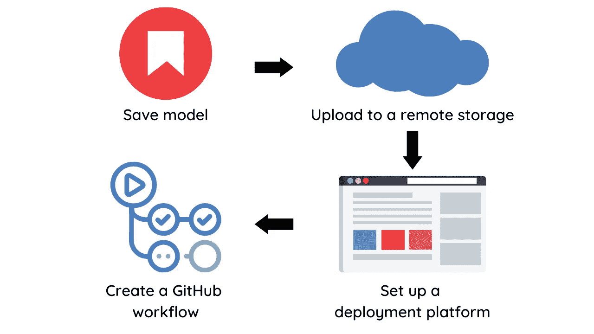

作者提供的图片

让我们详细探讨每一个步骤。

## 保存模型

我们将使用 [MLEM](https://mlem.ai/)，一个开源工具，来保存和部署模型。

使用 MLEM 保存实验的模型时，首先调用其 `save` 方法。

```py
from mlem.api import save
...

# instead of joblib.dump(model, "model/svm")
save(model, "model/svm", sample_data=X_train)
```

> [完整脚本。](https://github.com/khuyentran1401/cicd-mlops-demo/blob/main/src/train.py)

运行此脚本将创建两个文件：一个模型文件和一个元数据文件。

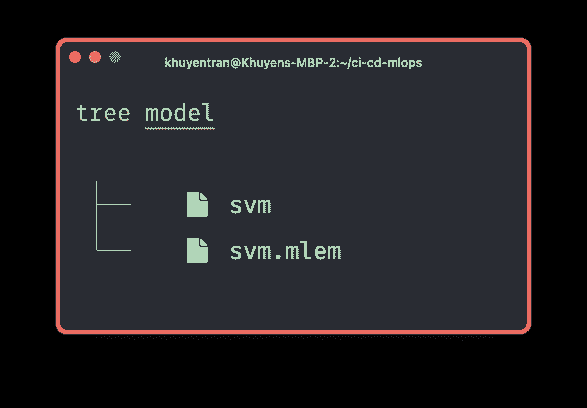

作者提供的图片

元数据文件记录了模型对象的各种信息，包括：

+   模型工件，例如模型的大小和哈希值，这些对于版本控制非常有用

+   模型方法，如`predict`和`predict_proba`

+   输入数据模式

+   用于训练模型的 Python 需求

```py
artifacts:
  data:
    hash: ba0c50b412f6b5d5c5bd6c0ef163b1a1
    size: 148163
    uri: svm
call_orders:
  predict:
  - - model
    - predict
object_type: model
processors:
  model:
    methods:
      predict:
        args:
        - name: X
          type_:
            columns:
            - ''
            - fixed acidity
            - volatile acidity
            - citric acid
            - residual sugar
            - ...
            dtypes:
            - int64
            - float64
            - float64
            - float64
            - float64
            - ...
            index_cols:
            - ''
            type: dataframe
        name: predict
        returns:
          dtype: int64
          shape:
          - null
          type: ndarray
        varkw: predict_params
    type: sklearn_pipeline
requirements:
- module: numpy
  version: 1.24.2
- module: pandas
  version: 1.5.3
- module: sklearn
  package_name: scikit-learn
  version: 1.2.2
```

> [查看元数据文件。](https://github.com/khuyentran1401/cicd-mlops-demo/blob/main/model/svm.mlem)

## 将模型推送到远程存储

通过将模型推送到远程存储，我们可以将我们的模型和数据存储在一个集中位置，GitHub 工作流可以访问该位置。


作者提供的图片

我们将使用 [DVC](https://dvc.org/) 来进行模型管理，因为它提供了以下好处：

1.  **版本控制**：DVC 使得跟踪模型和数据的变化变得容易，方便回滚到之前的版本。

1.  **存储**：DVC 可以将模型和数据存储在不同类型的存储系统中，例如 Amazon S3、Google Cloud Storage 和 Microsoft Azure Blob Storage。

1.  **可重复性**：通过对数据和模型进行版本控制，实验可以使用完全相同的数据和模型版本轻松重现。

[](/introduction-to-dvc-data-version-control-tool-for-machine-learning-projects-7cb49c229fe0?source=post_page-----f752766981b1--------------------------------) [## DVC 介绍：机器学习项目的数据版本控制工具]

### 就像 Git，但有数据！

towardsdatascience.com

要将 DVC 与 MLEM 集成，我们可以使用 [DVC pipeline](https://dvc.org/doc/start/data-management/data-pipelines)。通过 DVC pipeline，我们可以在 `dvc.yaml` 文件中指定创建某些输出所需的命令、依赖项和参数。

```py
stages:
  train:
    cmd: python src/train.py
    deps:
      - data/intermediate
      - src/train.py
    params:
      - data
      - model
      - train
    outs:
      - model/svm
      - model/svm.mlem:
          cache: false
```

> [查看完整文件。](https://github.com/khuyentran1401/cicd-mlops-demo/blob/main/dvc.yaml)

在上述示例中，我们在 `outs` 字段下指定了 `model/svm` 和 `model/svm.mlem` 作为输出。具体来说，

+   `model/svm` 被缓存，因此会上传到 DVC 远程存储，但不会提交到 Git。这确保了大型二进制文件不会减慢仓库的性能。

+   `mode/svm.mlem` 没有被缓存，因此不会上传到 DVC 远程存储，但会提交到 Git。这使我们能够跟踪模型的变化，同时保持仓库的大小较小。

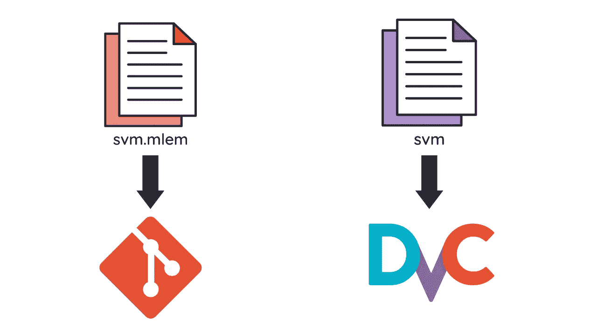

作者提供的图片

要运行管道，请在终端中输入以下命令：

```py
$ dvc exp run

Running stage 'train':                                                                                                                          
> python src/train.py
```

接下来，在文件 `.dvc/config` 中指定模型将被上传到的远程存储位置：

```py
['remote "read"']
    url = https://winequality-red.s3.amazonaws.com/
['remote "read-write"']
    url = s3://your-s3-bucket/
```

要将修改后的文件推送到名为“read-write”的远程存储位置，只需运行：

```py
dvc push -r read-write
```

## 设置一个平台来部署你的模型

接下来，让我们找一个平台来部署我们的模型。MLEM 支持将模型部署到以下平台：

+   Docker

+   Heroku

+   Fly.io

+   Kubernetes

+   Sagemaker

该项目选择了 [Fly.io](https://fly.io/) 作为部署平台，因为它易于入门且便宜。

要在 GitHub 工作流中创建 Fly.io 应用程序，你需要一个访问令牌。以下是如何获取一个的步骤：

1.  注册一个 [Fly.io](https://fly.io/) 账户（你需要提供信用卡信息，但在超出免费额度之前，他们不会收费）。

1.  登录后，点击右上角的“账户”按钮下的“访问令牌”。

1.  创建一个新的访问令牌并复制以备后用。

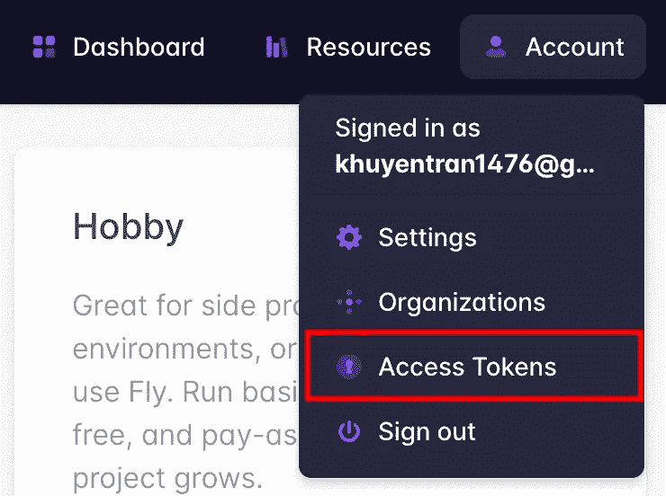

作者提供的图片

## 创建一个 GitHub 工作流

现在进入激动人心的部分：创建一个 GitHub 工作流来部署你的模型！如果你对 GitHub 工作流不熟悉，我推荐阅读 [这篇文章](https://docs.github.com/en/actions/learn-github-actions/understanding-github-actions) 以快速了解。

我们将在文件 `.github/workflows/publish.yaml` 中创建一个名为 `publish-model` 的工作流：

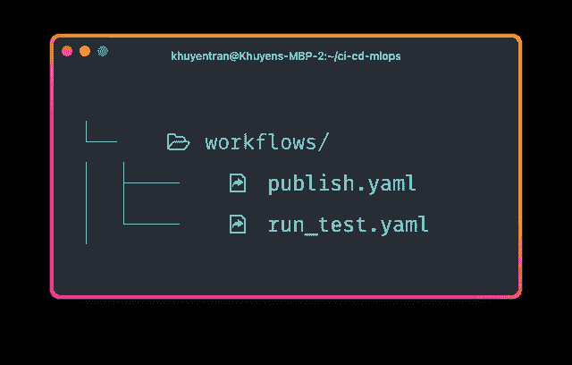

作者提供的图片

文件内容如下：

```py
name: publish-model

on:
  push:
    branches:
        - main
    paths:
        - model/svm.mlem

jobs:
  publish-model:
    runs-on: ubuntu-latest

    steps:
      - name: Checkout 
        uses: actions/checkout@v2

      - name: Environment setup
        uses: actions/setup-python@v2
        with:
          python-version: 3.8

      - name: Install dependencies
        run: pip install -r requirements.txt

      - name: Download model
        env:
          AWS_ACCESS_KEY_ID: ${{ secrets.AWS_ACCESS_KEY_ID }}
          AWS_SECRET_ACCESS_KEY: ${{ secrets.AWS_SECRET_ACCESS_KEY }}
        run: dvc pull model/svm -r read-write

      - name: Setup flyctl
        uses: superfly/flyctl-actions/setup-flyctl@master

      - name: Deploy model
        env:
          FLY_API_TOKEN: ${{ secrets.FLY_API_TOKEN }}
        run: mlem deployment run flyio svm-app --model model/svm
```

`on` 字段指定了管道在推送到主分支时触发。

`publish-model` 任务包括以下步骤：

+   检出代码

+   设置 Python 环境

+   安装依赖

+   使用 DVC 从远程存储位置拉取模型

+   设置 flyctl 以使用 Fly.io

+   将模型部署到 Fly.io

请注意，为了使工作正常运行，需要以下内容：

+   用于拉取模型的 AWS 凭证

+   用于部署模型的 Fly.io 访问令牌

为了确保在我们的仓库中安全存储敏感信息，并使 GitHub Actions 能够访问这些信息，我们将使用 [加密密钥](https://docs.github.com/en/actions/security-guides/encrypted-secrets)。

要创建加密的密钥，点击“设置” -> “操作” -> “新建仓库密钥”。

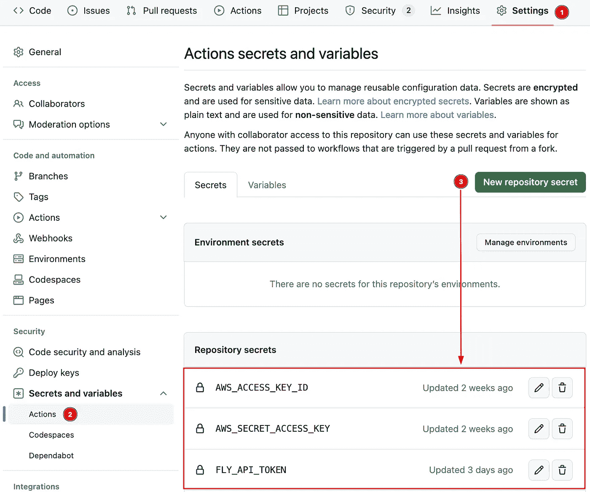

作者提供的图片

就这样！现在让我们尝试一下这个项目，看看它是否按预期工作。

# 试用

按照 [这个 GitHub 仓库](https://github.com/khuyentran1401/cicd-mlops-demo#try-it-out)中的说明来试用项目。

一旦在仓库中创建了拉取请求，将启动一个 GitHub 工作流来对代码和模型进行测试。所有测试成功通过后，拉取请求将被合并。

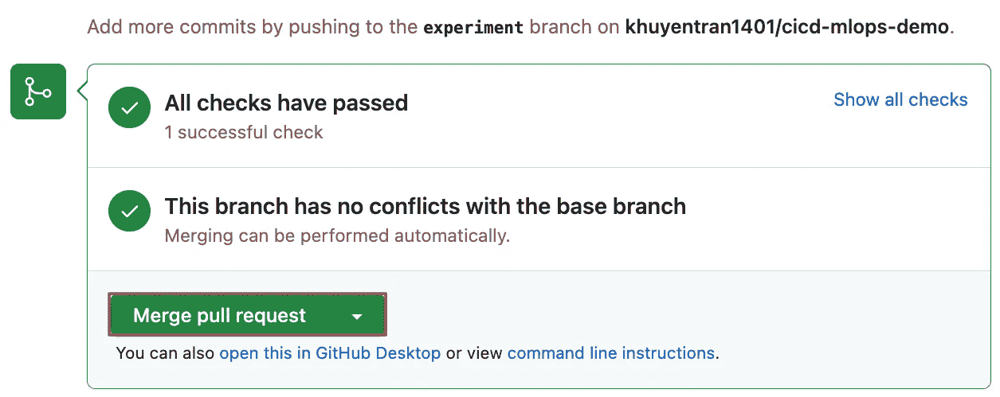

作者提供的图片

一旦更改被合并，将会触发一个 CD 管道来部署 ML 模型。

要查看工作流运行情况，点击工作流，然后点击`publish-model`任务。

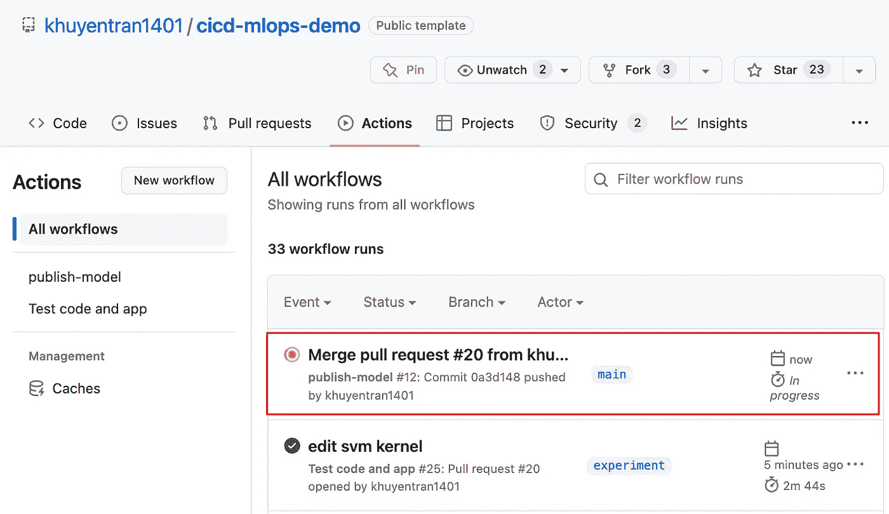

作者提供的图片

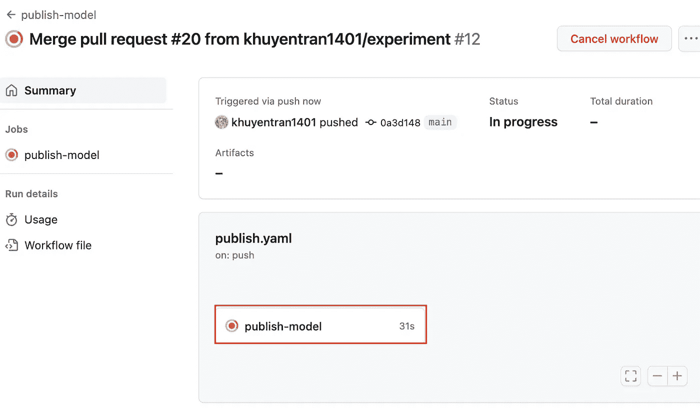

作者提供的图片

点击“部署模型”步骤下方的链接，以查看模型部署到的网站。

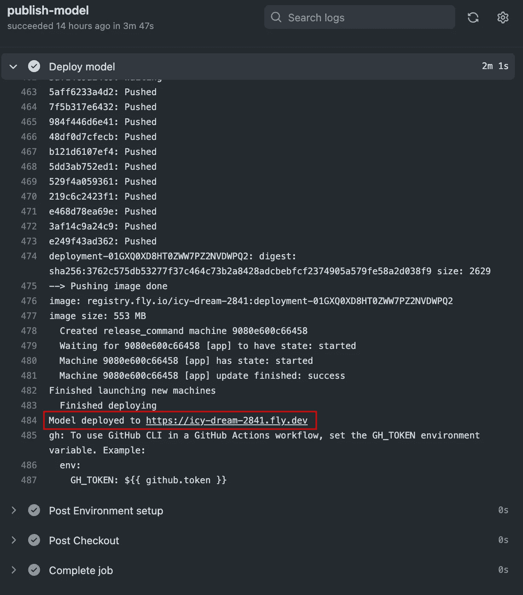

作者提供的图片

这是网站的样子。点击“试用”来在样本数据集上测试模型。

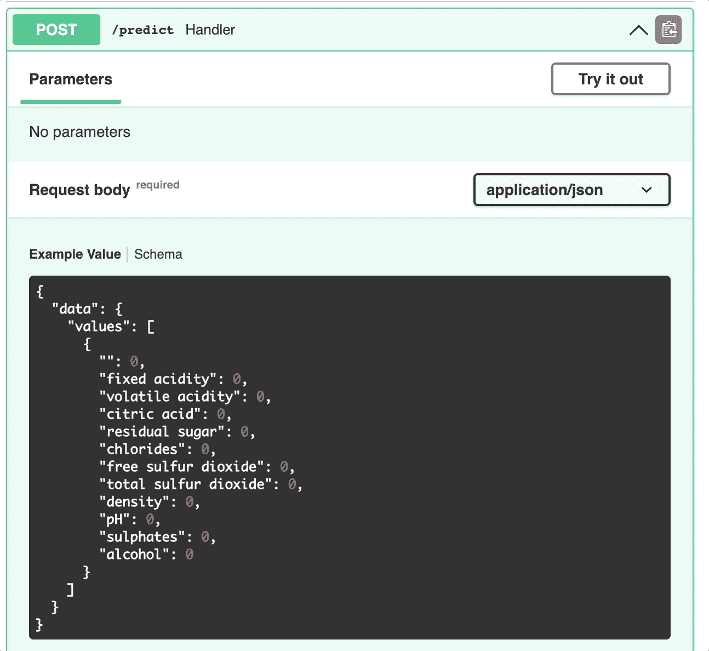

作者提供的图片

> [查看网站。](https://icy-dream-2841.fly.dev/)

# 结论

恭喜！你刚刚学会了如何创建一个 CD 管道来自动化你的机器学习工作流。将 CD 与 CI 结合，可以让你的公司更早发现错误，降低成本，并缩短上市时间。

我喜欢写关于数据科学的概念和玩各种数据科学工具。你可以在 [LinkedIn](https://www.linkedin.com/in/khuyen-tran-1401/) 和 [Twitter](https://twitter.com/KhuyenTran16) 上与我联系。

如果你想查看我写的文章的代码，请给 [这个仓库](https://github.com/khuyentran1401/Data-science) 点个星。关注我在 Medium 上的最新数据科学文章：

[](https://pub.towardsai.net/github-actions-in-mlops-automatically-check-and-deploy-your-ml-model-9a281d7f3c84?source=post_page-----f752766981b1--------------------------------) [## GitHub Actions 在 MLOps 中：自动检查和部署你的 ML 模型

### 使用 GitHub Actions 自动化你的 ML 管道

[验证你的 pandas DataFrame 使用 Pandera](https://pub.towardsai.net/github-actions-in-mlops-automatically-check-and-deploy-your-ml-model-9a281d7f3c84?source=post_page-----f752766981b1--------------------------------) [## 使用 Pandera 验证你的 pandas DataFrame]

### 确保你的数据符合预期

[验证你的 pandas DataFrame 使用 Pandera](https://towardsdatascience.com/validate-your-pandas-dataframe-with-pandera-2995910e564?source=post_page-----f752766981b1--------------------------------) [## 创建可观察且可复现的笔记本使用 Hex]

### 如何将笔记本集成到你的数据管道中

[在 BigQuery 上使用 Fugue 和 Python 简化数据科学工作流程](https://towardsdatascience.com/create-observable-and-reproducible-notebooks-with-hex-460e75818a09?source=post_page-----f752766981b1--------------------------------) [## 简化数据科学工作流程]

### 加快迭代速度并降低计算成本

[在 BigQuery 上使用 Fugue 和 Python 简化数据科学工作流程](https://towardsdatascience.com/simplify-data-science-workflows-on-bigquery-with-fugue-and-python-5215a1b65e43?source=post_page-----f752766981b1--------------------------------)
