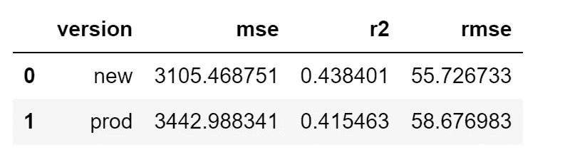

# 使用 MLflow 在 Databricks 中自动化 ML 模型的再训练和部署

> 原文：[`towardsdatascience.com/automate-ml-model-retraining-and-deployment-with-mlflow-in-databricks-ad29f6146f80?source=collection_archive---------2-----------------------#2023-03-15`](https://towardsdatascience.com/automate-ml-model-retraining-and-deployment-with-mlflow-in-databricks-ad29f6146f80?source=collection_archive---------2-----------------------#2023-03-15)

## 高效管理和部署生产模型使用 MLflow

[](https://medium.com/@mc12338?source=post_page-----ad29f6146f80--------------------------------)[](https://towardsdatascience.com/?source=post_page-----ad29f6146f80--------------------------------) [Matt Collins](https://medium.com/@mc12338?source=post_page-----ad29f6146f80--------------------------------)

·

[关注](https://medium.com/m/signin?actionUrl=https%3A%2F%2Fmedium.com%2F_%2Fsubscribe%2Fuser%2Fd1970f1605f1&operation=register&redirect=https%3A%2F%2Ftowardsdatascience.com%2Fautomate-ml-model-retraining-and-deployment-with-mlflow-in-databricks-ad29f6146f80&user=Matt+Collins&userId=d1970f1605f1&source=post_page-d1970f1605f1----ad29f6146f80---------------------post_header-----------) 发表在 [Towards Data Science](https://towardsdatascience.com/?source=post_page-----ad29f6146f80--------------------------------) ·8 分钟阅读·2023 年 3 月 15 日[](https://medium.com/m/signin?actionUrl=https%3A%2F%2Fmedium.com%2F_%2Fvote%2Ftowards-data-science%2Fad29f6146f80&operation=register&redirect=https%3A%2F%2Ftowardsdatascience.com%2Fautomate-ml-model-retraining-and-deployment-with-mlflow-in-databricks-ad29f6146f80&user=Matt+Collins&userId=d1970f1605f1&source=-----ad29f6146f80---------------------clap_footer-----------)

--

[](https://medium.com/m/signin?actionUrl=https%3A%2F%2Fmedium.com%2F_%2Fbookmark%2Fp%2Fad29f6146f80&operation=register&redirect=https%3A%2F%2Ftowardsdatascience.com%2Fautomate-ml-model-retraining-and-deployment-with-mlflow-in-databricks-ad29f6146f80&source=-----ad29f6146f80---------------------bookmark_footer-----------)

图片来源：[Karsten Winegeart](https://unsplash.com/es/@karsten116?utm_source=medium&utm_medium=referral) 在 [Unsplash](https://unsplash.com/?utm_source=medium&utm_medium=referral)

将一个可工作的机器学习模型部署给用户使用是一个伟大的成就。我们看到[统计数据](https://www.gartner.com/en/newsroom/press-releases/2018-02-13-gartner-says-nearly-half-of-cios-are-planning-to-deploy-artificial-intelligence)显示，机器学习模型常常未能投入生产，无论是由于数据不足、缺乏方向还是其他原因。

已经投入生产的模型仍然面临许多挑战，因为它们需要持续的关注，包括监控和重新训练，以确保它们所提供的见解随时间保持最新和准确。

本博客旨在帮助简化使用 MLflow 的模型重新训练过程，同时提供推荐方法的背景。

# 为什么要重新训练生产模型？

模型重新训练是给我们的生产模型提供最新数据以进行最新预测的过程。根据我们系统的复杂性，我们可能在各种场景下执行这种重新训练，例如：

+   在定期时间间隔：例如每周安排一次。

+   根据特定标准：[数据漂移](https://www.databricks.com/blog/2019/09/18/productionizing-machine-learning-from-deployment-to-drift-detection.html)达到阈值条件可能导致我们重新训练以适应不断变化的数据环境。

+   注册新模型时：我们的数据科学家找到了一种更准确的模型，并已获批准上线。

# MLflow

模型重新训练属于机器学习操作（MLOps）过程，MLflow 是一个很好的工具，可以以迭代的方式简化这一过程，实现更顺畅的交付和可重复的执行。

如果你对 MLflow 不熟悉，网上有许多详细的资源可供参考，但我建议从他们的[网站](https://mlflow.org/)开始，以了解他们的产品——我在下面包含了作为介绍的组件。

我们将利用 MLflow 的[跟踪](https://mlflow.org/docs/latest/tracking.html)组件来记录我们的重新训练实验运行，以及[模型注册表](https://mlflow.org/docs/latest/model-registry.html)组件来确保部署顺利，并减少我们生产环境中停机的需求。

# 前提条件

由于我们讨论的是重新训练，我们假设你已经在生产中有一个模型（以及你希望预测的数据）。如果没有，并且你希望使用 MLflow 来实现这一目标，我提供了[这个笔记本](https://github.com/MattPCollins/MLflowRetrainModel/blob/main/MLflowDeployModel.ipynb)作为起点。我们将在“将初始模型部署到生产”部分详细回顾这个过程和代码。

为了方便，我们将使用带有 ML 计算集群的 Databricks 工作区，因为这为我们提供了一个托管环境，其中安装了所有所需的软件包、嵌入了 MLflow 界面，并且有一个 Spark 环境，以协助任何大数据查询（如有必要）。

Databricks 可通过大多数云提供商获得——我将使用 Microsoft Azure。如果在本地运行 MLflow，则确保所有相关软件包已安装，并且设置了 MLflow 追踪服务器。

我在下面分解了这些要求：

+   运行 ML 计算集群的 Databricks 工作区，模拟生产环境。

+   源数据：在生产环境中，我预计这些将是我们数据仓库或数据湖中的表格。我们将使用 Scikit-learn 包中的糖尿病数据集作为示例。

+   一个现有的机器学习模型，我们将其保存为模型注册表中的生产模型（代码示例见下）。

# 将初始模型部署到生产环境中

以下代码块显示了 Ridge 回归模型的实验运行。有关完整笔记本，请参见我 [GitHub Repo](https://github.com/MattPCollins/MLflowRetrainModel/blob/main/MLflowDeployModel.ipynb) 中的此链接。此示例旨在为您提供一个“生产”模型，您可以基于此模型进行重新训练过程。

```py
# Start MLflow run for this experiment

# End any existing runs
mlflow.end_run()

with mlflow.start_run() as run:
  # Turn autolog on to save model artifacts, requirements, etc.
  mlflow.autolog(log_models=True)

  diabetes_X = diabetes.data
  diabetes_y = diabetes.target

  # Split data into test training sets, 3:1 ratio
  diabetes_X_train, diabetes_X_test, diabetes_y_train, diabetes_y_test = train_test_split(diabetes_X, diabetes_y, test_size=0.25, random_state=42)

  alpha = 1
  solver = 'cholesky'
  regr = linear_model.Ridge(alpha=alpha,solver=solver)

  regr.fit(diabetes_X_train, diabetes_y_train)

  diabetes_y_pred = regr.predict(diabetes_X_test)

  # Log desired metrics
  mlflow.log_metric("mse", mean_squared_error(diabetes_y_test, diabetes_y_pred))
  mlflow.log_metric("rmse", sqrt(mean_squared_error(diabetes_y_test, diabetes_y_pred)))
  mlflow.log_metric("r2", r2_score(diabetes_y_test, diabetes_y_pred))
```

使用 MLflow API 命令将其推送到你的模型注册表中进行生产部署。

```py
model_uri = "dbfs:/databricks/mlflow-tracking/<>/<>/artifacts/model"
desc = 'Initial model deployment'
new_run_id = run.info.run_id
client.create_model_version(name, model_uri, new_run_id, description=desc)
version = client.search_model_versions("run_id='{}'".format(new_run_id))[0].version
client.transition_model_version_stage(name, version, "Production")
```

# 找到合适的方法：部署代码与部署模型

为了了解我们的重新训练笔记本可能是什么样的，我们需要了解所采取的方法。微软讨论了两种部署模式，我在下面总结了这些。更多详细信息请参见 [此处](https://learn.microsoft.com/en-us/azure/databricks/machine-learning/mlops/deployment-patterns)。

## 部署代码

+   ML 工件被打包为从部署到生产的代码。

+   可以实现版本控制和测试。

+   部署环境在生产中得到复制，降低了生产问题的风险。

+   生产模型是针对生产数据进行训练的。

+   附加的部署复杂性。

## 部署模型

+   独立的工件（机器学习模型）被部署到生产环境中。

+   灵活性部署到不同类型的环境或集成不同的服务。

+   部署过程中的简单性。

+   快速部署时间，轻松版本管理。

+   特征工程、监控等的更改和增强需要单独管理。

我们将采取推荐的部署代码方法。这非常适合我们要实现的目标：我们可以使用已准备好的、得到利益相关者批准的生产脚本来进行重新训练。

**我们没有更改模型中的任何参数值：我们只是针对最新数据重新训练模型。**

从设置实验和我们要重新训练的模型开始。

```py
# Import packages
from mlflow.client import MlflowClient

# Set the experiment name to an experiment in the shared experiments folder
mlflow.set_experiment("/diabetes_regression_lab")

client = MlflowClient()

# Set model name
name = 'DiabetesRegressionLab'
```

加载数据集。如前所述，我们通过使用 scikit-learn 包中的糖尿病数据集来简化这个要求。实际上，这可能是对表的选择语句。

```py
# Load the diabetes dataset
diabetes = datasets.load_diabetes()
```

在这种情况下，我们模拟了模型重训练发生在数据变化后，可能是几天后。为了模拟这个时间差，当前注册的生产模型已经在数据的一个子集上进行了训练（1.），我们使用完整的数据集来展示随时间增加的数据（2.）

```py
# 1\. Mimic results from a week ago, used by our registered production model
diabetes_X = diabetes.data[:-20]
diabetes_y = diabetes.target[:-20]

# 2\. Dataset as of point of retraining, used in our latest experiment run
diabetes_X = diabetes.data
diabetes_y = diabetes.target
```

请注意，如果检测到数据漂移，可能会有用例需要从训练数据集中移除一些历史数据。

加载完成后，启动 MLflow 运行并开始训练。这将遵循通常的数据拆分、训练、预测和与测试数据集比较的过程。

```py
# Start MLflow run for this experiment: This is similar to your experimentation script
mlflow.end_run()

with mlflow.start_run() as run:
    # Turn autolog on to save model artifacts, requirements, etc.
  mlflow.autolog(log_models=True)

  # Split data into test training sets, 3:1 ratio
  diabetes_X_train, diabetes_X_test, diabetes_y_train, diabetes_y_test = train_test_split(diabetes_X, diabetes_y, test_size=0.25, random_state=42)

  alpha = 1
  solver = 'cholesky'
  regr = linear_model.Ridge(alpha=alpha,solver=solver)  

  regr.fit(diabetes_X_train, diabetes_y_train)

  diabetes_y_pred = regr.predict(diabetes_X_test)

  # Log desired metrics
  mlflow.log_metric("mse", mean_squared_error(diabetes_y_test, diabetes_y_pred))
  mlflow.log_metric("rmse", sqrt(mean_squared_error(diabetes_y_test, diabetes_y_pred)))
  mlflow.log_metric("r2", r2_score(diabetes_y_test, diabetes_y_pred))
```

# 验证标准

在替换生产中的模型之前，使用验证标准来确定新模型的性能至少与现有模型一样好是一个好习惯。这一过程有助于确保新模型的可靠性，并最小化性能退化的风险。在这种情况下，我仅使用 mse、rmse 和 r2 值作为我的验证指标。

既然我们已经记录了一个新的运行，我们可以将其与当前生产中的运行进行比较。

```py
# Collect latest run's metrics
new_run_id = run.info.run_id
new_run = client.get_run(new_run_id)
new_metrics = new_run.data.metrics

# Collect production run's metrics
prod_run_id = client.get_latest_versions(name, stages=["Production"])[0].run_id
prod_run = client.get_run(prod_run_id)
prod_metrics = prod_run.data.metrics

# Collate metrics into DataFrame for comparison
columns = ['mse','rmse','r2']
columns = ['version'] + [x for x in sorted(columns)]
new_vals = ['new'] + [new_metrics[m] for m in sorted(new_metrics) if m in columns]
prod_vals = ['prod'] + [prod_metrics[m] for m in sorted(prod_metrics) if m in columns]
data = [new_vals, prod_vals]

metrics_df = pd.DataFrame(data, columns=columns)
metrics_df
```



评估数据框：作者提供的图像

这是一个简单的例子，其中我们的模型使用了岭回归算法。实际上，我们的模型可能是复合的，使用超参数搜索空间，比较多种算法，并在复杂的验证标准下自动决定使用“最佳”算法。相同的概念可以应用，并且成功的模型可以发布到模型注册表中供使用。

# 在模型注册表中提升

然后我们可以使用以下代码在满足这些指定的验证标准时自动将此运行移动到模型注册表中的生产环境：

```py
# Retrieve validation variables from the metrics DataFrame
new_mse = metrics_df[metrics_df['version'] == 'new']['mse'].values[0]
new_rmse = metrics_df[metrics_df['version'] == 'new']['rmse'].values[0]
new_r2 = metrics_df[metrics_df['version'] == 'new']['r2'].values[0]

prod_mse = metrics_df[metrics_df['version'] == 'prod']['mse'].values[0]
prod_rmse = metrics_df[metrics_df['version'] == 'prod']['rmse'].values[0]
prod_r2 = metrics_df[metrics_df['version'] == 'prod']['r2'].values[0]

# Check new model meets our validation criteria before promoting to production
if (new_mse < prod_mse) and (new_rmse < prod_rmse) and (new_r2 > prod_r2):
  model_uri = "dbfs:/databricks/mlflow-tracking/<>/<>/artifacts/model"
  print('run_id is: ', new_run_id)

  desc = 'This model uses Ridge Regression to predict diabetes.'

  client.create_model_version(name, model_uri, new_run_id, description=desc)
  to_prod_version = client.search_model_versions("run_id='{}'".format(new_run_id))[0].version
  to_archive_version = client.search_model_versions("run_id='{}'".format(prod_run_id))[0].version

  # Transition new model to Production stage
  client.transition_model_version_stage(name, to_prod_version, "Production")

  # Wait for the transition to complete
  new_prod_version = client.get_model_version(name, to_prod_version)
  while new_prod_version.current_stage != "Production":
      new_prod_version = client.get_model_version(name, to_prod_version)
      print('Transitioning new model... Current model version is: ', new_prod_version.current_stage)
      time.sleep(1)

  # Transition old model to Archived stage
  client.transition_model_version_stage(name, to_archive_version, "Archived")

else:
  print('no improvement') 
```

在我们的情况下，所有验证标准都已满足，因此模型已被推送到模型注册表中的生产环境中。现在，模型的任何使用，无论是批处理还是实时，都将基于此版本。

希望到此时你能开始注意到部署代码方法的好处，因为它使我们对用于重新训练模型的脚本拥有完全的控制权，并且可以容纳不断变化的验证标准以进行自动重新部署。

**如果你希望查看完整的代码，可以访问我的** [**GitHub 仓库**](https://github.com/MattPCollins/MLflowRetrainModel/blob/main/MLflowRetrainModel.ipynb) **。**

# 使用情况

我们可以继续使用推断管道和 REST API 调用来访问模型，如之前一样，但要小心更新任何发生的模式变化。

这是我们可以在部署代码中考虑的内容，添加到模型注册表作为提醒，以防止这成为破坏性更改并影响最终用户。

# 注意事项/考虑因素

从 MLflow 2.0 开始，[Recipes](https://www.mlflow.org/docs/latest/recipes.html) 是一个实验性功能（在撰写本文时），它提供了一种简化的方式来实现部分功能，特别是验证标准。我期望 Recipes 的进一步发展能为用户提供一种结构良好且可重复的方法，用于模型部署和再训练的机器学习生命周期元素。

还值得注意的是，MLOps 仍然相对较新，我们确实可以看到不同企业和用户在实施机器学习解决方案时采取了多种不同的方法。标准化这一方法仍在进行中，解释性和监控等附加组件在生命周期中变得更加普遍。

感谢阅读，如有任何问题，请告知我。
