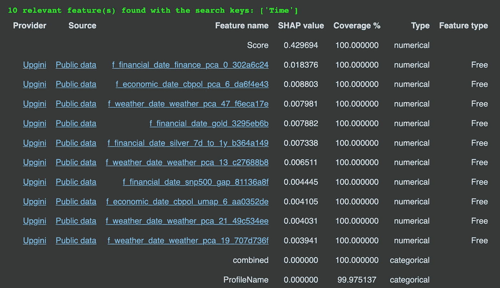
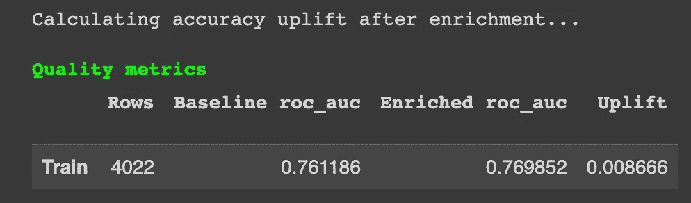
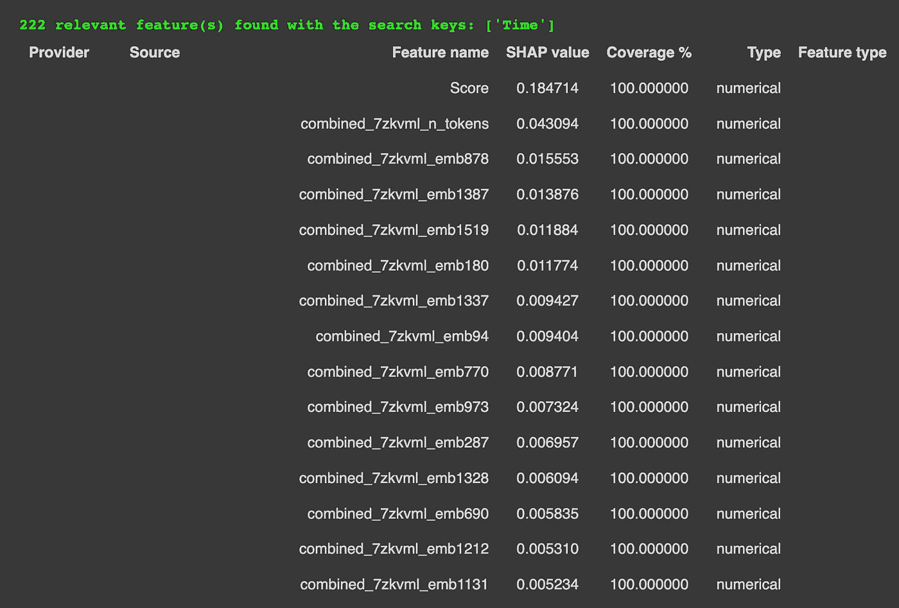
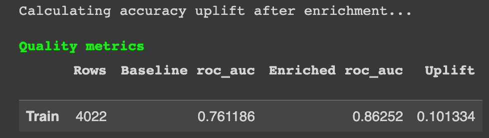
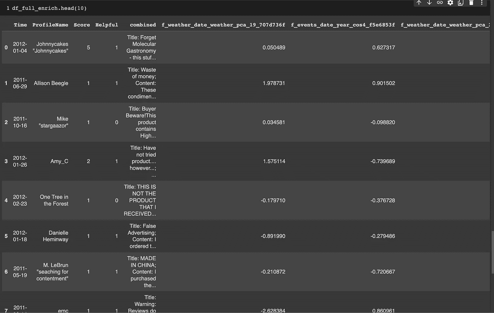

# Python 中的自动化特征工程

> 原文：[`towardsdatascience.com/automated-feature-engineering-in-python-5733426530bf`](https://towardsdatascience.com/automated-feature-engineering-in-python-5733426530bf)

## 机器学习 | Python | 数据科学

## 使用 Upgini 增强数据集的新功能的指南

[](https://david-farrugia.medium.com/?source=post_page-----5733426530bf--------------------------------)[](https://towardsdatascience.com/?source=post_page-----5733426530bf--------------------------------) [David Farrugia](https://david-farrugia.medium.com/?source=post_page-----5733426530bf--------------------------------)

·发表于 [Towards Data Science](https://towardsdatascience.com/?source=post_page-----5733426530bf--------------------------------) ·阅读时间 5 分钟·2023 年 5 月 2 日

--


照片由 [Alina Grubnyak](https://unsplash.com/@alinnnaaaa?utm_source=medium&utm_medium=referral) 提供，来自 [Unsplash](https://unsplash.com/?utm_source=medium&utm_medium=referral)

任何数据科学家或机器学习专业人士最重要的技能之一是从任何给定的数据集中提取更深层次和更有意义的特征。这个概念，更常被称为特征工程，可能是建模机器学习算法时最强大的技巧之一。

从数据中学习涉及大量的工程工作。虽然现代高级工具如 sklearn 已经将大部分复杂性抽象出来，但仍然需要深入理解数据，并将其塑造为你想要解决的问题。

提取更好的特征有助于为模型提供额外（且潜在更强）的业务领域和影响因素的基础关系。

不用说，特征工程是非常耗时和费力的。它需要大量的创造力、技术专长，并且在大多数情况下，还需要反复试验。

我最近发现了一个新工具，Upgini。与当前大型语言模型（LLM）的趋势相符，Upgini 利用 OpenAI 的 GPT LLM 来自动化我们数据集的整个特征工程过程。

在本文中，我们将介绍 Upgini 包并讨论其功能。

本文中，我们将使用亚马逊优质食品评论数据集（根据 CC0：公共领域许可）。

[## 亚马逊优质食品评论](https://www.kaggle.com/datasets/snap/amazon-fine-food-reviews?sort=votes&source=post_page-----5733426530bf--------------------------------)

### 分析 ~500,000 条来自 Amazon 的食品评论

www.kaggle.com](https://www.kaggle.com/datasets/snap/amazon-fine-food-reviews?sort=votes&source=post_page-----5733426530bf--------------------------------)

欲了解更多关于 Upgini 包的信息，可以访问其 GitHub 页面：

[](https://github.com/upgini/upgini/tree/main?source=post_page-----5733426530bf--------------------------------) [## GitHub - upgini/upgini: 机器学习数据搜索库 → 轻松找到并添加相关特征…

### 机器学习的数据搜索库 → 轻松从数百个相关特征中找到并添加到你的 ML 流水线中…

github.com](https://github.com/upgini/upgini/tree/main?source=post_page-----5733426530bf--------------------------------)

# 使用 Upgini 入门

首先，我们可以通过 pip 直接安装 Upgini：

```py
pip install upgini
```

我们还加载了我们的数据集：

```py
import pandas as pd
import numpy as np

# read full data
df_full = pd.read_csv("/content/Reviews.csv")
# convert Time to datetime column
df_full['Time'] = pd.to_datetime(df_full['Time'], unit='s')
# re-order columns
0df_full = df_full[['Time', 'ProfileName', 'Summary', 'Text', 'HelpfulnessNumerator', 'HelpfulnessDenominator', 'Score' ]]
```


结果数据的片段 — 作者提供的图像

我们还筛选了数据集，以包括帮助度超过 10 且发布于 2011–01–01 之后的评论。

```py
df_full = df_full[(df_full['HelpfulnessDenominator'] > 10) & 
                  (df_full['Time'] >= '2011-01-01')]
```

我们还将 Helpfulness 转换为 0.50 比例的二进制变量。

```py
df_full.loc[:, 'Helpful'] = np.where(df_full.loc[:, 'HelpfulnessNumerator'] / df_full.loc[:, 'HelpfulnessDenominator'] > 0.50, 1, 0)
```

最后，我们创建了一个新列 — combined — 将摘要和文本连接成一个单列。我们也借此机会删除任何重复项。

```py
df_full["combined"] = f"Title: {df_full['Summary'].str.strip()} ; Content: {df_full['Text'].str.strip()}"
df_full.drop(['Summary', 'Text', 'HelpfulnessNumerator', 'HelpfulnessDenominator' ], axis=1, inplace=True)
df_full.drop_duplicates(subset=['combined'], inplace=True)
df_full.reset_index(drop=True, inplace=True)
```

# 使用 Upgini 进行特征搜索和增强

我们现在准备开始搜索新特征。

根据 Upgini 文档，我们可以使用 FeaturesEnricher 对象开始特征搜索。在该 FeaturesEnricher 内，我们可以指定一个 SearchKey（即，我们要搜索的列）。

我们可以搜索以下列类型：

+   *电子邮件*

+   *胸针*

+   *IP 地址*

+   *电话*

+   *日期*

+   *日期时间*

+   *国家*

+   *邮政编码*

让我们将这些导入 Python。

```py
from upgini import FeaturesEnricher, SearchKey
```

我们现在可以开始特征搜索。

```py
enricher = FeaturesEnricher(search_keys={'Time': SearchKey.DATE})
enricher.fit(df_full[['Time', 'ProfileName', 'Score', 'combined']], df_full['Helpful'])
```

一段时间后，Upgini 向我们展示了一个搜索结果列表 — 可能相关的特征以增强我们的数据集。



找到的特征片段。作者提供的图像

似乎 Upgini 计算了每个找到的特征的 SHAP 值，以衡量该特征对数据和模型质量的整体影响。

对于每个返回的特征，我们也可以直接查看并访问其来源。

该包还评估了模型在原始和增强数据集上的表现。



增强后获得的结果。作者提供的图像

在这里我们可以看到，通过添加增强特征，我们成功地稍微提高了模型的表现。诚然，这一表现提升微不足道。

# 使用 GPT 模型进行特征生成

深入挖掘文档，似乎 FeaturesEnricher 还接受另一个参数 — generate_features。

generate_features 允许我们为文本列搜索并生成特征嵌入。这听起来非常有前景。我们确实有文本列 — combined 和 ProfileName。

> Upgini 连接了两个 LLM 到一个搜索引擎——来自 OpenAI 的 GPT-3.5 和 GPT-J——来自 Upgini 文档

让我们进行这个数据丰富化吧？

```py
enricher = FeaturesEnricher(
    search_keys={'Time': SearchKey.DATE}, 
    generate_features=['combined', 'ProfileName']
    )
enricher.fit(df_full[['Time','ProfileName','Score','combined']], df_full['Helpful'])
```

Upgini 为我们找到 222 个相关特征。每个特征我们会得到其 SHAP 值、来源以及在我们数据中的覆盖情况报告。

这一次，我们还可以注意到我们有一些生成的特征（即文本 GPT 嵌入特征）。



生成的文本嵌入特征的示例。图片由作者提供

那么评估性能如何？



评估指标。图片由作者提供。

使用新生成的特征，我们看到预测性能有了巨大的提升——提升了 0.1。最棒的是这一切都是完全自动化的！

鉴于我们观察到的巨大的性能提升，我们绝对想保留这些特征。我们可以按以下方式进行：

```py
df_full_enrich = enricher.transform(df_full)
```



结果数据集。图片由作者提供

结果是一个由 11 个特征组成的数据集。从现在开始，我们可以像处理任何其他机器学习任务一样进行。

# 结论

Upgini 提供了很多潜力。我仍在尝试其功能，并熟悉其不同的功能——但到目前为止，它证明非常有用——尤其是那个 GPT 功能生成器！

告诉我你的结果吧！

# 参考文献

亚马逊美食评论数据集由斯坦福网络分析项目提供，授权为 CC0：公有领域。

[](https://www.kaggle.com/datasets/snap/amazon-fine-food-reviews?sort=votes&source=post_page-----5733426530bf--------------------------------) [## 亚马逊美食评论

### 分析 ~500,000 条来自亚马逊的食品评论

www.kaggle.com](https://www.kaggle.com/datasets/snap/amazon-fine-food-reviews?sort=votes&source=post_page-----5733426530bf--------------------------------)

**你喜欢这篇文章吗？每月 $5，你可以成为会员，解锁对 Medium 的无限访问。你将直接支持我和你在 Medium 上的其他喜欢的作家。所以非常感谢！**

[](https://david-farrugia.medium.com/membership?source=post_page-----5733426530bf--------------------------------) [## 通过我的推荐链接加入 Medium - David Farrugia

### 独家访问我所有的 ⚡premium⚡ 内容和 Medium 上的无限制内容。通过请我喝杯咖啡来支持我的工作…

david-farrugia.medium.com](https://david-farrugia.medium.com/membership?source=post_page-----5733426530bf--------------------------------)

# 想要联系我吗？

我很想听听你对这个话题的看法，或者关于 AI 和数据的任何内容。

如果你想联系我，请发邮件到 ***davidfarrugia53@gmail.com***。

[Linkedin](https://www.linkedin.com/in/david-farrugia/)
