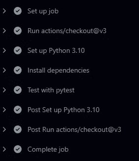

# 使用 GitHub Actions 进行自动化 Python 应用程序测试

> 原文：[`towardsdatascience.com/automated-python-application-testing-using-github-actions-79606f3f9eb2`](https://towardsdatascience.com/automated-python-application-testing-using-github-actions-79606f3f9eb2)

## 如何在`push`命令上运行自动测试

[](https://philip-wilkinson.medium.com/?source=post_page-----79606f3f9eb2--------------------------------)[](https://towardsdatascience.com/?source=post_page-----79606f3f9eb2--------------------------------) [Philip Wilkinson, Ph.D.](https://philip-wilkinson.medium.com/?source=post_page-----79606f3f9eb2--------------------------------)

·发布于[Towards Data Science](https://towardsdatascience.com/?source=post_page-----79606f3f9eb2--------------------------------) ·6 分钟阅读·2023 年 3 月 21 日

--


图片由[Roman Synkevych 🇺🇦](https://unsplash.com/@synkevych?utm_source=medium&utm_medium=referral)拍摄，发布在[Unsplash](https://unsplash.com/?utm_source=medium&utm_medium=referral)上

测试你的应用程序是任何软件开发或数据科学工作流程中的关键步骤。测试可以确保代码按预期工作，减少错误或漏洞的可能性，提高软件的整体质量和可靠性。

然而，在某些情况下，测试可能会成为负担，你或其他人可能会忘记在提交到仓库之前运行测试套件。这时，通过 GitHub Actions 自动化测试工作流程可以减少手动工作，确保一致的测试，并能够及早发现问题。

在本文中，我将讲解如何设置 GitHub Action 工作流程以自动化应用程序测试。这包括创建 GitHub Action 工作流程、设置触发事件、创建要运行的作业，并为你的仓库添加徽章以显示测试是否通过。到最后，你将拥有一个完全自动化的测试工作流程，可以向世界展示你的代码是否按预期工作！

## 什么是 GitHub Action？

根据 GitHub 提供的描述：

> GitHub Actions 使得自动化所有的软件工作流程变得简单，现在拥有世界级的 CI/CD。从 GitHub 直接构建、测试和部署你的代码。

这意味着 GitHub Actions 是由 GitHub 提供的自动化平台，专注于自动化软件开发工作流程。

Action 本身是可以作为 GitHub Actions 工作流程的一部分执行的代码单元。其目的是自动化由 GitHub 仓库中的事件触发的特定任务或工作流程。

重要的是，GitHub Action 可以用任何语言编写，可以在任何操作系统上运行，并可以通过 GitHub API 与存储库中的代码进行交互。它们可以用于各种任务，包括自动化最新构建的部署、更新代码库中的数据集，以及我们的目的——测试推送到主分支的最新内容。

## 创建 GitHub Action。

创建 GitHub Action 是一个相对简单的过程，首先是在你的 GitHub 存储库中创建一个新目录。这以一个文件夹标题`.github/workflows`的形式存在，GitHub 会识别这个文件夹包含我们希望 GitHub 执行的操作。

GitHub Actions 使用描述我们希望 GitHub 执行的操作的 YAML 文件。这意味着在`.github/workflows`文件夹中，我们需要创建一个 YAML 文件。现在我们可以称之为`python-app.yml`，并在文件中给它一个名称：

```py
name: Python application
```

这是我们将基于此构建来运行测试套件的基础。

## 设置触发事件。

文件创建完成后，告知 GitHub 我们希望它运行某些操作，我们需要告诉 GitHub 我们希望何时进行。这是通过在 YAML 文件中使用`on`关键字指定触发事件来完成的。

在测试时，你通常希望在对应用进行任何更改时运行完整的应用测试套件，以确保所做的更改不会引入任何系统漏洞。根据 Git 的最佳实践，这通常在两个点上：

+   任何推送到`main`应用分支的操作。

+   对`main`应用分支的任何拉取请求。

这是因为你的应用程序的最新部署通常应该来自你的存储库的`main`分支。在我们的 YAML 文件中，这可以使用以下内容指定：

```py
 on:
  push:
    branches: [ "main" ]
  pull_request:
    branches: [ "main" ]

permissions:
  contents: read
```

这里使用`push`关键字指定我们希望在推送到`main`分支时运行该操作，并使用`pull_request`关键字指定我们希望在向主分支发起拉取请求时也运行测试套件。

这确保了主分支上的任何更改在部署之前都经过全面测试，并且在更改公开时会运行。

## 创建要运行的作业。

现在我们已经告诉 GitHub 我们希望何时运行一个操作，我们需要实际告诉它我们希望运行什么。这是通过使用`jobs`关键字来完成的，它指定了作为 GitHub Action 的一部分将要运行的作业。

在这个`job`中，我们需要指定三个主要内容：

+   我们希望运行的作业名称。

+   我们希望工作流运行的平台。

+   工作流中我们希望执行的`steps`。

这首先通过使用`jobs:`关键字及我们想要进行的工作的名称来完成。现在我们可以简单地称之为`build`。

在`build`关键字之后，我们需要指定我们希望工作运行的平台。在我们的案例中，我们可以指定`runs-on: ubuntu-latest`，假设 Linux 是我们测试套件的合适平台。

然后我们指定一系列步骤，我们希望在这个 `job` 中进行。要运行我们的测试套件，我们需要：

+   将代码库检出到运行平台

+   在环境中设置 Python

+   安装运行测试套件所需的依赖项

+   运行测试套件本身

这可以通过以下命令完成：

```py
jobs:
  build:

    runs-on: ubuntu-latest

    steps:
    - uses: actions/checkout@v3
    - name: Set up Python 3.10
      uses: actions/setup-python@v3
      with:
        python-version: "3.10"
    - name: Install dependencies
      run: |
        python -m pip install --upgrade pip
        pip install -r requirements.txt
    - name: Test with pytest
      run: |
        pytest
```

解释这些步骤：

+   `uses: actions/checkout@v3` 告诉运行器我们想要使用 `actions/checkout@v3` 功能，这会将代码库的代码检出到作业的工作区。

+   `name: Set up Python 3.10` 创建一个步骤，设置运行器上的 Python 环境以使用 3.10 版本。

+   `name: Install dependencies` 安装项目所需的依赖项，包括 `requirements.txt` 文件中指定的那些。

+   `name: Test with pytest` 使用 `pytest` 命令运行测试套件，如果测试未通过则会使作业失败。

为此，我们使用 `name` 键将步骤拆分，这意味着我们可以清楚地识别在工作流中哪个点（如果有的话）失败。然后我们可以使用这些名称快速修复任何问题，并创建一个如下图所示的作业工作流。



作者提供的图片

## 向你的代码库添加徽章

创建上述文件将告诉 GitHub 我们想要为我们的代码库运行测试工作流，但任何查看我们代码库的人不会立即看到这一点。为了解决这个问题，我们可以创建一个徽章，它将出现在我们的 README Markdown 文档中，清晰地显示我们的测试正在通过。


作者提供的图片

这可以让任何新用户一目了然地知道主分支上的构建是稳定的，并且应用程序已被测试。此徽章的语法如下：

```py
](https://github.com/PhilipDW183/flask_petrol_map/actions/workflows/python-app.yml)
```

我还添加了一个链接到工作流文件，以便查看代码库的人也可以清楚地看到这个徽章所表示的内容。

## 结论

测试你的代码是任何软件工程或数据科学工作流的关键部分，但它也可能是一个容易在推送更改到主分支之前被忘记的步骤。为了简化这个过程并确保所有开发者之间测试的一致性，你可以创建一个 GitHub Action 来自动化你的测试工作流。在上面的文章中，我们展示了如何通过几个简单的步骤将其添加到你自己的代码库中。一个重要的部分是告诉你应用程序的新用户你已经测试了你的应用程序，这可以以你可以添加到 README 文件中的徽章形式呈现。

我的代码库中可以找到测试工作流的示例：

[`github.com/PhilipDW183/flask_petrol_map`](https://github.com/PhilipDW183/flask_petrol_map)
