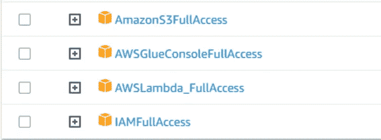

# 使用 Terraform 自动管理数据管道基础设施

> 原文：[`towardsdatascience.com/automatically-managing-data-pipeline-infrastructures-with-terraform-323fd1808a47?source=collection_archive---------9-----------------------#2023-05-02`](https://towardsdatascience.com/automatically-managing-data-pipeline-infrastructures-with-terraform-323fd1808a47?source=collection_archive---------9-----------------------#2023-05-02)

## *我知道你去年夏天做的手动工作*

[](https://joaopedro214.medium.com/?source=post_page-----323fd1808a47--------------------------------)[](https://towardsdatascience.com/?source=post_page-----323fd1808a47--------------------------------) [João Pedro](https://joaopedro214.medium.com/?source=post_page-----323fd1808a47--------------------------------)

·

[查看](https://medium.com/m/signin?actionUrl=https%3A%2F%2Fmedium.com%2F_%2Fsubscribe%2Fuser%2Fb111eee95c&operation=register&redirect=https%3A%2F%2Ftowardsdatascience.com%2Fautomatically-managing-data-pipeline-infrastructures-with-terraform-323fd1808a47&user=Jo%C3%A3o+Pedro&userId=b111eee95c&source=post_page-b111eee95c----323fd1808a47---------------------post_header-----------) 发表在 [Towards Data Science](https://towardsdatascience.com/?source=post_page-----323fd1808a47--------------------------------) ·15 分钟阅读·2023 年 5 月 2 日[](https://medium.com/m/signin?actionUrl=https%3A%2F%2Fmedium.com%2F_%2Fvote%2Ftowards-data-science%2F323fd1808a47&operation=register&redirect=https%3A%2F%2Ftowardsdatascience.com%2Fautomatically-managing-data-pipeline-infrastructures-with-terraform-323fd1808a47&user=Jo%C3%A3o+Pedro&userId=b111eee95c&source=-----323fd1808a47---------------------clap_footer-----------)

--

[](https://medium.com/m/signin?actionUrl=https%3A%2F%2Fmedium.com%2F_%2Fbookmark%2Fp%2F323fd1808a47&operation=register&redirect=https%3A%2F%2Ftowardsdatascience.com%2Fautomatically-managing-data-pipeline-infrastructures-with-terraform-323fd1808a47&source=-----323fd1808a47---------------------bookmark_footer-----------)

照片由 [EJ Yao](https://unsplash.com/fr/@hojipago?utm_source=medium&utm_medium=referral) 提供，来源于 [Unsplash](https://unsplash.com/?utm_source=medium&utm_medium=referral)

# 介绍

几周前，我写了一篇关于 [使用本地和 AWS 工具开发数据管道](https://medium.com/towards-data-science/data-pipeline-with-airflow-and-aws-tools-s3-lambda-glue-18585d269761) 的文章。这篇文章是我最近努力推出更多云导向数据工程文章的一部分。

然而，当我在脑海中回顾这篇文章时，我注意到一个大问题：**手动工作**。

每当我开发一个新项目，无论是真实的还是虚构的，我总是试图减少配置环境的摩擦（安装依赖项、配置文件夹、获取凭据等），这就是为什么我总是使用 Docker 的原因。通过 Docker，我只需传递一个 docker-compose.yaml 文件 + 几个 Dockerfile，您就能够通过一个命令创建与我完全相同的环境 —— docker compose up。

然而，当我们想要使用云工具（如 S3、Lambda、Glue、EMR 等）开发新的数据项目时，Docker 无法帮助我们，因为组件需要在提供商的基础设施中实例化，并且有两种主要的方法可以实现这一点：在 UI 上手动操作或通过服务 API 进行编程。

例如，您可以在浏览器上访问 AWS UI，搜索 S3 并手动创建一个新的存储桶，或者编写 Python 代码通过 AWS API 创建相同的实例。


在前面提到的帖子中，我详细描述了如何通过 AWS Web 界面**手动**创建所需的组件的步骤。结果如何？即使尽可能简化（甚至省略部分内容！），帖子也耗时 17 分钟，比我通常所需的多了 7 分钟，充满了说明应访问哪个屏幕，点击哪里以及选择哪些设置的截图。

除了成本高、混乱且耗时外，这仍然容易出现人为错误，这可能会在每月账单中带来更多麻烦甚至不愉快的惊喜。绝对是一个令人不愉快的过程。

这正是 **Terraform** 要解决的问题类型。

> 不是赞助内容。

# Terraform 是什么？

**Terraform 是一种基础设施即代码（IaC）工具**，以自动化和编程方式管理云提供商中的基础设施。

在 Terraform 中，期望的基础设施是通过一种称为 HCL（HashiCorp 配置语言）的声明性语言来描述的，其中指定了组件，*例如*一个名为“my-bucket”的 S3 存储桶以及一个位于 us-east-1 区域、运行 Ubuntu 22 的 EC2 服务器。

Terraform 通过调用云提供商的服务 API 将描述的资源实现。除了创建之外，它还能够销毁和更新基础设施，仅添加/删除从当前状态转移到期望状态所需的资源，*例如*如果请求创建 4 个 EC2 实例，则如果已存在 2 个实例，则仅创建 2 个新实例。这种行为是通过 Terraform 将基础设施的实际状态存储在状态文件中来实现的。

因此，可以更加敏捷和安全地管理项目的基础设施，因为它消除了配置每个单独资源所需的手动工作。

Terraform 的目标是成为一个与云平台无关的基础设施即代码（IaC）工具，因此它使用标准化的语言来调解与云提供商 API 的交互，从而不需要学习如何直接与它们交互。在这一点上，HCL 语言还支持变量操作和一定程度的‘流控制’（条件语句和循环），允许在资源创建中使用条件和循环，例如，创建 100 个 EC2 实例。

最后但同样重要的是，Terraform 还允许基础设施版本控制，因为它的纯文本文件可以被 git 轻松操作。

# 实施

如前所述，本文旨在自动化我之前文章中的基础设施创建过程。


总结一下，开发的项目旨在创建一个数据管道，从巴西的 ENEM（国家高中考试，直译）测试中提取问题，使用 MEC（教育部）[网站](https://www.gov.br/inep/pt-br/areas-de-atuacao/avaliacao-e-exames-educacionais/enem/provas-e-gabaritos)上提供的 PDF。

这个过程涉及三个步骤，由本地 Airflow 实例控制。这些步骤包括将 PDF 文件下载和上传到 S3 存储，通过 Lambda 函数从 PDF 中提取文本，以及使用 Glue Job 将提取的文本分割成问题。

请注意，为了使这个管道正常工作，需要创建并正确配置许多 AWS 组件。

## 0\. 设置环境

本项目中使用的所有代码都可以在这个[GitHub 仓库](https://github.com/jaumpedro214/posts)中找到。

你需要一台安装了 Docker 的机器和一个 AWS 账户。

第一步是为 Terraform 配置一个新的 AWS IAM 用户，这将是唯一在 AWS 网页控制台中执行的步骤。

**创建一个对 S3、Glue、Lambda 和 IAM 具有完全访问权限的新 IAM 用户，并为其生成代码凭证。**



这是对一个用户来说大量的权限，所以请妥善保管凭证。

> 我使用了完全访问权限，因为我现在想让事情更简单，但在处理凭证时总是考虑‘最小权限’的原则。

现在，回到本地环境。

在与*docker-compose.yaml*文件相同的路径下，创建一个*.env*文件并写入你的凭证：

```py
AWS_ACCESS_KEY_ID=<YOUR_ACCESS_KEY_ID>
AWS_SECRET_ACCESS_KEY=<YOUR_SECRET_ACCESS_KEY>
```

这些变量将传递给 docker-compose 文件供 Terraform 使用。

```py
version: '3'
services:
  terraform:
    image: hashicorp/terraform:latest
    volumes:
      - ./terraform:/terraform
    working_dir: /terraform
    command: ["init"]
    environment:
      - TF_VAR_AWS_ACCESS_KEY_ID=${AWS_ACCESS_KEY_ID}
      - TF_VAR_AWS_SECRET_ACCESS_KEY=${AWS_SECRET_ACCESS_KEY}
      - TF_VAR_AWS_DEFAULT_REGION=us-east-1
```

## 1\. 创建 Terraform 文件

在同一个文件夹中，创建一个名为**terraform**的新目录。在其中，创建一个新的文件**main.tf**，这将是我们的主要 Terraform 文件。

当容器运行时，这个文件夹将被映射到容器内部，这样内部的 Terraform 就能看到这个文件。

## 2\. 配置 AWS 提供商

我们需要做的第一件事是配置所使用的云提供商。

```py
terraform {
  required_version = ">= 0.12"

  required_providers {
    aws = ">= 3.51.0"
  }
}

variable "AWS_ACCESS_KEY_ID" {
  type = string
}

variable "AWS_SECRET_ACCESS_KEY" {
  type = string
}

variable "AWS_DEFAULT_REGION" {
  type = string
}

provider "aws" {
  access_key = var.AWS_ACCESS_KEY_ID
  secret_key = var.AWS_SECRET_ACCESS_KEY
  region     = var.AWS_DEFAULT_REGION
}
```

这就是一个 Terraform 配置文件的样子——一组具有不同类型的块，每个块都有特定的功能。

**terraform** 块固定了 Terraform 本身和 AWS 提供程序的版本。

**变量** 正如名称所示——一个分配给名称的值，可以在代码中引用。

> 正如你可能已经注意到的，我们的变量没有分配值，那么发生了什么？答案在 docker-compose.yaml 文件中，这些变量的值是通过系统中的环境变量设置的。当变量值未定义时，Terraform 会查看环境变量 TF_VAR_<var_name> 的值并使用它。我选择了这种方法来避免硬编码密钥。

**provider** 块也是显而易见的——它引用了我们使用的云提供商并配置了其凭据。我们用之前定义的变量设置提供程序的参数（access_key、secret_key 和 region），并用 **var.<var_name>** 符号引用这些变量。

定义好这个块之后，运行：

```py
docker compose run terraform init 
```

要设置 Terraform。

## 3\. 创建我们的第一个资源：S3 存储桶

Terraform 使用 **resource** 块来引用基础设施组件，如 S3 存储桶和 EC2 实例，以及授予用户权限或将文件上传到存储桶等操作。

下面的代码为我们的项目创建一个新的 S3 存储桶。

```py
resource "aws_s3_bucket" "enem-bucket-terraform-jobs" {
  bucket = "enem-bucket-terraform-jobs"
}
```

**resource** 定义遵循以下语法：

```py
resource <resource_type> <resource_name> {
  argument_1 = "blah blah blah blah" 
  argument_2 = "blah blah blah"
  argument_3 {
    ...
  }
}
```

在上述情况下，“*aws_s3_bucket*”是资源类型，“*enem-bucket-terraform-jobs*”是资源名称，用于在文件中引用此资源（它不是 AWS 基础设施中的存储桶名称）。参数 *bucket=“enem-bucket-terraform-jobs”* 为我们的存储桶分配了一个名称。

现在，使用以下命令：

```py
docker compose run terraform plan
```

Terraform 将比较当前的基础设施状态，并推断出需要做什么以实现 *main.tf* 文件中描述的期望状态。


因为这个存储桶还不存在，所以 Terraform 会计划创建它。

要应用 Terraform 的计划，运行

```py
docker compose run terraform apply
```


仅凭这几条命令，我们的存储桶已经创建好了。


很简单，对吧？

要销毁存储桶，只需输入：

```py
docker compose run terraform destroy
```


然后 Terraform 会处理其余的部分。

这些是将伴随我们直到帖子结束的基本命令：**plan**、**apply**、**destroy**。从现在开始，我们要做的就是配置 *main.tf* 文件，添加实现我们数据管道所需的资源。

## 4\. 配置 Lambda 函数第一部分：角色和权限

现在进入 Lambda 函数定义部分。

这是我之前帖子中最棘手的部分之一，因为默认情况下，Lambda 函数已经需要一组基本权限，此外，我们还必须给它对之前创建的 S3 存储桶的读写权限。

首先，我们必须创建一个新的 IAM 角色。

```py
# CREATE THE LAMBDA FUNCTION
# ==========================

# CREATE A NEW ROLE FOR THE LAMBDA FUNCTION TO ASSUME
resource "aws_iam_role" "lambda_execution_role" {
  name = "lambda_execution_role_terraform"
  assume_role_policy = jsonencode({
    # This is the policy document that allows the role to be assumed by Lambda
    # other services cannot assume this role
    Version = "2012-10-17"
    Statement = [
      {
        Action = "sts:AssumeRole"
        Effect = "Allow"
        Principal = {
          Service = "lambda.amazonaws.com"
        }
      }
    ]
  })
}
```

在开发这些东西时，我强烈建议你首先在 ChatGPT、GitHub Copilot 或其他 LLM 朋友中询问你需要什么，然后查看提供商的文档，了解这种类型的资源如何工作。

上面的代码创建了一个新的 IAM 角色，并允许 AWS Lambda 函数假设它。下一步是将 Lambda Basic Execution 策略附加到该角色，以允许 Lambda 函数无错误地执行。

```py
# ATTACH THE BASIC LAMBDA EXECUTION POLICY TO THE ROLE lambda_execution_role
resource "aws_iam_role_policy_attachment" "lambda_basic_execution" {
  policy_arn = "arn:aws:iam::aws:policy/service-role/AWSLambdaBasicExecutionRole"
  role       = aws_iam_role.lambda_execution_role.name
}
```

上面代码中值得注意的一点是，我们可以**引用资源属性**并**将它们作为参数传递到新资源的创建中**。在上述案例中，我们可以使用以下语法引用属性，而不是将‘*role’*参数硬编码为之前创建的角色‘*lambda_execution_role_terraform*’的名称：

<*resource_type*>.<*resource_name*>.<*attribute>*

如果你花时间查看资源的 Terraform 文档，你会注意到它有*arguments*和*attributes*。**Arguments**是你用来创建/配置新资源的参数，**attributes**是关于资源的只读属性，在资源创建后可用。

因此，attributes 被 Terraform 用来隐式管理资源之间的依赖关系，建立它们创建的适当顺序。

下面的代码为我们的 S3 桶创建一个新的访问策略，允许对其进行基本的 CRUD 操作。

```py
# CREATE A NEW POLICY FOR THE LAMBDA FUNCTION TO ACCESS S3
resource "aws_iam_policy" "s3_access_policy" {
  name = "s3_access_policy"
  policy = jsonencode({
    Version = "2012-10-17"
    Statement = [
      {
        Effect = "Allow"
        Action = [
          "s3:GetObject",
          "s3:PutObject",
          "s3:DeleteObject"
        ]
        Resource = aws_s3_bucket.enem-data-bucket.arn
      }
    ]
  })

# ATTACH THE EXECUTION POLICY AND THE S3 ACCESS POLICY TO THE ROLE lambda_execution_role
resource "aws_iam_policy_attachment" "s3_access_attachment" {
  name       = "s3_and_lambda_execution_access_attachment"
  policy_arn = aws_iam_policy.s3_access_policy.arn
  roles      = [aws_iam_role.lambda_execution_role.name]
}
```

同样，我们可以使用*aws_s3_bucket.enem-data-bucket.arn*引用这个属性，而不是硬编码桶的 ARN。

在正确配置 Lambda 角色之后，我们终于可以创建函数本身。

```py
# CREATE A NEW LAMBDA FUNCTION
resource "aws_lambda_function" "lambda_function" {
  function_name = "my-lambda-function-aws-terraform-jp"
  role          = aws_iam_role.lambda_execution_role.arn
  handler       = "lambda_function.lambda_handler"
  runtime       = "python3.8"
  filename      = "lambda_function.zip"
}
```

*lambda_function.zip*文件是一个压缩文件夹，其中必须包含一个*lambda_function.py*文件，文件内有一个*lambda_handler(event, context)*函数。它必须与 main.tf 文件在同一路径上。


```py
# lambda_function.py
def lambda_handler(event, context):
    return "Hello from Lambda!"
```

## 5\. 配置 Lambda 函数第 II 部分：附加触发器

现在，我们需要为 Lambda 函数配置触发器：它必须在每次新 PDF 上传到桶时执行。

```py
# ADD A TRIGGER TO THE LAMBDA FUNCTION BASED ON S3 BUCKET CREATION EVENTS
# https://stackoverflow.com/questions/68245765/add-trigger-to-aws-lambda-functions-via-terraform

resource "aws_lambda_permission" "allow_bucket_execution" {
  statement_id  = "AllowExecutionFromS3Bucket"
  action        = "lambda:InvokeFunction"
  function_name = aws_lambda_function.lambda_function.arn
  principal     = "s3.amazonaws.com"
  source_arn    = aws_s3_bucket.enem-data-bucket.arn
}

resource "aws_s3_bucket_notification" "bucket_notification" {
  bucket = aws_s3_bucket.enem-data-bucket.id

  lambda_function {
    lambda_function_arn = aws_lambda_function.lambda_function.arn
    events              = ["s3:ObjectCreated:*"]
    filter_suffix = ".pdf"
  }

  depends_on = [aws_lambda_permission.allow_bucket_execution]
}
```

这是一个需要指定**资源之间显式依赖关系**的情况，因为“*bucket_notification*”资源需要在“*allow_bucket_execution*”之后创建。

这可以通过使用*depends_on*参数轻松实现。

我们已经完成了 lambda 函数的设置，只需运行：

```py
docker compose run terraform apply
```

Lambda 函数将被创建。


## 6\. 向 Glue 作业添加模块

我们的*main.tf*文件变得相当庞大，而且记住这只是一个简单的数据管道。为了增强组织性并减少其大小，我们可以使用**模块**的概念。

一个**模块**是一组在单独文件中分组的资源，可以被其他配置文件引用和重用。模块使我们能够抽象复杂的基础设施部分，使我们的代码更加可管理、可重用、组织良好，并且*模块化*。

因此，我们不会在 *main.tf* 文件中编写创建 Glue 作业所需的所有资源，而是将它们放在一个 **模块** 中。

在 ./*terraform* 文件夹中，创建一个名为 ‘*glue*’ 的新文件夹，其中包含一个 *glue.tf* 文件。


然后在文件中添加一个新的 S3 存储桶资源：

```py
# INSIDE GLUE.TF
# Create a new bucket to store the job script
resource "aws_s3_bucket" "enem-bucket-terraform-jobs" {
  bucket = "enem-bucket-terraform-jobs"
}
```

回到 *main.tf*，只需引用这个模块：

```py
module "glue" {
  source = "./glue"
}
```

并重新初始化 terraform：

```py
docker compose run terraform init
```

Terraform 将重新启动其后端并用它初始化模块。


现在，如果我们运行 terraform plan，它应该将这个新的存储桶包含在创建列表中：


使用这个 **模块**，我们可以将创建作业的所有逻辑封装在一个单独的外部文件中。

AWS Glue 作业的一个要求是它们的作业文件存储在 S3 存储桶中，这就是为什么我们创建了“*enem-bucket-terraform-jobs*”。现在，我们必须上传作业文件本身。


在 *terraform* 路径*，*我包含了一个 *myjob.py* 文件，这只是一个用于模拟此行为的空文件。要向存储桶上传新对象，只需使用“aws_s3_object”资源：

```py
# UPLOAD THE SPARK JOB FILE myjob.py to s3
resource "aws_s3_object" "myjob" {
  bucket = aws_s3_bucket.enem-bucket-terraform-jobs.id
  key    = "myjob.py"
  source = "myjob.py"
}
```

从现在开始，只需实现 Glue 角色并创建作业本身。

```py
# CREATE A NEW ROLE FOR THE GLUE JOB TO ASSUME
resource "aws_iam_role" "glue_execution_role" {
  name = "glue_execution_role_terraform"
  assume_role_policy = jsonencode({
    # This is the policy document that allows the role to be assumed by Glue
    # other services cannot assume this role
    Version = "2012-10-17"
    Statement = [
      {
        Action = "sts:AssumeRole"
        Effect = "Allow"
        Principal = {
          Service = "glue.amazonaws.com"
        }
      }
    ]
  })
}

# ATTACH THE BASIC GLUE EXECUTION POLICY TO THE ROLE glue_execution_role
resource "aws_iam_role_policy_attachment" "glue_basic_execution" {
  policy_arn = "arn:aws:iam::aws:policy/service-role/AWSGlueServiceRole"
  role       = aws_iam_role.glue_execution_role.name
}
```

**不要那么快**。我们必须确保这个作业对“*enem-data-bucket*”桶具有与 Lambda 函数相同的读写权限，*即*，我们需要将 *aws_iam_policy.s3_access_policy* 附加到其角色*。*

但是，由于该策略是在主文件中定义的，**我们不能直接在我们的模块中引用它**。

```py
# THIS WILL RESULT IN A ERROR!!!!
# ATTACH THE THE S3 ACCESS POLICY s3_access_policy TO THE ROLE glue_execution_role
resource "aws_iam_policy_attachment" "s3_access_attachment_glue" {
  name       = "s3_and_glue_execution_access_attachment"
  policy_arn = aws_iam_policy.s3_access_policy.arn
  roles      = [aws_iam_role.glue_execution_role.name]
}
```

为了实现这种行为，我们必须将 *access policy arn* 作为 **参数** 传递给 **模块**，这非常简单。

首先，在 *glue.tf* 文件中，创建一个新的变量来接收这个值。

```py
variable "enem-data-bucket-access-policy-arn" {
    type = string
}
```

返回主文件，在模块引用中传递一个值给这个变量。

```py
module "glue" {
  source = "./glue"
  enem-data-bucket-access-policy-arn = aws_iam_policy.s3_access_policy.arn
}
```

最后，在 glue 文件中，使用变量的值在资源中。

```py
# ATTACH THE THE S3 ACCESS POLICY s3_access_policy TO THE ROLE glue_execution_role
resource "aws_iam_policy_attachment" "s3_access_attachment_glue" {
  name       = "s3_and_glue_execution_access_attachment"
  policy_arn = var.enem-data-bucket-access-policy-arn
  roles      = [aws_iam_role.glue_execution_role.name]
}
```

现在，花点时间思考我们刚刚完成的事情的威力。通过 **模块** 和 **参数**，我们可以创建**完全参数化的复杂基础设施**。

上述代码不仅仅是为我们的流水线创建了一个特定的作业。只需更改 *enem-data-bucket-access-policy-arn* 变量的值，我们就可以创建一个新的作业来处理来自完全不同存储桶的数据。

这种逻辑适用于你想要的 **任何** 东西。例如，可以使用变量同时为开发、测试和生产环境创建一个完整的项目基础设施。

没有多言，剩下的就是创建 Glue 作业本身，这并不是什么新鲜事：

```py
# CREATE THE GLUE JOB
resource "aws_glue_job" "myjob" {
  name     = "myjob"
  role_arn = aws_iam_role.glue_execution_role.arn
  glue_version = "4.0"
  command {
    script_location = "s3://${aws_s3_bucket.enem-bucket-terraform-jobs.id}/myjob.py"
  }
  default_arguments = {
    "--job-language" = "python"
    "--job-bookmark-option" = "job-bookmark-disable"
    "--enable-metrics" = ""
  }
  depends_on = [aws_s3_object.myjob]
}
```

我们的基础设施就完成了。运行 **terraform apply** 创建剩余的资源。

```py
docker compose run terraform apply
```


并且 **terraform destroy** 来清除所有内容。

```py
docker compose run terraform destroy
```


# 结论

我在发布有关使用云服务提供商创建数据管道的第二篇文章几天后，认识了**Terraform**，它彻底改变了我的想法。我立刻想到了为了设置项目所做的所有手动工作，展示过程的所有截图以及在需要重新生成过程时会困扰我梦魇的所有未记录细节。

Terraform 解决了所有这些问题。它简单易用，设置也简便，只需要一些 .*tf* 文件和提供者的凭据，我们就可以立即开始。

Terraform 解决了人们通常不太*激动*去思考的那种问题。在开发数据产品时，我们都关注性能、优化、延迟、质量、准确性以及产品的其他数据特定或领域特定方面。

不要误会，我们都学习应用我们更好的数学和计算知识来解决这些问题，但我们也需要考虑我们产品*开发过程*的关键方面，如可复现性、可维护性、文档化、版本控制、集成、模块化等等。

这些是我们*软件工程师*同事长期关注的方面，因此我们不必重复造轮子，只需从他们的最佳实践中学习一两件事情即可。

这就是为什么我在我的项目中始终使用 Docker，并且这也是为什么我可能会将 Terraform 添加到我的基本工具集中的原因。

希望本文帮助您理解这个工具 — Terraform — 包括其目标、基本功能和实际好处。与往常一样，我对本文提到的任何主题都不是专家，并强烈推荐进一步阅读，请参考以下参考资料。

谢谢你的阅读！ ;)

# 参考文献

> 所有代码都可以在[此 GitHub 仓库](https://github.com/jaumpedro214/posts)中找到。
> 
> 使用的数据 — [ENEM PDFs](https://www.gov.br/inep/pt-br/areas-de-atuacao/avaliacao-e-exames-educacionais/enem/provas-e-gabaritos)，[CC BY-ND 3.0]，巴西政府教育部。
> 
> 所有图片由作者创建，除非另有说明。

[1] *通过 Terraform 为 AWS Lambda 函数添加触发器*。Stack Overflow。[链接](https://stackoverflow.com/questions/68245765/add-trigger-to-aws-lambda-functions-via-terraform)。

[2] *AWSLambdaBasicExecutionRole — AWS 管理策略*。[链接](https://docs.aws.amazon.com/aws-managed-policy/latest/reference/AWSLambdaBasicExecutionRole.html)。

[3] Brikman, Y. (2022 年 10 月 11 日)。Terraform 技巧与窍门：循环、条件语句和陷阱。[*Medium*](https://blog.gruntwork.io/terraform-tips-tricks-loops-if-statements-and-gotchas-f739bbae55f9)*。*[4] *创建资源依赖关系 | Terraform | HashiCorp Developer*。[链接](https://developer.hashicorp.com/terraform/tutorials/configuration-language/dependencies)。

[5] TechWorld with Nana. (2020 年 7 月 4 日)。*在 15 分钟内解释 Terraform | Terraform 初学者教程* [视频]。[YouTube](https://www.youtube.com/watch?v=l5k1ai_GBDE)。

[6] *Terraform Registry*。AWS 提供者。 [Link](https://registry.terraform.io/providers/hashicorp/aws/latest)。
