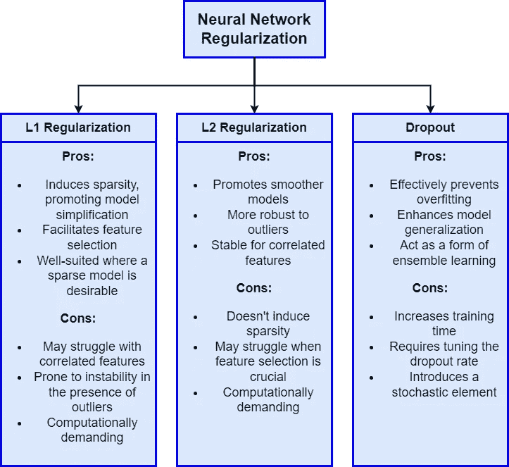

# 避免神经网络过拟合：深度探讨

> 原文：[`towardsdatascience.com/avoid-overfitting-in-neural-networks-a-deep-dive-b4615a2d9507`](https://towardsdatascience.com/avoid-overfitting-in-neural-networks-a-deep-dive-b4615a2d9507)

## 学习如何实施正则化技术以提升性能并防止神经网络过拟合

[](https://medium.com/@riccardo.andreoni?source=post_page-----b4615a2d9507--------------------------------)[](https://towardsdatascience.com/?source=post_page-----b4615a2d9507--------------------------------) [Riccardo Andreoni](https://medium.com/@riccardo.andreoni?source=post_page-----b4615a2d9507--------------------------------)

·发布于 [Towards Data Science](https://towardsdatascience.com/?source=post_page-----b4615a2d9507--------------------------------) ·10 分钟阅读·2023 年 11 月 30 日

--


图片来源：[unsplash.com](https://unsplash.com/photos/multicolored-illustration-gpiKdZmDQig).

在训练深度神经网络时，往往很难在**训练集和验证集上获得相同的性能**。验证集上明显较高的误差是**过拟合的明显标志**：网络在训练数据上过于专业化。本文提供了绕过这一问题的综合指南。

# 神经网络的过拟合

在处理任何机器学习应用时，清楚了解**模型的偏差和方差**是非常重要的。在传统机器学习算法中，我们讨论[**偏差与方差权衡**](https://en.wikipedia.org/wiki/Bias%E2%80%93variance_tradeoff#:~:text=In%20statistics%20and%20machine%20learning,bias%20in%20the%20estimated%20parameters.)，即在最小化模型的**方差**和**偏差**之间的斗争。

为了减少模型的偏差（即模型由于错误假设产生的误差），我们需要一个**更复杂的模型**。相反，减少模型的方差（模型捕捉训练数据变化的敏感度）则意味着**更简单的模型**。显然，在传统机器学习中，偏差与方差的权衡源于同时需要一个**更复杂和更简单的模型**的冲突。

在**深度学习时代**，我们拥有工具来仅仅减少模型的方差，而不影响模型的偏差，或者反过来，在不增加方差的情况下减少偏差。

在探讨用于防止神经网络过拟合的不同技术之前，明确什么是高方差或高偏差是很重要的。

以图像识别为例，考虑一个识别图片中是否有熊猫的神经网络。我们可以自信地评估，一个人可以以接近 0%的误差完成这个任务。因此，这对图像识别网络的准确率来说是一个合理的基准。在对训练集进行训练并在训练集和验证集上评估其性能后，我们可能会得到以下不同的结果：

1.  训练误差 = 20% 和 验证误差 = 22%

1.  训练误差 = 1% 和 验证误差 = 15%

1.  训练误差 = 0.5% 和 验证误差 = 1%

1.  训练误差 = 20% 和 验证误差 = 30%

第一个示例是**高偏差**的典型实例：**训练集和验证集上的误差都很大**。相反，第二个示例则遭遇了**高方差**，当处理**模型未学习到的数据**时准确率要低得多。第三个结果代表了**低方差和偏差**，模型可以被认为是有效的。最后，第四个示例展示了**高偏差和高方差**的情况：不仅训练误差在与基准比较时很大，而且验证误差也更高。


图片由作者提供。

从现在起，我将介绍几种正则化技术，用于减少模型对训练数据的过拟合。这些技术对前面例子中的第 2 和第 4 种情况很有帮助。

# L1 和 L2 正则化

类似于经典的回归算法（线性、逻辑、分式等），**L1 和 L2 正则化**也被用来防止高方差神经网络的过拟合。为了使本文简洁明了，我不会回顾 L1 和 L2 正则化在回归算法中的工作原理，但你可以查看[这篇文章](https://neptune.ai/blog/fighting-overfitting-with-l1-or-l2-regularization)获取更多信息。

L1 和 L2 正则化技术的理念是**约束模型的权重**使其变小或**将一些权重**缩小到 0。

考虑一个经典深度神经网络的成本函数 J：


成本函数 J 显然是每层 1, …, L 的权重和偏差的函数。m 是训练样本的数量，ℒ是损失函数。

## L1 正则化

在 L1 正则化中，我们将以下项添加到成本函数 J 中：


其中矩阵范数是网络中每层 1, …, L 的权重绝对值的总和：


λ 是**正则化项**。它是一个必须**仔细调整**的超参数。λ 直接控制正则化的影响：随着 λ 的增加，对权重收缩的影响会更严重。

L1 正则化下的完整成本函数变为：


对于 λ=0，L1 正则化的效果为零。相反，选择一个过大的 λ 值将过度简化模型，可能导致欠拟合网络。

L1 正则化可以被视为一种神经元选择过程，因为它会将一些隐藏神经元的权重变为零。

## L2 正则化

在 L2 正则化中，我们添加到成本函数中的项如下：


在这种情况下，正则化项是每个网络层的**权重的平方范数**。这个矩阵范数被称为 [Frobenius 范数](https://en.wikipedia.org/wiki/Matrix_norm)，显式地计算方法如下：


请注意，相对于第 l 层的权重矩阵有 n^{[l]} 行和 n^{[l-1]} 列。

最后，L2 正则化下的完整成本函数变为：


再次，λ 是**正则化项**，当 λ=0 时，L2 正则化的效果为零。

L2 正则化使权重的值趋近于零，从而得到一个更简单的模型。

## L1 和 L2 正则化如何减少过拟合？

L1 和 L2 正则化技术对训练数据的过拟合有积极的影响，原因有二：

+   一些隐藏单元的权重变得更接近（或等于）0。结果是，它们的影响被削弱，最终的网络更简单，因为它更接近于**较小的网络**。正如引言中所述，较简单的网络更不容易过拟合。

+   对于较小的权重，隐藏神经元激活函数的输入 z 也变得更小。对于接近 0 的值，许多激活函数表现为**线性**。

第二个原因并不简单，需要进一步展开。考虑一个双曲正切（tanh）激活函数，其图形如下：


图片由作者提供。

从函数图中我们可以看到，如果输入值 x 很小，函数 tanh(x) 的表现是**几乎线性的**。当 tanh 被用作神经网络隐藏层的激活函数时，输入值为：


对于小权重 w 也**接近零**。

如果神经网络的每一层都是线性的，我们可以证明整个网络表现为线性。因此，约束一些隐藏单元以模拟线性函数，会导致网络更简单，从而有助于防止过拟合。

更简单的模型通常无法捕捉训练数据中的噪声，因此，**过拟合的情况较少**。

# Dropout

[**dropout 正则化**](https://www.analyticsvidhya.com/blog/2022/08/dropout-regularization-in-deep-learning/#:~:text=In%20machine%20learning%2C%20%E2%80%9Cdropout%E2%80%9D,are%20codependent%20with%20one%20another.)的理念是**随机移除网络中的某些节点**。在训练过程开始之前，我们为网络中的每个节点设置一个概率（假设 p = 50%）。在训练阶段，每个节点有 p **被关闭的概率**。dropout 过程是随机的，并且是为每个训练样本单独执行的。因此，每个训练样本可能会在不同的网络上进行训练。

与 L2 正则化类似，dropout 正则化的结果是一个更简单的网络，而更简单的网络会导致一个更简单的模型。


简单网络上 dropout 的效果。图像由作者提供。

## 实际中的 dropout

在这一简短的部分中，我展示了如何**在实践中实现 Dropout 正则化**。我将通过几行简单的代码（python）进行说明。如果你只对正则化的一般理论感兴趣，可以轻松跳过这一部分。

假设我们已经将网络第 4 层的激活值存储在[NumPy](https://numpy.org/)数组`a4`中。首先，我们创建辅助向量`d4`：

```py
# Set the keeping probability
keep_prob = 0.7
```

```py
# Create auxiliary vector for layer 4
d4 = np.random.rand(a4.shape[0], a3.shape[1]) < keep_prob
```

向量`d4`的维度与`a4`相同，并根据概率`keep_prob`包含`True`或`False`的值。如果我们设置了 70%的保留概率，这就是给定隐藏单元被保留的概率，因此，在`d4`的某个元素上具有`True`值的概率。

我们将辅助向量`d4`应用于激活`a4`：

```py
# Apply the auxiliary vector d4 to the activation a4
a4 = np.multiply(a4,d4)
```

最后，我们需要通过`keep_prob`值来缩放修改后的向量`a4`：

```py
# Scale the modified vector a4
a4 /= keep_prob
```

这个最后的操作是为了补偿层中单位的减少。在训练过程中执行此操作可以让我们在测试阶段不应用 dropout。

## Dropout 是如何减少过拟合的？

Dropout 的效果是暂时**将网络转变为一个更小的网络**，我们知道较小的网络**更简单且不易过拟合**。

以上图所示的网络为例，关注第二层的第一个单元。由于某些输入可能由于 dropout 而被临时关闭，这个单元**不能总是依赖它们**。因此，隐藏单元被鼓励将其权重分散到各个输入上。权重的分散效果是降低权重矩阵的平方范数，从而产生一种**类似于 L2 正则化**的效果。

设置保留概率是有效 dropout 正则化的一个基本步骤。通常，保留概率是为神经网络的每一层单独设置的。对于权重矩阵较大的层，我们通常设置较小的保留概率，因为在每一步中，我们希望相对于较小的层保留比例较少的权重。

# 其他正则化技术

除了 L1/L2 正则化和 dropout，还有**其他正则化技术**。其中两种是**数据增强**和**早停**。

从理论上讲，我们知道在更多数据上训练网络对减少高方差有积极影响。由于获取更多数据通常是一项艰巨的任务，因此数据增强是一种技术，它在某些应用中几乎可以“免费”获得更多数据。在计算机视觉中，数据增强通过翻转、缩放和移动原始图像提供了**更大的训练集**。在数字识别的情况下，我们还可以对图像施加扭曲。

**早停**，顾名思义，涉及**在最初定义的迭代次数之前停止训练阶段**。如果我们将成本函数绘制在训练集和验证集上，并以迭代次数为函数进行观察，我们会发现，对于过拟合模型，训练误差总是持续减少，但验证误差可能在某些迭代次数后开始增加。当验证误差停止减少时，这正是停止训练过程的时机。通过更早地停止训练，我们迫使模型变得更简单，从而减少过拟合。

# **结论**

总之，L1 和 L2 正则化技术是解决神经网络中过拟合问题的不可或缺的工具。



作者提供的图像。

L1 正则化通过**惩罚无关特征**来引入稀疏性，这在**简化模型**方面表现有效。另一方面，L2 正则化通过惩罚权重的平方大小，**促进了更平滑的模型**，从而降低了极端值的风险。

Dropout 是一种在训练阶段随机停用神经元的动态技术，它增强了模型的泛化能力。它防止对特定神经元的过度依赖，从而促进了更强大的网络。

然而，这些技术也有其权衡之处。虽然正则化方法能有效缓解过拟合，但它们可能会无意中限制模型捕捉数据中复杂模式的能力。真正的挑战在于选择正则化强度和模型复杂性之间的正确平衡。

为了进一步了解，我会在参考部分添加一些精彩资源。我强烈建议查看这些资源，以便深化对主题的理解。

如果你喜欢这个故事，考虑关注我，以便及时了解我即将发布的项目和文章！

这是我过去的一些项目：

[](/advanced-dimensionality-reduction-models-made-simple-639fca351528?source=post_page-----b4615a2d9507--------------------------------) ## 先进的降维模型简单化

### 学习如何高效地应用最先进的降维方法，并提升你的机器学习…

towardsdatascience.com [](/use-deep-learning-to-generate-fantasy-character-names-build-a-language-model-from-scratch-792b13629efa?source=post_page-----b4615a2d9507--------------------------------) ## 使用深度学习生成奇幻名字：从零开始构建语言模型

### 语言模型能否创造出独特的奇幻角色名字？让我们从零开始构建它。

towardsdatascience.com [](/outlier-detection-with-scikit-learn-and-matplotlib-a-practical-guide-382d1411b8ec?source=post_page-----b4615a2d9507--------------------------------) ## 使用深度学习生成奇幻名字：从零开始构建语言模型

### 了解如何将先进的降维方法高效应用于机器学习任务。

towardsdatascience.com

# 参考文献

+   [《深度学习》作者：伊恩·古德费洛、约书亚·本吉奥、亚伦·库尔维尔](https://www.deeplearningbook.org/)

+   [《Dropout：防止神经网络过拟合的简单方法》作者：Nitish Srivastava 等（2014）](https://jmlr.org/papers/v15/srivastava14a.html)

+   [《深度学习中的正则化技术：调查与实践指南》作者：Navid Pustokhina 等](https://arxiv.org/abs/2201.03299)

+   [《理解批归一化中的 dropout 与方差偏移的失调》作者：Shibani Santurkar 等（2018）](https://www.researchgate.net/publication/327434121_Understanding_Regularization_in_Batch_Normalization)

+   [《神经网络与深度学习：一本教科书》作者：Charu Aggarwal](https://link.springer.com/book/10.1007/978-3-319-94463-0)
