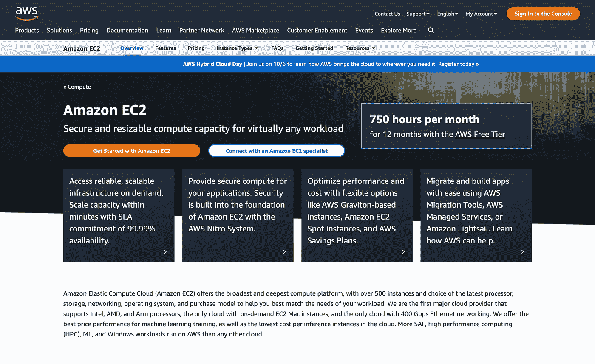

# 数据科学 AWS 基础：计算

> 原文：[`towardsdatascience.com/aws-essentials-for-data-science-compute-9b4c6e3b46bf`](https://towardsdatascience.com/aws-essentials-for-data-science-compute-9b4c6e3b46bf)

## 理解和部署 EC2 和 Lambda 服务

 [Matt Sosna](https://mgsosna.medium.com/?source=post_page-----9b4c6e3b46bf--------------------------------)

·发表于 [Towards Data Science](https://towardsdatascience.com/?source=post_page-----9b4c6e3b46bf--------------------------------) ·阅读时间 18 分钟·2023 年 1 月 3 日

--

图片由 [Nick Owuor (astro.nic.visuals)](https://unsplash.com/@astro_nic25?utm_source=medium&utm_medium=referral) 提供，来源于 [Unsplash](https://unsplash.com/?utm_source=medium&utm_medium=referral)

所以你创建了一个很酷的应用程序，并想向全世界展示它。也许它是一个可以生成[涂鸦猫咪图片的 AI](https://affinelayer.com/pixsrv/)、一个[病毒式 LinkedIn 帖子生成器](https://viralpostgenerator.com)或一个[英语到 RegEx 的翻译器](https://www.autoregex.xyz/)。你希望用户只需点击一个链接，就能立即开始使用你的应用程序，而不是需要下载并在他们的电脑上运行它。

这种“即时交互”需要一个**服务器**，它接收用户请求（例如，猫咪涂鸦）并*提供*响应（例如，AI 生成的猫咪图片）。你*可以*使用个人笔记本电脑，但当它进入睡眠模式或关闭时，它将停止处理请求，而且一个熟练的黑客可能会窃取你的私人数据。更糟糕的是，如果你的计算机尝试同时处理过多的请求，你的硬盘可能会过热！

除非你喜欢被黑客攻击或硬盘过热的笔记本电脑，否则你可能会想要租用云服务器。虽然你失去了一些对物理机器的控制，但你会避免很多你可能不愿意处理的配置和维护。而且如果你愿意多花点钱，你可以轻松租用一台——甚至几台——远比你的笔记本电脑强大的机器。那么我们怎么开始呢？

我们之前覆盖了云计算的高层概述以及存储数据的教程。但云计算的*引擎*是什么？在这篇最后的文章中，我们将讨论两个计算密集型的**亚马逊网络服务**。我们将从基础的云构建模块**EC2**开始，然后转到无服务器计算的**Lambda**。

由[Taylor Vick](https://unsplash.com/@tvick?utm_source=medium&utm_medium=referral)在[Unsplash](https://unsplash.com/?utm_source=medium&utm_medium=referral)拍摄

# 背景

假期季节对于零售商来说是一个反复出现的混乱时刻。例如，第四季度占**惊人的 33–39%**的[Macy's](https://ycharts.com/companies/M/revenues)和[Kohl's](https://ycharts.com/companies/KSS/revenues)年度收入，甚至在夏季的 Prime Day 之后，[亚马逊](https://ycharts.com/companies/AMZN/revenues)的第四季度仍然约为 31%。这股假日冲动[大多在线上发生](https://www.cbre.com/insights/articles/omnichannel-what-is-the-share-of-e-commerce-in-overall-retail-sales)，转化为*更多的用户*在商店网站上*花费更多的时间*。

将自己置身于 2005 年 10 月的亚马逊基础设施工程师的角色中，那时[互联网泡沫](https://en.wikipedia.org/wiki/Dot-com_bubble)已过去几年，但云计算行业尚未真正起步。你知道你必须做*某些事情*来应对即将到来的流量洪峰：你最不希望的就是网站崩溃，[数百万美元的销售机会溜走](https://www.independent.co.uk/news/business/amazon-down-internet-outage-sales-b1861737.html)，因为沮丧的顾客转向了其他网站。[1]

处理额外负载的一种方法是*购买更多计算机*。 (确实有[早期亚马逊工程师的故事](https://open.spotify.com/episode/14LmWeOMRZysw2i2vYSOuw?si=ce630660e3b44461)，他们在假期前购买了他们能找到的最强大的服务器，并祈祷一切顺利！) 这些额外的服务器确实应该处理流量激增。但当假期热潮结束时，这些额外的计算资源将会闲置，直到下一个假期季节。[2]

替代方案是以某种方式*租用*计算资源。理想情况下，资源会**弹性地**和**自动地**根据你的即时需求增加和减少，而不需要提前猜测。你将抽象化物理硬件，而只需进入一个“资源池”。

亚马逊网络服务（AWS）正是为了应对这些初创互联网的需求而诞生的：动态地访问你所需的计算资源。我们已经介绍过其基础的*存储*服务：亚马逊简单存储服务（S3），这是一个类似于 Dropbox 的综合数据存储服务。但现在让我们转向亚马逊的基础*计算*服务：**弹性计算云**。

作者截图

# EC2: 弹性计算云

我们可以使用**亚马逊 EC2**来访问云的基本构建块：**虚拟服务器**。数据中心充满了服务器，这些服务器被[逻辑分区](https://en.wikipedia.org/wiki/Logical_partition)成虚拟服务器，允许多人同时独立使用硬件。

一台服务器可以同时运行天气预报模拟，从多个数据库中获取数据，发送十几个网页的 HTML 等等。重要的是，这台物理服务器对用户来说是抽象的，超出了他们虚拟服务器的配置范围，让他们能够专注于自己的应用。

在 AWS 中，虚拟服务器被称为**EC2 实例**。EC2 于 2006 年发布，是[亚马逊的首批云服务之一](https://aws.amazon.com/blogs/aws/aws-blog-the-first-five-years/)，并已成长为[Netflix、Pinterest、Lyft 等众多公司技术栈的核心组件](https://aws.amazon.com/ec2/customers/)。EC2 实例具有模块化和可配置性，允许用户根据需求优化计算、内存、GPU、存储或它们的组合。例如，GPU 优化实例可以用于训练机器学习模型，而存储优化实例则可以托管数据库。

现在我们来创建一个 EC2 实例进行更详细的了解。我们[登录到我们的 AWS 账户](https://aws.amazon.com/login)，然后从服务菜单中导航到 EC2。我们应该会看到类似下面的图像。点击`Launch instance`按钮并开始。

作者截图

# 设置

## AMI: 亚马逊机器镜像

启动 EC2 实例时，我们首先需要选择[**亚马逊机器镜像**](https://docs.aws.amazon.com/AWSEC2/latest/UserGuide/AMIs.html)。AMI 指定了我们实例的基本软件配置：操作系统，[应用服务器](https://www.gartner.com/en/information-technology/glossary/application-server)和运行服务器所需的应用程序。AMI 就像[Docker 镜像](https://www.tutorialspoint.com/docker/docker_images.htm)：**可重用模板**，让我们每次都能创建出我们想要的精确环境。

默认的 AMI 配备了优化用于 EC2 的 Linux 内核，[系统和服务管理器 *systemd*](https://en.wikipedia.org/wiki/Systemd)、[GCC 编译器](https://en.wikipedia.org/wiki/GNU_Compiler_Collection)以及其他非常底层的软件。如果我们对如何优化以适应我们的用例有强烈的意见，我们可以创建自己的 AMI。但这是一个入门教程，所以我们就选择默认的 Amazon Linux 2 AMI。

作者截图

## 实例类型

接下来是**实例类型**，在这里我们选择服务器的硬件。我们不希望偏离`t2.micro`选项，该选项被免费套餐覆盖。在生产环境中，我们可以决定优化**CPU**（用于同时运行[各种系统操作](https://www.weka.io/learn/hpc/cpu-vs-gpu)）、**GPU**（用于机器学习或图形处理）、**存储**（用于慢速读写持久数据）、**内存**（用于[快速读写易失性数据](https://www.backblaze.com/blog/whats-diff-ram-vs-storage/)）或某种组合。

一旦启动了实例，我们无法更改实例类型，因此请确保你不要意外点击[每小时收费 31.21 美元的实例](https://www.todayilearnedcloud.com/Amazon-EC2-How-Much-Does-The-Most-Expensive-Instance-Cost/)! 仔细检查我们是否选择了`t2.micro`，然后可以继续下一步。

## 密钥对

现在我们将创建一对密钥。[AWS 使用公钥加密](https://docs.aws.amazon.com/AWSEC2/latest/UserGuide/get-set-up-for-amazon-ec2.html)来保护 EC2 实例的登录信息。我们将使用密钥对而不是密码，通过[SSH](https://www.techtarget.com/searchsecurity/definition/Secure-Shell)远程登录到我们的实例。

我们将点击`创建新密钥对`。然后给它起个名字，并保持 RSA 和 .pem 的默认设置。（如果你使用 Windows，请选择 PuTTY。）

作者截图

一旦我们点击`创建密钥对`，Amazon 将保存密钥的公钥部分，我们的计算机将下载私钥。确保不要丢失这个 .pem（或 .ppk）文件，因为我们将用它来在远程访问 EC2 实例时进行身份验证。

## 网络设置

现在我们设置通过互联网访问 EC2 实例的规则。对于这个演示，只需点击`选择现有的安全组`，然后选择我们的默认 VPC（[虚拟私有云](https://docs.aws.amazon.com/vpc/latest/userguide/what-is-amazon-vpc.html)）。如果你按照之前的[AWS 存储帖子](https://medium.com/towards-data-science/aws-essentials-for-data-science-storage-5755afc3cb4a)进行了操作，你将已经调整了这个 VPC 的入站和出站访问规则。

## 配置存储

我们将存储配置保持在默认值，这些值在免费层限制范围内。我们写入实例的任何数据将在演示结束后被删除；如果我们关心数据的持久性，可以点击 `Add new volume` 来预留一个[Amazon Elastic Block Storage (EBS)](https://aws.amazon.com/ebs/) 卷，并将数据保存在那里。但现在我们还是使用根卷吧。

## 高级细节

我们将在演示中跳过这一部分。但这里是我们可以指定配置的地方，例如使用按需[Spot 实例](https://aws.amazon.com/ec2/spot/)、关闭和[休眠](https://docs.aws.amazon.com/AWSEC2/latest/UserGuide/Hibernate.html)行为、是否需要详细的[Amazon CloudWatch](https://aws.amazon.com/cloudwatch/) 日志等。

[charlesdeluvio](https://unsplash.com/@charlesdeluvio?utm_source=medium&utm_medium=referral) 在 [Unsplash](https://unsplash.com/?utm_source=medium&utm_medium=referral) 上的照片

# 连接到我们的实例

我们的实例将在我们点击 `Create` 后的几分钟内可用。在 EC2 首页，我们可以点击 `Instances` 并查看类似下图的内容。

作者截图

现在让我们连接到实例。我们将使用[**SSH**](https://www.techtarget.com/searchsecurity/definition/Secure-Shell)，这是一种在不安全网络（如互联网）上进行安全通信的网络协议。一旦我们通过 SSH 连接到实例，我们将能够像在笔记本电脑的终端上控制机器一样控制它。

首先要做的是 **修改实例的安全组以允许入站流量**。在我们的实例页面上，我们点击底部的 `Security` 选项卡，然后点击实例安全组的链接。

作者截图

在安全组页面，点击 `Edit inbound rules`，然后点击 `Add rule`。选择 **SSH** 作为 `Type`，然后选择 **My IP** 作为 `Source`。最后，点击 `Save rules`。

现在让我们尝试连接到我们的实例。命令是 `ssh`，后跟公共[IPv4 DNS](https://www.cloudns.net/blog/what-is-ipv4-everything-you-need-to-know/)，该信息可以在实例页面找到。你也可以通过 `Connect` > `SSH client` 来获取地址。

我们遇到了权限被拒绝的错误，因为我们没有传入私钥。让我们切换到包含私钥的目录，然后再试一次。

到目前为止一切顺利，但随后我们遇到了另一个错误：

错误是我们的私钥具有[权限代码 644](https://chmodcommand.com/chmod-0644/)，这意味着任何人都可以读取该文件。这是新文件的[默认访问级别](https://www.namecheap.com/support/knowledgebase/article.aspx/400/205/file-permissions/)，但 AWS 认为这不够安全：任何拥有你的密钥的人都可能冒充你。

所以我们需要修改文件的隐私设置以增强安全性。为此，我们使用 [**chmod**](https://en.wikipedia.org/wiki/Chmod) 来更改文件的读写权限。具体来说，我们将文件更改为 **仅允许所有者（我们）读取**。即使有人将我们的私钥复制到另一台计算机上，或网络上的其他用户以某种方式找到了密钥，文件也无法打开，因为那个人不是所有者。作为额外的预防措施，我们还移除了写权限。

[这个权限级别的 `chmod` 代码是 400](https://chmodcommand.com/chmod-400/): 所有者只能读取（`4`），安全组无法读取/写入/执行（`0`），其他人无法读取/写入/执行（`0`）。因此，让我们在终端中运行这个命令：

现在当我们尝试连接时，我们成功了：

我们进来了！在光标左侧，我们应该看到类似 `[ec2-user@ip-xx-xx-xx-xxx ~]$` 的内容，而之前我们只看到 `$`。现在让我们运行一些快速命令来探索实例。

Python 已经安装了，这很方便！让我们从 GitHub 下载一个 [示例 Python 文件](https://raw.githubusercontent.com/mgsosna/code_samples/master/calculate_mean.py)，并在我们的 EC2 实例上运行一些基本计算。我们将使用 `curl` 从 URL 下载文件，然后传递一些参数给 `calculate_mean.py` 以获取其平均值。

现在让我们在生成的数据上训练一个随机森林分类器。我们将下载 `numpy`、`pandas` 和 `scikit-learn`，打开 Python，生成数据，然后创建模型。

我们将首先下载必要的库。

我们现在可以运行 Python，生成数据，训练模型，并做出一些预测。我们将使用 `np.random.normal` 生成特征，用 `np.random.choice` 生成标签。

呵呵！你（从技术上讲）在云端训练了一个机器学习模型。既然我们已经达到了 EC2 用例的**巅峰**（😜），让我们断开 SSH 连接并终止我们的实例。

现在在我们的 EC2 实例页面上，我们可以点击 `Instance state` > `Terminate instance`。注意，我们将丢失我们的 Python 库和 `calculate_mean.py` 文件，因为实例的数据将被清除，以便其他人使用。如果我们想多保留一会儿实例，可以点击 `Stop instance`。

图片由 [Ivan Diaz](https://unsplash.com/@ivvndiaz?utm_source=medium&utm_medium=referral) 在 [Unsplash](https://unsplash.com/?utm_source=medium&utm_medium=referral) 提供。

# 基础之外

所以我们刚刚创建了一个 EC2 实例，从互联网上下载了文件，并运行了一些 Python 代码。虽然这很棒，但我们还没有体验到任何无法在自己的笔记本电脑上运行的东西，而 `t2.micro` 服务器可能不如我们的笔记本电脑强大。 **那我们从 EC2 获得了什么真正的价值？**

首先需要注意的是，**除了免费套餐之外，EC2 选项有很多种。** 如果我们想为研究论文运行模拟，我们可以简单地选择一个比我们笔记本电脑拥有更多 CPU 或 GPU 的 EC2 实例。这将更快完成任务，特别是如果我们没有一台不错的计算机或不能将其所有资源都用于模拟的话。（这也可以防止损坏你自己的笔记本电脑，这一点我在大学里用一个非常低效的 R 脚本时不小心做到了！）

更重要的是，我们需要记住，**EC2 实例只是*构建块*。** 对于我们的研究模拟，租用两个或三个实例并进行并行计算可能更高效。如果我们使用 EC2 实例来托管我们网站的 Flask API，当流量增长时，我们可以简单地复制实例并添加负载均衡器来分配流量。更好的是，[我们可以自动调整](https://aws.amazon.com/ec2/autoscaling/) 实例的数量以满足需求，让我们可以更多地专注于实际应用。尽管 Q4 对零售商来说仍是一个紧张时期，但借助云计算，它已经变得更加可管理。

所有这些抽象化相较于 2000 年代初期的互联网是一个巨大的进步。然而，有时即使是虚拟服务器也可能不够灵活或可扩展以满足我们的用例。在这种情况下，我们可能需要像**Amazon Lambda**这样的“无服务器”选项。

作者截图

# Lambda

## 什么时候 EC2 不是正确的选择？

使用 EC2，我们会得到一个完整的虚拟服务器。AWS 在定义这个服务器的外观方面给了我们惊人的灵活性，让我们可以调整每一个硬件和软件细节。比如，本帖的 EC2 设置部分的简单演示就有几十行！

这种灵活性意味着我们可以找到一些 EC2 实例的组合，以满足我们可以想象的任何任务。**但这就将责任落在*我们*身上，以确保我们正确配置实例。** 如果我们只执行一个任务，比如训练一个机器学习模型，这种配置可能很简单。但当我们同时处理多个实例时，优化资源使用就变得更加具有挑战性，*尤其是当我们有多种实例类型时*。如果我们的应用程序运行不畅，我们是应该增加更多实例来托管数据库、从数据库中获取数据，还是在前端展示数据？随着我们应用程序的流量变化，这种情况会如何变化？

另一个问题是，**我们的实例只有在运行时才能访问。** 就像我们的笔记本电脑在睡眠或关闭时不会响应输入一样，除非 EC2 实例正在运行 — ***而且会对其使用收费。*** 如果我们不断向实例发送请求，这没问题。但如果我们预计会偶尔使用实例，那么在我们不使用它时保持实例运行可能会很昂贵且效率低下。

## 什么是 Lambda？

在 2014 年，亚马逊发布了[**Lambda**](https://aws.amazon.com/lambda/)，将云计算的抽象推向了一个新水平，提供了***无服务器计算*服务**。与 EC2 相比，我们对运行代码的机器没有*任何*信息。我们的[唯一可调参数](https://aws.amazon.com/lambda/pricing/)是代码允许使用的内存量。

Lambda 响应*事件*执行代码，并自动管理底层计算资源。如果我们的代码没有在机器上主动运行，我们不会支付任何费用。这非常适合像[将用户操作写入数据库](https://docs.aws.amazon.com/lambda/latest/dg/services-apigateway-tutorial.html)或[从 ML 模型生成预测](https://aws.amazon.com/blogs/compute/pay-as-you-go-machine-learning-inference-with-aws-lambda/)这样的单次操作，但我们甚至可以构建一个[基于微服务的 Web 应用](https://aws.amazon.com/getting-started/hands-on/build-serverless-web-app-lambda-apigateway-s3-dynamodb-cognito/)或[实时流数据处理器](https://aws.amazon.com/blogs/compute/building-serverless-applications-with-streaming-data-part-1/)。

我们在 Lambda 中的工作流程将涉及设置***函数***，然后从其他服务中*触发*这些函数。不需要担心配置硬件、确保其安全补丁是最新的，并有效利用资源。

唯一的主要缺点是**因为我们没有专用的虚拟服务器来等待请求，所以在第一次触发函数时会有短暂的延迟**，因为 Lambda 需要找到并预留所需的资源。将我们的应用程序分散到多个 Lambda 函数中，而不是一个巨大的 EC2 实例，也可能**显著增加应用程序的复杂性**。但这些通常是为了完全抽象化硬件所需支付的小代价。

图片由[Michael Dziedzic](https://unsplash.com/es/@lazycreekimages?utm_source=medium&utm_medium=referral)拍摄，来源于[Unsplash](https://unsplash.com/?utm_source=medium&utm_medium=referral)

# 创建一个函数

让我们通过设置一个返回一组数字平均值的函数来探索 Lambda。在 AWS 控制台中，我们首先导航到 Lambda 首页。然后点击大橙色的 `Create function` 按钮。我们将选择“从头开始创建”选项，然后给我们的函数起个名字（`calculate_mean`）并选择 Python 3.9 运行时。接着我们向下滚动并点击 `Create function`。

作者截屏

我们随后被带到了 Lambda 函数页面。向下滚动到 `Code` 标签，我们可以看到为我们的函数提供的基本模板：

在 `Test` 标签中，我们可以看到一个简单的 JSON 输入，供我们测试函数使用。

我们需要为我们的 `calculate_mean` 函数更改这两个内容。首先更改测试输入为下面的数字数组。给你的测试命名（例如 `my_array`），然后点击 `保存`。你应该会看到顶部的绿色横幅，上面写着 *“测试事件* ***my_array*** *已成功保存。”*

现在让我们回到 Lambda 函数，并将其更改为下面的代码。具体而言，我们去掉 `json` 导入，从 `event` 中提取 `nums` 字段，并将返回的 `body` 字段更改为计算均值。在生产环境中，我们需要添加对空数组、非数字数组等的错误处理，但现在这样就足够了。[3]

保存你的函数（⌘ + `s`，或 `文件` > `保存`），然后点击 `部署`。你应该会看到一条绿色横幅，上面写着 *“成功更新了函数* ***calculate_mean****。”* 现在点击 `测试`，应该会生成一些日志，如下所示。重要的是响应的 `body` 字段应该是你测试文件中数字数组的均值（例如我们的是 3，均值为 1 到 5）。

作者截图

现在让我们从 **AWS CLI** 尝试一下。（如果你还没有下载 CLI，可以参考 [这些步骤](https://medium.com/towards-data-science/aws-essentials-for-data-science-why-cloud-computing-141cc6cee284)。）打开一个终端窗口，创建一个输入 JSON 文件，并将文件发送到你的 Lambda 函数。Lambda 会将响应返回为一个文件，这里是 `output.json`，然后我们可以查看。

图片由 [Sergei Wing](https://unsplash.com/@sergeiwing?utm_source=medium&utm_medium=referral) 提供，来源于 [Unsplash](https://unsplash.com/?utm_source=medium&utm_medium=referral)

# 通过 API Gateway 触发

恭喜，我们有了一个 Lambda 函数！但我们只能在 Lambda 控制台和个人计算机上真正与这个函数交互。我们真正想要的是 **能够从任何地方触发这个函数**。所以回到浏览器，让我们滚动到 `calculate_mean` 函数页面的顶部，在那里可以看到我们函数的触发器（和目标）。

作者截图

当我们点击 `添加触发器` 时，我们会看到一个下拉菜单，其中包含大量服务，从 [Alexa](https://aws.amazon.com/alexaforbusiness/)、[AWS IoT](https://aws.amazon.com/iot/)、[DynamoDB](https://aws.amazon.com/dynamodb/)，到非 AWS 服务如 [Auth0](https://auth0.com/)、[Datadog](https://www.datadoghq.com/)、[Shopify](https://www.shopify.com/)。例如，我们可以让 Auth0 触发一个 Lambda 函数，在用户登录时写入数据库，或者 [Amazon SNS](https://aws.amazon.com/sns/) 在每次新文件上传到我们的 S3 桶时发送通知。

让我们选择 [**API Gateway**](https://aws.amazon.com/api-gateway/) 为我们的函数创建一个 HTTP 端点。这将允许我们从任何可以发送 HTTP 请求的代码中调用我们的 Lambda 函数。我们将选择 `创建一个新的 API`，选择 `HTTP API` 作为 API 类型，然后选择 `开放` 作为安全性设置。然后点击 `添加`。

作者截图

我们现在应该看到 API Gateway 作为我们 `calculate_mean` 函数的触发器。端点应该类似于 `[`xx.execute-api.us-east-1.amazonaws.com/default/calculate_mean`](https://xx.execute-api.us-east-1.amazonaws.com/default/calculate_mean.)`[.](https://xx.execute-api.us-east-1.amazonaws.com/default/calculate_mean.)

如果我们点击链接，我们会看到一个只显示“内部服务器错误”的页面。这是因为我们的 Lambda 函数配置为期望一个包含 `nums` 字段的 JSON，但我们浏览器的 HTTP 请求没有这个字段。传递此字段的一种简单方法是作为 [**查询字符串参数**](https://www.positly.com/support/query-string-parameters/)，其中 *URL 本身* 包含 `nums` 和数值数组。因此，应该是 `/default/calculate_mean?nums=1,2,3`，而不是 `/default/calculate_mean`。

所以让我们修改我们的 Lambda 函数以接受 URL 参数。我们将添加一个 try-except 块，其中我们首先尝试从查询字符串 (`event['queryStringParameters']`) 中提取 `nums` 参数。我们将字符串转换为字符串列表，然后将每个数字转换为浮点数。如果用户传递 JSON（如我们之前所做），我们只需从 `event` 对象中提取 `nums` 数组。

不要忘记保存函数并部署它。等待几秒钟，然后将你的 API 端点复制到浏览器新标签页的 URL 地址栏中。将 `?nums=1,2,3` 添加到 URL 末尾，然后按回车键。

作者截图

太棒了！让我们再尝试最后一件事。在本地机器（或你的 EC2，如果你想要炫耀的话）上打开一个 Python 窗口，并运行以下代码：

我们看到我们甚至可以通过 URL 字符串传递浮点数到我们的函数，并且我们能够从任何地方访问它。恭喜！🎉

[Sarah Brown](https://unsplash.com/@sweetpagesco?utm_source=medium&utm_medium=referral) 在 [Unsplash](https://unsplash.com/?utm_source=medium&utm_medium=referral) 提供的照片

# 清理

我们的演示结束了，因此让我们确保删除我们创建的所有内容，以避免产生费用。我们应该**从我们的 API 端点开始，该端点目前对互联网用户开放**——如果有人猜到我们的 URL，他们可能会开始每秒发送数百或数千个请求，而这些请求我们将需要为 AWS 支付费用。

所以让我们在 AWS 控制台中导航到 **API Gateway** 并删除我们的 API 端点。你点击 `calculate_mean-API` 旁边的按钮，然后选择 `操作` > `删除`。

接下来是 Lambda 函数。导航到**Lambda**在 AWS 控制台中，并删除该函数。

最后，如果你还没做，请终止你的 EC2 实例。导航到**EC2**在控制台中，如果你还没有停止实例，请先停止，然后终止它。你还可以进入你的安全组，将你的 IP 地址从入站流量规则中移除。

图片由[伊恩·斯托弗](https://unsplash.com/ja/@ianstauffer?utm_source=medium&utm_medium=referral)提供，来自[Unsplash](https://unsplash.com/?utm_source=medium&utm_medium=referral)

# 结论

在这篇文章中，我们探讨了两种计算的亚马逊网络服务：**EC2**和**Lambda**。我们看到**Amazon EC2 让我们可以预留一个具有我们所需精确配置的虚拟服务器**，根据我们的使用案例调整资源。我们创建了一个服务器，并在修改了私钥的读取权限后通过 SSH 连接到服务器。然后，我们从互联网下载了文件，运行了一个 Python 脚本，并在一些生成的数据上训练了一个分类器。

我们随后将 EC2 与**AWS Lambda，亚马逊的“无服务器”计算方法**进行了对比。我们创建了一个用于计算数字数组平均值的函数，并从控制台和 AWS CLI 中调用了该函数。我们还添加了 AWS API Gateway 触发器，修改了函数以接受查询字符串参数，并从浏览器和本地 Python 环境中调用了该函数。

在我们的介绍、存储和计算文章中，我们使用了七项基本服务：IAM、S3、RDS、DynamoDB、EC2、Lambda 和 API Gateway。虽然亚马逊提供了[超过 200 项服务](https://www.aboutamazon.com/what-we-do/amazon-web-services)，许多服务建立在这些核心服务之上。通过我们在这一系列中获得的知识，我们已经做好了充分准备，可以开始利用云服务满足我们的需求。

感谢阅读！

祝好，

马特

# 脚注

## 1\. 背景

在研究这篇文章时，我发现了很多关于流行网站在不可响应或不可用时的高成本的有趣统计数据。以下是一些更有趣的统计数据：

+   [淘宝](https://en.wikipedia.org/wiki/Taobao)，一个中国在线购物平台，在 2021 年双十一期间经历了 20 分钟的崩溃，这可能导致了[**数十亿美元**](https://queue-it.com/blog/singles-day-statistics/)的销售损失。

+   加载时间在两秒内的网页具有平均[跳出率](https://en.wikipedia.org/wiki/Bounce_rate)为 9%。当网页加载时间达到五秒时，这个数字[**跃升到 38%**](https://www.pingdom.com/blog/page-load-time-really-affect-bounce-rate/)。

## 2\. 背景

对于处于超高速增长期的早期亚马逊来说，节假日期间购买的额外计算资源最终只是满足公司成长后的正常业务需求。但对大多数公司来说，这些额外的计算资源在大部分时间里将成为一种负担。

顺便提一下，有一个常见的说法是 AWS 从亚马逊试图利用这些“额外的计算资源”中分拆出来的。他们有这么多未使用的服务器，那么为什么不让客户使用呢？我对这个说法的[最喜欢的反驳](https://open.spotify.com/episode/14LmWeOMRZysw2i2vYSOuw?si=ce630660e3b44461&nd=1)是，当下一年的 Q4 到来时，亚马逊显然不能仅仅终止所有这些客户以收回他们的服务器！亚马逊将不得不再次购买大量服务器。

## 3\. 创建函数

我们可以讨论错误处理是否应该在 Lambda 函数内部还是在调用函数的地方。两者各有利弊：将错误处理添加到函数中意味着检查集中在一个地方，减少了与函数交互的开发者的心理负担。但检查会让函数变得更重——它们需要在函数每次被调用时都运行。

我们可以通过让调用者保证有效输入来保持函数的轻量化。但强制执行这一责任是具有挑战性的，特别是当代码库很大而开发者不一定拥有系统的完整上下文时。这也意味着没有标准化的检查内容以及如何将错误反馈给用户。

一个中间选项可能是由[一个 Lambda 函数来执行检查，然后将有效输入传递给实际函数](https://stackoverflow.com/questions/31714788/can-an-aws-lambda-function-call-another)。这会增加整体系统的复杂性，但它可以减少调用者的心理负担，并保持函数的轻量化。**最终**，合适的方法取决于你的使用场景。
