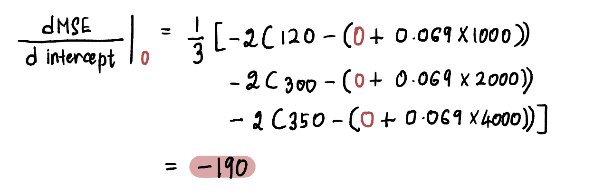
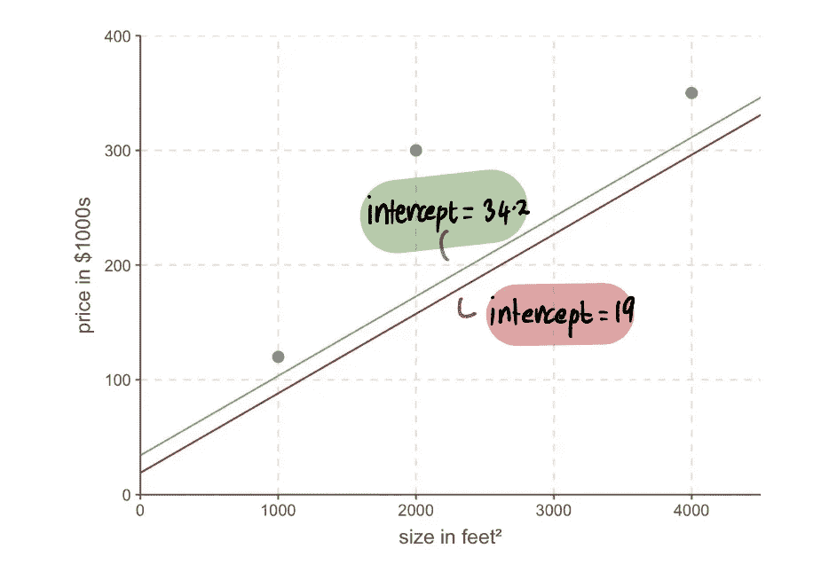
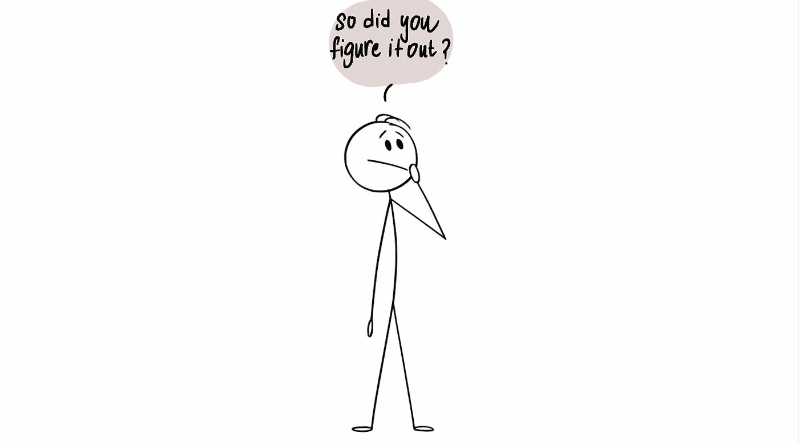

# 基础回顾，第二部分：梯度下降

> 原文：[`towardsdatascience.com/back-to-basics-part-dos-linear-regression-cost-function-and-gradient-descent-e3d7d05c56fd`](https://towardsdatascience.com/back-to-basics-part-dos-linear-regression-cost-function-and-gradient-descent-e3d7d05c56fd)

 [Shreya Rao](https://medium.com/@shreya.rao?source=post_page-----e3d7d05c56fd--------------------------------)

·发布于 [Towards Data Science](https://towardsdatascience.com/?source=post_page-----e3d7d05c56fd--------------------------------) ·阅读时间 11 分钟·2023 年 2 月 4 日

--

欢迎来到我们的***基础回顾***系列的第二部分。在 [第一部分](https://medium.com/towards-data-science/back-to-basics-part-uno-linear-regression-cost-function-and-gradient-descent-590dcb3eee46)中，我们讲解了如何使用线性回归和成本函数来为我们的房价数据找到最佳拟合线。然而，我们也看到测试多个*截距*值可能既繁琐又低效。在第二部分中，我们将深入探讨梯度下降，这是一种强大的技术，可以帮助我们找到完美的*截距*并优化我们的模型。我们将探讨其背后的数学原理，并看看它如何应用于我们的线性回归问题。

梯度下降是一种强大的优化算法，它***旨在快速高效地找到曲线的最小点***。最好的可视化方式是想象你站在山顶，山谷里有一个装满金币的宝箱等着你。

然而，山谷的确切位置是未知的，因为外面非常黑暗，你什么也看不见。此外，你希望在其他人之前到达山谷（因为你想独占所有的宝藏）。梯度下降帮助你导航地形，并***高效而迅速地***到达这个*最佳*点。在每个点，它会告诉你该走多少步以及需要朝哪个方向前进。

同样，通过使用算法制定的步骤，梯度下降可以应用到我们的线性回归问题中。为了可视化找到最小值的过程，让我们绘制**MSE**曲线。我们已经知道曲线的方程是：

曲线方程是用于计算均方误差（MSE）的方程

从上一篇文章中，我们知道我们问题中的**MSE**方程是：

如果我们放大一点，就会看到一个**MSE**曲线（类似于我们的谷底）可以通过将一堆*截距*值代入上述方程来找到。所以让我们代入 10,000 个*截距*值，得到如下曲线：

实际上，我们并不知道 MSE 曲线的样子

目标是达到这个**MSE**曲线的底部，我们可以通过以下步骤实现：

## 步骤 1：从一个随机的截距值初始猜测开始

在这种情况下，假设我们对*截距*值的初始猜测是 0。

## 步骤 2：计算此点 MSE 曲线的梯度

曲线在某一点的*梯度*由该点的切线表示（这是说该直线仅在该点接触曲线的一种方式）。例如，在点 A，当截距等于 0 时，**MSE**曲线的*梯度*可以由红色切线表示。

当截距 = 0 时，MSE 曲线的梯度

为了确定*梯度*的值，我们运用微积分知识。具体来说，*梯度*等于曲线对*截距*的导数，这在给定点上表示为：

> 注意：如果你不熟悉导数，我建议观看这个[Khan Academy 视频](https://www.khanacademy.org/math/ap-calculus-ab/ab-differentiation-1-new/ab-2-6a/v/derivative-properties-and-polynomial-derivatives)。否则，你可以略过下一部分，仍然能够跟随文章的其余内容。

我们计算***MSE 曲线的导数***如下：

现在为了找到***点 A 处的梯度***，我们将点 A 处的*截距*值代入上述方程中。由于*截距* = 0，点 A 处的导数为：

所以当*截距* = 0 时，*梯度* = -190

> **注意：** 当我们接近最优值时，梯度值接近零。在最优值处，梯度等于零。相反，当我们离最优值越远，梯度就越大。

从中我们可以推断步长应与*梯度*相关，因为它告诉我们是采取小步还是大步。这意味着，当曲线的*梯度*接近 0 时，我们应采取小步，因为我们接近最优值。如果*梯度*较大，则我们应采取较大的步伐，以更快地达到最优值。

> **注意：** 如果我们迈出一个超大的步伐，可能会跳过最佳点。所以我们需要小心。

## 步骤 3：使用梯度和学习率计算步长，并更新截距值

由于我们看到 ***步长*** 和 *梯度* 彼此成正比，*步长* 由 *梯度* 乘以一个预定的常数值来确定，这个常数值称为 ***学习率：***

*学习率* 控制 *步长* 的大小，并确保步伐既不太大也不太小。

> 实际上，学习率通常是一个小的正数，≤ 0.001。但对于我们的问题，我们将其设置为 0.1。

所以当截距为 0 时：

基于我们上面计算的 *步长*，我们使用以下等效公式更新 *截距*（即改变我们当前位置）：

为了找到这一步中的新 *截距*，我们代入相关值……

…并发现新的 *截距* = 19。

现在将这个值代入 **MSE** 方程中，我们发现当 *截距* 为 19 时，**MSE** = 8064.095。在一次大的步骤中，我们更接近了我们的最佳值，并降低了 **MSE**。

即使我们查看图表，我们也能看到新截距为 19 的直线比旧截距为 0 的直线更好地拟合了数据：

## 步骤 4：重复步骤 2-3

我们使用更新后的 *截距* 值重复步骤 2 和 3。

例如，由于此迭代中的新 *截距* 值为 19，按照 [步骤 2](https://medium.com/towards-data-science/back-to-basics-part-dos-linear-regression-cost-function-and-gradient-descent-e3d7d05c56fd#6ab4)，我们将计算该新点的梯度：

我们发现 **MSE** 曲线在截距值 19 处的 *梯度* 为 -152（如下图中红色切线所示）。

接下来，按照 [步骤 3](https://medium.com/towards-data-science/back-to-basics-part-dos-linear-regression-cost-function-and-gradient-descent-e3d7d05c56fd#67b0)，我们来计算 *步长*：

随后，更新 *截距* 值：

现在我们可以将之前截距为 19 的直线与新的截距为 34.2 的直线进行比较……

…并且我们可以看到新的直线更好地拟合了数据。

总体而言，**MSE** 正在变小……

…而我们的*步长*正在变得越来越小：

我们反复进行这个过程，直到我们收敛到最佳解决方案：

当我们向曲线的最小点推进时，我们观察到*步长*变得越来越小。在 13 步之后，梯度下降算法估计*截距*值为 95。如果我们有一个水晶球，这将被确认作为**MSE**曲线的最小点。很明显，这种方法比我们在[上一篇文章](https://medium.com/towards-data-science/back-to-basics-part-uno-linear-regression-cost-function-and-gradient-descent-590dcb3eee46)中看到的蛮力方法更有效。

现在我们已经有了*截距*的最佳值，线性回归模型是：

线性回归线如下所示：

最佳拟合线的截距为 95，斜率为 0.069

最后，回到我们朋友马克的问题——他应该以多少价格出售他那 2400 平方英尺的房子？

将 2400 平方英尺的房屋大小代入上述方程……

…瞧。我们可以告诉我们不必要担心的朋友马克，根据他所在社区的 3 栋房子，他应该将他的房子出售价格定在约$260,600。

现在我们对这些概念有了扎实的理解，让我们进行一个简短的问答环节，解答任何悬而未决的问题。

## 为什么找出梯度实际上有效？

为了说明这一点，考虑一个场景，我们尝试达到曲线 C 的最小点，记作*x**。我们当前在点 A，位于*x*的左侧：

如果我们在点 A 对曲线关于*x*求导，记作*dC(x)/dx*，我们会得到一个负值（这意味着*梯度*向下倾斜）。我们还观察到，需要向右移动才能到达*x**。因此，我们需要增加*x*以到达最小*x*。

红线，或称梯度，向下倾斜 => 负梯度

由于*dC(x)/dx*是负值，*x-𝛂*dC(x)/dx*将大于*x*，因此朝着*x**移动。

类似地，如果我们在点 A，位于最小点*x*的右侧，则我们得到一个**正的*梯度***（*梯度*向上倾斜），*dC(x)/dx*。

红线，或称梯度，向上倾斜 => 正梯度

因此*x-𝛂*dC(x)/dx*将小于*x*，从而朝着*x**移动。

## 梯度下降法如何知道何时停止？

当*步长*非常接近 0 时，梯度下降会停止。如前所述，在最小点处，*梯度*为 0，并且随着我们接近最小点，*梯度*也会接近 0。因此，当某一点的*梯度*接近 0 或在最小点附近时，*步长*也会接近 0，这表明算法已经达到了最优解。

当我们接近最小点时，梯度接近 0，随后，步长接近 0。

> 实际上，最小步长 = 0.001 或更小。

话虽如此，梯度下降还包括一个在放弃之前所进行的最大步数限制，称为*最大步数*。

> 实际上，最大步数 = 1000 或更大。

即使*步长*大于*最小步长*，如果已经进行了超过*最大步数*的迭代，梯度下降也会停止。

## 如果最小点更难以识别怎么办？

直到现在，我们一直在处理容易识别最小点的曲线（这些曲线被称为***凸性***曲线）。但如果我们遇到一条不那么美观的曲线（技术上称为***非凸性***曲线），并且它看起来像这样：

在这里，我们可以看到点 B 是*全局最小值*（实际最小值），而点 A 和 C 是*局部最小值*（可能被误认为是*全局最小值*的点）。因此，如果一个函数有多个*局部最小值*和一个*全局最小值*，并不保证梯度下降能够找到*全局最小值*。此外，它找到哪个局部最小值将取决于初始猜测的位置（如步骤 1 中所示）。

以上述非凸性曲线为例，如果初始猜测位于 A 区块或 C 区块，梯度下降会声明最小点位于局部最小值 A 或 C，实际上它位于 B。只有当初始猜测在 B 区块时，算法才会找到全局最小值 B。

**现在的问题是——我们如何做出一个好的初始猜测？**

*简单的答案：* 试错法。有点。

*不那么简单的答案：* 从上图来看，如果我们的* x* 最小猜测值为 0，因为它位于 A 区块，这会导致局部最小值 A。因此，如你所见，0 在大多数情况下可能不是一个好的初始猜测。一个常见的做法是在所有可能的 x 值范围内应用均匀分布的随机函数。此外，如果可行，运行算法并比较不同初始猜测的结果可以提供关于猜测是否存在显著差异的见解。这有助于更有效地识别全局最小值。

好了，我们快到了。最后一个问题。

## 如果我们尝试找到多个最佳值怎么办？

直到现在，我们只关注找到最佳的截距值，因为我们神奇地知道线性回归的*slope*值是 0.069。但是，如果没有水晶球，不知道最佳的*slope*值怎么办？那么我们需要同时优化斜率和截距值，分别表示为*x₀*和*x₁*。

为了做到这一点，我们必须使用偏导数，而不仅仅是导数。

> 注意：偏导数的计算方式与普通导数相同，但由于我们有多个变量需要优化，因此表示方式有所不同。要了解更多信息，请阅读这篇[文章](https://www.mathsisfun.com/calculus/derivatives-partial.html)或观看这个[视频](https://www.youtube.com/watch?v=JAf_aSIJryg)。

不过，这个过程与优化单一值的过程相对类似。成本函数（如**均方误差（MSE）**）仍然需要定义，并且梯度下降算法必须应用，但需要额外的步骤来求解 x₀和 x₁的偏导数。

**步骤 1：对 x₀和 x₁进行初始猜测**

**步骤 2：在这些点上找到关于 x₀和 x₁的偏导数**

**步骤 3：根据偏导数和学习率同时更新 x₀和 x₁**

**步骤 4：重复步骤 2–3，直到达到最大步数或步长小于最小步长**

*我们可以将这些步骤推广到 3、4，甚至 100 个值进行优化。*

总之，梯度下降是一种强大的优化算法，可以高效地帮助我们达到最优值。它可以应用于许多其他优化问题，是数据科学家必备的基本工具。

> 更新： [第三部分：逻辑回归](https://medium.com/towards-data-science/back-to-basics-part-tres-logistic-regression-e309de76bd66) 也已经上线了！

一如既往，欢迎通过[LinkedIn](https://www.linkedin.com/in/shreyarao24/)与我联系，或通过*shreya.statistics@gmail.com*发送电子邮件，提出问题或建议任何其他您希望说明的算法！
