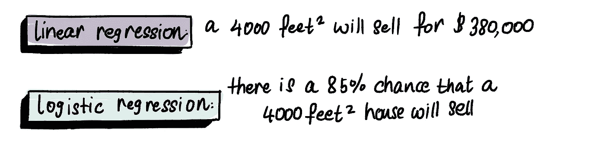

# 回到基础，第三部分：逻辑回归

> 原文：[`towardsdatascience.com/back-to-basics-part-tres-logistic-regression-e309de76bd66?source=collection_archive---------1-----------------------#2023-03-02`](https://towardsdatascience.com/back-to-basics-part-tres-logistic-regression-e309de76bd66?source=collection_archive---------1-----------------------#2023-03-02)

## 一份关于逻辑回归的插图指南，附有代码

 [Shreya Rao](https://medium.com/@shreya.rao?source=post_page-----e309de76bd66--------------------------------)

·

[关注](https://medium.com/m/signin?actionUrl=https%3A%2F%2Fmedium.com%2F_%2Fsubscribe%2Fuser%2F99b63de2f2c3&operation=register&redirect=https%3A%2F%2Ftowardsdatascience.com%2Fback-to-basics-part-tres-logistic-regression-e309de76bd66&user=Shreya+Rao&userId=99b63de2f2c3&source=post_page-99b63de2f2c3----e309de76bd66---------------------post_header-----------) 发表在 [Towards Data Science](https://towardsdatascience.com/?source=post_page-----e309de76bd66--------------------------------) ·8 分钟阅读·2023 年 3 月 2 日

--

欢迎回到我们***回到基础***系列的最后一篇文章，这次我们将深入探讨另一种基本的机器学习算法：**逻辑回归**。在之前的两篇文章中，我们帮助我们的朋友马克通过[线性回归](https://medium.com/towards-data-science/back-to-basics-part-uno-linear-regression-cost-function-and-gradient-descent-590dcb3eee46)和梯度下降确定了他 2400 平方英尺房子的理想售价。

今天，马克再次找我们求助。他住在一个高档社区，他认为小于某个尺寸的房子不会出售，他担心他的房子也可能卖不出去。他请我们帮助他确定他房子***出售的可能性***。

这是逻辑回归发挥作用的地方。

逻辑回归是一种预测二元结果概率的算法，例如预测房子是否会出售。与线性回归不同，逻辑回归使用 0%到 100%的范围来预测概率。请注意线性回归模型和逻辑回归模型之间的预测差异：

让我们通过确定不同尺寸房子的销售概率，深入了解逻辑回归是如何工作的。
