# 回到基础，第三部分：逻辑回归

> 原文：[`towardsdatascience.com/back-to-basics-part-tres-logistic-regression-e309de76bd66`](https://towardsdatascience.com/back-to-basics-part-tres-logistic-regression-e309de76bd66)

## 一本关于逻辑回归的图示指南，包括代码

 [Shreya Rao](https://medium.com/@shreya.rao?source=post_page-----e309de76bd66--------------------------------)

·发表于 [Towards Data Science](https://towardsdatascience.com/?source=post_page-----e309de76bd66--------------------------------) ·阅读时间 8 分钟·2023 年 3 月 2 日

--

欢迎回到我们***回到基础***系列的最终篇，在这一篇中，我们将深入探讨另一种基础机器学习算法：**逻辑回归**。在之前的两篇文章中，我们帮助我们的朋友 Mark 使用 [线性回归](https://medium.com/towards-data-science/back-to-basics-part-uno-linear-regression-cost-function-and-gradient-descent-590dcb3eee46) 和 梯度下降 确定了他 2400 平方英尺房子的理想售价。

今天，Mark 再次向我们求助。他住在一个高档社区，他认为某些尺寸以下的房子不会售出，他担心自己的房子也可能售不出去。他请我们帮助他确定他的房子***是否可能***售出。

这是逻辑回归发挥作用的地方。

逻辑回归是一种预测二元结果概率的算法，例如预测房子是否会售出。与线性回归不同，逻辑回归使用 0%到 100%的范围来预测概率。请注意线性回归模型和逻辑回归模型之间预测的区别：

让我们更深入地探讨逻辑回归如何通过确定不同大小的房子的销售概率来工作。

我们再次通过收集关于 Mark 所在社区的房屋大小的数据，并查看这些房屋是否售出，来开始我们的过程。

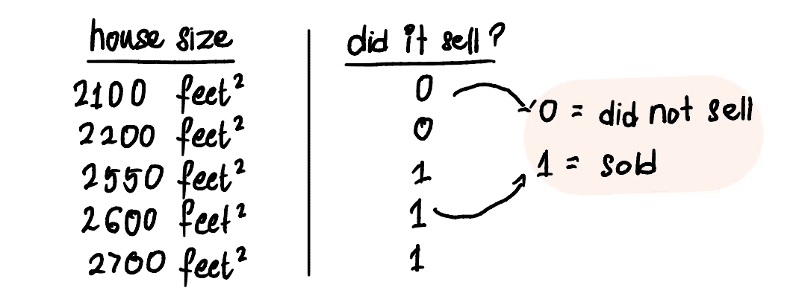

现在让我们绘制这些点：

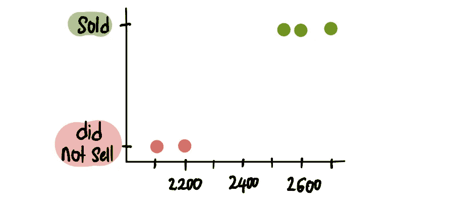

与其将图表的结果表示为二元输出，不如使用概率来表示，因为这是我们试图预测的量。

> 我们将 100%的概率表示为 1，将 0%的概率表示为 0

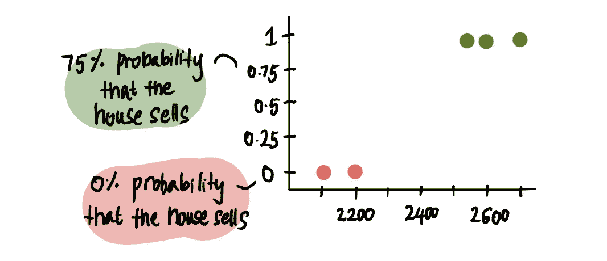

在我们上一篇文章中，我们学习了线性回归及其将直线拟合到数据的能力。但它能否用于我们的这个问题，其中期望的输出是一个概率？让我们通过尝试使用线性回归拟合一条直线来找出答案。

我们知道最佳拟合直线的公式是：

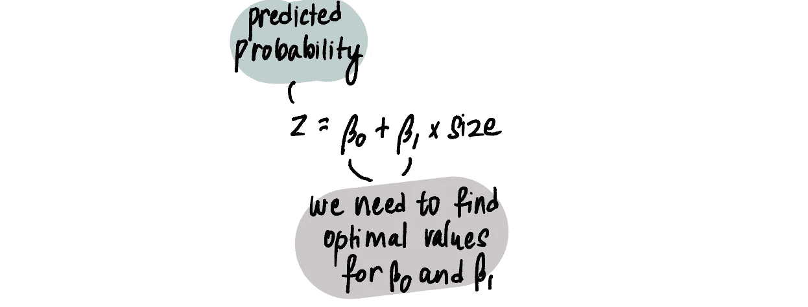

通过按照线性回归中概述的步骤，我们可以获得β₀和β₁的最佳值，从而得到最佳拟合的直线。假设我们已经完成了这些步骤，让我们看看我们获得的直线：

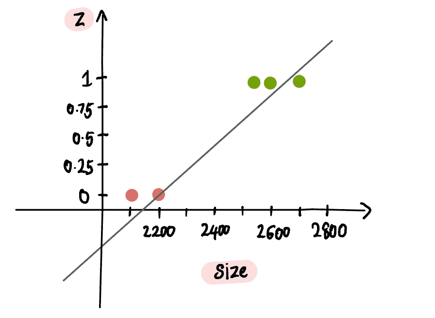

根据这条直线，我们可以看到一栋面积稍低于 2700 平方英尺的房子被预测有 100%的概率出售：

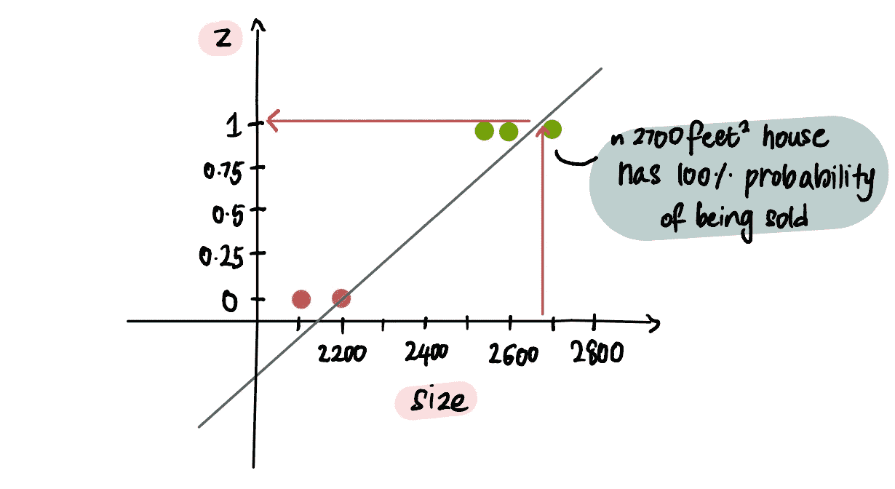

……而一栋 2200 平方英尺的房子被预测有 0%的出售概率：

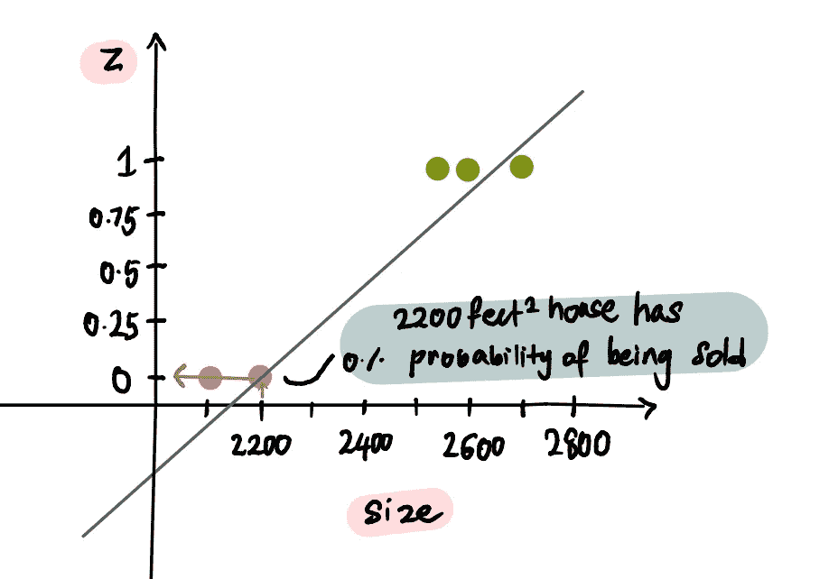

……而一栋 2300 平方英尺的房子被预测有大约 20%的出售概率：

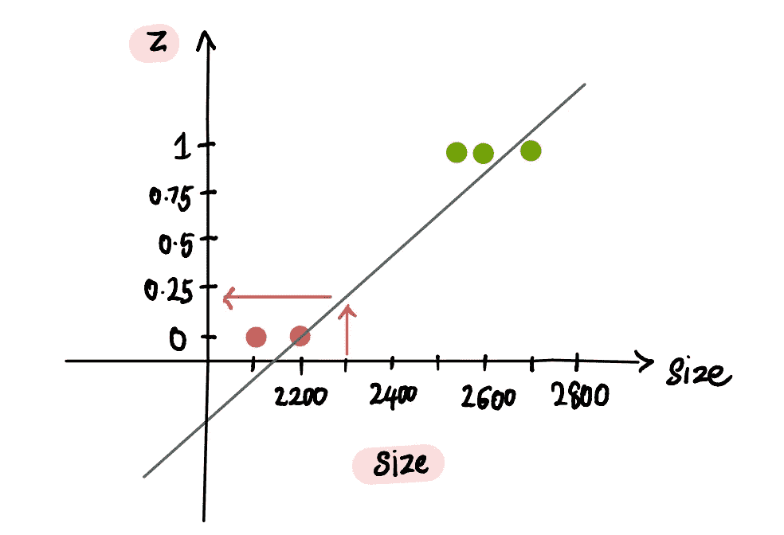

好了，到目前为止一切顺利。但如果我们有一栋面积为 2800 平方英尺的房子呢？

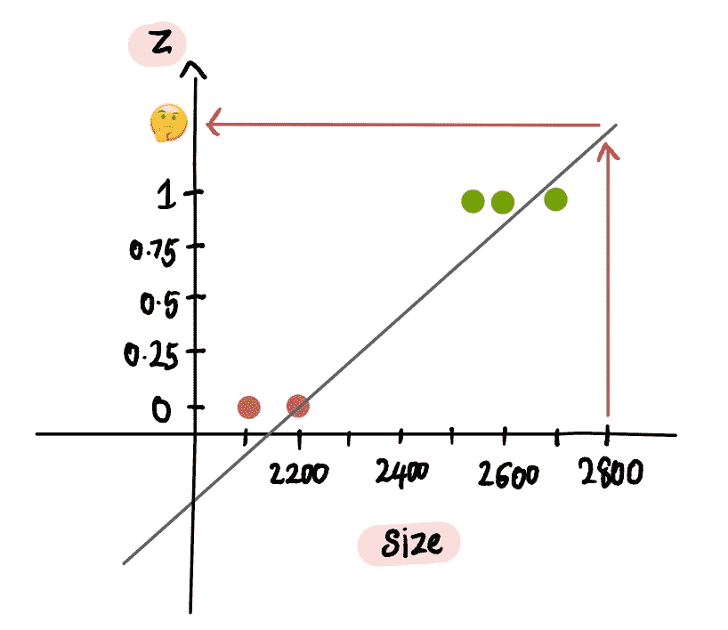

嗯……概率超过 100%是什么意思？这样的房子会被预测以 150%的概率出售吗？

奇怪。那一栋 2100 平方英尺的房子呢？

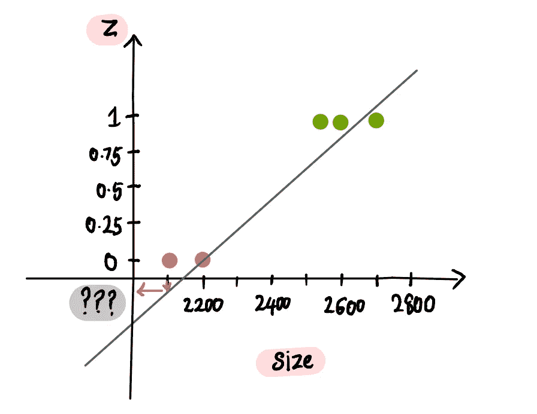

好吧，很明显我们遇到了一个问题，因为一个 2100 平方英尺房子的预测概率似乎是负值。这显然是没有意义的，这表明使用标准线性回归直线存在问题。

我们知道，概率的范围是从 0 到 1，我们不能超出这个范围。所以我们需要找到一种方法来将预测输出限制在这个范围内。

为了解决这个问题，我们可以通过一个非常酷的机器——**sigmoid 函数**，来处理我们的线性回归方程。这个机器将我们的预测值转换到 0 和 1 之间。我们将我们的 z 值（其中 z = β₀ + β₁size）输入到机器中……

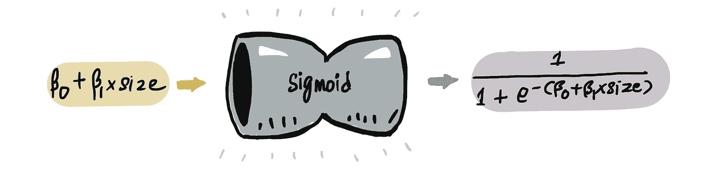

……然后出现了一个看起来很高级的新方程，它将符合我们的概率约束。

> 注意：输出中的**e**是一个常数值，大约等于 2.718。

一种更数学化的方式来表示`sigmoid 函数`：

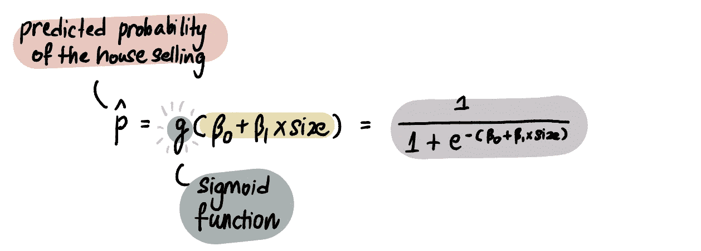

如果我们绘制这个公式，我们会看到 sigmoid 函数将直线挤压成一个 S 形曲线，限制在 0 和 1 之间。

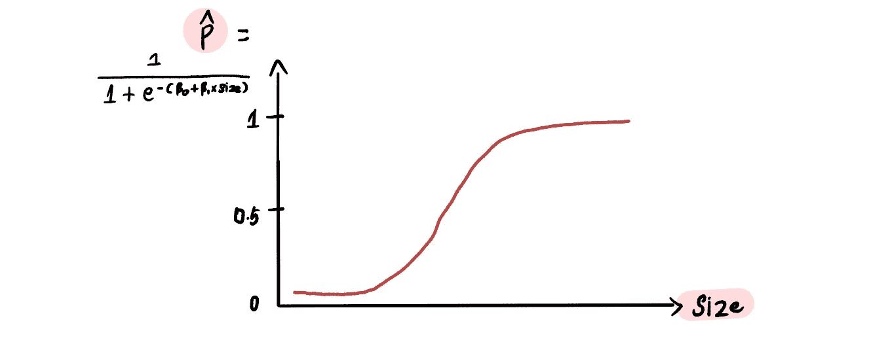

> 对于所有数学爱好者的可选说明：你可能在想我们为什么以及如何使用 sigmoid 函数来获得期望的输出。让我们来详细解释一下。
> 
> 我们开始时错误地假设使用线性回归公式会给我们所需的概率。

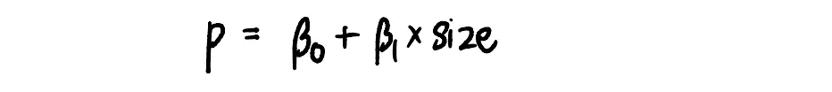

> 这个假设的问题在于(β₀ + β₁size)的范围是(-∞,+∞)，而 p 的范围是[0,1]。所以我们需要找到一个范围与(β₀ + β₁size)相匹配的值。
> 
> 为了解决这个问题，我们可以将直线等同于“对数几率”（观看[这个视频](https://www.youtube.com/watch?v=ARfXDSkQf1Y)以更好地理解对数几率），因为我们知道对数几率的范围是(-∞,+∞)。

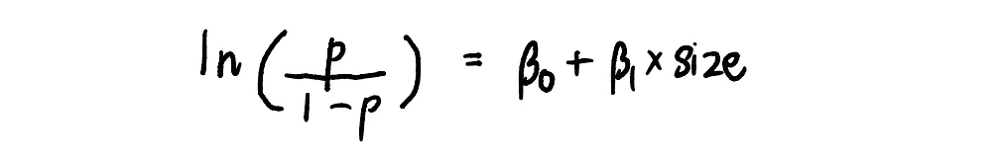

> 既然我们完成了这个步骤，只需重新排列这个方程，以找到**p**值应该等于多少。

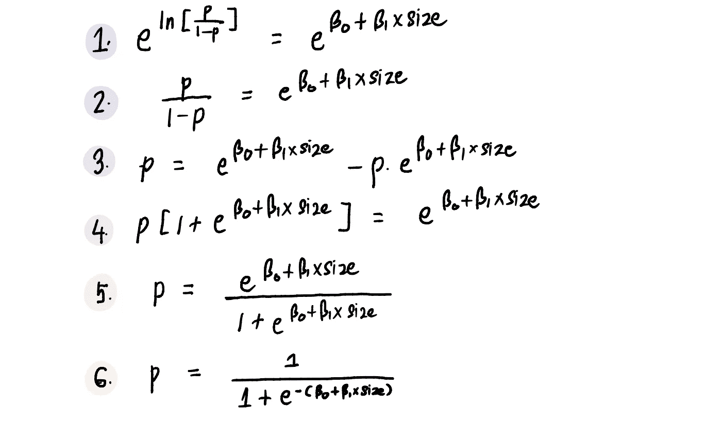

现在我们知道如何修改线性回归线以适应我们的输出约束，我们可以回到最初的问题。

我们需要为我们的数据集确定最佳曲线。为此，我们需要确定β₀和β₁的最佳值（因为这些是预测概率方程中会改变曲线形状的唯一值）。

类似于线性回归，我们将利用一个成本函数和梯度下降算法来获取这些系数的合适值。然而，关键区别在于我们不会使用[**均方误差**成本函数](https://medium.com/towards-data-science/back-to-basics-part-uno-linear-regression-cost-function-and-gradient-descent-590dcb3eee46#e9d3)，而是使用一个称为**对数损失**的不同成本函数，我们将在稍后深入探讨。

假设我们使用梯度下降和**对数损失**成本（[使用这些步骤](https://medium.com/towards-data-science/back-to-basics-part-dos-linear-regression-cost-function-and-gradient-descent-e3d7d05c56fd)）发现我们的最佳值为β₀ = -120.6 和β₁ = 0.051，那么我们预测的概率方程将是：

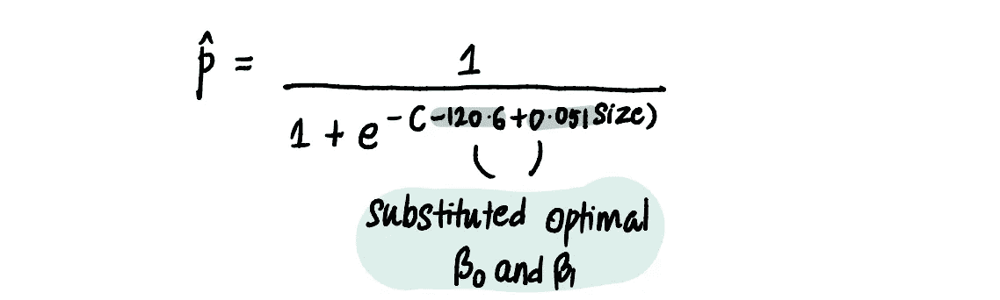

对应的最佳曲线是：

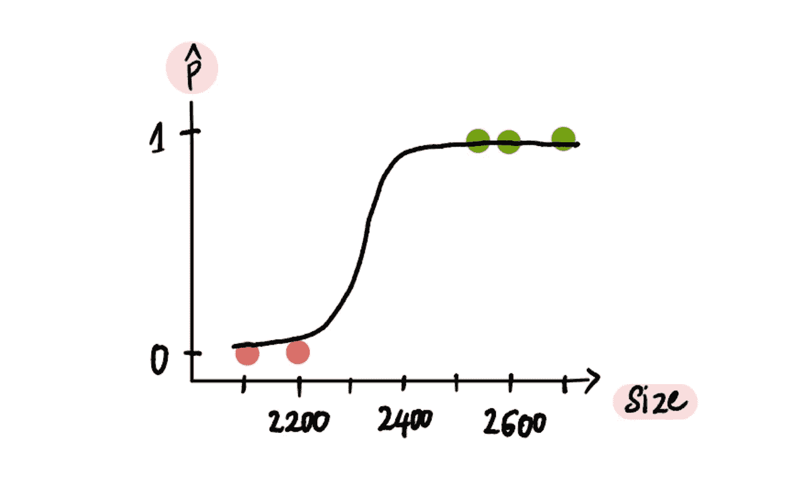

有了这个新曲线，我们现在可以解决马克的问题。通过观察，我们可以看到一个大小为 2400 平方英尺的房子……

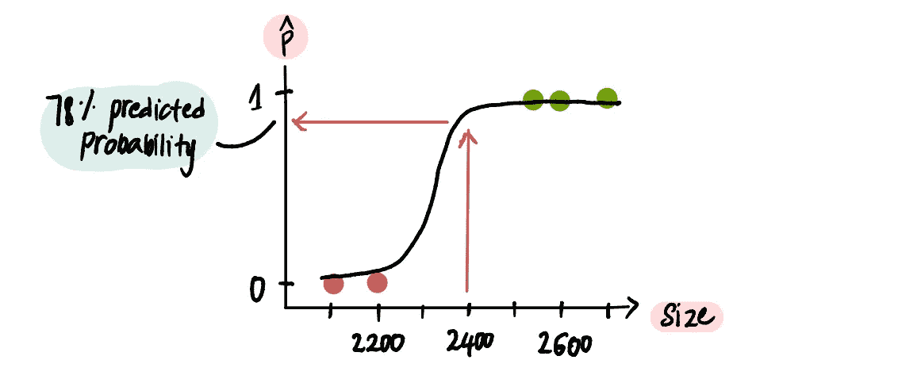

…的预测概率大约为 78%。因此，我们可以告诉马克不必担心，因为他的房子很可能会卖出去。

我们可以通过开发一个**分类算法**来进一步提升我们的方法。分类算法通常用于机器学习中，将数据分类到不同类别。在我们的情况下，我们有两个类别：会卖出的房子和不会卖出的房子。

要开发分类算法，我们需要定义一个阈值概率。这个阈值概率将预测的概率分为两个类别，“是的，房屋会出售”和“不是，房屋不会出售”。通常，50%（或 0.5）被用作阈值。

如果对房屋面积的预测概率超过 50%，它将被分类为“会出售”，如果低于 50%，则被分类为“不会出售”。

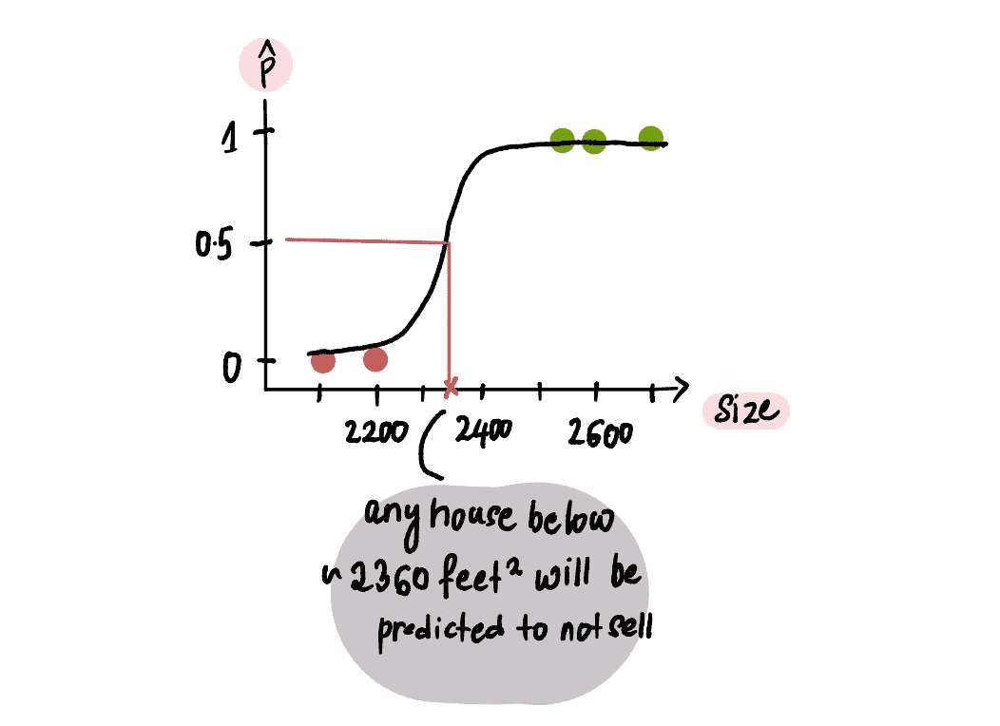

就是这样。这就是我们如何使用逻辑回归来解决问题。现在让我们理解我们用来找到逻辑回归最优值的成本函数。

## 成本函数

在线性回归中，成本是基于直线与数据点之间的偏差。而在逻辑回归中，成本函数取决于我们的预测与实际数据之间的偏差，*考虑到我们处理的是概率*。

如果我们在逻辑回归中使用了**MSE**成本函数（就像我们在线性回归中所做的那样），我们将得到一个***非凸***（一种*不那么漂亮的曲线，不能有效用于梯度下降*）[难以优化的成本函数曲线。](https://medium.com/towards-data-science/back-to-basics-part-dos-linear-regression-cost-function-and-gradient-descent-e3d7d05c56fd#6754)

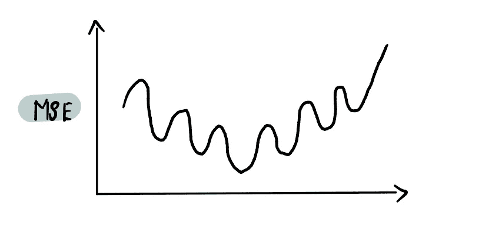

正如你可能从我们的梯度下降讨论中记得的那样，优化一个***凸***（即*具有明显最小点的曲线*）曲线比优化一个非凸曲线要容易得多。

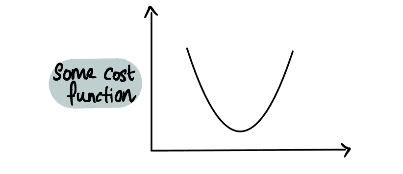

为了实现一个凸的成本函数曲线，我们使用一个称为**Log Loss**的成本函数。

要详细解析**Log Loss**成本函数，我们需要为房屋实际出售（y=1）和未出售（y=0）分别定义成本。

如果`y = 1`且我们预测为 1（即，100%概率出售），则没有惩罚。然而，如果我们预测为 0（即，0%概率未出售），则会受到严重惩罚。

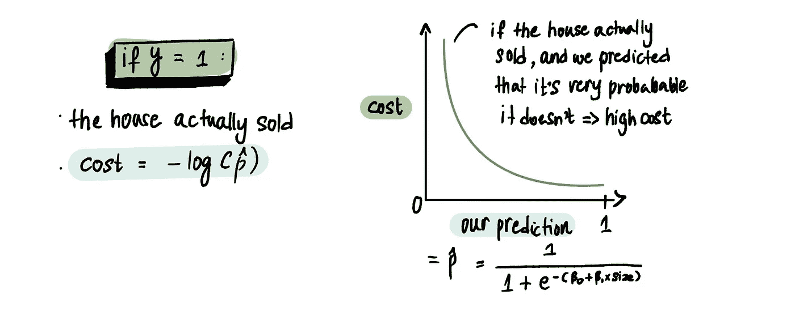

同样地，如果`y = 0`且我们预测房屋出售的概率很高，我们应受到严重惩罚；如果我们预测房屋出售的概率很低，则应受到较低的惩罚。偏差越大，成本越高。

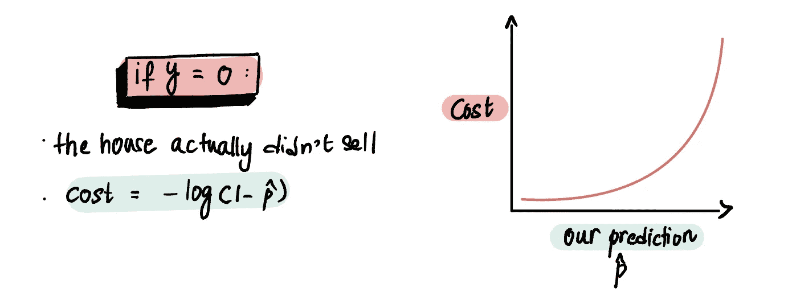

要计算我们数据集中所有房屋的成本，我们可以像这样对所有单个预测的成本进行平均：

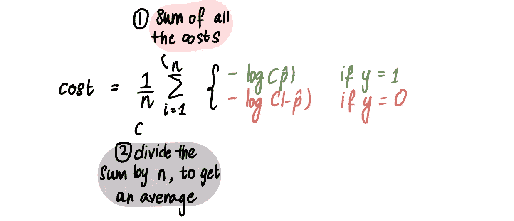

通过巧妙地重写这两个方程，我们可以将它们合并成一个方程，以得到我们的**Log Loss**成本函数。

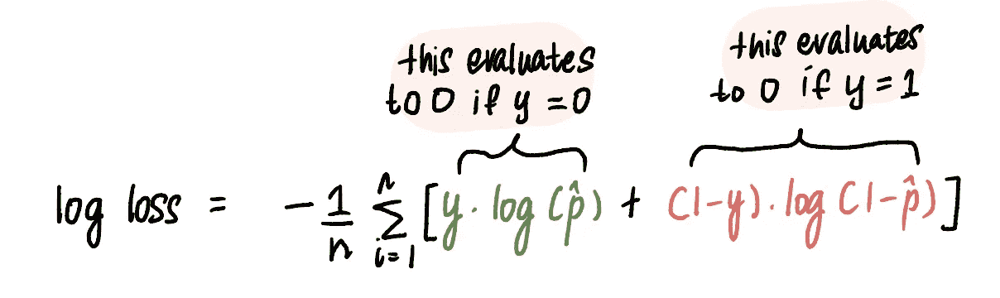

这是有效的，因为这两个值中总有一个为零，因此只使用另一个值。

结合的成本图看起来是这样的：

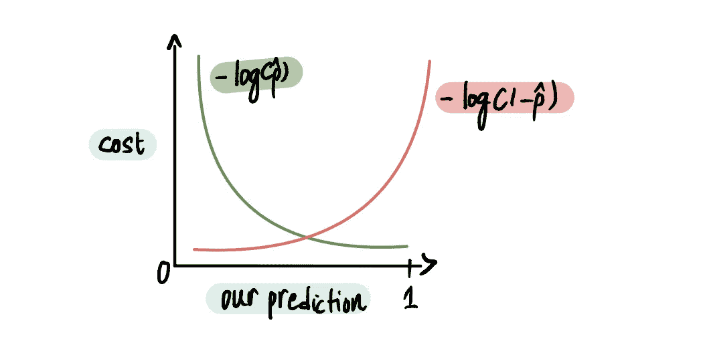

既然我们已经很好地理解了逻辑回归背后的数学和直觉，我们来看看如何在 Python 中实现 Mark 的房屋面积问题。

完成了！现在你拥有了解决逻辑回归问题所需的一切。

以及一如既往，如果有任何问题，请随时通过[LinkedIn](https://www.linkedin.com/in/shreyarao24/)联系我，或者发邮件到 *shreya.statistics@gmail.com*。
