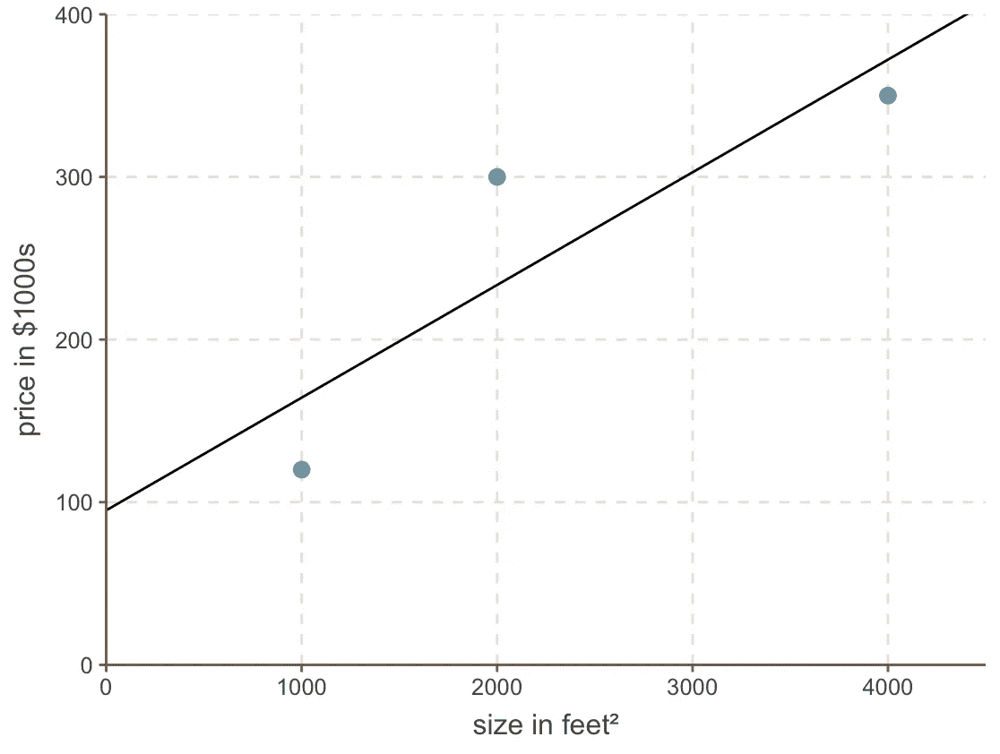
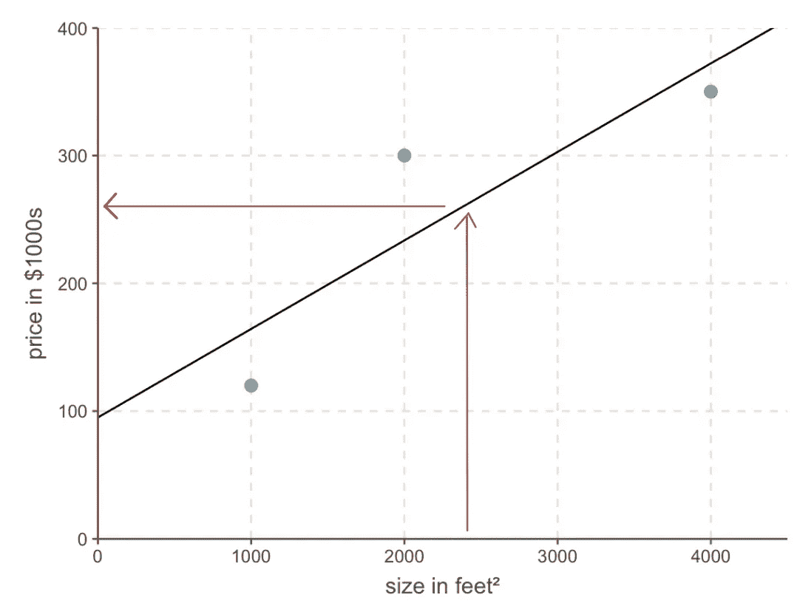
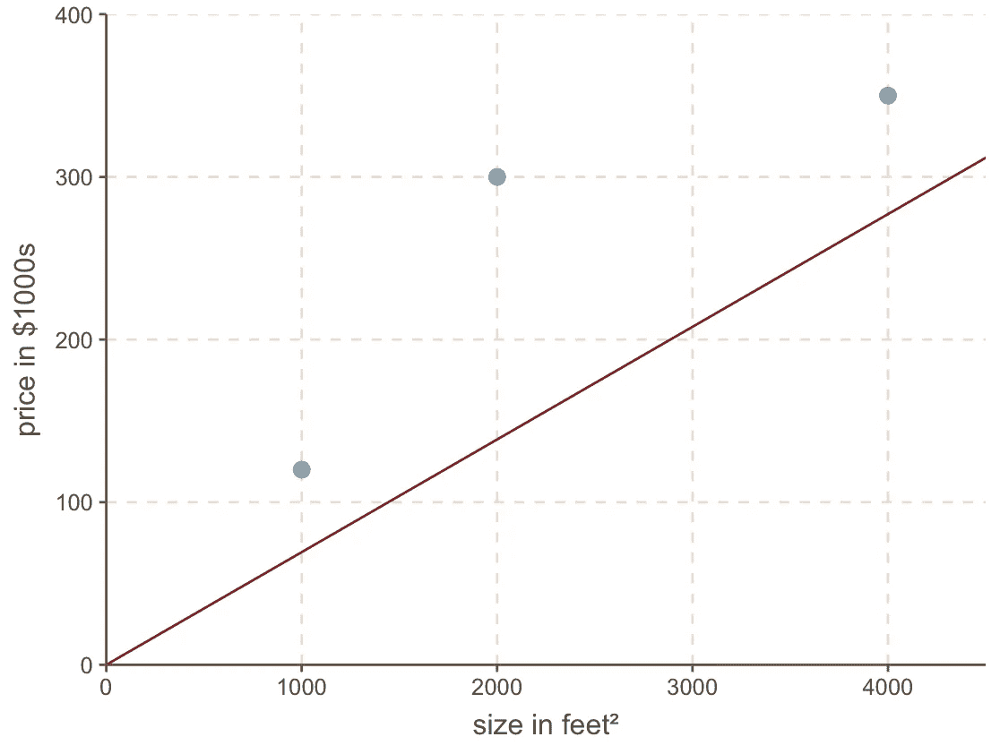
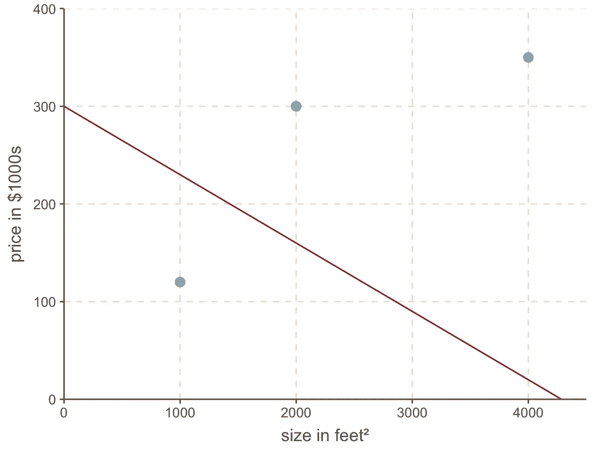

# 回归基础，第一部分：线性回归和成本函数

> 原文：[`towardsdatascience.com/back-to-basics-part-uno-linear-regression-cost-function-and-gradient-descent-590dcb3eee46`](https://towardsdatascience.com/back-to-basics-part-uno-linear-regression-cost-function-and-gradient-descent-590dcb3eee46)

## 一份关于基本机器学习概念的图解指南

 [Shreya Rao](https://medium.com/@shreya.rao?source=post_page-----590dcb3eee46--------------------------------)

·发布于[数据科学前沿](https://towardsdatascience.com/?source=post_page-----590dcb3eee46--------------------------------) ·阅读时间 7 分钟·2023 年 2 月 3 日

--

今天，我们将深入探讨机器学习中的三个关键概念：线性回归、成本函数和梯度下降。这些概念构成了许多机器学习算法的基础。最初，我决定不写关于这些主题的文章，因为它们已经被广泛讨论。然而，我改变了主意，因为理解这些概念对于理解像神经网络这样的高级主题（我计划在不久的将来讨论）是至关重要的。此外，为了更好地理解，本系列将分为两部分进行。

所以，舒适一下，拿杯咖啡，准备好开始这场神奇的机器学习之旅吧。

与任何机器学习问题一样，我们从一个具体的问题开始。在这个案例中，我们的朋友马克正在考虑出售他 2400 平方英尺的房子，并寻求帮助来确定最合适的挂牌价格。

直观地，我们从寻找我们朋友所在邻里中可比的房子开始。经过一些挖掘，我们找到了一份附近三栋房子的销售记录。自然，一个典型的数据集会有成千上万的数据点，但我们将简单化，先从这三栋房子开始。

让我们绘制这些数据：

通过检查数据，我们发现房屋的价格似乎与其面积在一个线性关系中相关。为了建模这种关系，我们可以使用一种*称为线性回归的机器学习技术*。这涉及在散点图上绘制一条最佳拟合数据点模式的直线。我们的模型可能如下所示：

现在使用这条直线，我们可以说一个 2400 平方英尺的房子应该卖...

…~$260,000。然后就可以得到答案了。

## 现在最大的问提是：我们如何确定最适合我们数据的直线？

我本可以画一条稍微偏离的直线，如下所示：

或者，甚至更糟，如下所示：

我们可以清楚地看到，它们并没有像我们的第一条直线那样很好地拟合数据。

要找出最佳直线，首先需要数学上表示出一条糟糕的直线是什么样的。所以我们取这条“糟糕”的直线，并根据它，2000 平方英尺的房子应该卖 ~$140,000，而我们知道它实际卖了 $300,000：

它也与所有其他值显著不同：

平均而言，这条直线的偏差为 ~$94,000（$50,000 + $160,000 + $72,000 / 3）。

这里是一条更好的直线：

这条直线的平均偏差为 ~$44,000，这要好得多。这$44,000 被称为*使用此直线的成本*。*成本*是直线与实际数据的偏差。最好的直线是与实际数据偏差最小或成本最低的直线。为了找出哪条直线是最好的，我们需要使用**成本函数**。

# 成本函数

上面，我们利用**均绝对误差（MAE）**成本函数来确定实际房价与预测价格之间的偏差。这基本上计算了实际房价（表示为 y，因为它表示 y 轴上的值）与预测房价（表示为 ŷ）之间的偏差的平均值。我们将**MAE**数学上表示为：

> 注：在计算 MAE 时使用绝对值，因为它们确保预测值与实际值之间的差异始终为正，无论预测值是高还是低。这允许在不同预测之间公平比较误差，因为如果不取绝对值，正负差异会相互抵消。

根据机器学习算法和当前问题的不同，可以使用各种类型的成本函数。对于我们的问题，我们将使用一种常用的方法，即**均方误差（MSE）**，它计算*预测房价与实际房价之间差异的平方的平均值*。

*最终*，任何成本函数的目的都是*将其值最小化并尽可能降低成本*。

## 直线方程

在深入研究线性回归之前，让我们退一步回顾基础知识。这里有一个直线的例子：*y = 1 + 2x*

第一个数字，称为*截距*，告诉我们直线在开始时应该有多高。

第二个数字告诉我们直线的角度（或者，用技术术语说，就是*斜率*）：

既然我们了解了方程的工作原理，我们只需要确定这两个值的最佳值——*斜率*和*截距*，以获得我们线性回归问题的最佳拟合直线。为了更简单些，假设我们已经神奇地拥有了*斜率*的值，0.069。

所以我们的线性回归直线的方程是：

要获取某一特定大小房屋的预测价格，我们只需要插入*截距*和期望的房屋大小。例如，对于一个大小为 1000 平方英尺，*截距*为 0 的房子……

…我们得到一个预测的房价为 69,000 美元。所以现在我们需要做的就是找到*截距*的最佳值，以便得到我们的线性回归模型。

一种选择（我们很快会发现这种方法相当繁琐且不太有趣）是使用蛮力法，其中我们反复猜测*截距*的值，绘制一个线性回归线，并计算**MSE**。为了实验的目的，我们暂时尝试这种方法。

从一个随机的*截距*值开始猜测（我们从 0 开始），并绘制线性回归线：

然后我们计算这条线的***MSE***：

为了获得直观的理解，我们在图上绘制*截距*值和相应的**MSE**：

接下来，我们将测试另一个*截距*值（假设为 25），绘制相应的直线，并计算**MSE**。

我们可以继续使用不同的*截距*值（= 0, 25, 50, 75, 100, 125, 150, 175）进行这个过程，直到我们得到一个如下所示的图：

从图上绘制的点可以看出，当*截距*设置为 100 时，**MSE**是最低的。然而，也有可能在 75 和 100 之间存在另一个*截距*值会产生更低的**MSE**。找到最小**MSE**的一种缓慢而痛苦的方法是像下面这样插入更多的*截距*值：

尽管我们付出了努力，但我们无法确定是否找到了最低可能的**均方误差**值。测试多个截距值的过程既繁琐又低效。幸运的是，梯度下降可以通过更高效和有效的方式找到最优解。而这正是我们将在本系列的[第二部分](https://medium.com/towards-data-science/back-to-basics-part-dos-linear-regression-cost-function-and-gradient-descent-e3d7d05c56fd)中探讨的内容！

 ## 回到基础，第两部分：梯度下降

### 关于基本机器学习概念的易于理解的视角

towardsdatascience.com

你可以通过[LinkedIn](https://www.linkedin.com/in/shreyarao24/)与我联系，或通过*shreya.statistics@gmail.com*发邮件给我，提出问题和建议，尤其是对于你希望我讲解的其他算法！
