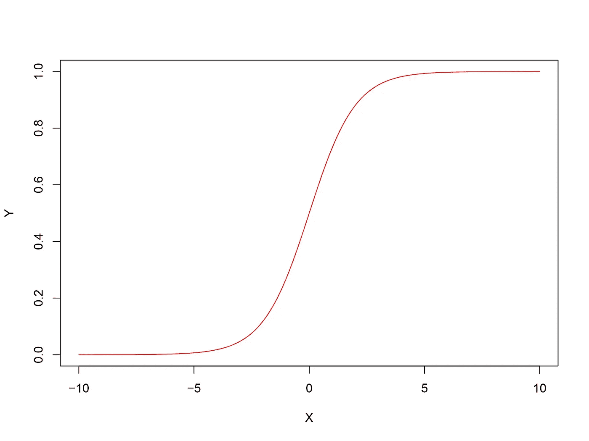
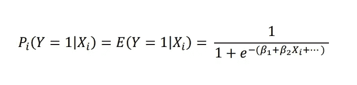
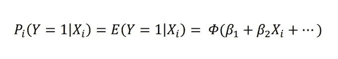
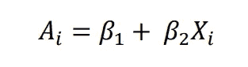
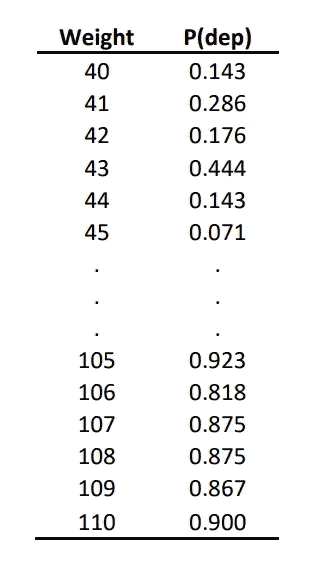
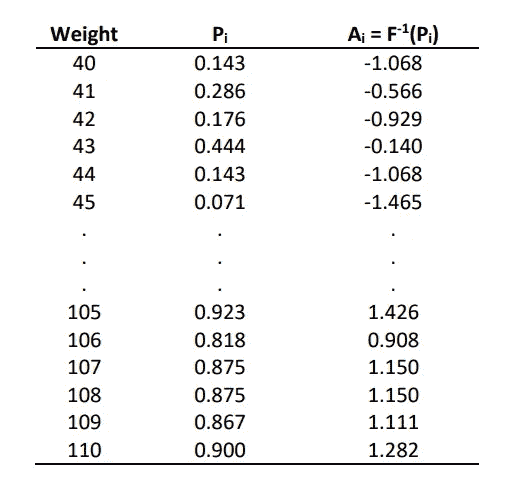
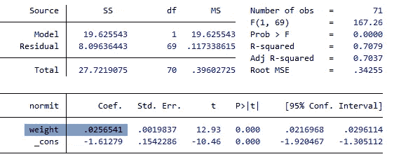
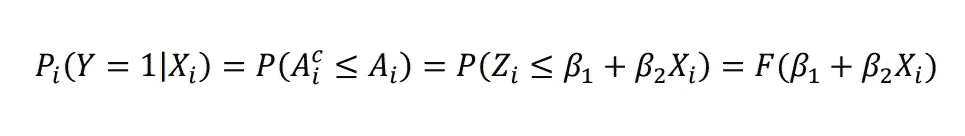
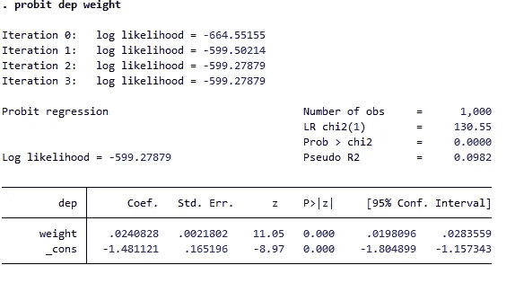
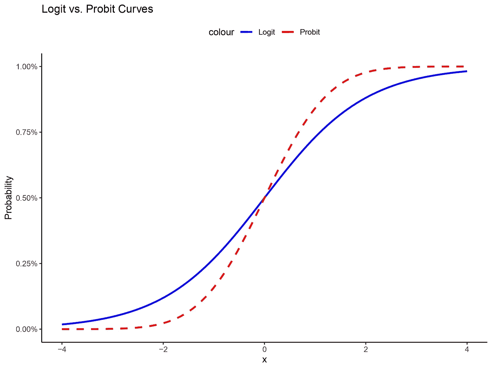

# 回到基础知识：Probit 回归

> 原文：[`towardsdatascience.com/back-to-the-basics-probit-regression-ac05f4694d49?source=collection_archive---------5-----------------------#2023-11-09`](https://towardsdatascience.com/back-to-the-basics-probit-regression-ac05f4694d49?source=collection_archive---------5-----------------------#2023-11-09)

## **二元结果分析中的关键方法**

 [Akif Mustafa](https://medium.com/@akif.iips?source=post_page-----ac05f4694d49--------------------------------)

·

[关注](https://medium.com/m/signin?actionUrl=https%3A%2F%2Fmedium.com%2F_%2Fsubscribe%2Fuser%2F7ff7bb988de&operation=register&redirect=https%3A%2F%2Ftowardsdatascience.com%2Fback-to-the-basics-probit-regression-ac05f4694d49&user=Akif+Mustafa&userId=7ff7bb988de&source=post_page-7ff7bb988de----ac05f4694d49---------------------post_header-----------) 发布于 [Towards Data Science](https://towardsdatascience.com/?source=post_page-----ac05f4694d49--------------------------------) ·7 min read·Nov 9, 2023

--

图片由 [Issac Smith](https://unsplash.com/@isaacmsmith) 提供，来自 [Unsplash](https://unsplash.com/photos/pen-on-paper-6EnTPvPPL6I)

每当我们面对与分析二元结果相关的任务时，我们往往会将 logistic 回归视为首选方法。这就是为什么大多数关于二元结果回归的文章都专注于 logistic 回归。然而，logistic 回归并不是唯一的选择。还有其他方法，例如线性概率模型（LPM）、Probit 回归和互补对数对数（Cloglog）回归。不幸的是，互联网上缺乏这些主题的文章。

线性概率模型很少被使用，因为它在捕捉二元结果与自变量之间的曲线关系方面效果不佳。我在之前的一篇文章中讨论过 Cloglog 回归。虽然互联网上有一些关于 Probit 回归的文章，但它们往往技术性较强，非技术读者难以理解。在这篇文章中，我们将解释 Probit 回归的基本原理及其应用，并与逻辑斯蒂回归进行比较。

# **背景**

这就是二元结果变量与自变量之间关系的典型表现：

作者提供的图片

你看到的曲线被称为 S 形曲线或逻辑斯蒂曲线。如果我们仔细观察这个图，我们会发现它类似于一个随机变量的累积分布函数（CDF）。因此，使用 CDF 来建模二元结果变量与自变量之间的关系是有意义的。最常用的 CDF 是逻辑斯蒂分布和正态分布。逻辑斯蒂回归使用逻辑斯蒂 CDF，其方程如下：

作者提供的图片

在 Probit 回归中，我们利用正态分布的累积分布函数（CDF）。合理地，我们可以用正态分布 CDF 替换逻辑斯蒂 CDF，以得到 Probit 回归的方程：

作者提供的图片

其中Φ()表示标准正态分布的累积分布函数。

我们可以记住这个方程式，但它并不能澄清我们对 Probit 回归的概念。因此，我们将采用一种不同的方法来更好地理解 Probit 回归的工作原理。

# Probit 回归的基本概念

假设我们有一组关于 1000 名个体的体重和抑郁状态的数据。我们的目标是使用 Probit 回归来研究体重与抑郁之间的关系。（从这个[链接](https://github.com/akifiips/Probit-Regression)下载数据。）

为了提供一些直观的理解，让我们假设一个个体（“第 i 个”个体）是否会经历抑郁取决于一个不可观察的潜在变量，记作 A*i*。这个潜在变量受到一个或多个自变量的影响。在我们的场景中，个体的体重决定了潜在变量的值。经历抑郁的概率随着潜在变量的增加而增加。

作者提供的图片

问题是，由于 A*i*是一个未观察到的潜在变量，我们如何估计上述方程的参数？好吧，如果我们假设它呈正态分布且具有相同的均值和方差，我们将能够获得关于潜在变量的一些信息，并估计模型参数。我稍后会更详细地解释这些方程，但首先，让我们进行一些实际计算。

回到我们的数据：在我们的数据中，让我们计算每个年龄的抑郁症概率并将其制表。例如，有 7 个人体重为 40 公斤，其中 1 人有抑郁症，因此体重 40 的抑郁症概率为 1/7 = 0.14286。如果我们对所有体重进行此操作，我们将得到以下表格：

图片由作者提供

那么，我们如何获得潜在变量的值呢？我们知道正态分布给出了给定 X 值的 Y 的概率。然而，正态分布的逆累积分布函数（CDF）使我们能够获得给定概率值的 X 值。在这种情况下，我们已经有了概率值，这意味着我们可以通过使用正态分布的逆 CDF 来确定潜在变量的相应值。 [注意：逆正态 CDF 函数几乎在所有统计软件中都可以找到，包括 Excel。]

图片由作者提供

这个未观察到的潜在变量 A*i*被称为正态等效偏差（n.e.d.），或简单地称为**normit**。仔细观察，这只是与未观察到的潜在变量相关的 Z 分数。一旦我们有了估计的 Ai，估计β1 和β2 相对简单。我们可以在 A*i*和我们的自变量之间进行简单的线性回归。

图片由作者提供

权重为 0.0256 的系数给出了与权重的单位变化相关的结果变量（抑郁症）的 z 分数的变化。具体而言，权重的单位增加与抑郁症高概率的 z 分数单位增加约 0.0256 相关。我们可以使用标准正态分布计算任何年龄的抑郁症概率。例如，对于体重 70，

A*i* = -1.61279 + (0.02565)*70

A*i* = 0.1828

与 z 分数 0.1828（P(x<Z)）相关的概率是 0.57；即体重 70 的抑郁症预测概率是 0.57。

可以说，上述解释对一个适度复杂的方法进行了过度简化是相当合理的。同时也需要注意，这只是使用累积正态分布在 Probit 回归中的基本原理的一个说明。现在，让我们看看数学方程。

## 数学结构

我们之前讨论过存在一个潜在变量 A*i*，它由预测变量决定。考虑到潜在变量存在一个临界或阈值（A*i*_c）是很合逻辑的，即如果 A*i*超过 A*i*_c，则个体将会有抑郁症；否则，他/她将不会有抑郁症。假设正态分布的前提下，可以从标准化正态累积分布函数中计算 A*i*小于或等于 A*i*_c 的概率：

图片由作者提供

其中 Z*i*是标准正态变量，即 Z ∼ N(0, σ 2)，F 是标准正态累积分布函数。

与潜在变量及β1 和β2 相关的信息可以通过对上述方程取逆得到：

图片由作者提供

当我们想要获得给定概率值的 Z 值时，会使用标准正态分布的逆累积分布函数。

现在，β1、β2 和 A*i*的估计过程取决于我们是否拥有分组数据或个体级别的未分组数据。

当我们有分组数据时，计算概率是很容易的。在我们的抑郁症例子中，初始数据是未分组的，即每个个体的权重及其抑郁状态（1 和 0）。最初，总样本量为 1000，但我们按权重将数据分组，结果形成 71 个组，并计算了每个权重组中的抑郁概率。

然而，当数据未分组时，使用最大似然估计（MLE）方法来估计模型参数。下图显示了我们未分组数据（n = 1000）上的 Probit 回归：

图片由作者提供

可以观察到，权重系数非常接近我们使用分组数据估计的结果。

# **Probit 与 Logit**

现在我们已经掌握了 Probit 回归的概念，并且对逻辑回归（希望）也比较熟悉，问题来了：哪个模型更优？在不同条件下哪个模型表现更好？事实上，这两个模型在应用上非常相似，并且在预测概率方面的结果也相当接近。唯一的细微区别在于它们对极端值的敏感性。让我们更详细地了解这两个模型：

图片由作者提供

从图中我们可以观察到，Probit 和 Logit 模型非常相似。然而，Probit 对极端值的敏感性较低。这意味着在极端值下，预测变量单位变化对结果概率的影响在 Logit 模型中高于 Probit 模型。因此，如果你希望模型对极端值敏感，你可能会更倾向于使用逻辑回归。然而，这种选择不会显著影响估计结果，因为两种模型在预测概率方面产生的结果相似。需要注意的是，来自两种模型的系数表示的是不同的量，不能直接比较。Logit 回归提供了结果与预测变量变化的对数赔率的变化，而 Probit 回归提供了结果的 z-score 的变化。然而，如果我们使用两种模型计算预测概率，结果将非常相似。

在实践中，逻辑回归因其数学简洁性和系数解释的方便性而优于 Probit 回归。
