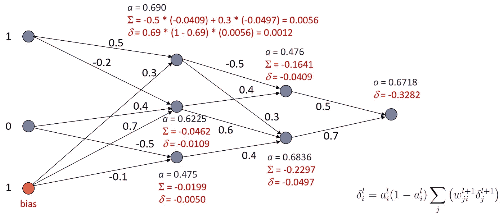

# 反向传播：逐步推导

> 原文：[`towardsdatascience.com/backpropagation-step-by-step-derivation-99ac8fbdcc28`](https://towardsdatascience.com/backpropagation-step-by-step-derivation-99ac8fbdcc28)

## 完整的神经网络训练算法指南

 [Roi Yehoshua 博士](https://medium.com/@roiyeho?source=post_page-----99ac8fbdcc28--------------------------------)

·发表于 [Towards Data Science](https://towardsdatascience.com/?source=post_page-----99ac8fbdcc28--------------------------------) ·阅读时间 11 分钟·2023 年 4 月 10 日

--

图片来源：[DeepMind](https://unsplash.com/@deepmind?utm_source=unsplash&utm_medium=referral&utm_content=creditCopyText) 在 [Unsplash](https://unsplash.com/photos/8heReYC6Zt0?utm_source=unsplash&utm_medium=referral&utm_content=creditCopyText)

在 [上一篇文章](https://medium.com/@roiyeho/multi-layer-perceptrons-8d76972afa2b) 中，我们讨论了多层感知机（MLPs）作为第一个可以解决非线性和复杂问题的神经网络模型。

很长一段时间内，如何在给定数据集上训练这些网络并不明确。虽然单层感知机具有保证收敛的简单学习规则，但这一规则无法扩展到多层网络。人工智能社区在这个问题上挣扎了 30 多年（在一个被称为“人工智能寒冬”的时期），直到 1986 年 Rumelhart 等人首次在其开创性论文中提出了**反向传播算法**。

在本文中，我们将详细讨论反向传播算法，并逐步推导其数学公式。由于这是用于训练各种神经网络（包括我们今天拥有的深度网络）的主要算法，我相信了解该算法的详细信息对任何从事神经网络工作的人都是有益的。

尽管你可以在许多教科书和在线资源中找到关于该算法的描述，但在撰写本文时，我尽力牢记以下原则：

+   使用清晰且一致的符号表示。

+   解释数学推导的每一个步骤。

+   推导最一般情况的算法，即适用于任意层数的网络及任何激活函数或损失函数。

在推导了反向传播方程后，提供了完整的算法伪代码，并通过数值示例进行了说明。

在阅读本文之前，我建议你刷新一下微积分知识，特别是在导数领域（包括[偏导数](https://en.wikipedia.org/wiki/Partial_derivative)和[导数链式法则](https://en.wikipedia.org/wiki/Chain_rule)）。

现在拿杯咖啡，让我们深入探讨 :)

# 算法的三个阶段

反向传播算法包括三个阶段：

1.  **向前传播**。在这个阶段，我们通过网络输入数据，做出预测并根据真实标签测量其误差。

1.  **反向传播**。我们将与每个权重相关的错误梯度从输出层向输入层反向传播。

1.  **梯度下降步骤**。我们通过在错误梯度的反方向上迈出一步来轻微调整网络中的连接权重。

我们现在将详细讨论这些阶段。

# 向前传播

在向前传播中，我们逐层前向传播输入，直到生成输出。层 *l* 中神经元 *i* 的激活通过以下方程计算：

向前传播方程

其中 *f* 是激活函数，*zᵢˡ* 是层 *l* 中神经元 *i* 的净输入，*wᵢⱼˡ* 是层 *l* — 1 中神经元 *j* 和层 *l* 中神经元 *i* 之间的连接权重，*bᵢˡ* 是层 *l* 中神经元 *i* 的偏差。有关符号和该方程推导的更多细节，请参见我的[上一篇文章](https://medium.com/@roiyeho/multi-layer-perceptrons-8d76972afa2b)。

为了简化学习算法的推导，我们将偏差视为具有常数值 1 的输入神经元 *x*₀ 的权重 *w*₀。这使我们能够将上述方程写成如下形式：

# 反向传播

在反向传播中，我们将错误的梯度从输出层反向传播到输入层。

## 错误和损失函数的定义

我们首先定义网络在训练集上的错误，关于其权重。假设 **w** 是包含网络所有权重的向量。

假设我们有 *n* 个训练样本 {(**x***ᵢ, yᵢ*)}，*i* = 1,…,*n*，且网络在样本 *i* 上的输出为 *oᵢ*。那么网络相对于 **w** 的错误是：

错误函数

其中 *J*(*y*, *o*) 是**损失函数**。我们使用的具体损失函数取决于网络要完成的任务：

1.  对于回归问题，我们使用**平方损失**函数：

2\. 对于二分类问题，我们使用**对数损失**（也称为**二分类交叉熵损失**）：

3\. 对于多分类问题，我们使用**交叉熵损失**函数：

其中 *k* 是类别的数量。

我们使用这些特定损失函数的原因在这篇文章中有详细解释。

我们的目标是找到权重**w**，以使 *E*(**w**) 最小化。不幸的是，由于隐藏神经元的非线性激活，这个函数是非凸的。这意味着它可能有多个局部最小值：

有多种技术可以用来防止梯度下降陷入局部最小值，例如动量。这些技术将在未来的文章中讨论。

## 寻找误差的梯度

为了使用梯度下降，我们需要计算 *E*(**w**) 对网络中每个权重的偏导数。

误差对给定权重的偏导数

为了简化数学推导，我们将假设只有一个训练示例，并找到该示例对误差的偏导数：

其中 *y* 是该示例的标签，*o* 是网络对该示例的输出。对 *n* 个训练样本的扩展是直接的，因为函数和的导数只是它们导数的和。

计算隐藏层权重的偏导数并不是简单的，因为这些权重并不直接影响输出（因此也不直接影响误差）。为了解决这个问题，我们将使用[链式法则](https://en.wikipedia.org/wiki/Chain_rule)来建立给定层误差梯度与后续层梯度之间的关系。

## Delta 项

我们首先注意到 *E* 仅通过第 *l* 层神经元 *i* 的净输入 *zᵢˡ* 依赖于权重 *wᵢⱼˡ*。因此，我们可以将链式法则应用于 *E* 对该权重的梯度：

方程右侧的二阶导数是：

因此，我们可以写：

变量 *δᵢ* 被称为神经元 *i* 的 **delta 项**，简称 **delta**。

## Delta 规则

**delta 规则**建立了第 *l* 层的 delta 项与第 *l* + 1 层的 delta 项之间的关系。

为了推导 delta 规则，我们再次使用链式法则。损失函数仅通过其在第 *l* + 1 层连接的所有神经元的净输入来依赖于神经元 *i* 的净输入。因此，我们可以写：

其中求和中的索引 *j* 遍历第 *l* + 1 层中与第 *l* 层神经元 *i* 连接的所有神经元。

再次使用链式法则分解括号内的第二个偏导数：

括号内的第一个偏导数就是层*l* + 1 中神经元*j*的 delta，因此我们可以写：

第二个偏导数很容易计算：

因此我们得到：

但*aᵢˡ* = *f*(*zᵢˡ*)，其中*f*是激活函数。因此，和外的偏导数只是激活函数*f*’(*x*)在*x* = *zᵢˡ*处的导数。

因此我们可以写：

delta 规则

这个方程，被称为**delta 规则**，显示了层*l*中的 delta 与层*l* + 1 中的 delta 之间的关系。更具体地说，层*l*中的每个 delta 都是层*l* + 1 中 delta 的线性组合，其中组合的系数是这些层之间的连接权重。delta 规则允许我们递归地计算所有 delta 项（从而所有误差的梯度），从输出层中的 delta 开始，一层一层地向回计算，直到达到输入层。

下图说明了误差信息的流动：

通过从层*l*+1 中与神经元*i*连接的神经元向后传播的 delta 来计算层*l*中神经元*i*的 delta。黑色箭头表示前向传播的方向，红色箭头表示误差的反向传播。

对于特定的激活函数，我们可以推导出 delta 规则的更明确的方程。例如，如果我们使用 sigmoid 函数，则：

sigmoid 函数的导数具有简单的形式：

因此：

那么 sigmoid 函数的 delta 规则变为以下形式：

对于 sigmoid 函数的 delta 规则

## 输出层中的 Deltas

拼图的最终部分是输出层中的 delta 项，这些是我们需要计算的第一个项。

输出层中的 deltas 依赖于输出神经元中使用的损失函数和激活函数：

其中*f*是用于计算输出的激活函数。

现在我们推导每种学习任务的更具体的 delta 项：

1.  在回归问题中，我们在输出中使用的激活函数是恒等函数*f*(*x*) = *x*，其导数为 1，损失函数是平方损失。因此，delta 为：

2\. 在二分类问题中，我们使用的激活函数是 sigmoid，损失函数是对数损失，因此我们得到：

换句话说，delta 只是网络输出和标签之间的差值。

3\. 在多分类问题中，我们有 *k* 个输出神经元（其中 *k* 是类别的数量），我们使用 softmax 激活函数和交叉熵对数损失。与前面的情况类似，第 *i* 个输出神经元的 delta 项非常简单：

其中 *oᵢ* 是网络预测的第 *i* 个组件，*yᵢ* 是标签的第 *i* 个组件。证明过程略长，你可以在 [这篇文章](https://medium.com/towards-data-science/deep-dive-into-softmax-regression-62deea103cb8) 中找到它。

# 梯度下降

一旦我们完成了所有 delta 项的计算，我们可以使用梯度下降来更新权重。在梯度下降中，我们沿梯度的相反方向（即沿着最陡下降的方向）采取小步骤，以接近最小误差：

梯度下降

记住，误差函数关于每个权重的偏导数是：

因此，我们可以将梯度下降的更新规则写成如下：

梯度下降更新规则

其中 *α* 是控制步长的学习率（0 < *α* < 1）。换句话说，我们从第 *l* 层的神经元 *j* 到第 *l* 层的神经元 *i* 的权重中减去神经元 *i* 的 delta 乘以神经元 *j* 的激活（按学习率缩放）。

梯度下降可以应用于以下模式之一：

1.  **批量梯度下降** — 在计算完整个训练集上的误差后更新权重。

1.  **随机梯度下降（SGD）** — 在每个训练样本之后执行一次梯度下降步骤。通常比批量梯度下降收敛速度更快，但稳定性较差。

1.  **小批量梯度下降** — 在批量梯度下降和 SGD 之间的一种折中方法。我们使用小批量的随机训练样本（通常在 10 到 1,000 个示例之间）来进行梯度更新。这减少了 SGD 中的噪声，但仍然比全批次更新更高效，并且是训练神经网络的最常见形式。

# 反向传播：完整算法

我们现在准备以完整的形式展示整个算法：

作为练习，尝试在 Python（或你喜欢的编程语言）中实现这个算法。

# 反向传播示例

想象一下，我们有一个二分类问题，具有两个二进制输入和一个二进制输出。我们的神经网络有两个隐藏层，权重如下：

隐藏层和输出单元的激活函数是 sigmoid 函数，学习率是 *α* = 0.5*。

网络呈现一个训练示例，输入是 *x*₁ = 1 和 *x*₂ = 0，目标标签是 *y* = 1。让我们执行一次反向传播算法的迭代以更新权重。

我们从输入的前向传播开始：

前向传播

网络的输出是 0.6718，而真实标签是 1，因此我们需要更新权重，以提高网络的输出，使其更接近标签。

我们首先计算输出节点的 delta。由于这是一个二分类问题，我们使用对数损失函数，输出的 delta 是 *o* — *y*。

输出神经元的 delta

我们现在使用 delta 规则将 deltas 从输出神经元传播回输入层：

反向传播

注意，当我们向后回溯到各层时，deltas 变得越来越小，导致网络中的早期层训练非常缓慢。这种现象被称为 **梯度消失**，是反向传播在训练深层网络时未能成功的主要原因之一，也是深度学习兴起的主要动因。

最后，我们执行一次梯度下降步骤：

梯度下降步骤

让我们再做一次前向传播，看看网络的输出是否更接近目标：

另一个前向传播

确实，输出已从 0.6718 增加到 0.6981！

## **最终说明**

除非另有说明，所有图像均由作者提供。

感谢阅读！

## 参考文献

[1] Rumelhart, David E.，Geoffrey E. Hinton 和 Ronald J. Williams. “通过反向传播误差学习表示。” *自然* 323.6088 (1986): 533–536。
