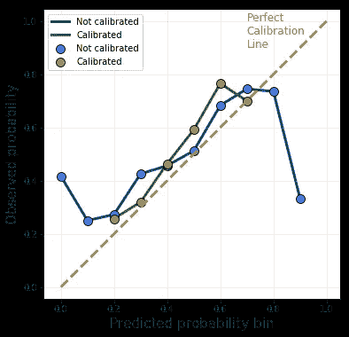

# 不良的机器学习模型仍然可以被良好校准

> 原文：[`towardsdatascience.com/bad-machine-learning-models-can-still-be-well-calibrated-7a856346fdf2`](https://towardsdatascience.com/bad-machine-learning-models-can-still-be-well-calibrated-7a856346fdf2)

## 机器学习

## 你不需要一个完美的神谕来正确地确定你的概率。

[](https://michaloleszak.medium.com/?source=post_page-----7a856346fdf2--------------------------------)[](https://towardsdatascience.com/?source=post_page-----7a856346fdf2--------------------------------) [Michał Oleszak](https://michaloleszak.medium.com/?source=post_page-----7a856346fdf2--------------------------------)

·发表在 [Towards Data Science](https://towardsdatascience.com/?source=post_page-----7a856346fdf2--------------------------------) ·11 min read·2023 年 2 月 13 日

--


机器学习模型通常根据其性能进行评估，这种性能是通过某些指标接近零或一（具体取决于指标）来衡量的，但这并不是决定其有用性的唯一因素。在某些情况下，一个整体准确度不高的模型仍然可以很好地进行校准，并找到有用的应用场景。在本文中，我们将探讨良好校准与良好性能之间的区别，以及何时一种可能优于另一种。让我们深入了解吧！


# 概率校准

概率校准的强定义是分类模型预测的概率与数据集中目标类的真实频率之间的匹配程度。一个[良好校准的模型](https://medium.com/towards-data-science/calibrating-classifiers-559abc30711a)会生成在总体上与实际结果紧密对齐的预测。

实际上，这意味着如果我们使用一个完美校准的二分类模型进行大量预测，然后只考虑那些模型预测为 70%概率为正类的情况，那么模型应该在 70%的时间里是正确的。同样，如果我们只考虑模型预测为 10%概率为正类的例子，实际情况将在十分之一的案例中确实为正类。

> 一个良好校准的模型会生成在总体上与实际结果紧密对齐的预测。

一个强校准的模型保证其预测满足频率主义的概率定义（而非贝叶斯的定义），即*事件的概率是其在多次试验中的相对频率的极限*。

考虑掷骰子时掷出六的概率。这个概率为 1/6，因为在多次掷骰子中，你平均每六次掷一次就会得到一个六。次数越多，六的频率就越接近 1/6。在这个背景下，当二元分类模型输出 90%的事件概率时，这意味着如果它多次这样做，大约在 10 次中的 9 次情况下事件确实会发生。

大多数机器学习模型的校准不佳，其原因取决于学习算法。基于树的集成方法，如随机森林，通过对单棵树的预测进行平均来生成预测，这使得获得接近零和一的概率不太可能，因为树的预测总是存在一定的方差。因此，我们看到接近零的概率被高估，接近一的概率被低估。许多其他模型优化并通过二元指标进行评分。准确率只关注我们是否正确，而忽略了确定性。决策树用于决定分裂的基尼不纯度优化的是尽可能快地达到尽可能准确的结果。

其结果是，尽管大多数机器学习模型生成的分数保持了顺序（数字越高，正类的可能性越大），但这些分数不能被解释为频率主义的概率。

[有一些简单的方法可以校准它们](https://medium.com/towards-data-science/calibrating-classifiers-559abc30711a)，良好的校准无疑是模型应具备的一个理想特征，但正如我们很快会看到的，它不是模型有用的必要条件，有时我们甚至可能希望模型没有经过校准！


# 你真的需要校准吗？

在训练分类模型时，你需要问自己一个关键问题：你是否*需要*模型良好的校准？答案将取决于模型的使用方式。让我们看一些例子。

## 校准是关键：信用额度分配

在某些情况下，良好的校准是不可或缺的。考虑一下银行如何决定给客户授予多少信用额度。假设我们只考虑那些已经被筛选和评估为低风险且符合贷款条件的申请者（我们将在稍后讨论这一筛选过程）。决定将贷款授予他们。问题是我们可以借给每个人多少钱？

要回答这个问题，银行需要知道每个客户在不同贷款金额下的确切违约概率。了解不同情景的可能性，银行将能够预测所有贷款（无论是已偿还还是违约）的货币影响，并做出最佳决策。为了实现这一目标，他们需要一个经过精确校准的模型。

注意，我们并不真正关心模型的准确性*本身*。准确性关乎于预测阈值的正确侧面；从它的角度来看，预测 51%和 99%没有区别，只要贷款违约；在这两种情况下，预测都是正确的。但对银行以及贷款申请者而言，这之间有着巨大的差异。这里重要的是获取正确的概率。

## 校准至关重要：模型性能估计

有时候，良好的模型校准是某些应用的先决条件。想象一下在不知道真实目标的情况下估计模型在生产中的性能。解决这个分类模型的挑战性任务的一种方法是 NannyML 的 [基于置信度的性能估计（CBPE）算法](https://medium.com/towards-artificial-intelligence/estimating-model-performance-without-ground-truth-453b850dad9a)。简而言之，这种方法的核心思想是根据期望的错误率来估计混淆矩阵的元素，前提是我们知道模型经过良好的校准。

因此，如果我们想监控模型在生产中的表现而没有立即获得真实目标，我们需要对模型进行校准。然而，模型的准确性并不需要很高，只要它的预测经过良好的校准，就可以使用。

## 我们不需要校准：排序问题

然而，有些情况下，模型的校准并不那么重要。例如，所有类型的排序问题。

想想那些根据质量或与用户搜索查询的相关性对新闻文章标题进行排名的模型。如果目标是选择一个或多个文章展示给用户，我们并不关心每篇文章是否具有高质量和相关性的确切概率；相反，我们关心的是模型产生的分数的排序。也就是说，我们希望确保展示给用户的内容优于未展示的内容，并且最好的新闻排在结果列表的顶部。在这种情况下，校准模型并没有太大意义。

## 我们不需要校准：授予贷款

另一个校准不那么重要的场景是我们之前提到的贷款授予筛选。

这里的目标是预测哪些申请者会偿还贷款。在这个二分类问题中，银行主要关注模型分类的准确性，而不是它产生的概率。

> 根据模型的使用方式，良好的校准可能是必不可少的，也可能是相对不必要的。

现在，让我们看看一些在性能方面较差的模型，但它们的良好校准使其在预期的用途上非常有用。


# 一个校准良好的差模型的故事

让我们考虑两个不同的模型。首先，我们将查看一个在性能上难以获得良好表现的模型，但良好的校准确保了模型提供了价值。其次，我们将考虑一个理论上无法获得良好表现的模型，但它经过良好校准，因此仍然有用。

## 当很难获得良好表现时

一段时间之前，我一直在训练模型来预测足球（也就是足球比赛）的结果，目标是通过在博彩公司下注快速且轻松地致富。准确预测比赛结果是一项不可能完成的任务——涉及到的隐藏因素太多，例如运气和球员当天的状态。但你猜怎么着，准确的预测并不是我们需要的！就像在信用额度分配和绩效评估的例子中一样，这里也是，游戏的关键在于获得正确的概率。

考虑这个二元随机森林分类器，它被训练来预测主队是否会赢得比赛。它是在几个赛季的英超联赛比赛上训练的，特征集包括了两个队伍的[ELO 评分](https://en.wikipedia.org/wiki/Elo_rating_system)以及许多不同的统计数据，汇总了每个球队在近期比赛中的进攻和防守表现。

模型的测试准确率为 63%。这肯定比一个总是预测主队获胜的虚拟模型要好；这样的模型会得到 46%的准确率，因为主队几乎赢得了半数的比赛。也就是说，63%似乎不是一个很好的结果。

让我们看看模型的校准图。水平轴显示了模型为测试集产生的概率，分为 10 个等宽的区间。对于每一个区间，主队获胜的实际频率显示在垂直轴上。一个完全校准的模型将产生一条完美的对角线。



足球预测器的校准曲线。图片由作者提供。

原始模型，显示为蓝色，在更极端的概率下校准效果很差：90%的预测仅有 30%的正确率！因此，我决定使用最流行的技术之一来进行校准：在模型输出上拟合逻辑回归器。

结果模型，显示为绿色，似乎校准效果好得多。你也会注意到，它不再产生极端概率。至于准确率，它下降了一个百分点，降至 62%。因此，我们成功地提高了模型的校准水平，但准确率有所下降。这有什么用呢？

考虑以下策略：我们只对模型最确定主队会赢的比赛进行投注，即模型预测主队胜率为 70%的比赛。得益于合理的校准，我们知道模型在这种情况下的正确率为 70%。为了简化起见，假设我们对每场比赛分别投注$100。

在 100 场比赛中，我们将错过 30 场，造成$3000 的损失。但我们将赢得剩下的 70 场比赛，现金奖励为`70 * 100 * (赔率 — 1)`（我们减去 1 是为了考虑到我们最初需要花费$7000 购买彩票）。我们可以解这个方程，找到一个博彩公司赔率，使得我们收支平衡：

```py
3000 = 7000 * odds - 7000
10000 = 7000 * odds
odds = 10000 / 7000 = 1.42
```

就这样！我们可以对模型预测为 70%的所有比赛进行投注，并且在这些比赛中，博彩公司提供的赔率需高于 1.42（不考虑税）。当然，我们也可以以类似的方式计算其他预测概率的赔率。假设模型的校准在未来保持良好（这是一项强假设！），这种策略应该在长期内相当有利。尽管准确率只有 62%，但这仍然有效！

## 当无法获得良好的性能时

现在考虑预测掷骰子的尝试。我们的模型应该给出骰子掷出六的概率。我们假设骰子是普通的六面公平骰子。

掷骰子是一个完全随机的过程，每一面朝上的机会是相同的：⅙。换句话说，数据类别是完全不可分的：建立一个准确的模型是不切实际的。那么，我们可以拥有什么模型呢？

考虑这两种竞争方法。模型 A 是一个虚拟的二元分类器，它总是全信心地预测掷出的数字不是六；也就是说，它 0%的时间预测六，100%的时间预测不是六。模型 B 也从不预测六，但它输出的概率不同：它总是以⅙的概率预测六，以⅚的概率预测不是六。

从长远来看，这两个模型的准确率相同：它们的正确率为 5/6。这是任何模型能达到的最好水平。然而，一个重要的事实区分了这两个模型：模型 B 的校准非常完美，而模型 A 根本没有校准。

就校准而言，这两个模型截然不同。那么，这两个模型的有用性如何？模型 A 实际上没有提供任何价值。另一方面，模型 B 允许我们在长期内准确预测目标频率。它还允许我们进行模拟，以回答更复杂的问题，例如：在 11 次掷骰中，掷出四次不是六和七次六的概率是多少？尽管预测性能不佳，但良好的校准使模型依然有用！


# 要点

+   校准良好的模型产生的预测与实际结果的频率高度一致。大多数模型由于学习方式的不同而校准不佳，但有一些简单的方法可以解决这个问题。

+   对于一些应用场景，如分配信用额度或 CBPE 估计，良好的校准至关重要（事实上，比性能指标本身更重要）。对于其他情况，比如贷款发放或排序问题，这一点则不那么重要；在这些场景中，正确的排序和性能才是关键。

+   不准确的模型在经过良好校准后可能会非常有用；有时，确保概率的正确性就是我们能做到的全部。

*这篇文章也发表在* [*NannyML 博客*](https://www.nannyml.com/blog/probability-calibration)*上。*


感谢阅读！

如果你喜欢这篇文章，为什么不[**订阅电子邮件更新**](https://michaloleszak.medium.com/subscribe)以获取我最新的文章呢？通过[**成为 Medium 会员**](https://michaloleszak.medium.com/membership)，你可以支持我的写作并无限制地访问其他作者及我自己的所有故事。

想要时刻掌握机器学习和 AI 快速发展的领域的动态吗？查看我的新通讯，[**AI Pulse**](https://pulseofai.substack.com/)。需要咨询？你可以在[**这里**](https://topmate.io/michaloleszak)问我任何问题或预约一对一服务。

你也可以尝试一下[我的其他文章](https://michaloleszak.github.io/blog/)。无法选择？挑一个看看吧：

[](/calibrating-classifiers-559abc30711a?source=post_page-----7a856346fdf2--------------------------------) ## 校准分类器

### 你确定你的模型返回的是概率吗？ 🎲

towardsdatascience.com [](https://pub.towardsai.net/estimating-model-performance-without-ground-truth-453b850dad9a?source=post_page-----7a856346fdf2--------------------------------) [## 无需真实数据估计模型性能

### 只要保持你的概率校准，这是可能的。

pub.towardsai.net](https://pub.towardsai.net/estimating-model-performance-without-ground-truth-453b850dad9a?source=post_page-----7a856346fdf2--------------------------------) [](/feature-selection-methods-and-how-to-choose-them-1e7469100e7e?source=post_page-----7a856346fdf2--------------------------------) ## 特征选择方法及如何选择它们

### 特征选择的原因、方法和时机，以及一些实用的技巧和建议

towardsdatascience.com
