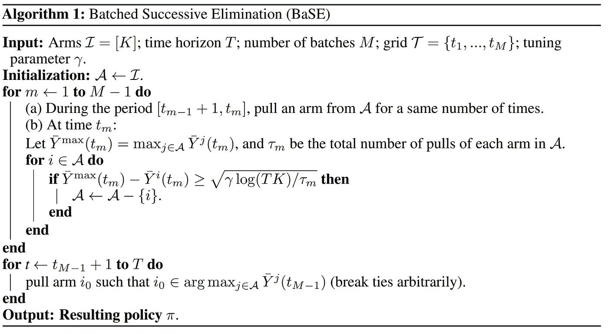
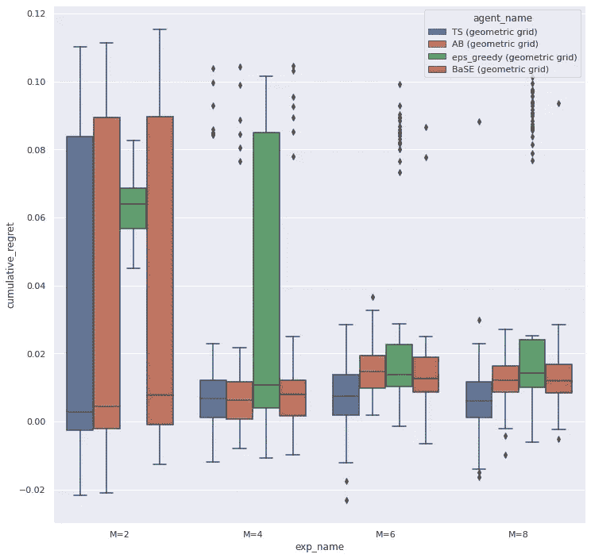
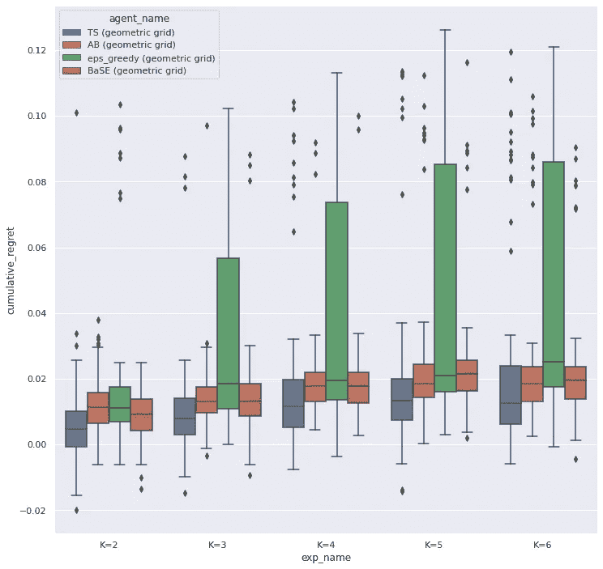
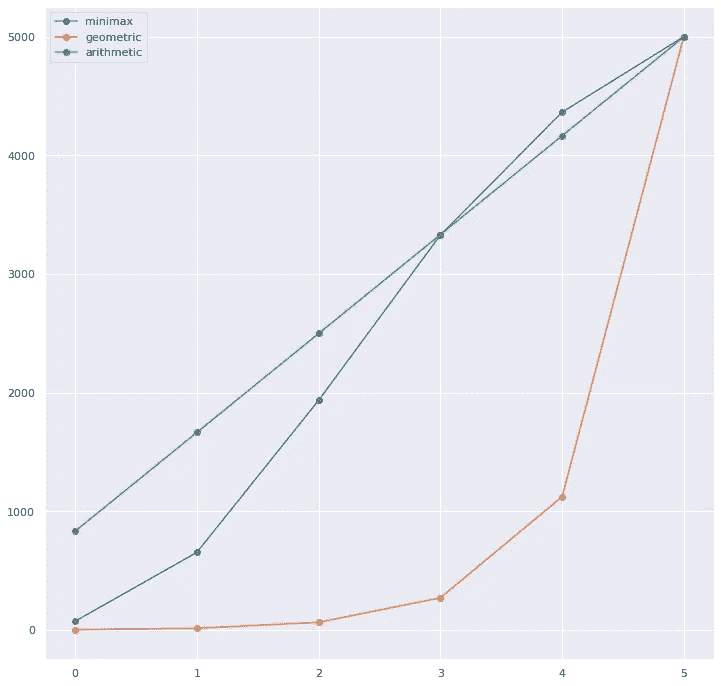

# 批量化赌博机问题

> 原文：[`towardsdatascience.com/batched-bandit-problems-ea73dba5da7a?source=collection_archive---------8-----------------------#2023-02-17`](https://towardsdatascience.com/batched-bandit-problems-ea73dba5da7a?source=collection_archive---------8-----------------------#2023-02-17)

## 多臂赌博机中的延迟奖励

[](https://medium.com/@smsmith714?source=post_page-----ea73dba5da7a--------------------------------)[](https://towardsdatascience.com/?source=post_page-----ea73dba5da7a--------------------------------) [Sean Smith](https://medium.com/@smsmith714?source=post_page-----ea73dba5da7a--------------------------------)

·

[关注](https://medium.com/m/signin?actionUrl=https%3A%2F%2Fmedium.com%2F_%2Fsubscribe%2Fuser%2F6957f6523097&operation=register&redirect=https%3A%2F%2Ftowardsdatascience.com%2Fbatched-bandit-problems-ea73dba5da7a&user=Sean+Smith&userId=6957f6523097&source=post_page-6957f6523097----ea73dba5da7a---------------------post_header-----------) 发表在 [Towards Data Science](https://towardsdatascience.com/?source=post_page-----ea73dba5da7a--------------------------------) ·11 分钟阅读·2023 年 2 月 17 日[](https://medium.com/m/signin?actionUrl=https%3A%2F%2Fmedium.com%2F_%2Fvote%2Ftowards-data-science%2Fea73dba5da7a&operation=register&redirect=https%3A%2F%2Ftowardsdatascience.com%2Fbatched-bandit-problems-ea73dba5da7a&user=Sean+Smith&userId=6957f6523097&source=-----ea73dba5da7a---------------------clap_footer-----------)

--

[](https://medium.com/m/signin?actionUrl=https%3A%2F%2Fmedium.com%2F_%2Fbookmark%2Fp%2Fea73dba5da7a&operation=register&redirect=https%3A%2F%2Ftowardsdatascience.com%2Fbatched-bandit-problems-ea73dba5da7a&source=-----ea73dba5da7a---------------------bookmark_footer-----------)

图片由 [Erik Mclean](https://unsplash.com/@introspectivedsgn?utm_source=medium&utm_medium=referral) 提供，来源于 [Unsplash](https://unsplash.com/?utm_source=medium&utm_medium=referral)

实验对任何业务操作至关重要。尽管 AB 测试是事实上的标准，但你会惊讶地发现许多从业者并没有进行适当的随机实验。更常见的情况是经验丰富的实验者会根据他们的判断来决定何时执行处理，从而覆盖了允许进行正式统计推断的神圣功效分析。尽管如此，这从根本上解决了许多随机实验所面临的遗憾问题。

精明的读者已经注意到我为深入讨论多臂老虎机问题铺垫了很好的引言，但这个讨论与其他文章略有不同。这里我们关注的是一个在学术界以外几乎没有受到关注的多臂老虎机问题类别：批次多臂老虎机问题。在典型的多臂老虎机场景中，代理执行一个动作并立即获得奖励。这种模式在数字营销和网站优化领域通常是足够的，但当奖励不是即时的呢？

举个例子，你在进行一场电子邮件营销活动，但营销部门没有人能决定 5 条广告文案中哪一条最有效。你的关键 KPI 将是点击率，**如果用户在收到邮件后的 5 天内点击广告，就会被测量**。现在假设所有用户的反应是一样的。进行活动的时间窗口很小。根据这些信息，**你将如何快速决定哪个创意效果最好，并在活动期间最大化 CTR？**

本文分为几个部分。首先我们讨论*网格*的概念，即在每批次中有多少受试者接受治疗的配置。接着我们查看如何将 epsilon-greedy 多臂老虎机算法格式化为一个批次多臂老虎机问题，并将其扩展到任何多臂老虎机算法。然后，我们研究批次顺序消除（BaSE）及其与随机实验（AB 测试）的相似性。最后，我们查看一些实验以研究批次数量和臂数量的影响，以及这些因素如何影响遗憾。我们将看到这些算法如何与具有相同网格配置的随机实验进行比较。文中提供了实验结果的讨论，并总结了从模拟中得出的通用指南。

# 回顾多臂老虎机问题

假设我们有一个动作集合**A**，每个动作对应一个*臂*，每个臂都有自己的奖励**R**。在我们的案例中，**R**将是一个伯努利分布的随机变量，其真实均值等于我们广告文案的 CTR。代码中如下所示：

```py
class Arm:
    def __init__(self, mean):
        self.mean = mean

    def sample(self):
        return np.random.binomial(1, self.mean)
```

多臂老虎机问题的目标是在给定的集合**A**中，我们希望了解哪个臂的回报最大，或哪个臂的真实均值最高。我们将*策略*定义为告诉我们哪个臂是最值得拉的函数。这里的关键是，当我们在学习或*探索*动作空间时，我们是在执行次优动作。因此，多臂老虎机算法的关键在于平衡探索可能的动作和*利用*那些看起来有前景的动作。

本文假设读者对多臂老虎机问题和 epsilon-greedy 方法有一定了解。对于那些不熟悉的人，这篇文章提供了一个表面层次的概述。对于全面了解，我推荐 Sutton 和 Barto 的[1]第二章作为参考。

# 介绍网格

如上所述，在批处理赌徒问题中，我们无法获得即时奖励。因此，我们需要策略性地选择行动并更新代理的*策略*。这引入了*网格*的概念，即每个批次采样多少用户，以便代理能够最佳地学习。Perchet 等人[2]在他们的论文中介绍了批处理赌徒问题并介绍了网格。为了形式化网格，我使用了 Gao 等人[3]的符号。

提供的第一个网格是算术网格，这相当简单。这个网格将时间范围 T 均匀地划分为 M 个相等的批次。当 M=T 时，这等同于传统的即时奖励赌徒问题。

我们使用的第二个网格是最小最大网格，其目的是最小化最大遗憾。第 i 项的方程式为：

提供的第三个网格是几何网格，它优化了相对于最大遗憾界限的遗憾。第 i 项的方程式为：

关于网格来源直观理解的更多信息，我推荐在[2]中的讨论。

# 将传统赌徒问题扩展到批处理赌徒问题

epsilon-贪婪算法通常是介绍强化学习中探索与利用权衡的起点。因此，我选择从将 epsilon-贪婪算法转换为批处理框架开始，然后展示如何将其扩展到任何赌徒算法。

批处理赌徒问题和常规赌徒问题的区别在于代理更新策略的时间。一个典型的赌徒算法可能如下所示：

```py
def eps_greedy_bandit():
  """ Not real code! Repo link below """
  for i in range(num_steps):
    a = agent.get_eps_greedy_action()
    r = agent.take_action(a)
    agent.update(a, r)
```

然而，在批处理赌徒中，我们不能实时获得奖励，必须等到批次结束后才更新代理的策略。一个关键点是，在最后一个批次中实验已经结束。在最后一个批次进行探索没有用处，因为没有未来的批次，所以我们选择在最后一个批次完全贪婪。以下是这可能如何适应我们上述代码的示例：

```py
def eps_greedy_bandit(batches):
  """ Not real code! Repo link below"""
  for batch_size in range(grid[:-1]):
    a_hist, r_hist = [], []
    for _ in range(batch_size):
      a = agent.get_eps_greedy_action()
      r = agent.take_action(a)
      a_hist.append(a)
      r_hist.append(r)
    agent.update(a_hist, r_hist)  # the udpate location changed!

  best_action = agent.get_best_action()
  for _ in range(grid[-1]):
    r = agent.take(best_action)
```

我们可以将此简单地扩展到任何类别的赌徒算法。通过更换允许更新的时机，任何算法都可以在批处理赌徒框架中与任何网格一起使用。

在电子邮件营销的背景下，我们可能决定针对 5000 名用户（T=5000）。根据可用的时间框架，我们可以选择一些批次（M = num_days_available / num_days_response）。假设我们需要在 30 天内启动活动，而响应需要 5 天，那么我们可以运行的批次数为 6。我们希望在前 5 个批次中进行探索，但在最后一个批次中，我们的活动已经结束，所以在这个批次中我们会承诺采取最佳行动。

# 批处理连续消除（BaSE）

如上所示，任何强盗算法都很容易扩展到批量框架。Gao 等人[3]通过将逐次淘汰法（SE）适应到批量环境中来展示了这一点。逐次淘汰（SE）通过尽可能早地修剪掉候选集中的较不有前途的臂来工作。为此，我们在批量过程中随机抽样每个臂。在批量结束时，我们构造置信阈值如下

修剪臂的置信阈值

其中 gamma 是缩放因子，T 是时间范围，K 是臂的数量，tau_m 是截至目前已抽样的观测次数。

为了决定一个臂是否留在候选集，我们取最大臂的累计奖励与每个其他臂的累计奖励之间的差异。如果平均值与当前臂之间的差异大于我们的置信阈值，则该臂将从被探索的臂集移除。下面是作者提供的算法伪代码。



BaSE 算法。图像取自 [Gao et al. [3]](https://arxiv.org/abs/1904.01763)

对于 BaSE 代理，一个有趣的观察是它与随机实验的相似性。注意步骤(a)，我们随机抽样每个臂集 A 中的臂并观察奖励，就像在随机实验中一样。不同之处在于修剪步骤(b)，我们根据可用信息逐步尝试从当前臂集移除候选臂。如文章开头所述，大多数从业者并不进行正规的 AB 测试，而是选择手动审查和修剪较不有前途的臂。BaSE 通过引入自动启发式来模拟这一过程，从而可能减少对人工干预的需求。

# 实验

为了了解批量环境中的算法，我们将查看几个实验，涉及批次数和臂的数量。每个算法都进行了 100 次试验，每个网格的 T=5000。

为了测试批次数的效果，进行了一项实验，使用均值为 0.5、0.51 和 0.6 的固定臂集。批次数测试了 2、4、6 和 8 的值。每个代理都在上述三个网格中运行。为了简化讨论，选择了表现最佳的强盗算法和网格组合。结果如下面的图所示。



每个代理在批量实验中的每个 M 的分布

为了测试臂的数量对效果的影响，进行了一项实验，考察了不同臂集的表现。每个臂集包含一个均值为 0.6 的最佳臂，对于实验的每个点，臂集里会添加一个均值约为 0.5 的臂。这一过程重复进行，以生成臂集的基数在 2 到 6 之间。该实验的批量大小固定为 M=6。实验结果如下。



每个代理在手臂实验中的每个 K 的分布

实验的完整结果可以在[这个](https://github.com/sms1097/batched_bandits/blob/main/tutorial.ipynb)笔记本中的仓库里找到。

# 实验分析

从实验中可以看出，所有代理在几乎所有实验设置下，在几何网格上的表现最佳。这一现象的直观解释来自于最终批次之前的样本数量。

下图显示了在 M=6 和 T=5000 的情况下，每个网格每个批次的累计处理样本数量。显著的差异在于，几何网格在最终批次之前处理的样本数量远少于算术网格或最小最大网格，其中代理选择了完全贪婪策略。这意味着在几何网格上的代理能够利用比在最小最大网格或算术网格上的更多样本，从而表现更好。这些发现得到了 Bayati 等人[4]的理论支持，作者对贪婪算法为何相比其他算法能够获得意外低的遗憾进行了深入分析。



每个网格每批次的累计样本数量。

然而，这一趋势并不能推广到批次数量较小的网格。在 M=2 的情况下，几何网格中第一个批次的样本数量相当少。在这种情况下，更好的选择是考虑最小最大网格，或者在稀疏奖励的情况下（即手臂奖励的平均值极小）算术网格可能更合适。

在两个实验中，随机代理（AB 代理）和 BaSE 代理表现非常相似。这仅在几何网格上成立，因为前面讨论了探索方面的优势。虽然 BaSE 确实引入了一个置信区间用于提前剪枝，但这个置信区间并不总是在最终批次之前被触发，因此结果与随机试验相似。

触发置信阈值的问题突显了实验系统中超参数的问题。BaSE 和 Epsilon-Greedy 都存在这个问题。观察 Epsilon-Greedy 代理，我们可以看到该代理在试验之间有极大的变异性。这是由于在试验之间使用的静态超参数。当使用像 BaSE 或 Epsilon-Greedy 这样的代理时，选择适合问题的超参数是很重要的。这些参数可以通过实验前的模拟来确定。

实验中的一个令人惊讶的结果来自 Thompson 采样代理（TS 代理），它在试验之间表现相对稳定。TS 代理不会受到之前讨论的超参数问题的影响，但确实需要一些先验知识。使用 TS 代理时，实施必须知道先验分布，并支持后验分布的推导以更新代理。在 CTR 的情况下，这是容易的，因为我们可以从 Beta 分布中采样结果，并且 Beta 分布的后验分布仍然是 Beta 分布。如果你使用的奖励信号是连续的，那么确保你的先验正确会变得更棘手。如果你对了解更多关于 Thompson 采样的内容感兴趣，这篇文章提供了一个良好的表面级介绍，而 Russo 等人[5]提供了全面的概述。

基于模拟，以下是一些通用实践的安全指南：

+   如果实验需要管理（批次之间有人互动），那么带有人类对关键 KPI 判断的 BaSE 代理是一个不错的选择，以确定何时进入开发阶段。

+   如果已知基础分布且实验将完全自动化，那么 Thompson 采样是一个不错的选择。

+   如果基础分布未知或具有复杂的后验分布且实验完全自动化，那么为 epsilon 贪婪代理或 BaSE 代理仔细考虑的参数是不错的选择。

需要注意的是，这些总结通常适用于这些臂分布。根据你的情况，这些代理可能会有不同的响应。因此，建议进行你自己的模拟，以评估实验的构建方式，这应基于你对臂的奖励的宽松预期。

# 结论

这只是对将多臂老虎机算法转换为批处理多臂老虎机算法的一些想法的简要介绍。所有这些算法都已实现，并可以在仓库中访问。为了进一步学习，我建议查看[2]和[3]中的算法，这些算法提供了对批处理多臂老虎机问题的深刻直觉以及一些关于遗憾界限的基础证明。

你可以通过 [这里](https://github.com/sms1097/batched_bandits.git) 访问这个仓库！

*除非另有说明，所有图片均由作者提供。*

[1] Sutton, R. S., & Barto, A. G. (2018). *强化学习：入门*. MIT 出版社。

[2] Vianney Perchet, Philippe Rigollet, Sylvain Chassang, & Erik Snowberg (2016). *批处理多臂老虎机问题*. 《统计年刊》，44(2)。

[3] Gao, Z., Han, Y., Ren, Z., & Zhou, Z.. (2019). *批处理多臂老虎机问题*。

[4] Bayati, M., Hamidi, N., Johari, R., & Khosravi, K.. (2020). 《在多臂老虎机中贪婪算法的非凡有效性》。

[5] Russo, D., Van Roy, B., Kazerouni, A., Osband, I., & Wen, Z. (2017). *Thompson 采样教程*。

*感谢阅读这篇文章！我的专注领域是个性化和实验。如果你有兴趣了解我的最新工作，请在* [*Medium*](https://medium.com/@smsmith714)*上关注我！我也会在* [*LinkedIn*](https://www.linkedin.com/in/sms714/)*上发布更频繁的更新，如果你对此感兴趣，也可以在那里关注我。*
