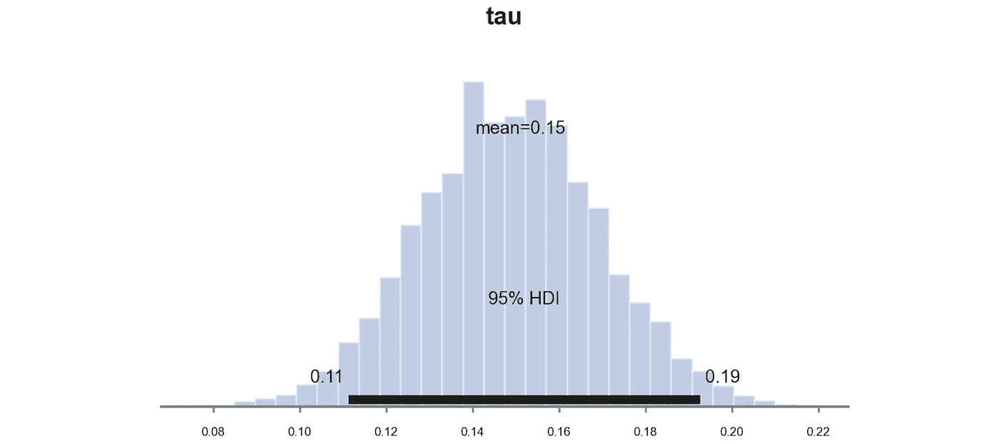

# 贝叶斯 AB 测试

> 原文：[`towardsdatascience.com/bayesian-ab-testing-ed45cc8c964d`](https://towardsdatascience.com/bayesian-ab-testing-ed45cc8c964d)

## [因果数据科学](https://towardsdatascience.com/tagged/causal-data-science)

## *在随机实验中使用和选择先验分布。*

 [Matteo Courthoud](https://medium.com/@matteo.courthoud?source=post_page-----ed45cc8c964d--------------------------------)

·发布在 [Towards Data Science](https://towardsdatascience.com/?source=post_page-----ed45cc8c964d--------------------------------) ·11 分钟阅读·2023 年 1 月 10 日

--

封面，作者提供的图片

随机化实验，即**AB 测试**，是行业中估计因果效应的标准方法。通过将处理（新产品、特性、用户界面等）随机分配给人群的一个子集（用户、患者、客户等），我们可以确保平均而言，结果（收入、访问量、点击量等）之间的差异可以归因于处理。像[Booking.com](https://partner.booking.com/en-gb/click-magazine/industry-perspectives/role-experimentation-bookingcom)这样的成熟公司报告称，他们同时运行着成千上万的 AB 测试。而像[Duolingo](https://blog.duolingo.com/improving-duolingo-one-experiment-at-a-time/)这样的新兴公司将他们成功的很大一部分归因于他们的大规模实验文化。

在如此众多的实验中，一个自然的问题是：在一个特定的实验中，你是否可以利用先前测试的信息？如何做到这一点？在这篇文章中，我将尝试通过介绍**贝叶斯 AB 测试方法**来回答这些问题。贝叶斯框架非常适合这种任务，因为它自然允许使用新数据来更新现有知识（先验）。然而，该方法对功能形式假设特别敏感，显然无害的模型选择，例如先验分布的偏斜度，可能会导致非常不同的估计结果。

# 搜索与无限滚动

在接下来的文章中，我们将使用一个玩具示例，该示例大致受到[Azavedo et al. (2019)](https://www.aeaweb.org/articles?id=10.1257%2Fpandp.20191003)的启发：一个**搜索引擎**希望在不牺牲搜索质量的情况下增加其**广告收入**。我们是一家具有成熟实验文化的公司，我们持续测试新想法以改进我们的着陆页。假设我们想出了一个新的绝妙主意：[无限滚动](https://blog.google/products/search/continuous-scrolling-mobile/)! 我们允许用户继续向下滚动，以查看更多结果，而不是使用离散的页面序列。

图片，由作者使用[NightCafé](https://creator.nightcafe.studio/)生成

为了理解无限滚动是否有效，我们进行了**AB 测试**：我们将用户随机分配到处理组和对照组，并仅对处理组的用户实施无限滚动。我从`[src.dgp](https://github.com/matteocourthoud/Blog-Posts/blob/main/notebooks/src/dgp.py)`导入了数据生成过程`dgp_infinite_scroll()`。相对于之前的文章，我生成了一个新的 DGP 父类，处理随机化和数据生成，而其子类包含具体的用例。我还从`[src.utils](https://github.com/matteocourthoud/Blog-Posts/blob/main/notebooks/src/utils.py)`导入了一些绘图函数和库。为了包含代码、数据和表格，我使用了[Deepnote](https://deepnote.com)，一个类似 Jupyter 的基于网络的协作笔记本环境。

我们有关于 10,000 名网站访问者的信息，其中我们观察他们生成的每月`ad_revenue`、他们是否被分配到处理组并使用了`infinite_scroll`，以及平均每月的`past_revenue`。

随机处理分配使得**均值差异**估计量[**无偏**](https://en.wikipedia.org/wiki/Bias_of_an_estimator)：我们期望处理组和对照组在平均上是可比的，因此我们可以将观察到的平均结果差异归因于处理效果。我们通过线性回归估计处理效果。我们可以将`infinite_scroll`的系数解释为估计的处理效果。

看来`infinite_scroll`确实是个好主意，它将平均月收入提高了 0.1524 美元。此外，该效果在 1%置信水平下显著不同于零。

我们可以通过在回归中控制`past_revenue`来进一步提高估计量的精度。我们不期望估计系数有显著变化，但精度应该会提高（如果你想了解更多控制变量的内容，可以查看我关于 CUPED 和 DAGs 的其他文章）。

确实，`past_revenue` 对当前 `ad_revenue` 的预测性很强，而 `infinite_scroll` 的估计系数的精度减少了三分之一。

到目前为止，一切都非常标准。然而，正如我们在开始时所说，假设这不是我们尝试改善浏览器（最终目标是广告收入）的唯一实验。无限滚动只是我们过去测试的成千上万种想法中的一种。是否有办法有效利用这些额外的**信息**？

# 贝叶斯统计

贝叶斯统计相比于频率学派方法的主要优点之一是，它可以轻松地将额外信息纳入模型中。这一思想直接来源于所有贝叶斯统计的核心定理：[**贝叶斯定理**](https://en.wikipedia.org/wiki/Bayes'_theorem)。贝叶斯定理允许你通过**反转推理问题**进行模型推断：从给定数据的模型概率，推断数据在给定模型下的概率，这是一种更易处理的对象。

贝叶斯定理，由作者提供的图片

我们可以将贝叶斯定理的右侧拆分为两个部分：**先验**和**似然**。似然是来自数据的模型信息，而先验则是关于模型的任何额外信息。

首先，让我们将贝叶斯定理映射到我们的背景中。数据是什么，模型是什么，我们的兴趣对象是什么？

+   **数据**由我们的结果变量 `ad_revenue`、*y*、处理变量 `infinite_scroll`、*D* 和其他变量 `past_revenue` 以及一个常量组成，我们将这些变量统称为 *X*

+   **模型**是`ad_revenue` 的分布，给定 `past_revenue` 和 `infinite_scroll` 特征，*y|D,X*

+   我们的**兴趣对象**是后验概率 *Pr(model | data)*，特别是 `ad_revenue` 和 `infinite_scroll` 之间的关系

我们如何在 AB 测试的背景下使用先验信息，可能还包括额外的协变量？

## 贝叶斯回归

让我们使用线性模型，使其与频率学派方法直接可比：

条件分布 y|x，由作者提供的图片

这是一个具有**两组参数**的参数模型：线性系数 *β* 和 *τ*，以及残差的方差 *σ*。一种等效但更具贝叶斯风格的模型表示方式是：

条件分布 y|x，由作者提供的图片

半冒号将数据与模型参数分开。与频率学派方法不同，在贝叶斯回归中，我们不依赖于[中心极限定理](https://en.wikipedia.org/wiki/Central_limit_theorem)来近似 *y* 的条件分布，而是直接**假设**它是正态分布。

我们对模型参数 *β*、*τ* 和 *σ* 的推断感兴趣。频率主义方法和贝叶斯方法之间的另一个**核心区别**是，前者假设模型参数是固定且未知的，而后者允许它们是随机变量。

这个假设具有非常实用的**含义**：你可以轻松地以**先验**分布的形式将关于模型参数的先前信息纳入模型。顾名思义，先验包含在查看数据之前可用的信息。这引出了贝叶斯统计中的一个最相关的问题：**如何选择先验**？

## 先验

选择先验时，一个在分析上有吸引力的限制是拥有一个使得后验属于同一家族的先验分布。这些先验被称为**共轭先验**。例如，在看到数据之前，我假设我的处理效应服从正态分布，并希望在结合数据中包含的信息后，它仍然是正态分布的。

在贝叶斯线性回归的情况下，*β*、*τ* 和 *σ* 的共轭先验是正态分布和逆伽马分布。让我们从盲目使用标准正态分布和逆伽马分布作为先验开始。

先验分布，图片由作者提供

我们使用概率编程包 [PyMC](https://www.pymc.io/projects/docs/en/stable/learn.html) 进行推断。首先，我们需要指定模型：不同参数的先验分布和数据的似然。

PyMC 具有一个极好的功能，可以将模型可视化为图形，即 `model_to_graphviz`。

模型示意图，图片由作者提供

从图形表示中，我们可以看到各种模型组件，它们的分布，以及它们如何相互作用。

我们现在准备**计算**模型后验。它是如何工作的？简而言之，我们对模型参数进行采样，计算给定这些值的数据的似然，并推导出相应的后验。

贝叶斯推断要求**采样**，这一点历史上一直是贝叶斯统计的主要瓶颈之一，因为这使得贝叶斯统计比频率主义方法明显慢。然而，随着模型计算机计算能力的增加，这不再是一个大问题。

我们现在可以检查结果了。首先，通过 `summary()` 方法，我们可以打印一个非常类似于我们用于线性回归的 `[statsmodels](https://www.statsmodels.org/dev/index.html)` 包生成的模型摘要。

估计的参数与我们使用频率主义方法得到的结果非常接近，其中 `infinite_scroll` 的估计效应为 0.157。

如果抽样的缺点是速度较慢，那么它的优点是**透明**。我们可以直接绘制后验分布。让我们为处理效应*τ*做这件事。PyMC 函数`plot_posterior`绘制了后验分布，黑色条表示贝叶斯等效的 95%置信区间。

*τ̂的后验分布，由作者提供的图像*

正如预期的那样，由于我们选择了共轭先验，后验分布看起来是高斯的。

到目前为止，我们在选择先验时没有太多指导。然而，假设我们有**过去实验**的数据。我们如何将这些具体信息纳入其中？

# 过去的实验

假设无限滚动的想法只是我们过去尝试和测试的**其他想法**中的一个。对于每个想法，我们都有相应实验的数据，以及对应的估计系数。

我们从过去的实验中生成了 1000 个估计值。我们如何利用这些额外的信息？

## 正态先验

第一个想法是**校准**我们的先验，以反映过去的数据分布。在保持正态性假设的情况下，我们使用过去实验的估计平均值和标准差。

平均而言，几乎对`ad_revenue`没有影响，平均效果为 0.0009。

然而，实验间存在合理的变异，标准差为 0.029。

让我们重写模型，使用过去估计值的均值和标准差作为*τ*的先验分布。

让我们从模型中进行抽样

并绘制处理效应参数*τ*的样本后验分布。

*τ̂的后验分布，由作者提供的图像*

估计系数明显更小：0.11 而不是之前的 0.16。这是为什么？

实际情况是，考虑到我们的先验，之前的 0.16 系数极不可能。我们可以计算在先验下得到相同或更极端值的概率。

这个值的概率几乎为零。因此，估计的系数已经朝着 0.0009 的先验均值移动。

## Student-t 先验

到目前为止，我们对所有线性系数假设了正态分布。这是否合适？让我们通过视觉检查（查看[这里](https://medium.com/towards-data-science/how-to-compare-two-or-more-distributions-9b06ee4d30bf)了解其他比较分布的方法），从截距系数*β₀*开始。

分布似乎相当正常。处理效应参数*τ*呢？

该分布非常**重尾**！虽然在中心看起来像正态分布，但尾部要“肥胖”得多，并且有几个非常极端的值。排除测量误差，这是行业中经常发生的情形，大多数想法效果极小或无效，只有少数想法是突破性的。

模拟这种分布的一种方法是[学生-t 分布](https://en.wikipedia.org/wiki/Student%27s_t-distribution)。特别地，我们使用均值为 0.0009、方差为 0.003、自由度为 1.3 的 t-学生分布，以匹配过去估计的经验分布的矩。

让我们从模型中抽样。

并绘制处理效应参数*τ*的样本后验分布。

*τ̂*的后验分布，作者提供的图像

估计的系数现在再次类似于我们使用标准正态先验时得到的值，0.11。然而，估计值更为精确，因为置信区间已从[0.077, 0.016]缩小到[0.065, 0.015]。

发生了什么？

## 收缩

答案在于我们使用的不同**先验分布**的形状：

+   标准正态分布，N(0,1)

+   匹配矩的正态分布，N(0, 0.03)

+   匹配矩的 t-学生，t₁.₃(0, 0.003)

让我们把所有数据一起绘制出来。

不同的先验分布，作者提供的图像

如我们所见，所有分布都以零为中心，但形状却大相径庭。标准正态分布在[-0.15, 0.15]区间内基本上是平坦的。每个值的概率几乎相同。最后两个分布虽然均值和方差相同，但形状却大相径庭。

这如何转化为我们的估计？我们可以为每个先验分布绘制隐含的后验。

先验对实验估计的影响，作者提供的图像

如我们所见，不同的先验对实验估计的影响方式截然不同。标准正态先验对[-0.15, 0.15]区间内的估计基本没有影响。匹配矩的正态先验则将每个估计值大约缩小了 2/3。t-学生先验的效果则是**非线性的**：它将小的估计值向零收缩，而保持大的估计值不变。虚线灰色标记了不同先验对我们的实验估计*τ̂*的影响。

图像由作者使用[NightCafé](https://creator.nightcafe.studio/)生成

# 结论

在这篇文章中，我们已经看到如何扩展 AB 测试的分析以融入**过去实验的信息**。特别是，我们介绍了贝叶斯方法用于 AB 测试，并且我们已经看到选择先验分布的重要性。在相同的均值和方差下，假设具有“胖尾”（非常偏斜）的先验分布意味着小效果的收缩更强，而大效果的收缩则较低。

**直觉**如下：具有“胖尾”的先验分布等同于假设突破性想法是稀有但不是不可能的。这在实验之后有实际的**影响**，正如我们在这篇文章中所见，但在实验之前也是如此。事实上，如[Azevedo 等人（2020）](https://www.journals.uchicago.edu/doi/full/10.1086/710607)所报告，如果你认为你的想法效果的分布更“正常”，则最佳方案是进行*少量但大的*实验，以便发现较小的效果。如果相反，你认为你的想法是“突破性还是无”，即它们的效果是胖尾的，那么进行*小而多的*实验更有意义，因为你不需要大样本来检测大效果。

## 参考文献

+   E. Azevedo, A. Deng, J. Olea, G. Weyl，[用多个 A/B 测试的经验贝叶斯估计治疗效果：概述](https://www.aeaweb.org/articles?id=10.1257%2Fpandp.20191003)（2019）。*AEA 论文集。*

+   E. Azevedo, A. Deng, J. Olea, J. Rao, G. Weyl，[具有胖尾的 A/B 测试](https://www.journals.uchicago.edu/doi/full/10.1086/710607)（2020）。*政治经济学杂志。*

+   A. Deng，[在线对照实验的**客观贝叶斯两样本假设检验**](https://dl.acm.org/doi/abs/10.1145/2740908.2742563)（2016）。*WWW ’15 会议论文集。*

## 相关文章

+   [贝叶斯自助法](https://medium.com/towards-data-science/the-bayesian-bootstrap-6ca4a1d45148)

+   理解 CUPED

+   DAGs 和控制变量

## 代码

你可以在这里找到原始的 Jupyter Notebook：

[## Blog-Posts/bayes_ab.ipynb at main · matteocourthoud/Blog-Posts

### 你现在无法执行该操作。你在其他标签页或窗口中登录了账户。你已在其他标签页或…

github.com](https://github.com/matteocourthoud/Blog-Posts/blob/main/notebooks/bayes_ab.ipynb?source=post_page-----ed45cc8c964d--------------------------------)

## 感谢阅读！

*非常感谢！* 🤗 *如果你喜欢这篇文章并希望查看更多内容，可以考虑* [***关注我***](https://medium.com/@matteo.courthoud)*。我每周发布一次关于因果推断和数据分析的主题。我尽量保持文章简洁而精准，始终提供代码、示例和模拟。*

*另外，一个小小的* ***免责声明***：我写作是为了学习，所以错误是常态，尽管我尽力而为。如果你发现错误，请告诉我。我也欢迎对新主题的建议！*
