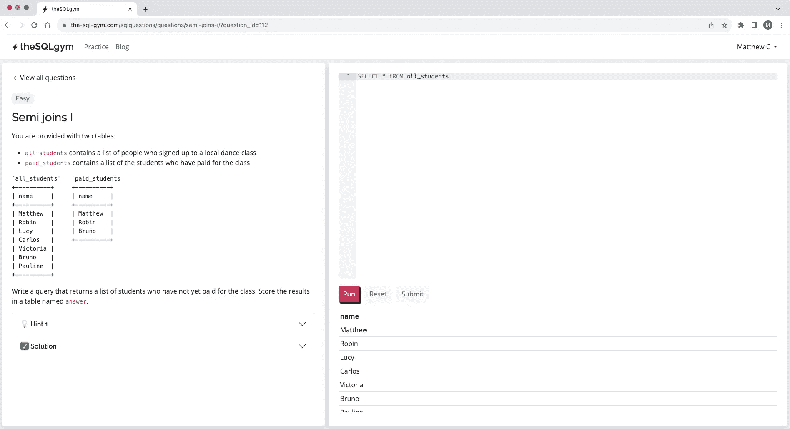

# 在 SQL 中使用“NOT IN”要小心

> 原文：[`towardsdatascience.com/be-careful-when-using-not-in-in-sql-c692fad3427b`](https://towardsdatascience.com/be-careful-when-using-not-in-in-sql-c692fad3427b)

## + 3 个简单的解决方案，以确保你不会被困住

[Matt Chapman](https://medium.com/@mattchapmanmsc?source=post_page-----c692fad3427b--------------------------------)

·发布于[Towards Data Science](https://towardsdatascience.com/?source=post_page-----c692fad3427b--------------------------------) ·阅读时间 5 分钟·2023 年 12 月 15 日

--

最近，我发现了[Benjamin Thürer](https://medium.com/@benjamin.thuerer)的精彩文章：

[## 如何避免在 Google BigQuery / SQL 中常见的五个错误](https://towardsdatascience.com/how-to-avoid-five-common-mistakes-in-google-bigquery-sql-6fafab396d88?source=post_page-----c692fad3427b--------------------------------)

### 在使用 BigQuery 多年过程中，我观察到即使是经验丰富的数据科学家也常犯的 5 个问题

[towardsdatascience.com](https://towardsdatascience.com/how-to-avoid-five-common-mistakes-in-google-bigquery-sql-6fafab396d88?source=post_page-----c692fad3427b--------------------------------)

…他警告我们在 BigQuery 中使用`NOT IN` SQL 子句的注意事项。

在这篇文章中，我将通过提供更多示例、解决方案和练习题来深入探讨他所说的内容。

如果你想理解为什么`NOT IN`子句有风险——以及如何应对——请继续阅读！

# 问题是：`NOT IN`处理`NULL`的方式可能与你预期的不同

`IN`和`NOT IN`操作符提供了一种逻辑方式来比较数组。例如，如果你写：

```py
SELECT 
  3 IN (1, 2, 3) # Output = true
```

BigQuery 将返回`true`。如果你写：

```py
SELECT 
  3 NOT IN (1, 2, 3) # Output = false
```

BigQuery 将返回`false`。

看起来很简单，对吧？但问题在于：当查找数组包含`NULL`值时，`IN`和`NOT IN`会表现异常。例如，以下代码将返回`NULL`，而不是`false`：

```py
SELECT
  3 NOT IN (1, 2, NULL) # Output = NULL
```

为了了解这为什么重要，请查看这三张表，每张表都包含一系列名称：

```py
`table_1`      `table_2`      `table_3`
+---------+    +---------+    +---------+
| name    |    | name    |    | name    |
+---------+    +---------+    +---------+
| Matt    |    | Matt    |    | Matt    |
| Sam     |    | Sam     |    | Sam     |
| Frankie |    +---------+    | NULL    |
| Ben     |                   +---------+
+---------+
```

如果你想找到`table_1`中不在`table_2`中的所有名称，我们可以使用`NOT IN`子句：

```py
SELECT name
FROM table_1
WHERE name NOT IN (SELECT name FROM table_2)

# Output
# +---------+
# | name    |
# +---------+
# | Frankie |
# | Ben     |
# +---------+
```

`NOT IN` 操作符使我们能够找到两个正确的名字：“Frankie”和“Ben”。用技术 SQL 术语来说，这种操作称为“反半连接”（它是一个***半***连接，因为我们没有在`table_1`和`table_2`之间进行完全连接；我们只是检查`table_2`中是否存在某些行，并且它是一个***反***半连接，因为我们在检查`table_2`是否**不**包含这些行（[1](https://www.youtube.com/watch?v=9i_Gqv5CfSw)））。

然而，如果我们尝试使用相同的逻辑来选择`table_1`中不在*table_3*（包含`NULL`值的表）中的所有名字，我们将得到以下结果：

```py
SELECT name
FROM table_1
WHERE name NOT IN (SELECT name FROM table_3) # Changed table_2 to table_3

# Output
# 
```

奇怪，对吧？

根据我们第一次查询的顺利程度，我们可能会期望返回“Frankie”和“Ben”这两个名字。但是在 BigQuery 中，我们将什么也得不到。

# 在 SQL 中，`NULL`的处理方式不同

在许多 SQL 方言中，包括 GoogleSQL（BigQuery 默认使用的方言），`NOT IN` 操作符将返回`NULL`，“如果右侧的任何值为`NULL`”（[2](https://cloud.google.com/bigquery/docs/reference/standard-sql/migrating-from-legacy-sql#not_in_conditions_and_null), [3](https://cloud.google.com/bigquery/docs/reference/standard-sql/functions-and-operators#in_operators)）。

这就是我们刚刚观察到的行为的根本原因——`(SELECT name FROM table_3)`返回的数组包含了`NULL`值，因此我们的整个查询最终没有返回数据。

为什么会发生这种情况？

在 SQL 中，`NULL`值的处理方式不同于其他（非空）值，如`1`、`5.12`、`true`或`botswana`。`NULL`对象的值不是“0”或“False”；它被视为*未知*或*未定义*。当我们尝试与一个未知对象进行比较时，这种比较的结果也会是未知的。

# 一个简单的解决方案


图片由 [Marcel Eberle](https://unsplash.com/@marcel_eberle) 提供，来源于 [Unsplash](https://unsplash.com/photos/black-and-yellow-lamp-post-pCHl_wqfr0M)

幸运的是，有一些简单的解决方法来解决这个问题。

## 1\. 从查找数组中删除`NULL`值

这一个相当直接：只需从`table_3`中过滤掉`NULL`行即可。这比其他解决方案（见下文）稍微计算开销大一点，但在较小的表上仍能很好地完成任务。

```py
SELECT name
FROM table_1
WHERE name NOT IN (
  SELECT name
  FROM table_3
  WHERE name IS NOT NULL # Remove NULLs
)
```

## 2\. 使用`LEFT JOIN`

我喜欢这个解决方案——它可能开始时有点困惑，但当你弄明白后会发现它非常优雅。

首先，我们将`table_1`与`table_3`在`name`列（即它们共同拥有的列）上进行连接。然后，我们对`table_3`应用`WHERE`过滤器，以便仅返回`NULL`的行。

```py
SELECT name
FROM table_1
LEFT JOIN table_3 ON table_1.name = table_3.name
WHERE table_3.name IS NULL

# Output
# +---------+
# | name    |
# +---------+
# | Frankie |
# | Ben     |
# +---------+
```

迷惑？如果我们不从`table_3`中包含`name`列并且不应用那个`WHERE`过滤器，结果会怎样：

```py
SELECT 
  table_1.name,
  table_3.name
FROM table_1
LEFT JOIN table_3 ON table_1.name = table_3.name

# Output
# +--------------+--------------+
# | table_1.name | table_3.name |
# +--------------+--------------+
# | Matt         | Matt         |
# | Sam          | Sam          |
# | Frankie      | NULL         |
# | Ben          | NULL         |
# +--------------+--------------+
```

当我们应用`WHERE table_3.name IS NULL`过滤器时，我们只是删除了前两行。

## 3\. 使用`WHERE NOT EXISTS`

`EXISTS` 操作符对于检查子查询是否包含任何行非常有用。它返回`true`“如果子查询产生一行或多行”，返回`false`“如果子查询产生零行”（[4](https://cloud.google.com/bigquery/docs/reference/standard-sql/subqueries#exists_subquery_concepts)）。

有趣的是，因为我们只是检查子查询中是否存在行，所以我们`SELECT`哪一列并不重要；例如，在下面的示例中，我只选择了“1”，但我也可以选择“`true`”、“`5.12`”或“`botswana`”。你选择什么都无所谓！

```py
SELECT name
FROM table_1
WHERE NOT EXISTS (
  SELECT 
    1 # Any value/column will do here: `name`, 5.12, and "botswana" would also work!
  FROM table_3 
  WHERE table_1.name = table_3.name
)
```

# 检查你的理解

因为这是一个棘手的概念，我在我的 SQL 练习网站上写了 4 个练习题，你可以用来检查你对`IN`和`NOT IN`的理解，[the-sql-gym.com](https://the-sql-gym.com/)。如果你想巩固学习，请去看看吧！



图片由作者提供，来自 [the-sql-gym.com](https://the-sql-gym.com/)

# 还有一件事 —

我开始了一份免费的新闻通讯，[AI in Five](https://aiinfive.substack.com/)，每周分享 5 个要点，涉及最新的 AI 新闻、编码技巧和数据科学家/分析师的职业故事。如果这对你来说很有吸引力，[订阅这里](https://aiinfive.substack.com/)！

感谢阅读，随时通过 [Twitter](https://twitter.com/matt_chapma) 或 [LinkedIn](https://www.linkedin.com/in/matt-chapman-ba8488118/) 联系我！ :-)
