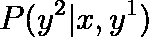

# Beam Search: 序列模型中使用最广泛的算法

> 原文：[`towardsdatascience.com/beam-search-the-most-used-algorithm-in-sequence-models-107d56b23556`](https://towardsdatascience.com/beam-search-the-most-used-algorithm-in-sequence-models-107d56b23556)

## 学习最著名的文本翻译和语音识别算法的工作原理。

 [Riccardo Andreoni](https://medium.com/@riccardo.andreoni?source=post_page-----107d56b23556--------------------------------)

·发表于 [Towards Data Science](https://towardsdatascience.com/?source=post_page-----107d56b23556--------------------------------) ·阅读时间 6 分钟·2023 年 12 月 13 日

--

Beam Search 允许考虑多个候选流。图片来源：[unsplash.com](https://unsplash.com/photos/multi-colored-light-streaks-on-white-background-ylMP3TetKoQ)。

想象你是一个[AI](https://en.wikipedia.org/wiki/Artificial_intelligence)语言模型，比如[ChatGPT](https://chat.openai.com/)，在完成一个句子时。你如何选择下一个词，使其不仅**语法正确**而且**上下文相关**？这就是[**Beam Search**](https://en.wikipedia.org/wiki/Beam_search#:~:text=In%20computer%20science%2C%20beam%20search,that%20reduces%20its%20memory%20requirements.)发挥作用的地方。

通过高效**并行探索多个可能性**并在每一步保持最佳候选，Beam Search 在预测**后续元素**的任务中发挥着至关重要的作用。作为一种有效且强大的算法，它确保输出符合语法约束和上下文。

要理解 Beam Search 的影响，请考虑所有需要精确序列生成的应用，例如**语言翻译**、**文本补全**和**聊天机器人**。在所有这些应用中，Beam Search 都发挥着关键作用。

在这篇文章中，我将介绍 Beam Search 算法的理论，并带你通过一个实际的逐步示例。我还将介绍几种 Beam Search 变体，并详细讲解这个基础算法的所有优缺点。

# 理解 Beam Search

想象一下你需要将**以下句子**从西班牙语翻译成英语：

> Pablo 将于下周在纽约。

我们不仅仅希望获得正确的翻译，我们还希望获得**最佳的翻译**。对于语言模型而言，最佳输出就是**最可能的输出**。

为了完成这项任务，大多数[序列到序列](https://blog.keras.io/a-ten-minute-introduction-to-sequence-to-sequence-learning-in-keras.html)模型使用 Beam Search。它作为一种启发式算法，系统地并行探索多个可能性。在每一步中，定义的“beam width”保持固定数量的最佳候选项。这使得算法能够探索多个候选项。

这种方法**模拟决策过程**，模型会评估并选择最有前景的选项。

# Beam Search 逐步过程

考虑一个标准的序列到序列模型，下面是一个简单的网络表示：

图片由作者提供。

在每个时间步*t*，模型输出一个单词，用于组成最终的序列。最终序列将是所提供的翻译句子。

如果你对 RNN 不太熟悉，我建议查看我在本文中包含的简单介绍：

## 使用深度学习生成幻想名字：从零开始构建语言模型

### 一个语言模型能否发明独特的幻想角色名字？让我们从零开始构建它

如何使用深度学习生成幻想角色名字：从零开始构建语言模型

对于文本翻译，我们通常使用一个[**编码器**](https://en.wikipedia.org/wiki/Autoencoder)，它是网络的一部分，负责将输入序列转换为向量形式。在这种情况下，输入序列是要翻译的西班牙语句子。编码器后面跟着一个**解码器**，它在每个时间步返回输出序列的一部分。

图片由作者提供。

让我们详细查看第一步。

编码器（绿色部分）接收西班牙语句子“*Pablo estará en Nueva York la próxima semana.*”并将其转换为向量形式提供给解码器（蓝色部分）。

图片由作者提供。

在时间步 1，解码器将输出翻译的第一个单词。关键问题是：

> 解码器如何选择单词？

解码器根据输入序列*x*选择最可能的单词。换句话说，对于字典中的每个单词，模型计算其成为输出序列第一个单词的对应概率。

选择使得概率最大的那个单词。

这就是**Beam Search 进入游戏**的地方：它引入了一个参数 *B*，称为**beam width**，表示模型在每一步选择的单词数量。

比如，设置 *B=3*，模型将返回不仅是一个而是三个候选单词。

假设翻译中最可能的首个单词是“*Pablo*”、“*Next*”和“*During*”。

图片由作者提供。

对于这 3 个候选词中的每一个，模型通过猜测第二个单词 *y²* 在英文翻译中继续处理。

图片由作者提供。

与往常一样，模型选择最大化给定概率的单词。在这种情况下：

现在你可以清楚地看到 Beam Search 名字的由来。从最初的 3 个候选集开始，算法将在每一步扩大它，考虑所有这些组合的概率。

第 2 步的输出包括 9 个候选序列：“*Pablo will*”、“*Pablo is*”、……、“*During next*”和“*During one*”。模型将每一个与一个概率相关联。通过设置参数 *B=3*，模型将仅保留三个概率较高的候选序列。

假设概率较高的候选词是“*Pablo will*”、“*Pablo is*”和“*Next week*”。在第 3 步中，解码器将为每个候选词猜测 3 个后续单词。

图片由作者提供。

相同的过程将重复进行，直到模型将**句子结束**标记预测为最可能的单词。[EOS](https://forum.opennmt.net/t/end-and-start-tokens/4570)标记表示序列已达到终点，现在被视为完成。

# Beam Search 变体

Beam Search 的适应性可以通过算法的几种变体来增强。这些变体提供了适用于不同序列生成任务的更多或更少合适的选项。最常见的变体包括：

+   **Length-Normalized Beam Search**：它通过规范化概率分数来调整句子长度差异，减少对较短序列的偏见。

+   **Diverse Beam Search**：它在候选选择中引入多样性，以防止算法过早收敛，促进对更广泛解决方案空间的探索。

+   **Top-*k* Beam Search**：它将每一步考虑的候选数量限制为前 *k* 个最可能的单词，提供了计算效率而不牺牲性能。

+   **Alpha-Diverse Beam Search**：它通过引入一个 alpha 参数来控制多样性和优化之间的权衡，从而能够根据特定任务要求进行微调。

+   **Nucleus Sampling**：它定义了一个概率阈值（nucleus），并从最可能的候选集进行采样，提高算法对高质量序列的关注。

图像来源：[unsplash.com](https://unsplash.com/photos/multicolored-light-passage-in-dark-area-d3Zu34NBg7A)。

# 结论

总结来说，在这篇帖子中我们理解了为什么 Beam Search 是**最常用的算法**，特别是在**语言翻译**模型的领域中，但也适用于**聊天机器人响应**。它通过定义的光束宽度系统地并行探索多个可能性，从而提高了生成序列的精准性和上下文相关性。

我相信我提供的逐步示例将使 Beam Search 的抽象概念变得更加具体。

正如我在帖子中常做的那样，我现在将回顾一下 Beam Search 的一些优缺点。该算法的主要优点包括：

+   **精准性**：Beam Search 在生成精确且具有上下文相关性的序列方面表现优异。

+   **灵活性**：像多样性 Beam Search 和 Top-*k* Beam Search 这样的变体提供了对多样任务需求的适应性。

+   **效率**：它高效地探索解决方案空间，平衡了计算复杂性和性能。

然而，在机器学习中**没有免费的午餐**。因此，澄清每种算法的缺点是很重要的。在 Beam Search 的情况下，我发现了这些可能的问题：

+   **计算成本**：对所有可能性的详尽探索可能会带来计算开销。

+   **潜在收敛**：在标准配置下，Beam Search 可能会过早地收敛到次优解。

作者提供的图像。

最后，我邀请你探索提供的资源，以更深入地了解这个算法。

如果你喜欢这个故事，考虑关注我，以便获得我即将发布的项目和文章的通知！

# 参考文献

+   [自然语言处理的深度学习，Brownlee, J. (2019)](https://oku.ozturkibrahim.com/docs_python/Deep_Learning_for_Natural_Language_Processing.pdf)

+   [长短期记忆，Hochreiter, S., & Schmidhuber, J. (1997)](https://ieeexplore.ieee.org/abstract/document/6795963/)

+   [神经图灵机，Graves, A., 等 (2014)](https://arxiv.org/abs/1410.5401)

+   [促进多样性的目标函数用于神经对话模型，Li, J., 等 (2016)](https://aclanthology.org/N16-1014)

+   [通过联合学习对齐和翻译的神经机器翻译，Bahdanau, D., 等 (2015)](https://arxiv.org/abs/1409.0473)
