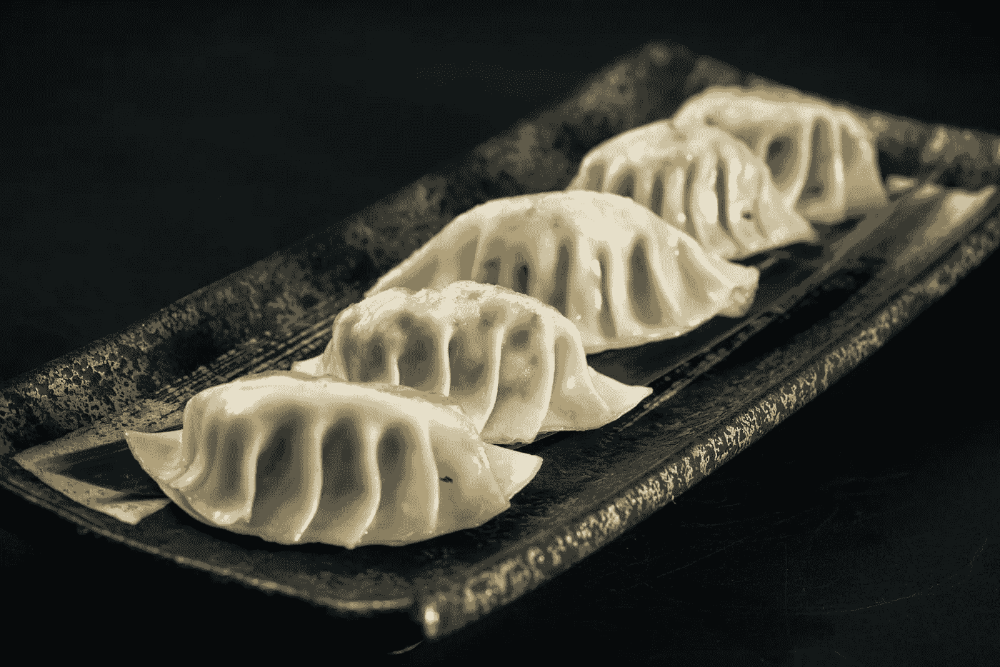

# 通过可视化掌握 Python 装饰器

> 原文：[`towardsdatascience.com/become-fluent-in-python-decorators-via-visualization-4cc6ac06f2cb?source=collection_archive---------14-----------------------#2023-01-23`](https://towardsdatascience.com/become-fluent-in-python-decorators-via-visualization-4cc6ac06f2cb?source=collection_archive---------14-----------------------#2023-01-23)

## 通过可视化理解 Python 装饰器

 [Chengzhi Zhao](https://chengzhizhao.medium.com/?source=post_page-----4cc6ac06f2cb--------------------------------)

·

[关注](https://medium.com/m/signin?actionUrl=https%3A%2F%2Fmedium.com%2F_%2Fsubscribe%2Fuser%2Ff956c63a9571&operation=register&redirect=https%3A%2F%2Ftowardsdatascience.com%2Fbecome-fluent-in-python-decorators-via-visualization-4cc6ac06f2cb&user=Chengzhi+Zhao&userId=f956c63a9571&source=post_page-f956c63a9571----4cc6ac06f2cb---------------------post_header-----------) 发布于 [Towards Data Science](https://towardsdatascience.com/?source=post_page-----4cc6ac06f2cb--------------------------------) ·7 分钟阅读·2023 年 1 月 23 日

--

图片来源于 [Huyen Bui](https://unsplash.com/ja/@huyenbui30?utm_source=unsplash&utm_medium=referral&utm_content=creditCopyText) 在 [Unsplash](https://unsplash.com/photos/vM9R9uu_BKY?utm_source=unsplash&utm_medium=referral&utm_content=creditCopyText)

Python 装饰器是语法糖。你可以在不显式使用装饰器的情况下完成所有操作。然而，使用装饰器可以使你的代码更简洁、更具可读性。**最终**，通过利用 Python 装饰器，你可以写更少的代码行数。

尽管如此，Python 装饰器并不是一个容易理解的概念。理解 Python 装饰器需要构建一些基础，包括闭包、将函数作为对象的概念以及对 Python 代码执行方式的深入了解。

许多在线资源讨论了 Python 装饰器，但很多教程仅提供了一些示例代码的讲解。阅读示例代码可以帮助对 Python 装饰器有一个基本的了解。当你需要实现自己的装饰器时，我们可能仍然需要对装饰器概念进行澄清和明确，还可能需要参考在线资源来刷新我们对细节的记忆。

阅读代码有时并不能加深记忆，但看到图像则可以。在本文中，我想通过一些可视化和有趣的例子来帮助你理解 Python 装饰器。

# Python 函数是对象
