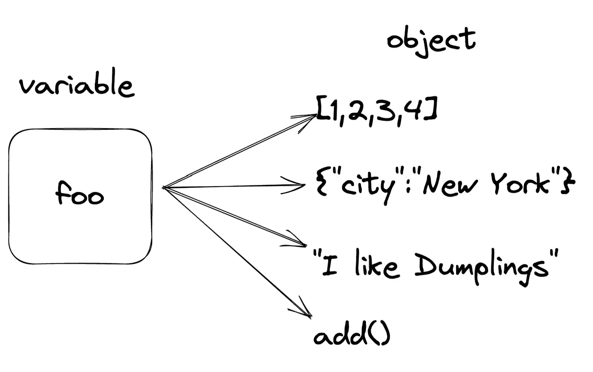
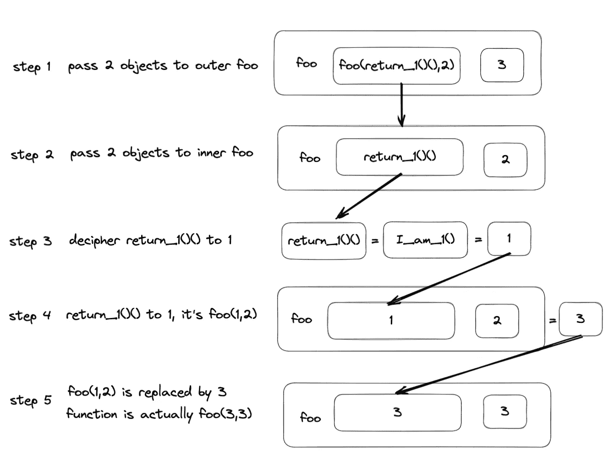
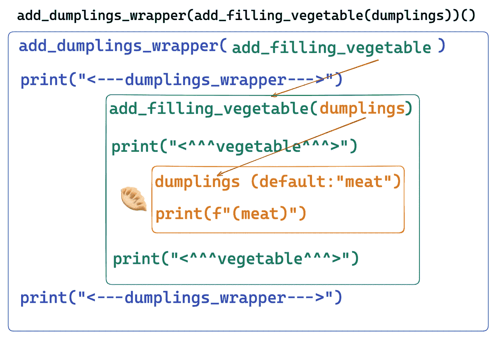
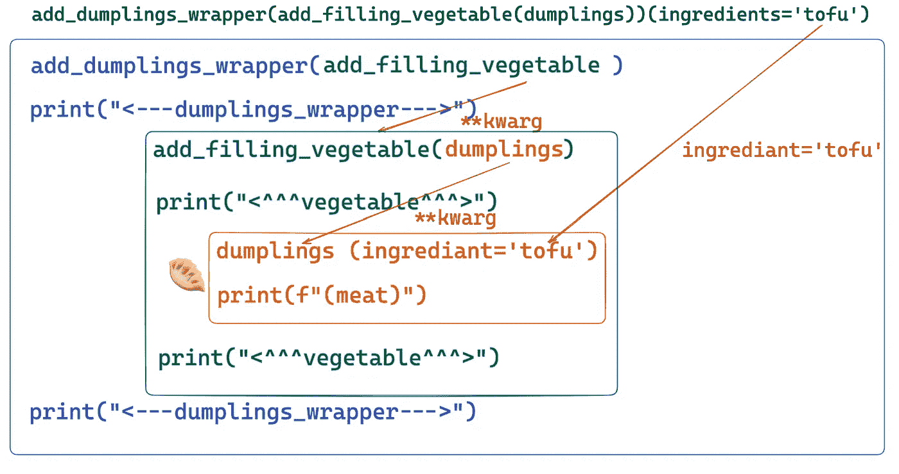

# 通过可视化掌握 Python 装饰器

> 原文：[`towardsdatascience.com/become-fluent-in-python-decorators-via-visualization-4cc6ac06f2cb`](https://towardsdatascience.com/become-fluent-in-python-decorators-via-visualization-4cc6ac06f2cb)

## 通过可视化理解 Python 装饰器

[](https://chengzhizhao.medium.com/?source=post_page-----4cc6ac06f2cb--------------------------------)[](https://towardsdatascience.com/?source=post_page-----4cc6ac06f2cb--------------------------------) [Chengzhi Zhao](https://chengzhizhao.medium.com/?source=post_page-----4cc6ac06f2cb--------------------------------)

·发布在 [Towards Data Science](https://towardsdatascience.com/?source=post_page-----4cc6ac06f2cb--------------------------------) ·阅读时间 7 分钟·2023 年 1 月 23 日

--


图片由 [Huyen Bui](https://unsplash.com/ja/@huyenbui30?utm_source=unsplash&utm_medium=referral&utm_content=creditCopyText) 提供，来源于 [Unsplash](https://unsplash.com/photos/vM9R9uu_BKY?utm_source=unsplash&utm_medium=referral&utm_content=creditCopyText)

Python 装饰器是语法糖。你可以在不显式使用装饰器的情况下实现所有功能。然而，使用装饰器可以使你的代码更加简洁和可读。最终，通过利用 Python 装饰器，你可以写更少的代码行数。

然而，理解 Python 装饰器并不是一个简单的概念。理解 Python 装饰器需要构建块，包括闭包、函数作为对象，以及对 Python 代码执行方式的深刻理解。

许多在线资源讨论了 Python 装饰器，但许多教程只提供了一些示例代码的演示。阅读示例代码可以帮助你对 Python 装饰器有一个基本的理解。当需要实现你的装饰器时，我们可能仍然需要对装饰器概念有更清晰的理解，并且还需要参考在线资源以便详细回顾。

阅读代码有时并不会加深记忆，但看到图像却会有所帮助。在这篇文章中，我想通过一些可视化和有趣的示例来帮助你理解 Python 装饰器。

# Python 函数是对象



Python 函数是对象 | 图片作者

如果我们参加了 Python 编程基础课程，我们可能会看到这样的图示。我们定义了一个变量，这是一个用来引用对象的表示性名称。变量 `foo` 在某一时刻指向一个对象。它可以是一个列表 `[1,2,3,4]`，也可以是一个字典 `[“city”: “New York”]`，或者是一个字符串 `“I like dumplings”`

在 Python 中一个较少讨论的话题是变量 `foo` 也可以指向函数 `add()`。当变量引用一个函数时，`foo` 可以像使用 int、str、list 或 dict 等其他类型一样传递。

那么这意味着我可以传递 `foo` 吗？**这使我们能够将函数作为参数传递。此外，我们还可以将函数作为返回类型返回。**

```py
# Python Functions are Objects
def I_am_1():
    return 1

def return_1():
    return I_am_1

def add(a, b):
    return a + b

foo = add

del add
## let remove the original defintion

print(foo(return_1()(),2))
## ouput 3
print(foo(foo(return_1()(),2),3))
## output 6
```

**代码讲解**

+   **函数定义**：我们定义了三个函数，分别是 `add`，用于加两个对象；`I_am_1()`，简单返回数字 1；`return_1`，返回函数 `I_am_1`

+   **有趣的事实**：然后我们将其指向另一个变量 `foo`。为了证明函数像其他类型一样是对象，我们甚至可以移除原始函数引用 `add`。其余代码仍然可以运行，因为 `foo` 引用的是函数的对象。

+   **结果解释**：`return_1()()` 起初看起来有些奇怪。如果我们仔细观察，它实际上是调用函数的方式，`return_1()` 就是 `I_am_1`，因为它只是返回这个函数。在这种情况下，我们可以将 `return_1()()=1` 理解为心里活动，因此 `foo(1,2)` 得到 3 的输出也就不足为奇了。我们还可以将 `foo(1,2)` 传递给另一个函数。在这种情况下，我们将其传递给了它自己。由于 `foo(1,2)=3`，外部函数将作为 `foo(3,3)` 操作。为了得到结果，我们可以将整个函数及其参数传递，并让程序在运行时执行以解读所有内容。

**代码可视化**



将函数传递给另一个函数 | 图片作者

# Python 装饰器结构

Python 装饰器在不修改原始对象的情况下，转换原始对象的功能。它是一种语法糖，使用户可以更方便地扩展对象的能力，而不是重复一些现有的代码。装饰器是 [装饰器设计模式](http://en.wikipedia.org/wiki/Decorator_pattern) 的 Python 实现（注意：Python 装饰器与装饰器设计模式并不完全相同）。

我们已经讨论了可以将函数作为返回类型返回。现在，我们扩展这个概念，演示装饰器如何工作：**我们可以在另一个函数内将函数作为返回类型返回。**

为了让我们的示例更有趣，我们可以创建一个装饰器，像一个函数的包装器，然后堆叠多个装饰器。

首先定义我们的函数，并以制作一些饺子为例。🥟🥟🥟

```py
## Python Decorators Basic -- I love dumplings
def add_filling_vegetable(func):
    def wrapper(*args, **kwargs):
        print("<^^^vegetable^^^>")
        func(*args, **kwargs)
        print("<^^^vegetable^^^>")
    return wrapper

def add_dumplings_wrapper(func):
    def wrapper(*args, **kwargs):
        print("<---dumplings_wrapper--->")
        func(*args, **kwargs)
        print("<---dumplings_wrapper--->")
    return wrapper

def dumplings(ingredients="meat"):
    print(f"({ingredients})")

add_dumplings_wrapper(add_filling_vegetable(dumplings))()
# <---dumplings_wrapper--->
# <^^^vegetable^^^>
# (meat)
# <^^^vegetable^^^>
# <---dumplings_wrapper--->
add_dumplings_wrapper(add_filling_vegetable(dumplings))(ingredients='tofu')
# <---dumplings_wrapper--->
# <^^^vegetable^^^>
# (tofu)
# <^^^vegetable^^^>
# <---dumplings_wrapper--->
```

**代码讲解**

+   **函数定义**：我们定义了三个函数，分别是 `add_filling_vegetable`、`add_dumplings_wrapper` 和 `dumplings`。在 `add_filling_vegetable` 和 `add_dumplings_wrapper` 中，我们定义了一个包装函数，该函数包裹在作为参数传递的原始函数周围。此外，我们可以做其他的事情。在这种情况下，我们在原始函数之前和之后打印一些文本。如果原始函数还定义了参数，我们可以通过包装函数传递它们。我们还利用了魔法 `*args` 和 `**kwargs` 来提高灵活性。

+   **结果解释**

1.  我们可以通过使用默认的 `add_dumplings_wrapper(add_filling_vegetable(dumplings))()` 来调用默认的成分 `meat`，我们可以看到函数是链式调用的。这不易读，我们将很快用装饰器语法来修复它。这里的核心思想是我们不断将函数对象作为参数传递给另一个函数。这个函数做了两件事：1) 继续执行未修改的原始函数；2) 执行附加的代码。整个代码的执行就像是一个往返旅行。



`add_dumplings_wrapper(add_filling_vegetable(dumplings))() | 图片由作者提供`

2\. 对于 `add_dumplings_wrapper(add_filling_vegetable(dumplings))(ingredients=’tofu’)`，它通过传递额外的参数将默认成分从 `meat` 改为 `tofu`。在这种情况下，`*args` 和 `**kwargs` 对于解决复杂性非常有用。包装器函数不需要解包以了解参数的上下文。作为一个装饰器，它可以安全地传递实际函数而不需要修改它们。



`add_dumplings_wrapper(add_filling_vegetable(dumplings))(ingredients=’tofu’)`

到目前为止，我们还没有触及装饰器语法。让我们对原始函数的定义做一个小改变，称其为 `fancy_dumplings`。

```py
## Stack decorator, the order matters here
@add_dumplings_wrapper
@add_filling_vegetable
def fancy_dumplings(ingredients="meat"):
    print(f"({ingredients})")

fancy_dumplings()
# <---dumplings_wrapper--->
# <^^^vegetable^^^>
# (meat)
# <^^^vegetable^^^>
# <---dumplings_wrapper--->

fancy_dumplings(ingredients='tofu')
# <---dumplings_wrapper--->
# <^^^vegetable^^^>
# (tofu)
# <^^^vegetable^^^>
# <---dumplings_wrapper--->
```

现在装饰器简化了我们调用所有函数的方式，使其更具可读性。我们只需要调用一次`fancy_dumplings`。这比水平嵌套多个函数在视觉上要干净得多。

# 我可以用装饰器做什么呢？

太棒了！现在我们清楚了如何创建 Python 装饰器。我可以用装饰器做什么呢？

Python 装饰器有许多潜在的实际应用场景。它使你的代码更易读且更具动态性。*请注意，你不一定需要使用装饰器。我们总是可以在另一个函数周围实现一个包装器来达到相同的目的。* ***装饰器只是语法糖***。

你可以构建一个时间装饰器来评估给定函数的性能。以下是来自 [Python 装饰器入门](https://realpython.com/primer-on-python-decorators/#a-few-real-world-examples) 的一个计时器示例。

```py
import functools
import time

def timer(func):
    """Print the runtime of the decorated function"""
    @functools.wraps(func)
    def wrapper_timer(*args, **kwargs):
        start_time = time.perf_counter()    
        value = func(*args, **kwargs)
        end_time = time.perf_counter()      
        run_time = end_time - start_time    
        print(f"Finished {func.__name__!r} in {run_time:.10f} secs")
        return value
    return wrapper_timer
```

它测量执行给定函数的时间。让我们将其与我们的饺子示例结合起来。

```py
@timer
@add_dumplings_wrapper
@add_filling_vegetable
def fancy_dumplings(ingredients="meat"):
    print(f"({ingredients})")

fancy_dumplings()
# <---dumplings_wrapper--->
# <^^^vegetable^^^>
# (meat)
# <^^^vegetable^^^>
# <---dumplings_wrapper--->
# Finished 'wrapper' in 0.0000334990 secs
```

你可以继续堆叠装饰器来实现你的目标，只需简单地调用原始函数，无需担心在调用时包装其他函数，因为我们在定义原始函数时已经提供了装饰器的顺序。


照片由[Markus Spiske](https://unsplash.com/@markusspiske?utm_source=unsplash&utm_medium=referral&utm_content=creditCopyText)提供，发布在[Unsplash](https://unsplash.com/photos/IiEFmIXZWSw?utm_source=unsplash&utm_medium=referral&utm_content=creditCopyText)上。

# 最后的想法

你可以利用 Python 装饰器的许多可能性。本质上，它是一个包装器，用于改变原始函数的行为。装饰器的实用性取决于你的观点，但它不应是让你感到陌生的语法。希望通过一些可视化，装饰器的概念变得更容易理解。如果你对这个故事有任何评论，请告诉我。

希望这个故事对你有帮助。本文是**我的工程与数据科学故事系列的一部分**，目前包括以下内容：


[Chengzhi Zhao](https://chengzhizhao.medium.com/?source=post_page-----4cc6ac06f2cb--------------------------------)

## 数据工程与数据科学故事

[查看列表](https://chengzhizhao.medium.com/list/data-engineering-data-science-stories-ddab37f718e7?source=post_page-----4cc6ac06f2cb--------------------------------)53 个故事

你也可以[**订阅我的新文章**](https://chengzhizhao.medium.com/subscribe)或成为[**推荐的 Medium 会员**](https://chengzhizhao.medium.com/membership)，享受对 Medium 上所有故事的无限访问权限。

如有疑问/评论，**请随时在本文评论中写下**，或通过[Linkedin](https://www.linkedin.com/in/chengzhizhao/)或[Twitter](https://twitter.com/ChengzhiZhao)直接联系我。
