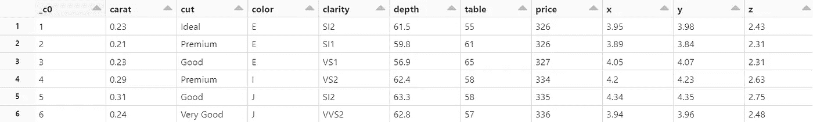
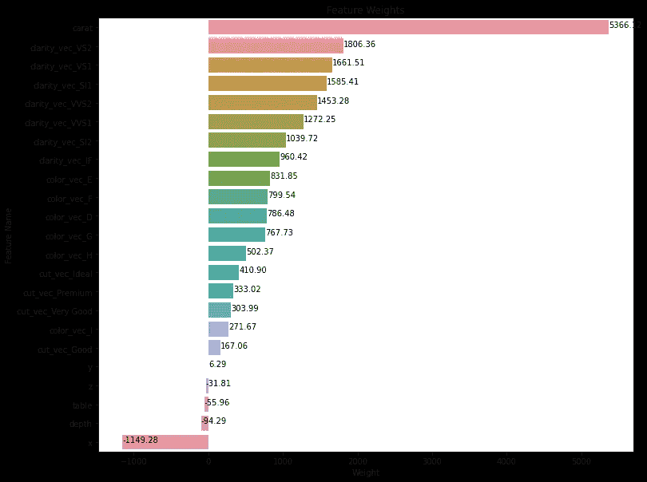

# PySpark 线性回归初学者指南

> 原文：[`towardsdatascience.com/beginners-guide-to-linear-regression-with-pyspark-bfc39b45a9e9`](https://towardsdatascience.com/beginners-guide-to-linear-regression-with-pyspark-bfc39b45a9e9)

## 使用 PySpark 代码构建线性回归模型的逐步教程

[](https://medium.com/@yazihejazi?source=post_page-----bfc39b45a9e9--------------------------------)[](https://towardsdatascience.com/?source=post_page-----bfc39b45a9e9--------------------------------) [Yasmine Hejazi](https://medium.com/@yazihejazi?source=post_page-----bfc39b45a9e9--------------------------------)

·发布于[Towards Data Science](https://towardsdatascience.com/?source=post_page-----bfc39b45a9e9--------------------------------) ·阅读时间 5 分钟·2023 年 1 月 11 日

--


照片由[eskay lim](https://unsplash.com/@eskaylim?utm_source=medium&utm_medium=referral)提供，来源于[Unsplash](https://unsplash.com/?utm_source=medium&utm_medium=referral)

# 介绍

PySpark 是 Apache Spark 的 Python API。它允许我们在高层次的编程语言中编写代码，同时享受分布式计算的好处。通过内存计算、使用并行化的分布式处理和原生机器学习库，我们可以解锁对数据处理的极大效率，这对数据扩展至关重要。

本教程将逐步讲解如何使用[Diamonds 数据](https://ggplot2.tidyverse.org/reference/diamonds.html)创建 PySpark 线性回归模型，该数据来自[ggplot2](https://ggplot2.tidyverse.org/reference/#data)。Databricks 在[Databricks Utilities (](https://docs.databricks.com/dev-tools/databricks-utils.html)`[dbutils](https://docs.databricks.com/dev-tools/databricks-utils.html)`[)](https://docs.databricks.com/dev-tools/databricks-utils.html)上托管此数据集，以便轻松加载。该数据包含数值和分类特征，我们可以利用这些特征来构建我们的模型。我们将处理如何预处理数据，以便我们可以简单地训练模型并生成预测。我们将实现这一点而无需接触 Pandas！


照片由[Tahlia Doyle](https://unsplash.com/@tahliaclaire?utm_source=medium&utm_medium=referral)提供，来源于[Unsplash](https://unsplash.com/?utm_source=medium&utm_medium=referral)

如果你已经熟悉在 Pandas 中进行线性回归，过程是类似的。回归模型将预测钻石的**价格**。

# 数据预处理

首先，让我们加载数据。我们将使用`diamonds`数据集来根据特征预测钻石的价格。每个变量的描述可以在[这里](https://ggplot2.tidyverse.org/reference/diamonds.html)找到。

```py
df = spark.read.csv("/databricks-datasets/Rdatasets/data-001/csv/ggplot2/diamonds.csv", header="true", inferSchema="true")
display(df)
```



作者拍摄的照片

为了准备我们的数据进行机器学习，我们首先需要创建一个数值特征向量，作为模型的输入。这意味着，如果我们有类别变量，我们需要将它们一热编码成数值特征；然后，将所有特征放入一个向量中。

MLlib 库是一个对 PySpark 的封装，支持许多用于分类、回归、聚类、降维等的机器学习算法。这个库将大大帮助我们的数据处理和机器学习需求！

## 预处理类别特征

1.  [StringIndexer](https://spark.apache.org/docs/latest/api/python/reference/api/pyspark.ml.feature.StringIndexer.html)：这基本上是为每个类别分配一个数值（例如：Fair: 0, Ideal: 1, Good: 2, Very Good: 3, Premium: 4）

1.  [OneHotEncoder](https://spark.apache.org/docs/3.1.1/api/python/reference/api/pyspark.ml.feature.OneHotEncoder.html)：这个工具将类别转换为二进制向量。结果是一个 SparseVector，指示 StringIndexer 中哪个索引具有一热值 1。

```py
from pyspark.ml import Pipeline
from pyspark.ml.feature import StringIndexer, OneHotEncoder

cat_cols= ["cut", "color", "clarity"]
stages = [] # Stages in Pipeline

for c in cat_cols:
    stringIndexer = StringIndexer(inputCol=c, outputCol=c + "_index")
    encoder = OneHotEncoder(inputCols=[stringIndexer.getOutputCol()], \
            outputCols=[c + "_vec"])    
    stages += [stringIndexer, encoder] # Stages will be run later on
```

## 汇总特征向量

在 PySpark 中，我们需要将所有特征合并成一个向量列。特征向量列将作为我们机器学习模型的输入。PySpark 允许我们使用[VectorAssembler](https://spark.apache.org/docs/3.1.3/api/python/reference/api/pyspark.ml.feature.VectorAssembler.html)轻松创建这个向量。

你需要将之前的数值特征和类别稀疏向量特征合并成一个向量。

然后，我们可以将这些阶段作为管道运行。这会将数据通过到目前为止定义的所有特征转换。

```py
from pyspark.ml.feature import VectorAssembler

# Transform all features into a vector
num_cols = ["carat", "depth", "table", "x", "y", "z"]
assemblerInputs = [c + "_vec" for c in cat_cols] + num_cols
assembler = VectorAssembler(inputCols=assemblerInputs, outputCol="features")
stages += [assembler]

# Create pipeline and use on dataset
pipeline = Pipeline(stages=stages)
df = pipeline.fit(df).transform(df)
```

# 训练-测试拆分

随机将数据集拆分为训练集和测试集。

```py
train, test = df.randomSplit([0.90, 0.1], seed=123)
print('Train dataset count:', train.count())
print('Test dataset count:', test.count())
```

# 拆分后的数据处理

在线性回归中，通常建议对特征进行标准化。PySpark 的[StandardScaler](https://spark.apache.org/docs/latest/api/python/reference/api/pyspark.ml.feature.StandardScaler.html)通过去除均值（设为零）并缩放到单位方差来实现这一点。

首先，将 StandardScaler 拟合到训练数据上。然后，使用缩放器对训练数据和测试数据进行转换。你应该在训练数据上进行拟合的原因是[避免数据泄漏](https://machinelearningmastery.com/data-preparation-without-data-leakage/)——当将模型应用于实际世界时，你还不知道测试数据的分布。

```py
from pyspark.ml.feature import StandardScaler

# Fit scaler to train dataset
scaler = StandardScaler().setInputCol('features') \
        .setOutputCol('scaled_features')
scaler_model = scaler.fit(train)

# Scale train and test features
train = scaler_model.transform(train)
test = scaler_model.transform(test)
```

# 构建和训练模型

我们可以从 MLlib 导入以开始构建我们的模型 ([pyspark.ml.regression.**LinearRegression**](https://spark.apache.org/docs/latest/api/python/reference/api/pyspark.ml.regression.LinearRegression.html))。我们可以从默认参数值开始，并在模型调优过程中调整这些值。需要注意的一些默认参数是：`maxIter=100`，`regParam=0.0`，`elasticNetParam=0.0`，`loss='squaredError’`。然后调用 `fit()` 将模型拟合到训练数据上。

```py
from pyspark.ml.regression import LinearRegression

lr = LinearRegression(featuresCol='scaled_features', labelCol='price')
lr_model = lr.fit(train)
```

# 评估模型

首先，我们需要使用新模型从数据中生成预测。要获取预测，请调用 `transform()`。

```py
train_predictions = lr_model.transform(train)
test_predictions = lr_model.transform(test)
```

**为什么你还需要在训练数据上拟合你的模型？** 对比模型在训练数据和测试数据上的评估可以帮助你识别是否存在过拟合或欠拟合。如果训练和测试的评估结果相似，你可能存在欠拟合。如果测试评估结果远低于训练评估，你可能存在过拟合。

要评估模型，PySpark 提供了 [RegressionEvaluator](https://spark.apache.org/docs/latest/api/python/reference/api/pyspark.ml.evaluation.RegressionEvaluator.html)。你可以选择最适合你用例的评估指标：

+   RMSE — 均方根误差（默认）

+   MSE — 均方误差

+   R2 — 决定系数

+   MAE — 平均绝对误差

+   Var — 解释方差

```py
from pyspark.ml.evaluation import RegressionEvaluator

evaluator = RegressionEvaluator(predictionCol="prediction", \
                 labelCol="price", metricName="r2")

print("Train R2:", evaluator.evaluate(train_predictions))
print("Test R2:", evaluator.evaluate(test_predictions))
```

训练 R2: 0.9204 | 测试 R2: 0.9142

# 分析特征权重

要提取线性回归的权重和系数，请运行以下代码。

```py
print("Coefficients: " + str(lr_model.coefficients))
print("Intercept: " + str(lr_model.intercept))
```

将权重与特征名称匹配并绘制它们可能更有帮助。这种视图对希望了解模型关键驱动因素的主要利益相关者特别重要。

```py
import numpy as np
import pandas as pd
import matplotlib.pyplot as plt
import seaborn as sns

list_extract = []
for i in df.schema['features'].metadata["ml_attr"]["attrs"]:
    list_extract = list_extract + df.schema['features'] \
                    .metadata["ml_attr"]["attrs"][i]
varlist = pd.DataFrame(list_extract)
varlist['weight'] = varlist['idx'].apply(lambda x: coef[x])
weights = varlist.sort_values('weight', ascending = False)
```

上述操作生成了包含特征名称和权重的 Pandas 数据框。现在让我们绘制这些权重。

```py
def show_values(axs, space=.01):
    def _single(ax):
        for p in ax.patches:
            _x = p.get_x() + p.get_width() + float(space)
            _y = p.get_y() + p.get_height() - (p.get_height()*0.5)
            value = '{:.2f}'.format(p.get_width())
            ax.text(_x, _y, value, ha="left")

    if isinstance(axs, np.ndarray):
        for idx, ax in np.ndenumerate(axs):
            _single(ax)
    else:
        _single(axs)

def plot_feature_weights(df):
    plt.figure(figsize=(10, 8))
    p = sns.barplot(x=df['weight'], y=df['name'])
    show_values(p, space=0)

    plt.title('Feature Weights')
    plt.xlabel('Weight')
    plt.ylabel('Feature Name')

plot_feature_weights(weights)
```



作者照片

# 总结

使用 PySpark 实现线性回归的步骤：

1.  使用 StringIndexer 和 OneHotEncoder 对分类特征进行独热编码

1.  使用 VectorAssembler 创建输入特征向量列

1.  将数据分割为训练集和测试集

1.  使用 StandardScaler 进行数据缩放

1.  初始化并在训练数据上拟合 LinearRegression 模型

1.  在测试数据上转换模型以进行预测

1.  使用 RegressionEvaluator 评估模型

1.  分析特征权重以理解和改进模型
