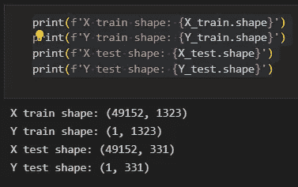
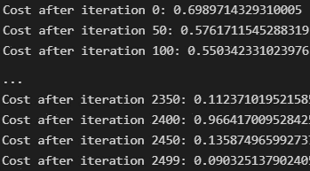
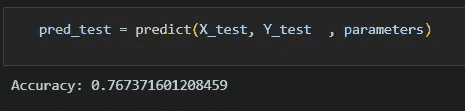

# 深度学习神经网络在图像分类中的幕后故事

> 原文：[`towardsdatascience.com/behind-the-scenes-of-a-deep-learning-neural-network-for-image-classification-5222aee3231d?source=collection_archive---------5-----------------------#2023-02-10`](https://towardsdatascience.com/behind-the-scenes-of-a-deep-learning-neural-network-for-image-classification-5222aee3231d?source=collection_archive---------5-----------------------#2023-02-10)

## 这是魔法还是线性代数和微积分？

 [布鲁诺·卡拉法](https://brunocaraffa.medium.com/?source=post_page-----5222aee3231d--------------------------------)

·

[关注](https://medium.com/m/signin?actionUrl=https%3A%2F%2Fmedium.com%2F_%2Fsubscribe%2Fuser%2F657289ec5532&operation=register&redirect=https%3A%2F%2Ftowardsdatascience.com%2Fbehind-the-scenes-of-a-deep-learning-neural-network-for-image-classification-5222aee3231d&user=Bruno+Caraffa&userId=657289ec5532&source=post_page-657289ec5532----5222aee3231d---------------------post_header-----------) 发表在 [Towards Data Science](https://towardsdatascience.com/?source=post_page-----5222aee3231d--------------------------------) ·16 分钟阅读·2023 年 2 月 10 日

--

照片由 [皮耶特罗·詹](https://unsplash.com/@pietrozj?utm_source=medium&utm_medium=referral) 提供，来源于 [Unsplash](https://unsplash.com/?utm_source=medium&utm_medium=referral)

深度学习神经网络最近受到很多关注，这有充分的理由。它是语音识别、人脸检测、语音控制、自动驾驶汽车、脑肿瘤检测等技术的基础，这些技术在 20 年前还不曾进入我们的生活。尽管这些网络看起来很复杂，但它们的学习方式与人类一样：通过示例。网络通过大量数据集进行训练，并通过多个层次和多次迭代进行优化，以实现最佳结果。在过去 20 年中，计算能力和数据量的指数级增长为深度学习神经网络创造了完美的条件。即使我们在*机器学习*和*人工智能*等华丽术语面前感到困惑，但它们不过是线性代数和微积分与计算结合的产物。

像 Keras、PyTorch 和 TensorFlow 这样的框架简化了定制深度网络的构建、训练、验证和部署。这些框架在创建现实生活中的深度学习应用时是显而易见的首选。然而，有时候，退一步思考，真正理解框架背后的运行机制是至关重要的。在本文中，我们将通过仅使用 NumPy 来创建一个网络，并将其应用于图像分类问题。你可能会在计算过程中，尤其是在反向传播的微积分阶段感到迷茫，但不用担心。对过程的直观理解比计算本身更重要，因为框架会处理这些计算。

在本文中，我们将构建一个图像分类（猫或非猫）神经网络，该网络将使用来自两个数据集的 1,652 张图像进行训练：来自[狗与猫图像数据集](https://www.kaggle.com/datasets/chetankv/dogs-cats-images)的 852 张猫图像和来自[Unsplash 随机图像集合](https://www.kaggle.com/datasets/lprdosmil/unsplash-random-images-collection)的 800 张随机图像。首先，图像需要被转换为数组，我们将通过将原始尺寸缩小到 128x128 像素来实现这一点，以加快计算速度，因为如果保持原始尺寸，训练模型将花费太长时间。所有这些 128x128 的图像都有三个颜色层（红色、绿色和蓝色），当混合在一起时，能还原图像的原始颜色。每张 128x128 图像上的每个像素都有从 0 到 255 的红色、绿色和蓝色值，这些就是我们图像向量中的值。因此，在我们的计算中，我们将处理 1,652 张图像的 128x128x3 向量。

要将这个向量传递通过网络，需要将其重新调整，将三层颜色堆叠成一个单一的数组，如下图所示。然后我们会得到一个 (49.152,1.652) 的向量，用 1.323 个图像向量来训练模型，使用 331 个图像向量来测试，通过预测图像分类（猫或非猫）来验证训练模型。通过将这些预测与图像的真实分类标签进行比较，就可以估算模型的准确性。

图 1 — 将图像转化为向量的过程。来源：作者。

最后，既然训练向量已经解释完毕，就该谈谈网络的架构，如图 2 所示。由于训练向量中有 49.152 个值，模型的输入层必须具有相同数量的节点（或神经元）。然后，有三个隐藏层，直到输出层，该层表示图片中猫的概率。在实际模型中，通常会有远超过 3 层隐藏层，因为网络需要更深以便在大数据背景下表现良好，但在这篇文章中，仅使用了三层隐藏层，因为它们对于简单的分类模型已经足够。然而，尽管这个架构只有 4 层（输出层不算在内），代码仍然可以应用于创建更深的神经网络，只需将层的维度作为训练函数的参数即可。

图 2 — 网络架构。来源：作者。

现在图像向量和网络架构已经解释完毕，优化算法在图 3 中进行了描述：[梯度下降](https://example.org/gradient-descent-algorithm-a-deep-dive-cf04e8115f21)。如果你一开始没有完全理解也不用担心，因为每一步将在文章的编码部分中详细讲解。

图 3 — 训练过程。来源：作者。

首先，我们初始化网络的参数。这些参数是每个节点连接的权重 (***w***) 和偏置 (***b***)，如图像 2 所示。在代码中，将更容易理解每个权重和偏置参数是如何工作的以及它们如何初始化。随后，初始化这些参数后，就可以运行前向传播模块，并在最后应用 sigmoid 函数以获得概率预测。在我们的案例中，它是猫出现在那张图片中的概率。然后，我们通过交叉熵成本来比较我们的预测与图像的真实标签（猫或非猫），交叉熵成本是优化分类模型的广泛使用的损失函数。最后，计算成本后，我们将其传递回反向传播模块，以计算相对于参数 ***w*** 和 ***b*** 的梯度。掌握了相对于 ***w*** 和 ***b*** 的损失函数梯度后，可以通过将相应的梯度相加来更新参数，因为它们指向最小化损失函数的 ***w*** 和 ***b*** 值。

由于目标是最小化损失函数，因此此循环应经过预定义的迭代次数，以小步向损失函数的最小值逼近。在某些时候，参数将停止变化，因为梯度将趋于零，最小值已经接近。

## 1\. 加载数据

首先，需要加载库。除了 *keras.preprocessing.image*（用于将图像转换为向量）和 *sklearn.model_selection*（用于将图像向量拆分为训练和测试向量）之外，只需 Numpy、Pandas 和 OS。

数据必须从两个文件夹加载：cats 和 random images。这可以通过获取所有文件名并构建每个文件的路径来完成。然后，只需将所有文件路径汇总到数据框中，并创建一个条件列 "*is_cat*"，如果路径在猫文件夹中则值为 1，否则为 0。

拥有路径数据集后，接下来是通过将图像分成 80%用于训练和 20%用于测试来构建我们的训练和测试向量。Y 代表特征的真实标签，而 X 代表图像的 RGB 值，因此 X 被定义为数据框中包含图像文件路径的列，然后使用 *load_img* 函数加载图像，并将 target_size 设置为 128x128 像素以便加快计算速度。最后，图像使用 *img_to_array* 函数转换为数组。这些是 X_train 和 X_test 向量的形状：

图像 4 — X_train 和 X_test 的形状。来源：作者。

## **2\. 初始化参数**

由于线性函数为`z = w*x + b`，网络有 4 层，需要初始化的参数向量包括 w1、w2、w3、w4、b1、b2、b3 和 b4。在代码中，通过遍历层维度列表的长度来完成这项工作，该列表将在后面定义，但它是一个硬编码的列表，包含网络中每一层的神经元数量。

参数***w***和***b***必须有不同的初始化：***w***必须初始化为随机小数矩阵，而***b***初始化为零矩阵。这是因为如果我们将权重初始化为零，权重对损失函数的导数将全部相同，因此在后续迭代中的值总是相同，隐藏层将全都对称，导致神经元只能学习相同的少量特征。因此，权重被初始化为随机数以打破这种对称性，并允许神经元学习不同的特征。需要注意的是，偏差可以初始化为零，因为权重已经打破了对称性，神经元中的值将全部不同。

最后，要理解参数向量初始化时定义的形状，需要知道权重参与矩阵乘法，而偏差则参与矩阵加法（记住`z1 = w1*x + b1`？）。矩阵加法可以在不同大小的数组中进行，因为[Python 广播](https://www.geeksforgeeks.org/python-broadcasting-with-numpy-arrays/)的存在。另一方面，[矩阵乘法](https://www.cuemath.com/algebra/multiplication-of-matrices/)仅在形状兼容时才可能发生，如`(m,n) x (n,k) = (m,k)`，这意味着第一个数组的列数需要与第二个数组的行数匹配，最终矩阵将具有第一个数组的行数和第二个数组的列数。图 5 展示了神经网络中所有参数向量的形状。

图 5 — 参数向量的形状。来源：作者。

在第一层中，由于我们将***w1***参数向量与原始的 49.152 个输入值相乘，因此需要将***w1***的形状设置为`(20,49.152)`，因为`(20,49.152) * (49.152,1.323) = (20,1.323)`，这就是第 1 个隐藏层激活的形状。***b1***参数将矩阵乘法的结果相加（记住`z1 = w1*x + b1`），因此我们可以将一个`(20,1)`的数组添加到`(20,1.323)`的乘法结果中，因为广播会处理形状不匹配的问题。这种逻辑适用于接下来的层，因此我们可以假设**w(l)**的形状公式是`(层 l+1 的节点数, 层 l 的节点数)`，而**b(l)**的形状公式是`(层 l+1 的节点数, 1)`***。***

最后，对于权重向量初始化有一个重要的观察。我们应该将随机初始化的权重除以所在层的节点数的平方根。例如，输入层有 49.152 个节点，所以我们将随机初始化的参数除以√49.152，结果是 222，而第一个隐藏层有 20 个节点，所以我们将随机初始化的 w2 参数除以√20，结果是 4.5。初始化的值必须保持较小，因为这是[随机梯度下降的要求](https://machinelearningmastery.com/why-initialize-a-neural-network-with-random-weights/)。

## 3\. 前向传播

现在参数向量已经初始化，我们可以进行前向传播，这是通过进行线性操作`z = w*x + b`，然后进行一个 ReLU 激活，一直到最后一层，最后一层使用 sigmoid 激活替代 ReLU 激活，并获得一个概率作为最后的激活。线性操作的输出通常用字母“z”表示，并称为预激活参数。因此，预激活参数***z***将成为 ReLU 和 sigmoid 激活的输入。

在输入层之后，对给定层 L 上的线性操作将为`z[L] = w[L] * A[L-1] + b[L]`，使用前一层的激活值而不是数据输入 x。线性操作和激活的参数都将存储在缓存列表中，以便作为后续反向传播块中计算梯度的输入。

现在首先定义线性前向函数：

现在必须定义 Sigmoid 和 ReLU 函数。图 6 展示了这两个函数的图表。Sigmoid 激活通常用于两类分类问题，以预测二进制变量的概率。这是因为 S 形曲线使大部分值接近 0 或 1。因此，我们只会在网络的最后一层使用 sigmoid 激活来预测图片中是否有猫的概率。

另一方面，如果 ReLU 函数的输出为正，则直接输出输入，否则输出为零。这是一个非常简单的操作，因为它没有任何指数运算，并且有助于加快内层的计算速度。此外，使用 ReLU 作为激活函数减少了梯度消失问题的可能性，与 tanh 和 sigmoid 函数不同。

ReLU 激活使得不是所有的节点同时被激活，因为负值在激活后会被变为零。网络中有一些 0 值很重要，因为它增加了神经网络所需的特性：稀疏性，意味着网络具有更好的预测能力和更少的过拟合。毕竟，神经元正在处理有意义的信息部分。例如，在我们的示例中，可能有一个特定的神经元可以识别猫的耳朵，如果图像是人类或风景，这个神经元显然应该被设置为 0。

图像 6 — Sigmoid 和 ReLU 函数。来源：作者。

现在可以实现完整的激活函数了。

最后，是时候根据计划的网络架构整合激活函数了。首先，创建缓存列表，将第一个激活设置为数据输入（训练向量），由于网络中有两个参数（***w*** 和 ***b***），层数可以定义为参数字典长度的一半。然后，函数循环遍历所有层，除了最后一层，应用线性前向函数，然后是 ReLU 激活，最后在网络的最后一层用最终的线性前向传播和 sigmoid 激活生成预测概率，即最后的激活。

## 4\. 交叉熵损失

损失函数通过将预测概率（最后激活的结果）与图像的真实标签进行比较，量化模型在给定数据上的表现。如果网络在学习数据，成本（损失函数的结果）应该在每次迭代后下降。在分类问题中，交叉熵损失函数常用于优化，其公式见下图像 6：

图像 7 — 神经网络的成本。来源：作者。

使用 NumPy 定义交叉熵成本函数：

## 5\. 反向传播

在反向传播模块中，我们应该从右到左遍历网络，计算相对于损失函数的参数梯度，然后进行更新。就像在前向传播模块一样，首先呈现线性反向传播，然后是 sigmoid 和 relu，最后一个函数将整合所有函数以适应网络架构。

对于给定的层 L，线性部分是 `z[L] = w[L] * A[L-1] + b[L]`***.*** 假设你已经计算了导数 **dZ[L]**，即线性输出的成本导数。其公式将很快呈现，但首先让我们查看图像 8 中呈现的 **dW[L]**、**dA[L-1]** 和 **db[L]** 的导数公式，以便首先实现线性反向函数。

图 8 — 成本相对于权重、偏置和之前激活的导数。来源：作者。

这些公式是交叉熵成本函数相对于权重、偏置和之前激活 **(a[L-1])** 的导数。本文不会详细介绍导数计算，但可以参考 [这篇 Towards Data Science 文章](https://medium.com/@pdquant/all-the-backpropagation-derivatives-d5275f727f60)。

定义线性反向传播函数时需要使用 **dZ** 作为输入，因为在反向传播中，线性部分位于 sigmoid 或 relu 反向传播之后。在下一个代码部分将计算 **dZ**，但为了遵循前向传播的相同函数实现逻辑，线性反向传播函数将首先出现。

在实现梯度计算之前，需要从之前的层加载参数 ***weight***、***bias*** 和 ***activation***，这些参数在线性传播过程中都存储在缓存中。参数 ***m*** 最初来源于交叉熵成本公式，并且是之前激活向量的大小，可以通过 `previous_activation.shape[1]` 获得。然后可以使用 NumPy 实现梯度公式的向量化计算。在偏置梯度中，需要 `keepdims=True` 和 `axis=1` 参数，因为需要在向量的行中进行求和，并且必须保持向量的原始维度，即 **dB** 将与 **dZ** 具有相同的维度。

成本相对于线性输出的导数 (**dZ**) 公式如图 9 所示，其中 **g’(Z[L])** 是激活函数的导数。

图 9— 成本相对于线性输出的导数。来源：作者。

因此，必须首先计算 sigmoid 和 ReLU 函数的导数。在 ReLU 中，当值为正时，导数为 1，否则为未定义，但为了计算目的，在 ReLU 反向传播中获取 **dZ**，可以直接复制 dactivation 向量（因为 `dactivation * 1 = dactivation`），并在 *z* 为负时将 **dZ** 设置为 0。对于 sigmoid 函数 ***s***，其导数为 `s * (1-s)`***，*** 乘以这个导数后，***dactivation,*** 向量 **dZ** 就在 sigmoid 反向传播函数中实现了。

现在可以实现 `linear_activation_backward` 函数。

首先，需要从 `cache` 列表中检索线性和激活缓存。然后对每个激活，首先运行 `activation_backward` 函数，获取 **dZ**，然后将其作为输入，与 `linear cache` 结合，传递给 `linear_backward` 函数。最后，该函数返回 **dW**、**dB** 和 **dprevious_activation** 梯度。请记住，这与前向传播的顺序相反，我们在网络中从右到左进行。

现在是时候为整个网络实现反向传播函数了。这个函数将从最后一层 L 开始，向后遍历所有隐藏层。因此，代码需要计算**dAL**，即成本函数对最后一次激活的导数，以便将其作为`linear_activation_backward`函数的输入，该函数用于 sigmoid 激活。dAL 的公式在下面的图 10 中展示。

图 10 — 成本函数对最后一次激活的导数。来源：作者。

现在一切准备就绪，可以实现反向传播函数了。

首先，创建梯度字典。网络的层数通过获取缓存字典的长度来定义，因为每层在前向传播块中都有其线性和激活缓存，因此缓存列表的长度与层数相同。之后，函数将遍历这些层的缓存，以检索线性激活反向传播函数的输入值。此外，真实标签向量 (**Y_train**) 被重塑为与最后一次激活的形状匹配的维度，因为这是在**dAL**计算中将一个除以另一个的要求，接下来的代码行。

创建并设置***current_cache***对象以检索最后一层的线性和激活缓存（记住 Python 索引从 0 开始，所以最后一层是 n_layers - 1）。然后，在`linear_activation_backward`函数中，将激活缓存用于`sigmoid_backward`函数，而线性缓存将作为`linear_backward`函数的输入。最后，函数收集这些函数的返回值，并将其分配给梯度字典。在**dA**的情况下，由于梯度公式计算的是来自前一激活的，因此需要使用 n_layers-1 进行索引分配。在这个代码块之后，计算了网络最后一层的梯度。

按照网络的反向顺序，下一步是反向循环遍历 linear->relu 层并计算它们的梯度。然而，在反向循环过程中，`linear_activation_backward`函数必须使用‘relu’参数而不是‘sigmaid’，因为`relu_backward`函数需要被调用以处理其余层。最后，函数返回所有层计算得到的***dA***、***dW***和***dB***梯度，反向传播也就完成了。

## 6\. 参数更新

在计算出梯度后，是时候通过使用梯度更新原始参数来结束梯度下降，向着成本函数的最小值移动。

该函数通过遍历层并将***w***和***b***参数赋予其原始值减去学习率输入乘以相应的梯度来实现。乘以学习率是控制每次模型权重更新时网络参数***w***和***b***变化多少的一种方式。

## 7\. 向量的预处理

最终，所有必要的梯度下降优化函数都已实现，因此训练和测试向量可以预处理并准备好进行训练。

layers_dimensions，初始化函数的输入必须硬编码，通过创建一个包含每层神经元数量的列表来完成。随后，X_train 和 X_test 向量必须被展平以作为网络的输入，如图像 1 所示。这可以通过使用 NumPy 函数 reshape 来完成。此外，需要将 X_train 和 X_test 的值除以 255，因为它们是像素（范围从 0 到 255），而将值归一化到 0 到 1 的范围是一个良好的实践。这样，数字会更小，计算也会更快。最后，Y_train 和 Y_test 被转换为数组并且也展平。

这就是训练和测试向量的最终维度：

图片 11 — 训练和测试向量的维度。 来源：作者。

## 8\. 训练

准备好所有函数后，只需将它们组织成一个循环来创建训练迭代。

但首先，创建一个空列表来存储来自`cross_entropy_cost`函数的成本输出，并初始化参数，因为这必须在迭代之前完成一次，因为这些参数将通过梯度更新。

现在创建一个循环，遍历输入的迭代次数，按照正确的顺序调用实现的函数：`l_layer_model_forward`、`cross_entropy_cost`、`l_layer_model_backward`和`update_parameters`。最后，添加一个条件语句以每 50 次迭代或在最后一次迭代时打印成本。

调用函数进行 2500 次迭代：

成本从第一次迭代的 0.69 降到最后一次的 0.09。

图片 12 — 来源：作者。

这意味着在 NumPy 中开发的梯度下降函数已经在训练过程中优化了参数，从而导致更好的预测和更低的成本。训练完成后，我们可以检查训练好的模型如何预测测试图像标签。

## 9\. 预测

通过使用训练好的参数，此函数运行**X_test**向量的前向传播以获得预测，然后将其与真实标签向量**Y_test**进行比较，以返回准确率。

图片 13 — 来源：作者。

该模型在测试图像中检测猫的准确率已达到近 77%。考虑到仅使用了 NumPy 构建网络，这个准确率相当不错。添加新图像到训练数据集中、增加网络复杂性，或使用数据增强技术将现有训练图像转换为新图像，都是提高准确率的可能方法。

不过，再次强调，准确率不是我们关注的重点，因为我们深入探讨了数学基础。这也是本文的价值所在。学习网络的基础知识为迷人的深度学习网络应用世界奠定了知识基础。希望你继续深入探索！
