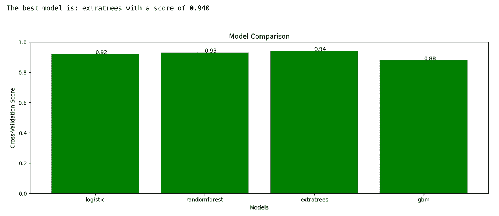

# 使用交叉验证和 Matplotlib 在 Python 中对机器学习模型进行基准测试

> 原文：[`towardsdatascience.com/benchmarking-machine-learning-models-with-cross-validation-and-matplotlib-in-python-4957a41149e`](https://towardsdatascience.com/benchmarking-machine-learning-models-with-cross-validation-and-matplotlib-in-python-4957a41149e)

## *学习如何创建面向对象的方法，使用交叉验证和结果可视化来比较和评估机器学习模型的性能*

[](https://medium.com/@theDrewDag?source=post_page-----4957a41149e--------------------------------)[](https://towardsdatascience.com/?source=post_page-----4957a41149e--------------------------------) [安德烈亚·达戈斯蒂诺](https://medium.com/@theDrewDag?source=post_page-----4957a41149e--------------------------------)

·发表于[数据科学的前沿](https://towardsdatascience.com/?source=post_page-----4957a41149e--------------------------------) ·5 分钟阅读·2023 年 1 月 23 日

--


作者提供的图片。

在这篇文章中，我们将探讨如何使用 Python 来比较和评估机器学习模型的性能。

我们将使用 Sklearn 进行交叉验证以测试模型，并使用 Matplotlib 显示结果。

这样做的主要动机是**清晰准确地理解模型性能，从而改进模型选择过程。**

交叉验证是一种对训练数据以外的数据测试模型的稳健方法。它允许我们在*折叠*数据上评估模型性能，这些数据没有用于训练模型本身，从而为我们提供了对模型在真实数据上性能的更准确估计。

有关交叉验证的详细解释，请参阅这篇文章

[](/what-is-cross-validation-in-machine-learning-14d2a509d6a5?source=post_page-----4957a41149e--------------------------------) ## 什么是机器学习中的交叉验证

### 了解交叉验证是什么——构建可泛化模型的基本技术

towardsdatascience.com

我们将使用面向对象的方法，以便可以轻松地将其重复用于其他机器学习项目，使得这种方法高度可复制。

# 基准测试类

首先，我们将创建一个名为`Benchmark`的类，该类负责测试模型。该类将接受一个模型字典，其中键是模型名称，值是模板对象本身。

该类还将使用 scikit-learn 的`make_classification`函数生成测试数据。

```py
import numpy as np
from sklearn import model_selection
from sklearn import metrics
from sklearn import datasets

import matplotlib.pyplot as plt

class Benchmark:
  """
  This class allows to compare and evaluate the 
  performance of machine learning models using cross-validation

  Parameters
  ----------
  models : dict
      Dictionary of models, 
      where the key is the name of the model and
      the value is the model object.
  """

  def __init__(self, models):
      self.models = models

  def test_models(self, X=None, y=None, cv=5):
    """
    Test the models using the provided data and cross-validation.

    Parameters
    ----------
    X : array-like or DataFrame, shape (n_samples, n_features)
        Features for the test data.
    y : array-like or Series, shape (n_samples,)
        Target for the test data.
    cv : int, cross-validation generator or an iterable, optional
        Number of folds for the cross-validation.

    Returns
    -------
    best_model : str
        Name of the model with the highest score.
    """
    if X is None or y is None:
        X, y = datasets.make_classification(
            n_samples=100, 
            n_features=10, 
            n_classes=2, 
            n_clusters_per_class=1, 
            random_state=0
        )
    self.results = {}
    for name, model in self.models.items():
        scores = model_selection.cross_val_score(model, X, y, cv=cv)
        self.results[name] = scores.mean()
    self.best_model = max(self.results, key=self.results.get)
    return f"The best model is: {self.best_model} with a score of {self.results[self.best_model]:.3f}"
```

该类的主要功能将是`test_models`函数，该函数将接受测试数据并使用交叉验证来测试模型。该函数将把结果存储在实例绑定的变量中，并通过交叉验证的各种迭代返回得分最高的模型。

为了显示结果，我们将向类中添加一个名为`plot_cv_results`的函数。这个函数将使用 Matplotlib 创建一个条形图，显示每个模型的平均交叉验证得分。

```py
def plot_cv_results(self):
  """
  Create a bar chart to visualize the cross-validation results.

  Returns
  -------
  None
  """
  plt.figure(figsize=(15,5))
  x = np.arange(len(self.results))
  plt.bar(x, list(self.results.values()), align='center', color ='g')
  plt.xticks(x, list(self.results.keys()))
  plt.ylim([0, 1])
  plt.ylabel('Cross-Validation Score')
  plt.xlabel('Models')
  plt.title('Model Comparison')
  for index, value in enumerate(self.results.values()):
      plt.text(index, value, str(round(value,2)))
  plt.show()
```

最后，为了使用该类，我们将通过传递模型字典并调用`test_models`函数与测试数据来实例化`Benchmark`对象。接下来，我们将使用`plot_cv_results`函数来显示结果。

```py
from sklearn import linear_model, ensemble

models = {
    'logistic': linear_model.LogisticRegression(),
    'randomforest': ensemble.RandomForestClassifier(),
    'extratrees': ensemble.ExtraTreesClassifier(),
    'gbm': ensemble.GradientBoostingClassifier()
}

benchmark = Benchmark(models)
print(benchmark.test_models())
benchmark.plot_cv_results()
```

这是结果。



模型基准结果。图片由作者提供。

这样，**我们可以轻松比较和评估模型的性能，然后选择最适合我们特定问题的模型。**

在这个例子中，我们使用了`make_classification`函数生成了玩具数据，但你当然可以使用任何你喜欢的数据集。

此外，`Benchmark`类可以扩展以包括其他功能，例如将结果保存到文件的能力或在多个数据集上测试模型。

# 下一步是什么？

按照通常的机器学习流程，下一步将**调优最佳模型的超参数**（在这个例子中是`ExtraTreesClassifier`）。如果我们的特征被认为是决定性的，这一步是必要的。

如果不是，另一种中间步骤是进行**特征选择/工程**，并在每次特征更改时重复基准测试步骤。

# 结论

我们创建的`Benchmark`类只是如何在项目中实现这种技术的一个例子，但它可以轻松地适应和定制以满足你的项目具体需求。

使用这种方法的主要好处是**它自动化了比较和评估模型的过程，这可以节省时间并减少人为错误。**

# 推荐阅读

对感兴趣的人，我推荐了一些关于每个机器学习相关主题的书籍。这些书籍在我看来是必读的，并且对我的职业生涯有很大的影响。

+   **机器学习简介**: [*自信的数据技能：掌握处理数据的基础知识并提升你的职业生涯*](https://amzn.to/3WZ51cE) 作者: Kirill Eremenko

+   **Sklearn / TensorFlow**: [*带有 Scikit-Learn、Keras 和 TensorFlow 的实践机器学习*](https://amzn.to/3jseVGb) 作者: Aurelien Géron

+   **自然语言处理（NLP）**: [*文本数据：机器学习和社会科学的新框架*](https://amzn.to/3l9FO22) 作者: Justin Grimmer

+   **Sklearn / PyTorch**: [*使用 PyTorch 和 Scikit-Learn 的机器学习：使用 Python 开发机器学习和深度学习模型*](https://amzn.to/3wYZf0e) 作者: Sebastian Raschka

+   **数据可视化**：[*用数据讲故事：商务专业人士的数据可视化指南*](https://amzn.to/3HUtGtB) 作者：Cole Knaflic

# 有用的链接（由我撰写）

+   **学习如何在 Python 中执行顶级的探索性数据分析**：*在 Python 中进行探索性数据分析 — 逐步过程*

+   **学习 TensorFlow 的基础知识**：[*开始使用 TensorFlow 2.0 — 深度学习简介*](https://medium.com/towards-data-science/a-comprehensive-introduction-to-tensorflows-sequential-api-and-model-for-deep-learning-c5e31aee49fa)

+   **使用 TF-IDF 在 Python 中进行文本聚类**：*在 Python 中使用 TF-IDF 进行文本聚类*

**如果你想支持我的内容创作活动，可以通过下面的推荐链接加入 Medium 的会员计划**。我将获得你投资的一部分，你将能够无缝访问 Medium 上大量的数据科学及其他文章。

[](https://medium.com/@theDrewDag/membership?source=post_page-----4957a41149e--------------------------------) [## 通过我的推荐链接加入 Medium - Andrea D'Agostino

### 阅读 Andrea D'Agostino 的每一个故事（以及 Medium 上其他成千上万作者的故事）。你的会员费直接…

medium.com](https://medium.com/@theDrewDag/membership?source=post_page-----4957a41149e--------------------------------)

# 代码模板

这是整个代码库

```py
class Benchmark:
    def __init__(self, models):
        self.models = models

    def test_models(self, X=None, y=None, cv=5):
        if X is None or y is None:
            X, y = datasets.make_classification(
                n_samples=100, 
                n_features=10, 
                n_classes=2, 
                n_clusters_per_class=1, 
                random_state=0
            )
        self.results = {}
        for name, model in self.models.items():
            scores = model_selection.cross_val_score(model, X, y, cv=cv)
            self.results[name] = scores.mean()
        self.best_model = max(self.results, key=self.results.get)
        return f"The best model is: {self.best_model} with a score of {self.results[self.best_model]:.3f}"

    def plot_cv_results(self):
        plt.figure(figsize=(15,5))
        x = np.arange(len(self.results))
        plt.bar(x, list(self.results.values()), align='center', color ='g')
        plt.xticks(x, list(self.results.keys()))
        plt.ylim([0, 1])
        plt.ylabel('Cross-Validation Score')
        plt.xlabel('Models')
        plt.title('Model Comparison')
        for index, value in enumerate(self.results.values()):
            plt.text(index, value, str(round(value,2)))
        plt.show()

from sklearn import linear_model, ensemble

models = {
    'logistic': linear_model.LogisticRegression(),
    'randomforest': ensemble.RandomForestClassifier(),
    'extratrees': ensemble.ExtraTreesClassifier(),
    'gbm': ensemble.GradientBoostingClassifier()
}

benchmark = Benchmark(models)
print(benchmark.test_models())
benchmark.plot_cv_results()
```
