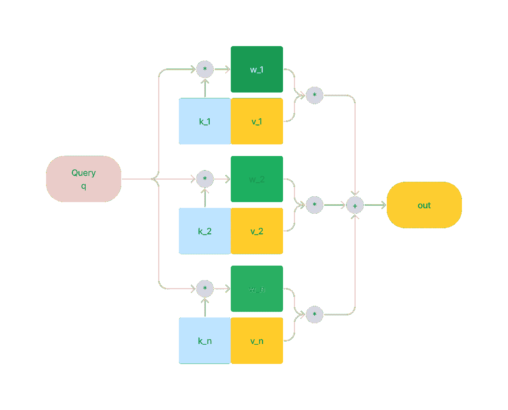
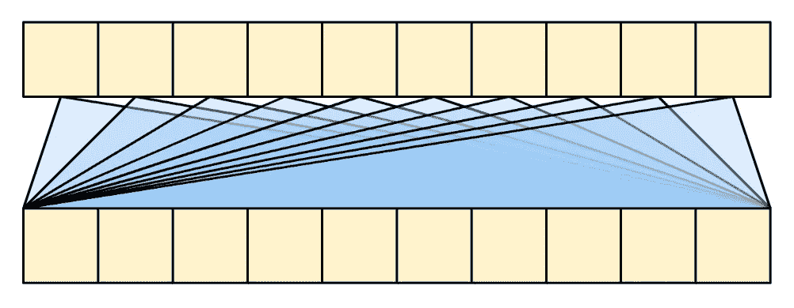
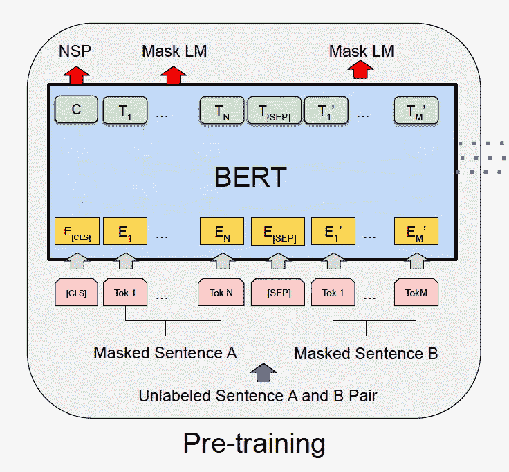
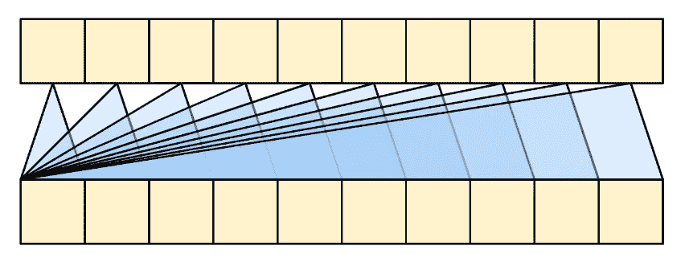
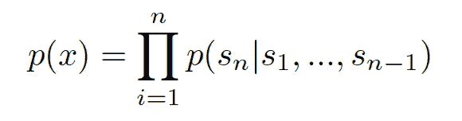
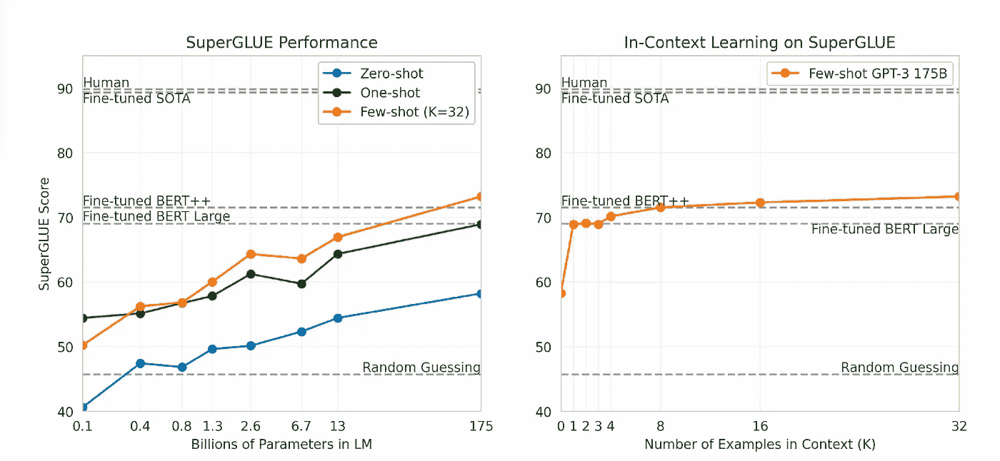

# BERT 与 GPT：比较 NLP 巨头

> 原文：[`towardsdatascience.com/bert-vs-gpt-comparing-the-nlp-giants-329d105e34ec`](https://towardsdatascience.com/bert-vs-gpt-comparing-the-nlp-giants-329d105e34ec)

## 它们的结构有何不同，这些差异如何影响模型的能力？

 [Thao Vu](https://medium.com/@vuphuongthao9611?source=post_page-----329d105e34ec--------------------------------)

·发布于 [Towards Data Science](https://towardsdatascience.com/?source=post_page-----329d105e34ec--------------------------------) ·阅读时长 7 分钟·2023 年 8 月 20 日

--

图片由作者使用 Stable Diffusion 生成。

在 2018 年，NLP 研究人员对 BERT 论文感到惊讶[1]。这个方法虽然简单，但结果却令人印象深刻：它为 11 个 NLP 任务设立了新的基准。

> 在短短一年多的时间里，BERT 已成为自然语言处理（NLP）实验中的一个普遍基准，超过 150 篇研究论文分析和改进了该模型。[2]

在 2022 年，ChatGPT [3] 以其生成类人响应的能力引爆了整个互联网。该模型可以理解广泛的话题，并能够自然地进行长时间对话，这使其与所有传统聊天机器人不同。

BERT 和 ChatGPT 是自然语言处理（NLP）领域的重大突破，但它们的方法不同。它们的结构有何不同？这些差异如何影响模型的能力？让我们深入探讨一下！

# 注意力

我们必须首先回顾常用的注意力机制，以便完全理解模型结构。注意力机制旨在捕捉和建模序列中令牌之间的关系，这也是它们在 NLP 任务中如此成功的原因之一。

## 一个直观的理解

+   想象一下你有 ***n*** 件商品存放在箱子 ***v1, v2,…,v_n.*** 这些被称为“值”。

+   我们有一个查询 ***q***，它要求从每个箱子中取出一些适量的商品 ***w***。我们称这些为 ***w_1, w_2,..,w_n***（这就是“注意力权重”）。

+   如何确定 ***w_1, w_2,.., w_n***？换句话说，如何知道在 ***v_1,v_2, ..,v_n,*** 哪些应该比其他的多取？

+   记住，所有的值都存储在我们无法窥探的箱子里。因此，我们不能直接判断 ***v_i*** 应该取少还是取多。

+   幸运的是，我们在每个框上都有一个标签，***k_1, k_2,…,k_n***，这些被称为“keys”。“keys”代表容器内部的特征。

+   基于 ***q*** 和 ***k_i (q*k_i)*** 的“相似性”，我们可以决定 ***v_i*** 的重要性 (***w_i***) 以及我们应该取多少 ***v_i*** (***w_i*v_i***).

基础注意力机制（图片由作者提供）

当然，这是一种非常抽象的注意力解释，但它帮助我更好地记住“query”、“key”和“value”背后的含义。

接下来，让我们更深入地了解 Transformer 模型如何使用不同类型的注意力。

# BERT：全球自注意力和双向编码器

全球自注意力对 query、key 和 value 的值是相同的。在一系列词元中，**每个词元将“关注”所有其他词元**，因此信息沿序列传播。而且更重要的是，以并行方式进行。

全球自注意力 [4]

与 RNN 和 CNN 相比，这一点非常重要。

+   对于 RNN，每个“状态”经过许多步骤，这可能导致信息的丢失。此外，RNN 按顺序传递每个词元，我们无法利用 GPU 并行处理。

+   对于 CNN，尽管它是并行运行的，但每个词元只能关注有限的领域，从而对词元的关系做出假设。

自注意力是编码器的关键组件，是 BERT 的构建块 [1]。BERT 论文的作者指出了从左到右的语言模型的局限性如下。

> 这些限制对于句子级任务是次优的，当应用基于微调的方法于如问答这样的词元级任务时，它可能非常有害，因为在这些任务中，结合来自两个方向的上下文至关重要。[1]

BERT 预训练 [1]

为了克服上述缺点，BERT 在“掩码语言模型”（MLM）和“下一个句子预测”（NSP）任务上进行了预训练。

+   对于 MLM 任务，15% 的词元位置被选中进行预测。因此，所选择的词元中将有 80% 被替换为 ***[MASK]*** 词元，10% 被随机词元替换，10% 不被替换。

+   对于 NSP 任务，给定 2 个句子，***s1*** 和 ***s2***，输入格式为“***[CLS]<s1>[SEP]<s2>***”，模型预测 ***s1*** 是否接在 ***s2*** 之后。[***CLS]*** 和 ***[SEP]*** 分别是特殊的分类和分隔符标记。

正如我们所见，模型可以在这两个任务中“窥视”每个词元的左右上下文。这使得模型能够利用双向词表示，并获得更深入的理解。

但双向编码有其代价。缺乏解码器的 BERT 可能不适合文本生成。因此，该模型需要添加额外的任务特定架构以适应生成任务。

# GPT：因果自注意力和文本生成

与全局自注意力相比，因果自注意力允许每个标记仅关注其左侧上下文。这种架构不适合文本理解等任务，但使得模型在文本生成方面表现优秀。

因果自注意力 [4]

即，因果自注意力使模型能够学习一系列单词的概率，这是“语言模型” [8] 的核心。给定一个符号序列 x=(s1, s2, …, sn)，模型可以预测该系列的概率如下。

一系列符号的联合概率 [6]

因果自注意力是 Transformer 解码器块的关键组成部分。第一个预训练的 Transformer 解码器之一是 OpenAI 的 GPT [5]。与 BERT 类似，该模型也旨在利用大量未标记的文本数据集来构建预训练语言模型。预训练于 Book Corpus[7] 上，该模型的目标是预测下一个标记。然后对预训练模型进行微调以适应下游任务。

GPT-2 [6] 采用了相同的构建通用词表示的方法，但更具雄心。它旨在成为一个“多任务学习者”，在不进行微调的情况下执行不同任务。GPT 只学习***p(output|input)*** 的分布，这使得模型在“做什么任务”方面缺乏上下文***。*** 作者希望通过将预测条件化为输入和任务来将 GPT-2 适应多任务，***p(output|input, task)***。

之前的方法在架构层面上结合了“任务”信息，但 GPT-2 通过自然语言“表达”任务，使其更加灵活。例如，翻译任务的输入可以是“*translate to French, <English sentence>*”。

从大量未标记的文本中提取明确的“任务”信息可能是具有挑战性的。然而，作者认为模型可以从自然语言中推断隐含的“任务”表达。因此，他们收集了一个庞大且多样化的数据集，可以在各种领域展示“任务”。即，模型在包含 4500 万个链接文本子集的 WebText 数据集[6] 上进行了训练。

尽管在一些基准测试中的表现不够出色，但 GPT-2 为许多后来的大型语言模型奠定了基础，如 GPT-3 [9] 和 ChatGPT。特别是，GPT-3 能够仅通过基于文本的交互来理解任务和示例。对于 SuperGLUE 基准测试 [10]，一组语言理解任务，GPT-3 在没有基于梯度的更新的情况下，相较于微调后的 BERT 展现了令人印象深刻的表现。

GPT-3 和 BERT 在 SuperGLUE 上的表现 [9]

# **选择哪个模型？**

根据模型的结构，我们可以得出结论，BERT 在理解语言和提取上下文信息方面表现出色，使其非常适合情感分析和文本分类等任务。相比之下，GPT 模型旨在生成类似人类的文本，使其成为聊天机器人和语言生成任务的首选。

另一个重要因素是我们的数据资源。我们可以仅用少量数据轻松定制最近的 GPT 模型以完成特定任务，使其适用于更广泛的应用。另一方面，BERT 微调可能需要更多的努力和数据。有关微调 LLM 技术，你可以查看我的文章。

 [## 大型语言模型微调技术快速指南

### 大型语言模型 (LLM) 以其出色的文本生成能力，已经彻底改变了自然语言处理 (NLP) 领域...

medium.com](https://medium.com/mlearning-ai/a-simple-survey-of-fine-tuning-techniques-for-large-language-models-6c7945e6ee34?source=post_page-----329d105e34ec--------------------------------)

最后但同样重要的是，我们还需要考虑计算资源。尽管进行了许多优化努力，但相比于 BERT，微调、存储和服务 LLM 仍然需要大量资源。

或者你也可以通过将它们结合起来享受两者的最佳体验。我将在未来的文章中讨论这个话题。

目前，希望你享受阅读 :-)

# 参考文献

[1] Devlin, Jacob 等. “Bert: 语言理解的深度双向变换器的预训练。” *arXiv 预印本 arXiv:1810.04805* (2018).

[2] Rogers, Anna, Olga Kovaleva, 和 Anna Rumshisky. “BERT 学科概述：我们对 BERT 工作原理的了解。” 计算语言学协会会刊 8 (2021): 842–866.

[3]  [`openai.com/blog/chatgpt`](https://openai.com/blog/chatgpt)

[4] [`www.tensorflow.org/text/tutorials/transformer`](https://www.tensorflow.org/text/tutorials/transformer)

[5] Radford, Alec 等. “通过生成预训练提高语言理解。” (2018).

[6] Radford, Alec 等. “语言模型是无监督的多任务学习者。” *OpenAI 博客* 1.8 (2019): 9.

[7] Zhu, Yukun 等. “对齐书籍和电影：通过观看电影和阅读书籍实现类似故事的视觉解释。” *IEEE 国际计算机视觉会议论文集*。2015 年。

[8] [`en.wikipedia.org/wiki/Language_model`](https://en.wikipedia.org/wiki/Language_model)

[9] Brown, Tom 等. “语言模型是少量学习者。” *神经信息处理系统进展* 33 (2020): 1877–1901.

[10] 王艾利克斯等. “Superglue: 一个更具挑战性的通用语言理解系统基准。” *神经信息处理系统进展* 32 (2019).
