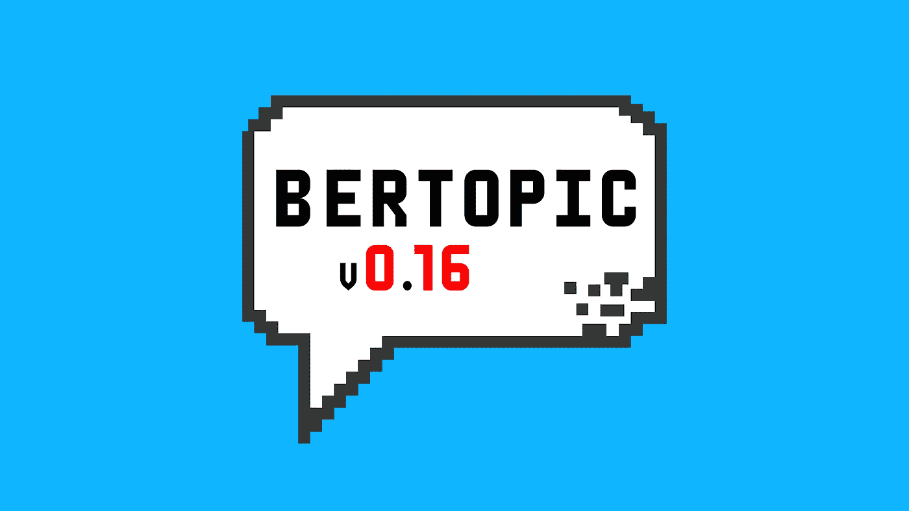
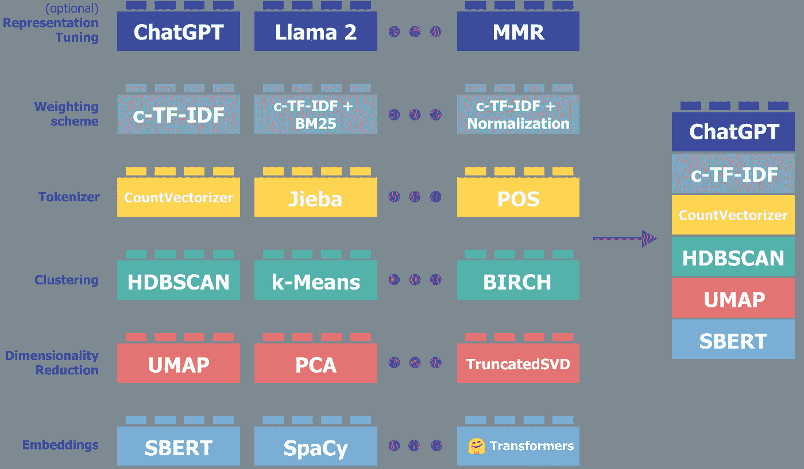
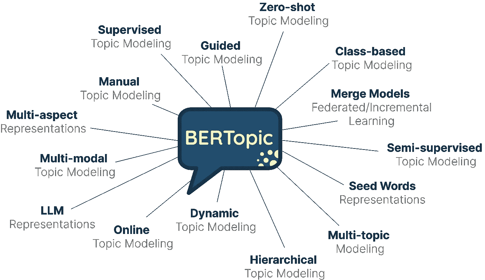

# BERTopic: v0.16 有什么特别之处？

> 原文：[`towardsdatascience.com/bertopic-what-is-so-special-about-v0-16-64d5eb3783d9?source=collection_archive---------2-----------------------#2023-12-13`](https://towardsdatascience.com/bertopic-what-is-so-special-about-v0-16-64d5eb3783d9?source=collection_archive---------2-----------------------#2023-12-13)

## 探索零样本主题建模、模型合并和大语言模型（LLMs）

 [Maarten Grootendorst](https://medium.com/@maartengrootendorst?source=post_page-----64d5eb3783d9--------------------------------)

·

[关注](https://medium.com/m/signin?actionUrl=https%3A%2F%2Fmedium.com%2F_%2Fsubscribe%2Fuser%2F22405c3b2875&operation=register&redirect=https%3A%2F%2Ftowardsdatascience.com%2Fbertopic-what-is-so-special-about-v0-16-64d5eb3783d9&user=Maarten+Grootendorst&userId=22405c3b2875&source=post_page-22405c3b2875----64d5eb3783d9---------------------post_header-----------) 发表在[Towards Data Science](https://towardsdatascience.com/?source=post_page-----64d5eb3783d9--------------------------------) · 8 分钟阅读 · 2023 年 12 月 13 日 

--

我对[BERTopic](https://github.com/MaartenGr/BERTopic)的雄心是通过提供显著的灵活性和模块化，使其成为**一站式服务**的主题建模工具。

这是过去几年的目标，通过[发布 v0.16](https://github.com/MaartenGr/BERTopic/releases/tag/v0.16.0)，我相信我们离实现这一目标更近了一步。

首先，让我们稍微回顾一下。*BERTopic 是什么？*

BERTopic 是一个主题建模框架，它允许用户基本上创建他们自己的主题模型。通过实现多种主题建模变体，它的想法是支持几乎任何使用场景。

BERTopic 的模块化特性允许你以任何方式构建你的主题模型。组件的切换使 BERTopic 能够与语言 AI 的最新发展同步成长。

使用[v0.16](https://github.com/MaartenGr/BERTopic/releases/tag/v0.16.0)版本，实现了若干新特性，我相信这些特性将使 BERTopic 迈上一个新的台阶，即：

+   零样本主题建模

+   模型合并

+   更多大型语言模型（LLM）支持

仅列出 BERTopic 的一些功能。
