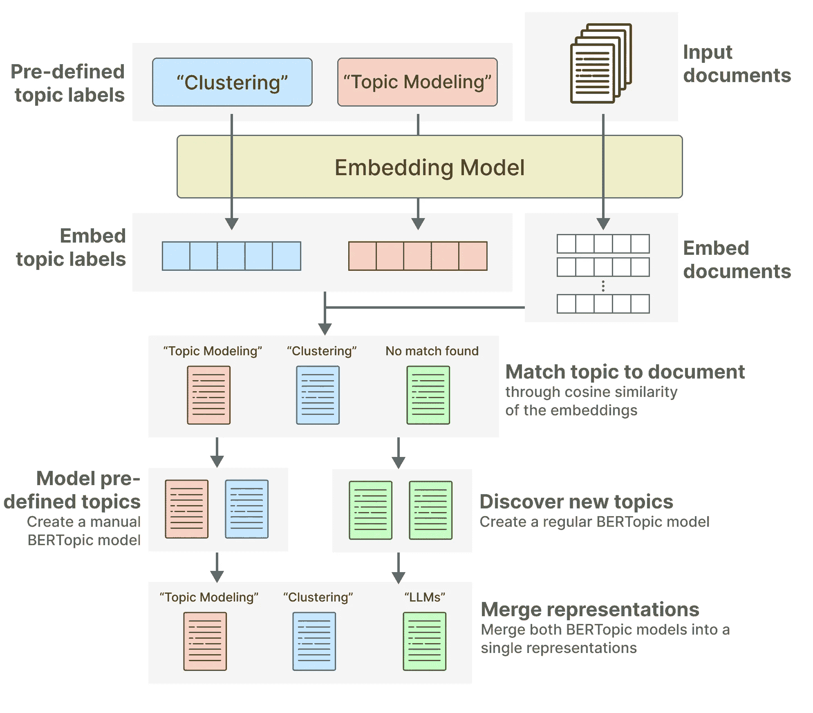
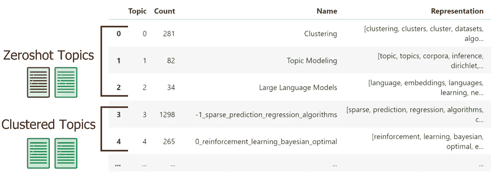
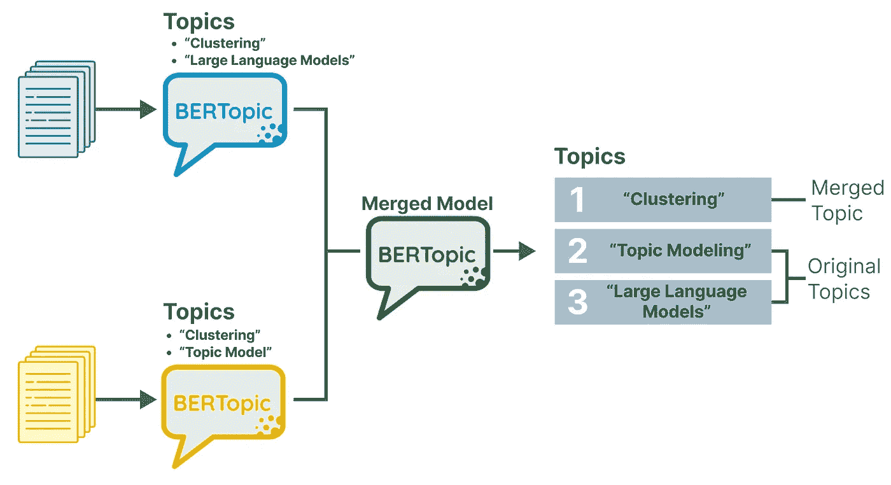
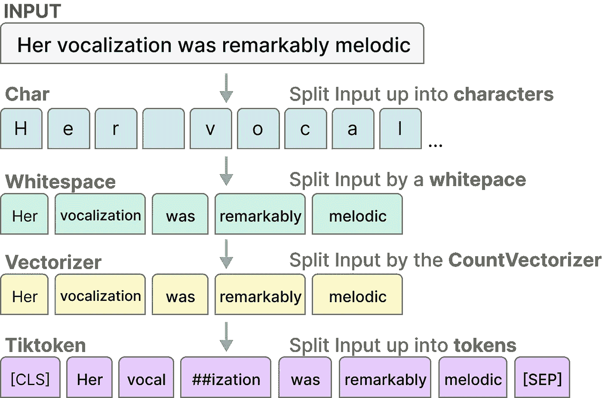
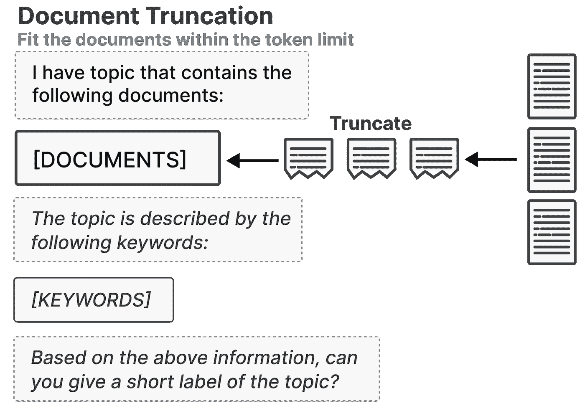

# BERTopic：v0.16 有什么特别之处？

> 原文：[`towardsdatascience.com/bertopic-what-is-so-special-about-v0-16-64d5eb3783d9`](https://towardsdatascience.com/bertopic-what-is-so-special-about-v0-16-64d5eb3783d9)

## 探索零样本主题建模、模型合并和 LLM

[](https://medium.com/@maartengrootendorst?source=post_page-----64d5eb3783d9--------------------------------)[](https://towardsdatascience.com/?source=post_page-----64d5eb3783d9--------------------------------) [Maarten Grootendorst](https://medium.com/@maartengrootendorst?source=post_page-----64d5eb3783d9--------------------------------)

·发布于[Towards Data Science](https://towardsdatascience.com/?source=post_page-----64d5eb3783d9--------------------------------) ·阅读时长 8 分钟·2023 年 12 月 13 日

--


我对[BERTopic](https://github.com/MaartenGr/BERTopic)的愿景是通过提供显著的灵活性和模块化，使其成为**一站式**主题建模解决方案。

这已经是过去几年中的目标，并且随着[v0.16 版本的发布](https://github.com/MaartenGr/BERTopic/releases/tag/v0.16.0)，我相信我们离实现这一目标已经**更进一步**。

首先，让我们稍微回顾一下。*什么是 BERTopic？*

BERTopic 是一个主题建模框架，允许用户基本上创建自己的主题模型版本。由于实现了多种主题建模变体，目标是支持几乎任何用例。


BERTopic 的模块化特性允许你按照自己的方式构建主题模型。通过切换组件，BERTopic 可以随着语言人工智能的最新发展而不断成长。

在[v0.16](https://github.com/MaartenGr/BERTopic/releases/tag/v0.16.0)版本中，实施了几个功能，我相信这些功能将把 BERTopic 带到一个新的水平，即：

+   零样本主题建模

+   模型合并

+   更多的大型语言模型（LLM）支持


仅仅是 BERTopic 的一些功能。

在本教程中，我们将介绍这些特性以及它们可能对哪些用例有帮助。

首先，你可以按照以下步骤安装 BERTopic（包含 HF 数据集）：

```py
pip install bertopic datasets
```

你还可以跟随[Google Colab Notebook](https://colab.research.google.com/drive/113Eg-cq9wUuOuNwXO40Zo3AlMgaW2Go1?usp=sharing)来确保一切按预期工作。

**更新**：我上传了一个 YouTube 视频，更深入地讲解了如何使用这些新特性：

# 零样本主题建模：一种灵活的技术

零-shot 技术通常指的是没有用于训练数据的示例。尽管你知道目标是什么，但它并没有被分配给你的数据。

在 BERTopic 中，我们使用零-shot 主题建模来在大量文档中找到预定义的主题。

想象一下，你有关于机器学习的 ArXiv 摘要，并且你知道“*大型语言模型*”这个主题在其中。通过零-shot 主题建模，你可以让 BERTopic 找到所有与“大型语言模型”相关的文档。

本质上，它不过是语义搜索！但是……有一个很酷的技巧 ;-)

当你试图找到与“大型语言模型”相关的文档时，会有许多文档与这些主题无关。那么，你会如何处理这些主题？你可以使用 BERTopic 来找到所有剩下的主题！



结果是，你将有三种零-shot 主题建模的场景：

+   **未检测到零-shot 主题**。这意味着没有文档符合预定义的主题，因此将运行常规的 BERTopic。

+   **仅检测到零-shot 主题**。在这种情况下，我们不需要寻找额外的主题，因为所有原始文档都已被分配到预定义的主题之一。

+   **检测到零-shot 主题和聚类主题**。这意味着一些文档会符合预定义的主题，而其他文档则不符合。对于后者，发现了新的主题。

使用零-shot BERTopic 非常简单：

```py
from datasets import load_dataset

from bertopic import BERTopic
from bertopic.representation import KeyBERTInspired

# We select a subsample of 5000 abstracts from ArXiv
dataset = load_dataset("CShorten/ML-ArXiv-Papers")["train"]
docs = dataset["abstract"][:5_000]

# We define a number of topics that we know are in the documents
zeroshot_topic_list = ["Clustering", "Topic Modeling", "Large Language Models"]

# We fit our model using the zero-shot topics
# and we define a minimum similarity. For each document,
# if the similarity does not exceed that value, it will be used
# for clustering instead.
topic_model = BERTopic(
    embedding_model="thenlper/gte-small", 
    min_topic_size=15,
    zeroshot_topic_list=zeroshot_topic_list,
    zeroshot_min_similarity=.85,
    representation_model=KeyBERTInspired()
)
topics, probs = topic_model.fit_transform(docs)
```

我们可以查看三个预定义的主题以及几个新发现的主题：

```py
topic_model.get_topic_info()
```



请注意，尽管我们对主题有预定义的名称，但我们允许 BERTopic 进行额外的表示。

这为预定义的主题提供了令人兴奋的新见解！

那么……你什么时候使用零-shot 主题建模？

如果你已经知道数据中的一些主题，这是一个很好的解决方案来找到它们！因为它可以发现预定义的和新的主题，是一种非常灵活的技术。

# 模型合并：联邦学习和增量学习

这是一个有趣的新功能，*模型合并*！

模型合并指的是 BERTopic 将多个预训练的 BERTopic 模型合并为一个大型主题模型的能力。它探索哪些主题应该合并，哪些主题应该保持分开。

它的工作原理如下。当我们将一系列模型传递给这个新功能`.merge_models`时，列表中的第一个模型被选择为基准。这个基准模型用来检查所有其他模型是否包含基于主题嵌入相似性的新的主题。

不同的主题被添加到基准模型中，而相似的主题则被分配到基准主题中。这意味着我们需要嵌入模型是相同的。



在合并 BERTopic 模型时，重复的主题将被合并，所有其他主题将保持不变。

合并预训练的 BERTopic 模型很简单，只需要几行代码：

```py
from bertopic import BERTopic

# Merge 3 pre-trained BERTopic models
merged_model = BERTopic.merge_models(
    [topic_model_1, topic_model_2, topic_model_3]
)
```

就这样！通过一个函数`.merge_models`，你可以合并预训练的 BERTopic 模型。

合并预训练模型的好处在于，它允许多种创造性和有用的应用场景。例如，我们可以用它来：

+   *增量学习* — 我们可以通过迭代合并模型来不断发现新主题。这可以用于问题票证，以快速发现紧迫的错误/问题。

+   *批量学习* — 对于大型数据集，或者当你的硬件资源不足时，计算和内存问题可能会出现。通过将训练过程拆分为更小的模型，我们可以在减少所需计算的同时获得类似的性能。

+   *联邦学习* — 合并模型允许将训练分布在不同的客户端之间，这些客户端不愿分享他们的数据。这增加了数据的隐私和安全，特别是如果使用基于非关键词的方法来生成表示，例如使用[大型语言模型](https://maartengr.github.io/BERTopic/getting_started/representation/llm.html#zephyr-mistral-7b)。

联邦学习相当简单，只需在你的中央服务器上运行`.merge_models`。

另外两个，增量学习和批量学习，可能需要一些示例！

## 增量学习和批量学习

为了执行*增量*和*批量*学习，我们将模拟一个典型的`.partial_fit`管道。在这里，我们将首先训练一个基础模型，然后迭代地添加一个新的小型训练模型。

在每次迭代中，我们可以检查是否有任何主题被添加到基础模型中：

```py
from bertopic import BERTopic
from bertopic.representation import KeyBERTInspired
from datasets import load_dataset

# Prepare documents
all_docs = load_dataset("CShorten/ML-ArXiv-Papers")["train"]["abstract"][:20_000]
doc_chunks = [all_docs[i:i+5000] for i in range(0, len(all_docs), 5000)]

# Base Model
representation_model = KeyBERTInspired()
base_model = BERTopic(representation_model=representation_model, min_topic_size=15).fit(doc_chunks[0])

# Iteratively add small and newly trained models
for docs in doc_chunks[1:]:
    new_model = BERTopic(representation_model=representation_model, min_topic_size=15).fit(docs)
    updated_model = BERTopic.merge_models([base_model, new_model])

    # Let's print the newly discover topics
    nr_new_topics = len(set(updated_model.topics_)) - len(set(base_model.topics_))
    new_topics = list(updated_model.topic_labels_.values())[-nr_new_topics:]
    print("The following topics are newly found:")
    print(f"{new_topics}\n")

    # Update the base model
    base_model = updated_model
```

举例来说，这将返回新发现的主题，例如：

> 以下是新发现的主题：
> 
> [
> 
> ‘50_forecasting_predicting_prediction_stocks’,
> 
> ‘51_activity_activities_accelerometer_accelerometers’,
> 
> ‘57_rnns_deepcare_neural_imputation’
> 
> ]

它保留了原始模型中的所有内容，包括

我们不仅通过将训练过程拆分为多个部分来减少计算量，还可以监控模型中新增的主题。

实际操作中，你可以使用适合你用例的频率来训练新模型。你可以每月、每周，甚至每天检查新主题，只要你有足够的数据。

# 更多大型语言模型支持

尽管我们现在可以在 BERTopic 中使用大型语言模型（LLMs），但 v0.16 版本发布了几个较小的功能，使得使用 LLMs 的体验更加愉快！

总结来说，以下内容被添加了：

+   [*llama-cpp-python*](https://maartengr.github.io/BERTopic/getting_started/representation/llm.html#llamacpp)：使用 llama.cpp 加载任何 GGUF 兼容的 LLM

+   [*截断文档*](https://maartengr.github.io/BERTopic/getting_started/representation/llm.html#truncating-documents)：使用各种技术在传递给任何 LLM 时截断文档。

+   *LangChain*：支持[@joshuasundance-swca](https://github.com/joshuasundance-swca)的 LCEL Runnables

让我们探索前两个功能的简短示例，*llama.cpp* 和 *文档截断*。

当你将文档传递给任何 LLM 模块时，它们可能会超出其令牌限制。相反，我们可以通过定义`tokenizer`和`doc_length`来截断传递给 LLM 的文档。



截断文档时不同的分词方法。

`doc_length`的定义取决于你使用的分词器。例如，100 的值可以指按令牌数或字符数进行截断。



在将文档添加到提示中之前，可以根据分词策略首先对其进行截断。

要将其与`llama-cpp-python`一起使用，我们可以考虑以下示例。首先，我们安装必要的包，准备环境，并下载一个小而强大的模型（[Zephyr-7B](https://huggingface.co/TheBloke/zephyr-7B-alpha-GGUF)）：

```py
pip install llama-cpp-python
CMAKE_ARGS="-DLLAMA_CUBLAS=on" FORCE_CMAKE=1 pip install llama-cpp-python
wget https://huggingface.co/TheBloke/zephyr-7B-alpha-GGUF/resolve/main/zephyr-7b-alpha.Q4_K_M.gguf
```

在 BERTopic 中用`llama-cpp-python`加载 GGUF 模型非常简单：

```py
from bertopic import BERTopic
from bertopic.representation import LlamaCPP

# Use llama.cpp to load in a 4-bit quantized version of Zephyr 7B Alpha
# and truncate each document to 50 words
representation_model = LlamaCPP(
    "zephyr-7b-alpha.Q4_K_M.gguf",
    tokenizer="whitespace",
    doc_length=50
)

# Create our BERTopic model
topic_model = BERTopic(representation_model=representation_model, verbose=True)
```

就这样！我们创建了一个可以截断输入文档并在不受令牌限制约束的情况下创建有趣主题表示的模型。

# 感谢阅读！

如果你和我一样，对*人工智能*和/或*心理学*充满热情，请随时在[**LinkedIn**](https://www.linkedin.com/in/mgrootendorst/)和[**Twitter**](https://twitter.com/MaartenGr)上加我，或订阅我的[**新闻通讯**](http://maartengrootendorst.substack.com/)。你还可以在我的[**个人网站**](https://maartengrootendorst.com/)上找到我的一些内容。

[](https://maartengrootendorst.substack.com/?source=post_page-----64d5eb3783d9--------------------------------) [## 探索语言模型 | Substack

### 撰写关于人工智能、语言模型和心理学交集的内容。

maartengrootendorst.substack.com](https://maartengrootendorst.substack.com/?source=post_page-----64d5eb3783d9--------------------------------)

*所有未注明来源的图像均由作者创建——这意味着所有图像都是如此，我喜欢自己创作图像；)*
