# BERxiT: 适用于 BERT 的早期退出

> 原文：[`towardsdatascience.com/berxit-early-exiting-for-bert-6f76b2f561c5?source=collection_archive---------3-----------------------#2023-01-14`](https://towardsdatascience.com/berxit-early-exiting-for-bert-6f76b2f561c5?source=collection_archive---------3-----------------------#2023-01-14)

## *介绍用于深度神经网络高效推理的“早期退出”方法，并回顾“BERxiT”论文*

 [Oded Mousai](https://medium.com/@odedmous?source=post_page-----6f76b2f561c5--------------------------------)

·

[关注](https://medium.com/m/signin?actionUrl=https%3A%2F%2Fmedium.com%2F_%2Fsubscribe%2Fuser%2Fefb071325af8&operation=register&redirect=https%3A%2F%2Ftowardsdatascience.com%2Fberxit-early-exiting-for-bert-6f76b2f561c5&user=Oded+Mousai&userId=efb071325af8&source=post_page-efb071325af8----6f76b2f561c5---------------------post_header-----------) 发表在 [Towards Data Science](https://towardsdatascience.com/?source=post_page-----6f76b2f561c5--------------------------------) ·11 分钟阅读·2023 年 1 月 14 日

--

作者提供的图片（由 Midjourney 创建）

本文包含两个部分。在**第一部分**，我介绍了提高推理时间效率的动机，并引入了实现这一目标的“早期退出”概念。在**第二部分**，我回顾了有趣的论文“**BERxiT: 通过更好的微调和回归扩展对 BERT 的早期退出**”（Xin, Ji 等）[[1](https://aclanthology.org/2021.eacl-main.8/)]，该论文于 2021 年发表，旨在改进早期退出方法。请注意，这篇论文集中于 NLP 领域（使用 BERT 模型），但这一思想可以很容易地应用于其他领域。

# **第一部分：介绍**

## **推理时间效率的重要性**

深度神经网络（DNN）在过去几年中规模显著增长，导致这些模型的训练和推理时间更长。虽然训练成本最初可能显得较高，但在许多情况下，推理成本实际上更高，因为这些模型通常只训练一次，但会被应用数百万次。

高效的推理也很重要，原因如下：

资源限制：在某些情况下，DNN 部署的设备可能资源有限，比如移动设备。在这些情况下，需要快速的推理时间以确保 DNN 能够高效且有效地运行。

用户体验：在许多应用中，DNN 用于提供对用户请求的实时响应。例如，在语音识别系统中，DNN 必须实时处理和分类用户的语音，以提供准确的转录。如果推理时间过慢，用户体验将会很差。

成本：在某些情况下，运行 DNN 的成本可能取决于推理所需的时间。例如，在云计算环境中，用户可能会根据 DNN 运行的时间来收费。

可持续性：关于 DNN 的能源消耗及其对环境潜在影响的讨论很多（例如，参见 [[2](https://arxiv.org/abs/1906.02243)]、[[3](https://deepai.org/publication/compute-and-energy-consumption-trends-in-deep-learning-inference)] 和 [[4](https://arxiv.org/abs/1907.10597)]），而且快速的推理时间似乎更具能源效率。

## **早期退出方法**

有不同的方法可以提高推理时间的效率 [[5](https://arxiv.org/abs/2209.00099)]。显而易见的方向是减少模型的大小，例如通过剪枝或知识蒸馏方法。然而，由于模型的复杂性通常会提高准确性，这可能会影响模型的性能，并且通常需要在常规训练阶段之外的额外步骤。

另一种方法是“早期退出”方法，这也被 RTJ3 [[6](https://arxiv.org/abs/2004.07453)]、DeeBERT [[7](https://arxiv.org/abs/2004.12993)] 和 FastBERT [[8](https://arxiv.org/abs/2004.02178)] 探索过。早期退出的想法源于观察到样本的难度不一 [[6](https://arxiv.org/abs/2004.07453)]。较长且结构复杂的句子可能需要更多的时间和精力进行分析。考虑以下句子用于情感分析任务：

(1) 餐厅很棒。

(2) 我不确定厨师是否真的有才华，还是食物只是微波加热的冷冻餐。

句子 1 易于分析，因为它短且包含直接的积极语言，表示积极情感。句子 2 更难分析，因为它包含积极和消极的词语，而总体情感是消极的。此外，评论员使用讽刺的语气表达对厨师才华的怀疑，这很难被检测到。

上述观察导致了以下想法：在网络中创建多个决策点，在推理时，让每个样本在网络对其预测有信心的最早点退出。因此，“简单”的样本可能会早早终止，只有“最难”的样本需要通过所有层。这样，网络可以避免执行不必要的计算，从而节省时间和资源。

在 BERT 模型中，这一思想通过在每个 Transformer 层的输出处附加一个小型分类器（除了已经有分类器的最后一层）来实际实现。我称这些分类器为“早期退出组件”。每个分类器的输出是一个概率向量；在这样的向量中，最大概率称为“置信度分数”。在样本的推理时，将每层的置信度分数与预定义阈值进行比较；如果某层的置信度分数大于阈值，则样本以当前预测退出，跳过未来的层。下图展示了这一思想。

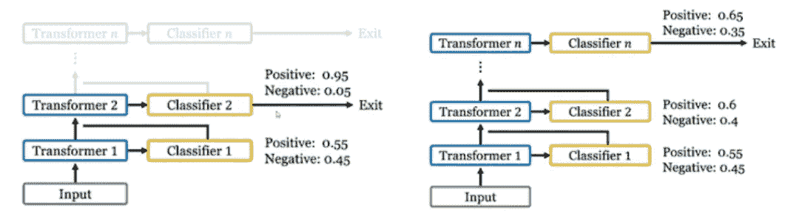

***左图：*** *这里第二层的置信度分数（0.95）大于预定义阈值（0.9），因此样本以“Positive”标签的预测从模型中退出。* ***右图：*** *这里所有层的置信度分数都小于预定义阈值（0.9），因此没有进行早期退出，预测结果是最终分类器的输出。来源：* [*链接*](https://www.virtual2021.eacl.org/paper_main.44.html)

# 第二部分：BERexiT

BERxiT（BERT+exit）论文旨在解决之前工作的两个弱点：

1.  **微调策略 —** 之前的微调策略对于具有早期退出组件的模型并不理想。

1.  **回归任务 —** 之前的工作基于预测概率分布的置信度做出早期退出决策，因此仅限于分类任务。

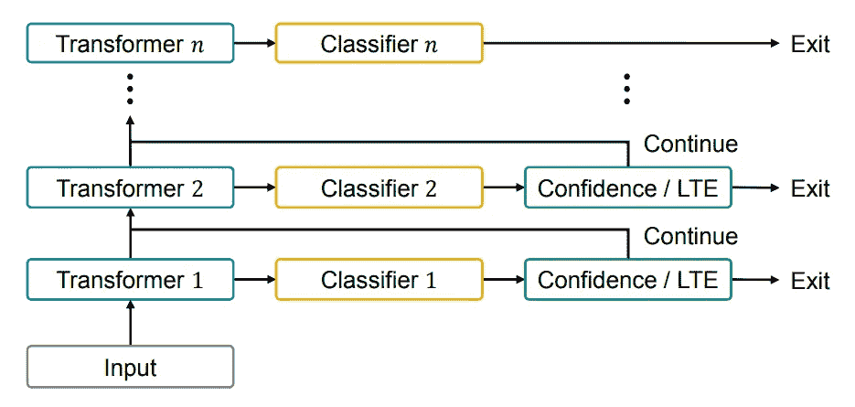

BERxiT 架构。来源：[链接](https://aclanthology.org/2021.eacl-main.8/)

## **1\. 微调策略**

在“常规”神经网络架构中，优化的是单一损失函数。在我们的案例中，为每个 Transformer 层添加了一个早期退出组件，因此存在多个损失项。这对学习过程提出了挑战，因为 Transformer 层必须提供隐藏状态以满足两个竞争的目的：一个是相邻分类器的即时推断，另一个是未来分类器的渐进特征提取。因此，在分类器之间取得平衡至关重要，这也是微调策略的最终目标。

**参数**

在我介绍不同策略之前，让我们了解需要优化哪些参数。第一组参数是主干模型 Transformer 层的参数，用θ₁, …, θₙ表示。它们的工作是为任务学习良好的特征。第二组参数是 N 个分类器的参数。第 i 个分类器的参数用 wᵢ表示。因此，w₁, …, wₙ是前 n-1 个分类器（早期退出组件）的参数，而 wₙ是最后一个分类器的参数。它们的工作是将隐藏状态映射到一组类别的概率分布。

现在让我们深入了解三种微调策略:

+   联合

+   两阶段

+   交替

**联合**

在这种简单策略中，损失函数定义为所有 N 个分类器的损失函数之和，主干模型和所有分类器共同训练。

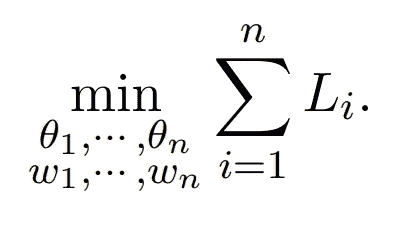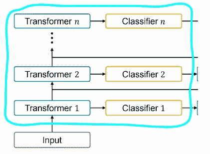

来源: [链接](https://aclanthology.org/2021.eacl-main.8/)

缺点: 联合方法对所有分类器一视同仁，因此无法保持（原始）最终分类器的性能。这并不理想，因为最终分类器必须提供高度准确的输出；在它之后没有其他分类器来处理那些未被早期退出的样本。

**两阶段**

在这种策略中，训练阶段分为两个连续的独立阶段: 在第一阶段，仅训练最终分类器以及主干模型。在第二阶段，仅训练前 N-1 个分类器（而最终分类器和主干模型被冻结）。

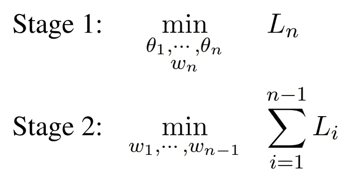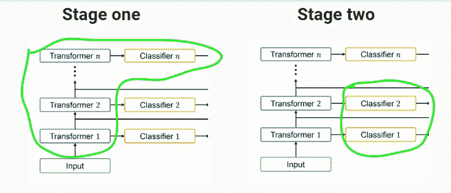

来源: [链接](https://aclanthology.org/2021.eacl-main.8/)

缺点: 这种策略产生了一个具有最佳质量的最终分类器，但以早期分类器为代价，因为主干模型参数（大多数参数）仅为最终分类器进行优化。

**交替**

本文提出了这种策略以克服之前策略的缺点。在该策略中，训练在奇数和偶数轮次之间交替进行不同的目标。在两者中，主干模型都会进行训练，但在奇数轮次中，还训练最终分类器，而在偶数轮次中，还训练前 N-1 个分类器。这样有可能在最终分类器的性能和早期退出组件的性能之间取得平衡。

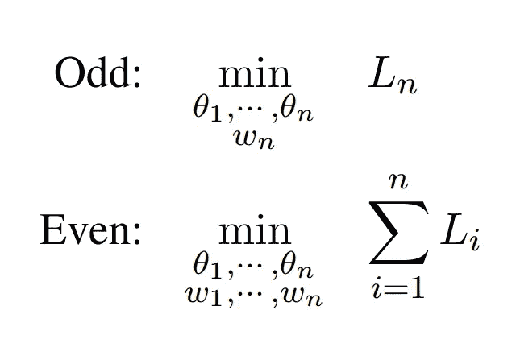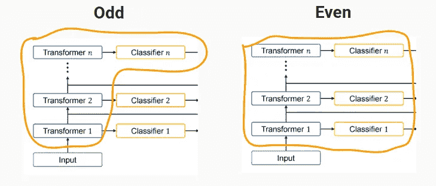

来源：[链接](https://aclanthology.org/2021.eacl-main.8/)

## **2\. 回归任务**

“当模型对其预测有高置信度时停止推理”的方法不能应用于回归任务，因为回归任务输出的是实数而非概率。

为了将这个思路扩展到回归任务，作者建议使用一个对所有层共享的学习退出（LTE）组件。这个组件是一个单层全连接网络，它将某层的隐藏状态作为输入，并输出该层预测的置信得分。因此，在样本的推理时间，如果某层生成的置信得分高于阈值，隐藏状态也会被插入到相邻的回归器中以生成该样本的输出，推理过程则停止。

注意，LTE 是另一个需要训练的参数组件。该组件的损失函数是生成的置信得分 uᵢ与第 i 层的“真实值”置信得分 ũᵢ之间的简单 MSE：Jᵢ = ||uᵢ − ũᵢ||₂²。ũᵢ通过否定预测的绝对误差来估计：ũᵢ = 1- tanh( |gᵢ(hᵢ ;wᵢ) − y| )，其中 y 是真实值，gᵢ(hᵢ ;wᵢ)是第 i 个回归预测值。

LTE 组件通过将 Lᵢ替换为 Lᵢ+Jᵢ（i=1,…,n-1）与模型的其余部分一起训练。

## 实验

本文进行了几个实验。我将回顾其中的三个。

**实验 1：微调策略比较**

第一个实验比较了 3 种微调策略（涵盖 6 种不同的分类任务），通过展示它们的逐层得分曲线来进行比较：曲线中的每一点表示在某一退出层的输出得分，即**所有样本必须在此层退出**以进行评估。注意，这些得分已转换为相对于 BERTᵇᵃˢᵉ基准模型（值为 100%）的相对得分，这是一种不包含早期退出组件的模型。

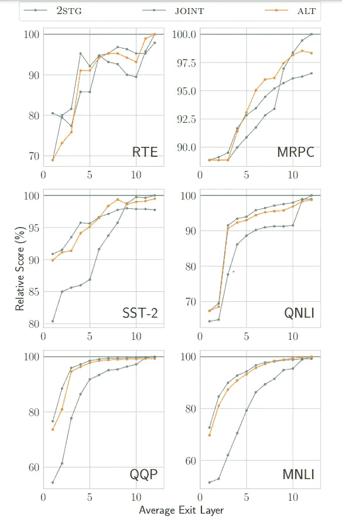

比较了两阶段（2STG）、联合和交替（ALT）微调策略。 来源：[链接](https://aclanthology.org/2021.eacl-main.8/)

从图中得到的几项观察：

+   模型的准确性随着退出层的延迟而提高，这有意义，因为较深的层具有更高的复杂度。

+   两阶段策略在早期层次上表现不佳，这也有意义，因为该策略在现有层次的成本上重度优化了最后的分类器。

+   交替策略在后期层次上优于联合策略，而在早期层次上略显逊色。

结论是交替策略在早期退出组件上提供了良好的结果，同时保持了最终分类器的性能。

**实验 2：质量–效率权衡**

在本实验中使用了几种模型：

+   **Raw** — 没有早期退出组件的 BERTᵇᵃˢᵉ模型（基准）

+   **ALT** — BERTᵇᵃˢᵉ + 早期退出组件，采用交替微调策略

+   **DB** — DistilBERT，使用知识蒸馏方法将 BERTᵇᵃˢᵉ模型缩减为更小的模型

+   **DB+ALT** — DistilBERT + 早期退出组件，采用交替微调策略

这些模型通过两个指标进行了比较，以检查质量–效率权衡：

+   **模型质量指标**：Raw 的准确率得分和其他模型的相对得分（相对于 Raw 模型）。

+   **模型效率指标**：RAW 的层数和其他模型相对节省的层数（相对于 Raw 模型）。对于 ALT 和 DB+ALT 模型，节省的层数通过使用平均退出层计算得出。

实验目标是首先检查所提出模型（ALT）与基准模型（RAW）的质量-效率权衡。其次，检查所提出模型（ALT）是否优于另一种强效的方法（DB）。最后，检查是否通过在 DistilBert 模型（DB）上应用所提出模型（DB+ALT）可以改进 DistilBert 模型（DB）。

注意，与实验 1 相比，此处对早期退出组件（ALT 和 DB+ALT）的模型应用了“常规”推理阶段：测试集样本在某层的置信度分数高于阈值时**可以自由退出**。此外，ALT 中的三行不同是通过调整置信度阈值生成的。

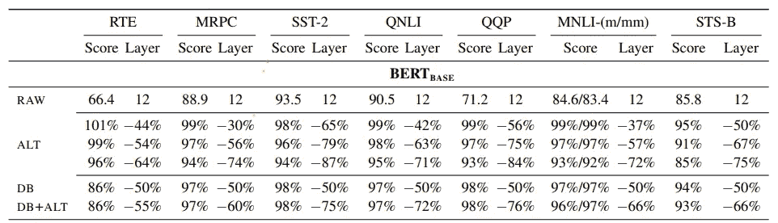

质量–效率权衡。来源：[链接](https://aclanthology.org/2021.eacl-main.8/)

以结果为例：MRPC 数据集上的第一个 ALT 模型平均未使用 30%的层，但仍实现了 RAW 基准模型得分的 99%！降低置信度阈值导致模型效率提高（平均节省 56%和 74%），质量降级合理（分别为 97%和 94%）。

主要观察结果：

+   使用早期退出（配合交替微调）可以减少推理计算，同时仍能获得良好的得分，与没有早期退出组件的基准模型相比。

+   在大多数情况下，交替策略优于 DistilBERT，而 DistilBERT 需要在预训练中进行蒸馏，因此资源需求更高。

+   使用交替策略进一步提高了 DistilBERT 上的模型效率，表明早期退出与其他加速方法是累积的。

**实验 3：回归任务**

在此实验中，将所提出的模型（ALT-LTE）与先前的模型（PABEE）在预测两个句子相似度的任务（STS-B 数据集）上进行了比较。

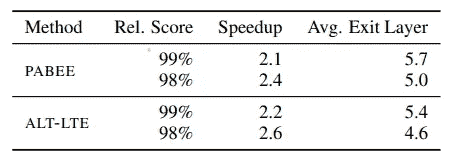

比较 LTE 与 PABEE 在 STS-B 上的表现。来源：[链接](https://aclanthology.org/2021.eacl-main.8/)

如图所示，ALT-LTE 在推理时间上取得了相同的分数。

## **结论**

+   快速推理时间对于部署在资源受限设备上的深度神经网络（DNN）至关重要，这不仅是为了向用户请求提供实时响应，还涉及到成本和可持续性问题。通过允许样本在网络中的不同深度退出，“早期退出”方法提高了推理时间，可能使许多“较容易”的样本提前退出，从而避免不必要的计算，同时保持准确性。

+   BERxiT 论文通过提出交替微调策略改进了这一方法，其目标是在最终分类器的性能与早期退出组件的性能之间取得平衡。此外，BERxiT 通过提出学习退出（LTE）组件，将早期退出方法扩展到回归任务，该组件学习输出置信度分数。

+   实验结果表明，交替策略在质量-效率权衡上表现更佳，LTE 组件在回归任务中确实有效，并且早期退出方法可以与其他加速方法结合使用。

## **参考文献**

[1] Xin, J., Tang, R., Yu, Y., & Lin, J.J. (2021). [BERxiT：BERT 的早期退出，改进微调及扩展至回归任务](https://www.semanticscholar.org/paper/BERxiT%3A-Early-Exiting-for-BERT-with-Better-and-to-Xin-Tang/7b37c0a4976c4d2a5a440d494fbb0f3daede2a00). *欧洲计算语言学协会会议*。

[2] Strubell, E., Ganesh, A., & McCallum, A. (2019). [自然语言处理中的深度学习的能耗与政策考虑](https://www.semanticscholar.org/paper/Energy-and-Policy-Considerations-for-Deep-Learning-Strubell-Ganesh/d6a083dad7114f3a39adc65c09bfbb6cf3fee9ea). *ArXiv, abs/1906.02243*。

[3] Desislavov, R., Mart’inez-Plumed, F., & Hern’andez-Orallo, J. (2021). [深度学习推理中的计算和能耗趋势](https://www.semanticscholar.org/paper/Compute-and-Energy-Consumption-Trends-in-Deep-Desislavov-Mart'inez-Plumed/01ce9f7d1c35e88f6ab3abe51bf1e1370da718b5). *ArXiv, abs/2109.05472*。

[4] Schwartz, R., Dodge, J., Smith, N., & Etzioni, O. (2019). [绿色人工智能](https://www.semanticscholar.org/paper/Green-AI-Schwartz-Dodge/fb73b93de3734a996829caf31e4310e0054e9c6b). *ACM 通讯，63*, 54–63。

[5] Treviso, M.V., Ji, T., Lee, J., van Aken, B., Cao, Q., Ciosici, M.R., Hassid, M., Heafield, K., Hooker, S., Martins, P.H., Martins, A., Milder, P., Raffel, C., Simpson, E., Slonim, N., Balasubramanian, N., Derczynski, L., & Schwartz, R. (2022). [自然语言处理的高效方法：综述](https://arxiv.org/abs/2209.00099)。*ArXiv, abs/2209.00099*。

[6] Schwartz, R., Stanovsky, G., Swayamdipta, S., Dodge, J., & Smith, N.A. (2020). [合适的工具：模型与实例复杂度的匹配](https://arxiv.org/abs/2004.07453)。*计算语言学协会年会*。

[7] Xin, J., Tang, R., Lee, J., Yu, Y., & Lin, J.J. (2020). [DeeBERT：加速 BERT 推理的动态早期退出](https://arxiv.org/abs/2004.12993)。*计算语言学协会年会*。

[8] Liu, W., Zhou, P., Zhao, Z., Wang, Z., Deng, H., & Ju, Q. (2020). [FastBERT：一种自我蒸馏的 BERT 与自适应推理时间](https://arxiv.org/abs/2004.02178)。*计算语言学协会年会*。
