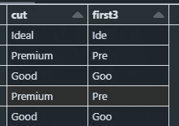

# PySpark 中最好的数据整理函数

> 原文：[`towardsdatascience.com/best-data-wrangling-functions-in-pyspark-3e903727319e`](https://towardsdatascience.com/best-data-wrangling-functions-in-pyspark-3e903727319e)

## 学习在处理大数据时使用 PySpark 的最有用函数

[](https://gustavorsantos.medium.com/?source=post_page-----3e903727319e--------------------------------)[](https://towardsdatascience.com/?source=post_page-----3e903727319e--------------------------------) [Gustavo Santos](https://gustavorsantos.medium.com/?source=post_page-----3e903727319e--------------------------------)

·发布于 [Towards Data Science](https://towardsdatascience.com/?source=post_page-----3e903727319e--------------------------------) ·阅读时长 7 分钟·2023 年 12 月 12 日

--


图片由 [Oskar Yildiz](https://unsplash.com/@oskaryil?utm_content=creditCopyText&utm_medium=referral&utm_source=unsplash) 提供，来源于 [Unsplash](https://unsplash.com/photos/turned-on-gray-laptop-computer-cOkpTiJMGzA?utm_content=creditCopyText&utm_medium=referral&utm_source=unsplash)。

# 介绍

我每天在 Databricks 中使用 PySpark。作为一名数据科学家，我的工作需要处理许多不同表中的大量数据。这是一份充满挑战的工作。

尽管 **提取、转换和加载 (ETL)** 过程听起来很简单，但我可以说它并不总是如此。当我们处理大数据时，我们的思维需要因两个原因而改变：

1.  这些数据的规模远远大于常规数据集。

1.  在集群中进行并行计算时，我们必须考虑到数据会被分割到许多工作节点中，以执行部分工作，然后再合并为整体。并且这一过程，很多时候，如果查询过于复杂，可能会非常耗时。

知道这一点后，我们必须学习如何为大数据编写智能查询。在这篇文章中，我将展示一些我最喜欢的来自模块 `pyspark.sql.functions` 的函数，旨在帮助你在 PySpark 中进行数据整理。

# 最佳函数

现在，让我们继续讨论这篇文章的内容。

就像许多其他语言一样，PySpark 的模块也提供了许多现成的函数，适用于各种不同的目的。这里是我们将加载到会话中的模块：

```py
from pyspark.sql import functions as F
```

如果你想查看`pyspark.sql.functions`中函数的扩展列表，[请访问这个网站](https://spark.apache.org/docs/latest/api/python/reference/pyspark.sql/functions.html)，在那里有 API 参考。请注意，这适用于 3.5.0 版本。一些旧版本可能不包含我将在这篇文章中展示的所有函数。

## 数据集

用作示例的数据集是*Diamonds*，来自 ggplot2，依据[MIT 许可证](https://tidyverse.tidyverse.org/LICENSE.html)共享。

```py
# Point file path
path = '/databricks-datasets/Rdatasets/data-001/csv/ggplot2/diamonds.csv'

# Load Data
df = spark.read.csv(path, header=True, inferSchema= True)
```

## 创建索引列

对于那些在 Python 中使用 Pandas 的人来说，刚开始处理没有索引的数据框时会觉得很奇怪。因此，如果我们想要添加一个索引列，可以使用函数`monotonically_increasing_id()`。计数从 0 开始。因此，如果我们想从 1 开始，只需在函数后加上`+1`。

```py
# Add an increasing ID column starting in 1
display(
    df
    .limit(100)
    .withColumn('ID', F.monotonically_increasing_id()+1 )
)
```

## 总和、均值、最大值、最小值

经典的数学函数肯定会出现在这个列表中。无论何种情况都很有用。

```py
display(
    df
    .groupBy('cut')
    .agg( F.sum('price').alias('total'),
          F.mean('price').alias('avg_price'),
          F.min('price').alias('min_price'),
          F.max('price').alias('max_price') )
)
```

## 计数和计数不同

计数值和了解数据中有多少个不同值也是很重要的。

```py
display(
    df
    .groupBy('cut')
    .agg( F.count('cut').alias('n_count'), #count of obervations
          F.countDistinct('price').alias('distinct') ) #distinct n prices
)
```

## 字面值

函数`lit()`允许你为数据中的每一行写入一个字面值。

```py
display(
    df #dataset
    .limit(10) #only 10 rows
    .withColumn('literal', F.lit('my text or number')) #add column with literal value
)
```


lit(‘my text or number’). 图片由作者提供。

## 向下取整、向上取整和百分位数

一些在处理数据时非常有用的数学函数是`floor`——向下取整的整数——和`ceiling`——向上取整的整数。

```py
display(
    df
    .limit(10)
    .select('x')
    .withColumn('floor', F.floor('x') )
    .withColumn('ceiling', F.ceiling('x') )
)
```


向上取整和向下取整。图片由作者提供。

现在百分位数特别有用，尤其是用于计算中位数。直到不久前，我记得我在计算中位数时遇到过错误。现在我发现它在版本 3.5.0 中已经存在。最好的解决方法是使用`percentile()`在 50%处计算。

```py
display(
    df
    .groupBy('cut')
    .agg( F.median('price').alias('median'),
          F.percentile('price', 0.5).alias('50th pct'))
)
```


## 描述性统计

尽管`describe()`不在`sql.functions`模块中，但它也适用于那些熟悉 Pandas 的人。它提供了数据集的描述性统计信息。这里提供的数字有：计数、均值、标准差、最小值和最大值。

```py
# Descriptive Stats

display(
  df
  .describe()
)
```

结果如下：


describe()函数的结果。图片由作者提供。

## 对数

作为数据科学家，我们常常使用对数函数。特别是在进行线性回归时，它是变量标准化的辅助工具。

```py
# Calculating different Logs of 'price'
display(
    df
    .select( F.ln('price').alias('Ln'),
            F.log1p('price').alias('Log1p'),
            F.log10('price').alias('Log10'))
)
```


对数变量已计算。图片由作者提供。

## 数组聚合

`array_agg`是一个很好的函数，用于获取一个组的值并将其列出在新列中。假设我们想按切割质量对钻石进行分组，并查看列出的价格。以下代码片段执行了这个操作。

```py
# Get the aggregated values and list them in a new variable
display(
    df.limit(50)
    .groupBy('cut')
    .agg( F.array_agg('price'))
)
```


按组列出值。图片由作者提供。

## 计数 IF

我敢打赌，如果你使用过 MS Excel，这听起来很熟悉，对吧？想法是一样的。如果我们想要计算在分组后价格超过 18,000 美元的钻石数量，可以使用这个函数。看看吧。

```py
display(
    df
    .groupBy('cut')
    .agg( F.count_if( col('price') > 18000))
)
```

我们有更多的*理想*和*优质*切工，价格昂贵，几乎没有*公平*。


计数操作。图片来自作者。

## 众数

变量的众数是最常见的值。现在我们想知道每种切工质量的最常见克拉数是什么。

```py
# Most common value
display(
    df
    .groupBy('cut')
    .agg( F.mode( 'carat' ).alias('mode') )
)
```

## 回归函数

这些函数非常有趣。我们可以快速计算线性回归指标，如 R 平方值、截距、斜率，使用这些函数：`regr_r2`、`regr_intercept`、`regr_slope`、`regr_avgx`。

在下一段代码中，我们将计算每组的回归 R 平方值和公式。

```py
# Remember that the regression formula is y = a + b*x
(
    df
    .groupBy('cut')
    .agg( F.regr_r2( 'price', 'carat').alias('regression_r2'),
         F.lit('y ='),
         F.regr_intercept( 'price', 'carat').alias('intercept'),
         F.lit('+'),
         F.regr_slope( 'price', 'carat').alias('reg_slope'),
         F.lit('*'),
         F.regr_avgx( 'price', 'carat').alias('avg_x')    )

).show()
```

这非常酷！*理想*切工（最佳质量）具有最高的 R²，而*公平*切工（最低质量）具有最低的 R²。这是有道理的。


按组回归。图片来自作者。

## 正则表达式

是的，*正则表达式*无处不在。我看到很多人对那些漂亮的表达式翻白眼，但它是一个很棒的工具。想象一下，你可以使用这些表达式从文本中提取几乎任何东西。一开始可能会很困难且曲折，但一旦你了解得更多，你会开始喜欢它们。PySpark 的函数中也有这些。

在这里，我使用`regexp()`与文字文本`lit`结合，检查变量`clarity`中是否有数字。下一行是函数`locate`，用于定位在同一变量中字母‘S’首次出现的位置。

```py
# Using Regular Expessions
display(
    df
    .select( 'clarity',
            F.regexp('clarity', F.lit(r'(\d+)')),
            F.locate('S', 'clarity', 1) )
)
```


文本解析函数。图片来自作者。

## 文本解析

关于文本解析，我们可以使用`split()`将文本拆分成部分。在下一段代码中，我将`carat`列转换为文本，并按`.`拆分。所以像 0.23 这样的数字变成了[“0”， “23”]。然后，我只需使用切片表示法将结果放在不同的列中。

```py
 display( df
        .select( col('carat').cast('string'))
        .select( F.split('carat', '\.')[0],
                 F.split('carat', '\.')[1] ) 
        )
```


拆分函数结果。图片来自作者。

另一种解析可能性是函数`left`，类似于 MS Excel。你有一列文本，希望只获取其中的 N 个字符。只需使用`left`与`lit`组合。

```py
display( df
        .select('cut')
        .withColumn('first3', F.left('cut', F.lit(3)))
        )
```



左侧函数结果。图片来自作者。

# 在你离开之前

数据处理是一门艺术。不管是使用 PySpark、R 还是 Python，你总是需要最好的函数来实现你的转换。在这里，我列出了`pyspark.sql.functions`模块中的一些函数。我建议你访问文档页面，创建你自己最好的函数列表。

我最好的数据转换建议是：

+   知道你的最终结果应该是什么样的。

+   从那里，你可以将过程拆分成更小的步骤，以实现目标。

我在职业生涯初期学习到这一点，当时我经常使用 Excel 表格。当我不知道如何写一个复杂的公式时，我会在不同的单元格中写出较小的部分，直到得到期望的结果。然后，只需将这些部分汇总在一起，就能作为一个公式使用。

同样的原则适用于编程。创建你的策略时要以最终目标为导向，并按步骤进行（如有需要）。就是这样。

如果你喜欢这内容，可以关注我的博客获取更多信息，并订阅我的通讯。

[## Gustavo Santos - Medium](https://medium.com/@gustavorsantos?source=post_page-----3e903727319e--------------------------------)

### 在 Medium 上阅读 Gustavo Santos 的文章。数据科学家。我从数据中提取洞察，以帮助人们和公司……

[medium.com](https://medium.com/@gustavorsantos?source=post_page-----3e903727319e--------------------------------)

也可以在 [LinkedIn](https://www.linkedin.com/in/gurezende/) 上找到我。

## 有兴趣深入了解 PySpark 吗？

我刚刚发布了我的新在线课程 [**在 Databrick 中掌握 PySpark 数据处理**](https://www.udemy.com/course/master-data-processing-pyspark/?referralCode=44AA924FEB5260F5EB25)。这是一个很好的机会，让你提升技能，深入了解大数据处理！

我提供了 [**这场免费的网络研讨会，其中包含了我关于如何更快编写 PySpark 查询的顶级技巧**](https://www.gustavorsantos.com/webinar-funnel-3-cf-2-0--71744)。查看一下，你会发现里面有一个特别的首发优惠券！

# 参考资料

[## Functions - PySpark 3.5.0 documentation](https://www.udemy.com/course/master-data-processing-pyspark/?referralCode=44AA924FEB5260F5EB25)

### `pyspark.sql.SparkSession.builder.getOrCreate`

[spark.apache.org](https://spark.apache.org/docs/latest/api/python/reference/pyspark.sql/functions.html?source=post_page-----3e903727319e--------------------------------)
