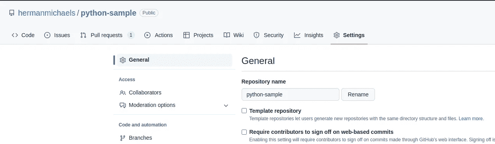

# Python 开发的最佳实践

> 原文：[`towardsdatascience.com/best-practices-for-python-development-bf74c2880f87`](https://towardsdatascience.com/best-practices-for-python-development-bf74c2880f87)

## 设置和使用专业的 Python 仓库

[](https://medium.com/@hrmnmichaels?source=post_page-----bf74c2880f87--------------------------------)[](https://towardsdatascience.com/?source=post_page-----bf74c2880f87--------------------------------) [Oliver S](https://medium.com/@hrmnmichaels?source=post_page-----bf74c2880f87--------------------------------)

·发表于[Towards Data Science](https://towardsdatascience.com/?source=post_page-----bf74c2880f87--------------------------------) ·8 分钟阅读·2023 年 2 月 8 日

--


图片由[Christina @ wocintechchat.com](https://unsplash.com/@wocintechchat?utm_source=unsplash&utm_medium=referral&utm_content=creditCopyText)拍摄，发布于[Unsplash](https://unsplash.com/photos/EkeThvO9VfM?utm_source=unsplash&utm_medium=referral&utm_content=creditCopyText)

本文的目标是分享 Python 开发的最佳实践——特别是如何设置、使用和管理 Github 仓库，遵循专业的行业标准。我们将讨论有用的工具，以保持代码整洁且无错误，展示如何设置仓库并包括之前介绍的用于自动 CI（持续集成）检查的工具——最后将所有这些结合在一个示例项目中。请注意，我并不声称这个列表是完整的或唯一的方法。然而，我希望分享我作为软件工程师的专业经验，并确认许多大型软件公司遵循类似的模式。

话虽如此，让我们直接进入重点——希望你觉得这个有用！你可以在[这里](https://github.com/hermanmichaels/python-sample)找到这篇文章的完整代码，并在我们进行时跟随操作。

# 使用的工具

在本节中，我们将介绍本文使用的工具。

## poetry

Poetry 是一个很棒的工具来管理 Python 版本和依赖关系。它使得控制和修复 Python 版本，以及集中管理依赖关系变得简单。在所有这些方法中，我推荐使用 poetry。我在另一篇文章中写了[更详细的介绍](https://medium.com/@hrmnmichaels/dependency-management-with-poetry-f1d598591161)，但在这里会总结要点。

Poetry 的依赖管理核心是`pyproject.toml`文件。对于我们的项目，它如下所示：

```py
[tool.poetry]
name = "Sample Python Project"
version = "0.1.0"
description = "Sample Python repository"
authors = ["hermanmichaels <hrmnmichaels@gmail.com>"]

[tool.poetry.dependencies]
python = "3.10"
matplotlib = "3.5.1"
mypy = "0.910"
numpy = "1.22.3"
pytest = "7.1.2"
black = "22.3.0"
flake8 = "4.0.1"
isort = "⁵.10.1"
```

我们可以看到一个定义并公开某些项目属性的标题，接着是一段定义所需依赖的文字。

作为“用户”，我们只需在终端中执行 `poetry install`，poetry 将自动创建一个安装了所有依赖项的 Python 环境。然后我们可以通过 `poetry shell` 进入这个环境。

开发者在添加新依赖后，运行 `poetry update`。这将生成或更新 `poetry.lock` 文件，你可以将其视为上述指定依赖项的二进制表示。这个文件也需要被添加到仓库中——而上述安装要求的过程实际上使用了这个文件。

## isort

[PEP 8](https://peps.python.org/pep-0008/)，Python 的风格指南，也定义了 [如何排序导入](https://peps.python.org/pep-0008/#imports)。建议创建以下几组：

1.  标准库导入（例如 `os`、`sys`）

1.  相关的第三方导入（例如 `numpy`）

1.  本地、项目特定的导入（例如，项目的不同文件）

在这些组内，导入应按字母顺序排序。

[isort](https://pycqa.github.io/isort/) 是一个工具，它消除了我们记住和执行这些操作的必要性。方便的是，isort 和接下来章节中介绍的大多数工具都与 poetry 很好地配合使用，我们甚至在 `pyproject.toml` 文件中设置了它们的配置。对于我们的用例，我们设置了以下内容：

```py
[tool.isort]
profile = "black"
py_version = 310
multi_line_output = 3
```

除了 Python 版本，我们告诉 isort 我们将使用格式化工具 black（见下一节），并定义如何处理过长的导入行，参考 [re-formatted](https://pycqa.github.io/isort/docs/configuration/multi_line_output_modes.html)。

## black

[black](https://black.readthedocs.io/en/stable/) 是一个 Python 代码格式化工具。运行它会根据特定的约定格式化代码。通过让所有开发者使用它，我们强制执行一种特定的、统一的代码风格。考虑一下行缩进、函数后的空行数量等。

设置也由 poetry 管理，我们简单设置：

```py
[tool.black]
line-length = 80
target_version = ["py310"]
```

即最大行长度为 80，以及目标 Python 版本。

## flake8

[flake8](https://flake8.pycqa.org/en/latest/) 是一个代码检查工具。代码检查工具和代码格式化工具密切相关，然而，检查工具检查特定风格和指南的遵循情况，但不进行格式化。flake8 做了几件事，其中之一是检查是否符合前述的 PEP 8 标准。

## mypy

[mypy](https://mypy.readthedocs.io/en/stable/) 是一个用于 Python 的静态类型检查器。正如你（很可能）知道的那样，Python 是一种 [动态类型语言](https://en.wikipedia.org/wiki/Type_system#DYNAMIC)，意味着变量类型是在运行时推断的（与 C++等语言相对）。这种灵活性我们都喜欢，但也有缺点，比如更高的出错概率，没有编译器或类似的东西作为第一道防线。因此，近年来许多努力实际上都集中在使 Python 中的类型检查更严格。 `mypy` 就是这样的一个类型检查器，它会检查你的代码，看你是否正确使用了变量。大部分工作是自动的，不过你也可以通过注解使某些类型显式（这对于函数参数和返回类型的可见性是推荐的）。

我们可以如下注解函数参数和返回类型：

```py
def foo(x: int, y: int) -> int:
    return x + y
```

如果我们尝试使用错误的参数调用函数，`mypy` 会提出警告，例如：

```py
foo("a", "b")
```

我们在单独的 `mypy.ini` 文件中管理 `mypy` 设置。这主要是因为一些外部依赖不能进行类型检查，我们需要将它们排除在检查之外（尽管我们可以修复一些）。

## pytest

单元测试对任何稍微专业的软件项目都是必不可少的，并且推荐所有人使用。我们将使用 [pytest](https://docs.pytest.org/en/7.2.x/)，这是许多 Python 开发者的首选。我在另一篇文章中写了一个 [更详细的介绍](https://medium.com/@hrmnmichaels/unit-testing-with-pytest-5c59cdf89529)，有一些后续内容，所以如果你不熟悉它的话，可以参考那里（或者当然是其他任何优秀的教程！）。

单元测试帮助我们发现错误，从而保持代码质量在高水平。

## Github Actions

[Github Actions](https://docs.github.com/en/actions) 允许自动化和运行仓库中的某些步骤——所有这些都是为了持续集成的精神。通过它们，我们可以创建在特定事件（如拉取请求（PRs））下运行的工作流。我们将在这里使用的工作流实际上是上述介绍的工具的积累——即每当有 PR 打开时，它会运行格式化、检查、类型检查和单元测试等操作，我们期望在合并之前所有这些都能通过——从而保护我们的主分支不被提交任何不干净或有缺陷的代码！

对于这个主题，我想参考我之前的一篇 [文章](https://medium.com/gitconnected/introduction-to-github-actions-e742b5370bfa) 来进行介绍。

# 配置仓库

本文不会介绍版本控制系统或从头设置 Github 仓库。相反，期望读者有一些基本知识，我建议参考任何其他教程，例如 [官方 Github 教程](https://docs.github.com/en/get-started/quickstart/hello-world)。这里我们只讨论 Git 中的设置，基本上任何专业的软件仓库都会有这些设置。

从广义上讲，这只有一个：保护主分支。我们不希望任何人未经检查就推送到这里，特别是需要两件事：其他开发者的审批和我们建立的 CI 测试的通过。为此，请转到你的代码库，选择“设置”，然后选择“分支”：



作者截图

然后为你的主分支添加分支保护规则，并启用：

+   合并前要求进行拉取请求

+   需要审批（然后你可以选择必要的审批数量）

+   在合并之前要求状态检查通过

# 综合起来

这介绍了所有需要的主题。现在我们将把它们结合起来，设置一个示例代码库，并展示每个开发者应遵循的工作流。

## 示例项目

我们的示例项目将有一个`utils`文件夹，包含`math_utils.py`和一个相关的单元测试文件（`math_utils_test.py`）。在`math_utils`中，我们将重新实现一个幂函数以示范：

```py
import numpy.typing as npt

def exponentiate(base: int, exponent: npt.NDArray) -> npt.NDArray:
    return base**exponent
```

因此，`exponentiate(2, [1, 2, 3])`将返回`[2, 4, 8]`。

我们在测试文件中测试函数的正确性：

```py
import numpy as np
import numpy.typing as npt
import pytest

from utils.math_utils import exponentiate

@pytest.mark.parametrize(
    "base, exponent, expected",
    [
        (2, np.zeros(3), np.ones(3)),
        (2, np.linspace(1, 4, 4), np.asarray([2, 4, 8, 16])),
    ],
)
def test_exponentiate(base: int, exponent: npt.NDArray, expected: npt.NDArray) -> None:
    assert np.allclose(exponentiate(base, exponent), expected)
```

在我们的主文件（`main.py`）中，我们将使用它生成前 10 个 2 的幂，并使用`matplotlib`绘制：

```py
import matplotlib.pyplot as plt
import numpy as np

from utils.math_utils import exponentiate

def main() -> None:
    x = np.linspace(0, 10, 10)
    y = exponentiate(2, x)
    plt.plot(x, y, "ro")
    plt.savefig("plot.png")

if __name__ == "__main__":
    main()
```

这个项目的`pyproject.toml`文件如下：

```py
[tool.poetry]
name = "Sample Python Project"
version = "0.1.0"
description = "Sample Python repository"
authors = ["hermanmichaels <hrmnmichaels@gmail.com>"]

[tool.poetry.dependencies]
python = "3.10"
matplotlib = "3.5.1"
mypy = "0.910"
numpy = "1.22.3"
pytest = "7.1.2"
black = "22.3.0"
flake8 = "4.0.1"
isort = "⁵.10.1"

[tool.poetry.dev-dependencies]

[tool.black]
line-length = 80
target_version = ["py310"]

[tool.isort]
profile = "black"
py_version = 310
multi_line_output = 3
```

此外，我们将`matplotlib`排除在 mypy 检查之外，以防止错误，通过生成以下`mypy.ini`文件：

```py
[mypy]
python_version = 3.10

[mypy-matplotlib.*]
ignore_missing_imports = True
ignore_errors = True
```

## Github 工作流

然后我们定义以下 Github Actions 工作流：

```py
name: Sample CI Check

on:
  pull_request:
    branches: [main]
  push:
    branches: [main]

permissions:
  contents: read

jobs:
  build:
    runs-on: ubuntu-20.04

    steps:
      - uses: actions/checkout@v3

      - name: Set up Python 3.10.0
        uses: actions/setup-python@v3
        with:
          python-version: "3.10.0"

      - name: Install poetry dependencies
        run: |
          curl -sSL https://install.python-poetry.org | python3 -
          poetry install

      - name: Sort imports with isort
        run: poetry run python -m isort .

      - name: Format with black
        run: poetry run python -m black .

      - name: Lint with flake8
        run: poetry run python -m flake8 .

      - name: Check types with mypy
        run: poetry run python -m mypy .

      - name: Run unit tests
        run: poetry run python -m py.test
```

因此，这个工作流在每个新的 PR 和每个合并到主分支的 PR 时运行。

它包括以下步骤：

+   它检查出代码库。

+   它安装了 Python 3.10。

+   它安装了 poetry，并安装了我们的依赖项。

+   然后它运行我们安装的所有检查（注意`poetry run X`与通过`poetry shell`进入诗歌环境后执行`X`是相同的）。特别地，包括：通过 isort 排序导入，使用 black 格式化代码，使用 flake8 进行 lint 检查，使用 mypy 检查类型，以及运行 pytest。

## 本地开发者工作流

现在我们描述每个开发者应偶尔执行的工作流，尤其是在提交 PR 之前（对“工作流”的过度使用表示歉意——在上面的部分中表示 Github 概念的分组步骤，而这里仅仅描述开发者执行的步骤列表）。

实质上，我们不想依赖 CI 来发现所有错误，而是尽可能将 PR 推送为“干净”的：这意味着在推送之前，在本地运行 CI 上运行的所有步骤。这通过以下方式实现：

+   运行 isort 以排序导入：`isort .`

+   运行 black 以格式化代码：`black .`

+   运行 flake8 检查代码：`python -m flake8`

+   运行 mypy 进行类型检查：`mypy .`（注意第一次运行可能需要相当长的时间）

+   运行所有单元测试：`python -m pytest`

# 结论

在这篇文章中，我们介绍了一些有用的工具，帮助管理、组织和保持 Python 代码的良好状态，并符合专业标准。接着，我们展示了如何设置一个 Git 仓库进行版本控制和代码共享，特别是如何在 CI 中使用之前介绍的工具：即运行某些检查以防止任何不干净或有缺陷的提交到主分支。最后，我们展示了开发人员如何先在本地运行所有这些工具，以最小化 CI 失败的风险。

我希望这篇文章对你未来的私人和专业项目有所帮助。如果你或你的公司正在使用一些很棒的工具，或者觉得我遗漏了什么，请告诉我。感谢阅读！
