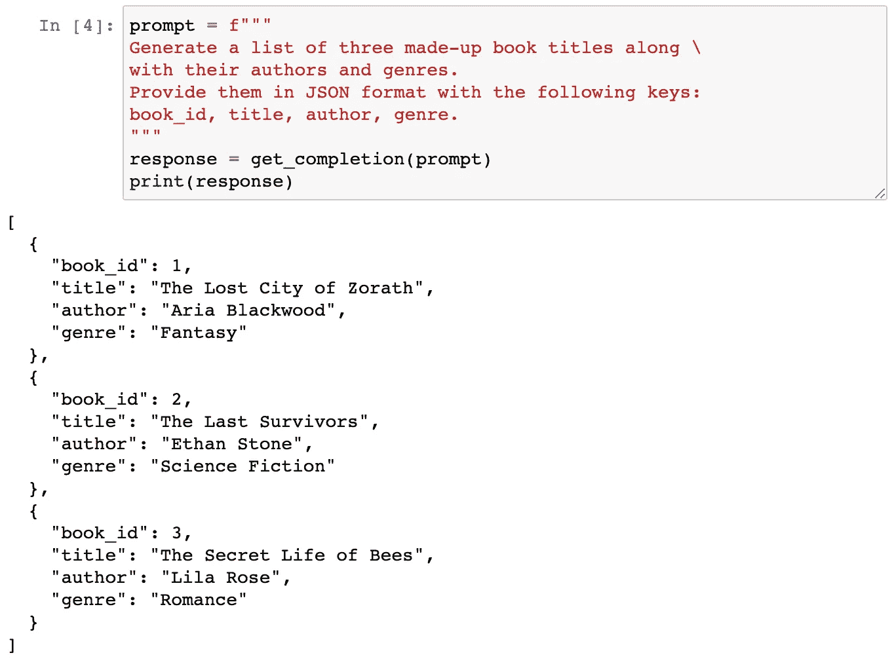
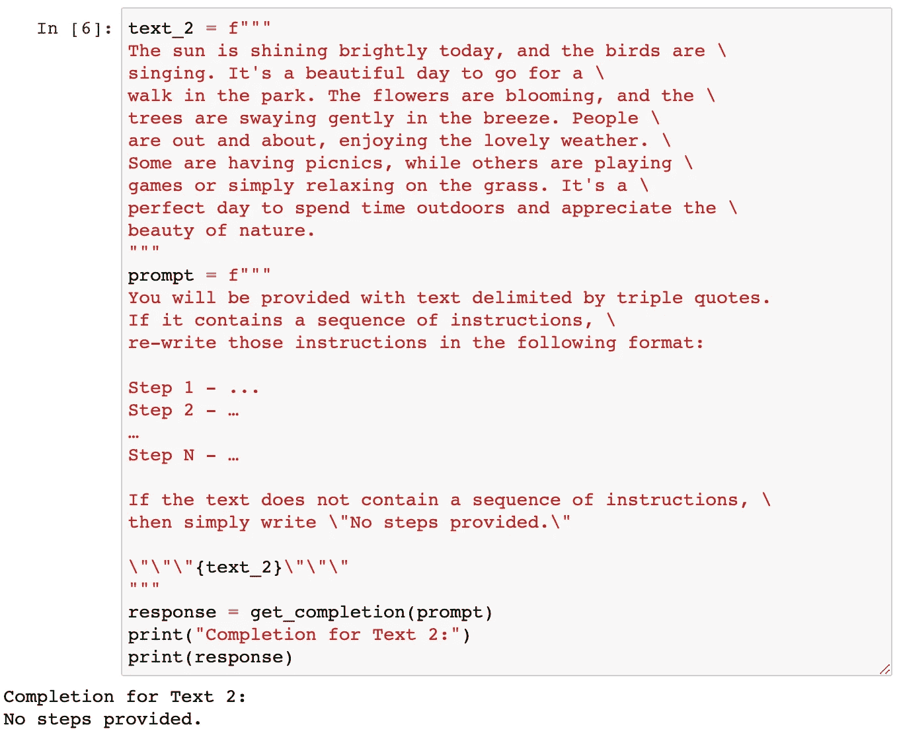
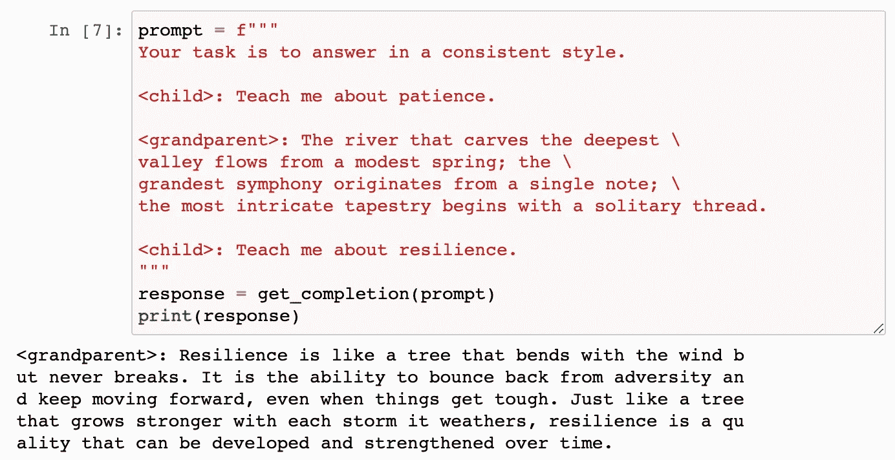
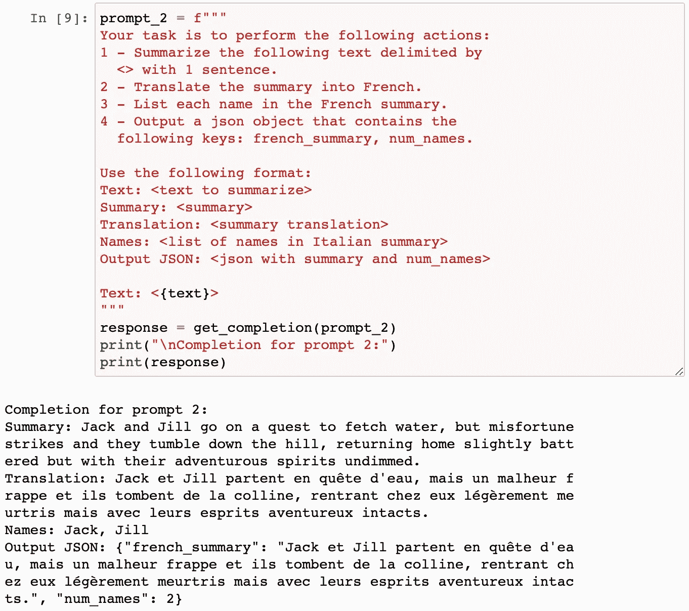
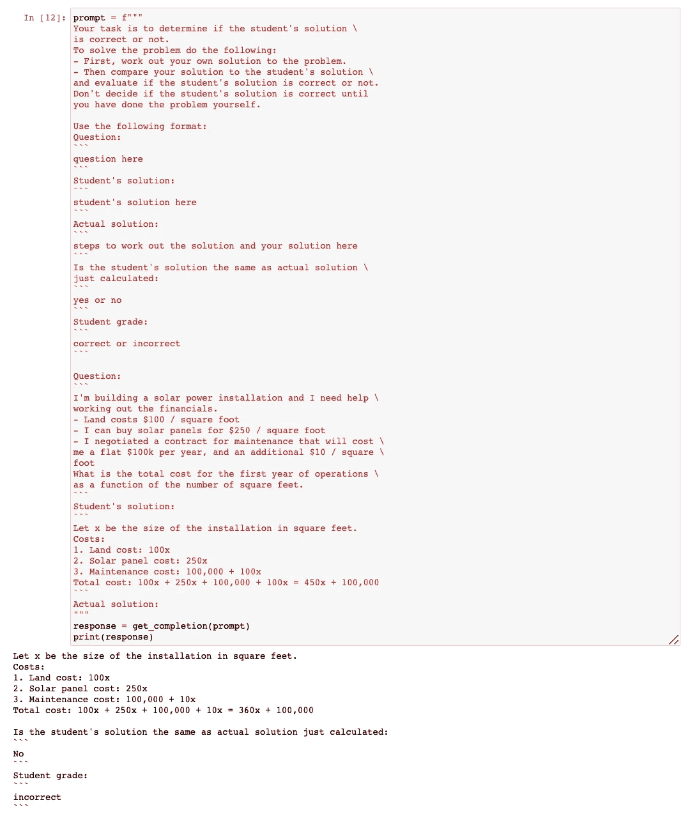
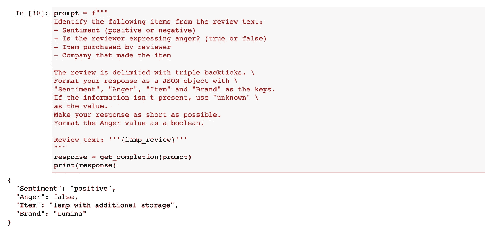
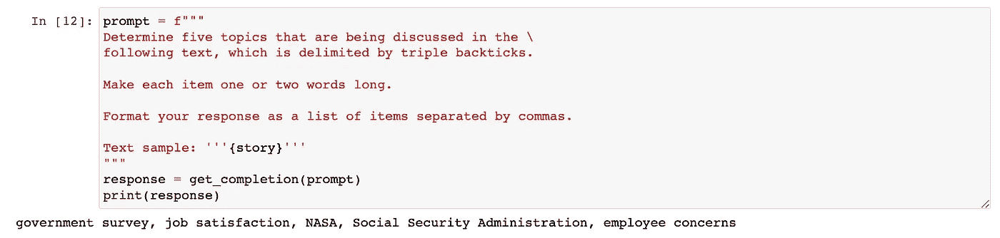
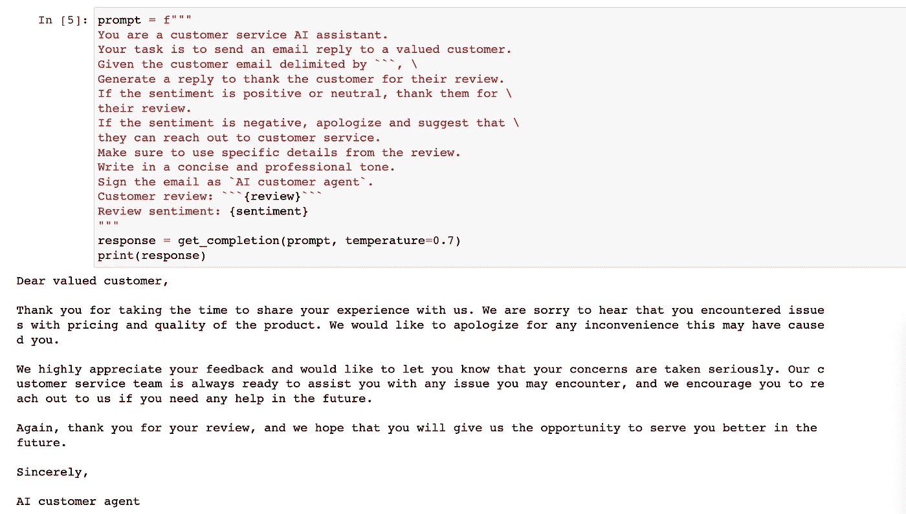
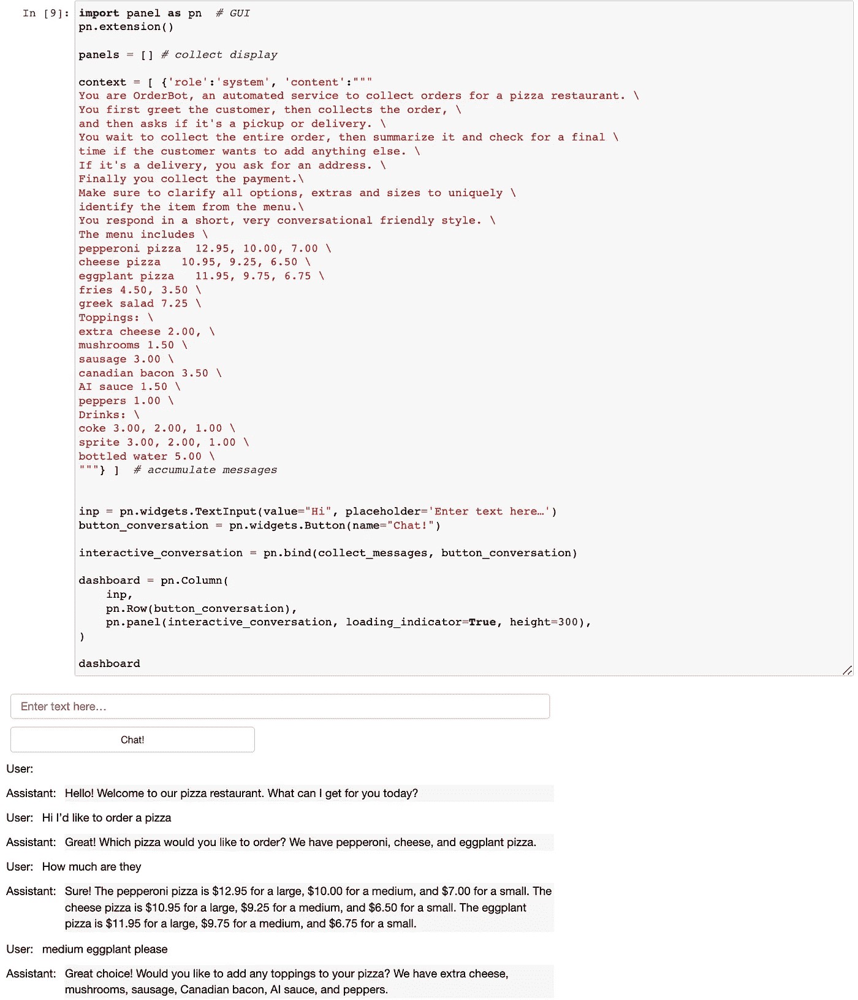

# 提示工程的最佳实践

> 原文：[`towardsdatascience.com/best-practices-in-prompt-engineering-a18d6bab904b?source=collection_archive---------2-----------------------#2023-05-01`](https://towardsdatascience.com/best-practices-in-prompt-engineering-a18d6bab904b?source=collection_archive---------2-----------------------#2023-05-01)

## 从 Andrew Ng 的新课程中学到的知识和想法

[](https://sophiamyang.medium.com/?source=post_page-----a18d6bab904b--------------------------------)[](https://towardsdatascience.com/?source=post_page-----a18d6bab904b--------------------------------) [Sophia Yang, Ph.D.](https://sophiamyang.medium.com/?source=post_page-----a18d6bab904b--------------------------------)

·

[阅读](https://medium.com/m/signin?actionUrl=https%3A%2F%2Fmedium.com%2F_%2Fsubscribe%2Fuser%2Fae9cae9cbcd2&operation=register&redirect=https%3A%2F%2Ftowardsdatascience.com%2Fbest-practices-in-prompt-engineering-a18d6bab904b&user=Sophia+Yang%2C+Ph.D.&userId=ae9cae9cbcd2&source=post_page-ae9cae9cbcd2----a18d6bab904b---------------------post_header-----------) 发表在[Towards Data Science](https://towardsdatascience.com/?source=post_page-----a18d6bab904b--------------------------------) · 8 分钟阅读·2023 年 5 月 1 日[](https://medium.com/m/signin?actionUrl=https%3A%2F%2Fmedium.com%2F_%2Fvote%2Ftowards-data-science%2Fa18d6bab904b&operation=register&redirect=https%3A%2F%2Ftowardsdatascience.com%2Fbest-practices-in-prompt-engineering-a18d6bab904b&user=Sophia+Yang%2C+Ph.D.&userId=ae9cae9cbcd2&source=-----a18d6bab904b---------------------clap_footer-----------)

--

[](https://medium.com/m/signin?actionUrl=https%3A%2F%2Fmedium.com%2F_%2Fbookmark%2Fp%2Fa18d6bab904b&operation=register&redirect=https%3A%2F%2Ftowardsdatascience.com%2Fbest-practices-in-prompt-engineering-a18d6bab904b&source=-----a18d6bab904b---------------------bookmark_footer-----------)

深度学习人工智能最近推出了一个新的**ChatGPT 提示工程师课程**，由 Isa Fulford 和 Andrew Ng 主讲。这是一个免费的 1.5 小时短期[课程](https://www.deeplearning.ai/short-courses/chatgpt-prompt-engineering-for-developers/)，这个课程非常棒。在本文中，我将讨论以下两个部分：

+   第一部分：课程总结

+   第二部分：我对提示工程最佳实践的想法，包括🦜🔗**LangChain**和各种**OpenAI 技巧和窍门**。

# 第一部分：课程总结

该课程包括三个部分：两个提示原则、一个迭代开发过程，以及包括总结、推理、转换、扩展和构建聊天机器人的能力。

## 1. 两个原则

**原则 1：编写清晰且具体的指令**

+   *策略 1*: *使用分隔符，如 ```py, “““, < >,* `*<tag> </tag>*`*to clearly indicate distinct parts of the input*. This will help better organize your input and avoid prompt injections. In this example, the ``` 分隔符用于指示我们希望总结的文本。*

```py
text = f"""
You should express what you want a model to do by \ 
providing instructions that are as clear and \ 
specific as you can possibly make them. \ 
This will guide the model towards the desired output, \ 
and reduce the chances of receiving irrelevant \ 
or incorrect responses. Don't confuse writing a \ 
clear prompt with writing a short prompt. \ 
In many cases, longer prompts provide more clarity \ 
and context for the model, which can lead to \ 
more detailed and relevant outputs.
"""
prompt = f"""
Summarize the text delimited by triple backticks \ 
into a single sentence.
```{text}```py
"""
```

+   *策略 2: 请求结构化输出。* 例如，我们可以要求输出为 JSON 格式，稍后我们可以轻松地将其读取为 Python 中的列表或字典。



+   *策略 3: 检查条件是否满足。* 我们可以在提示中首先检查假设。考虑边界条件以及模型应该如何处理它们也可能是有帮助的。在这个例子中，文本没有包含指示，我们给出了写“未提供步骤”的指示。



+   *策略 4: 少量示例提示。* 我们提供成功完成任务的示例，然后要求模型执行该任务。



**原则 2: 给模型时间“思考”**

+   *策略 1: 指定完成任务所需的步骤，并要求以特定格式输出。* 有时候，模型或人类直接得出答案很困难。对于复杂任务，逐步指示通常很有帮助。类似于人类工作方式，我们可以要求模型在提供最终答案之前进行一系列相关推理。



+   *策略 2: 指导模型在得出结论之前先解决自己的方案。*



## **2\. 迭代提示开发**

迭代提示开发过程非常类似于我们编写代码的方式。我们尝试一些方法，如果不成功，我们会改进并重试：

+   尝试一些方法

+   分析结果与预期不符的地方

+   澄清指示，给出更多思考时间

+   用一批示例来改进提示

+   重复

在课程示例中，Andrew 演示了如何从产品资料表生成营销文案。他逐步发现并解决了这三个问题，每一步都用改进的提示。

+   问题 1: 文本太长 -> 解决方案：“使用最多 50 个词”。

+   问题 2\. 文本关注错误的细节 -> 解决方案：添加预期受众“描述旨在为家具零售商提供…”

+   问题 3\. 描述需要一个维度表 -> 解决方案：

    “将所有内容格式化为 HTML”

## 3\. 能力

+   **总结**：许多人使用大型语言模型来总结文本。你可以指定提示，以特定的重点（例如价格和价值）来总结文本：

```py
prompt = f"""
Your task is to generate a short summary of a product \
review from an ecommerce site to give feedback to the \
pricing deparmtment, responsible for determining the \
price of the product.  

Summarize the review below, delimited by triple 
backticks, in at most 30 words, and focusing on any aspects \
that are relevant to the price and perceived value. 

Review: ```{prod_review}```py
"""
```

当然，你可以编写一个 for 循环来总结多个文本：

```py
reviews = [review_1, review_2, review_3, review_4]

for i in range(len(reviews)):
    prompt = f"""
    Your task is to generate a short summary of a product \ 
    review from an ecommerce site. 

    Summarize the review below, delimited by triple \
    backticks in at most 20 words. 

    Review: ```{reviews[i]}```py
    """

    response = get_completion(prompt)
    print(i, response, "\n")
```

+   **推断：** 你可以使用大型语言模型来推断情感、推断情绪、提取产品名称、提取公司名称、推断主题等。你不再需要为特定任务训练模型，大型语言模型可以在没有训练的情况下为你推断所有这些内容。



+   **转换中：**大型语言模型可以进行文本转换任务，如语言翻译、拼写和语法检查、语气调整以及格式转换。


+   **扩展中：**大型语言模型可以生成定制的客户服务电子邮件，适合每位客户的审查：



+   **构建聊天机器人：**我非常感激他们选择使用[**Panel**](https://panel.holoviz.org/)来构建一个聊天机器人！



Panel 聊天机器人

我写了几篇关于 Panel 的博客文章和 Panel 聊天机器人。请查看我之前关于这个主题的博客文章：

> 构建问答 PDF 聊天机器人：LangChain + OpenAI + Panel + HuggingFace
> 
> 如何制作 AI 图像编辑聊天机器人：Stable Diffusion InstructPix2Pix 在 Panel 应用中
> 
> 如何使用 Docker 将 Panel 应用部署到 Hugging Face
> 
> [ChatGPT 和 DALL·E 2 在 Panel 应用中](https://sophiamyang.medium.com/chatgpt-and-dall-e-2-in-a-panel-app-1c921d7d9021?sk=37f97ad29e6388ef79f29504fa82ba05)
> 
> 如何将 Panel 可视化仪表板部署到 GitHub Pages
> 
> [构建 Panel 可视化仪表板的三种方法](https://sophiamyang.medium.com/3-ways-to-build-a-panel-visualization-dashboard-6e14148f529d?sk=2cd93ae39586305bae8cfaead2bf7bb4)

# 第二部分：我的思考

这是一个很棒的课程，介绍了 ChatGPT 提示工程的许多最佳实践和能力。我特别喜欢其中的两个指导原则。还有许多其他有趣的问题，例如如何处理长令牌、如何将 LLMs 与其他工具配合使用、如何处理速率限制、如何流式传输完成等。基于这门令人惊艳的课程，我想在两个思考领域进行扩展：一个是 LangChain，另一个是 OpenAI 的技巧和窍门。

## **1\.** 🦜🔗 **LangChain**

✨ **是否在开始写清晰具体的指导时遇到困难？**LangChain 提供许多提示模板供您使用。您不必每次都从头编写指导。

✨ **您希望获得比纯文本更结构化的信息吗？**LangChain 提供[输出解析器](https://python.langchain.com/en/latest/modules/prompts/output_parsers.html)，帮助结构化语言模型的响应。

✨ **你的文本超出令牌限制吗？** 例如，如果你想总结或询问一本 500 页的书。你该怎么办？使用`map_reduce`、`refine`、`map-rerank`，LangChain 允许你将文本分成多个批次并逐个处理：

+   `map_reduce`：它将文本分成多个批次，将每个批次和问题分别输入 LLM，根据每个批次的回答得出最终答案。

+   `refine`：它将文本分成多个批次，将第一个批次输入 LLM，然后将回答和第二个批次一起输入 LLM。通过遍历所有批次来优化回答。

+   `map-rerank`：它将文本分成多个批次，将每个批次输入 LLM，返回回答问题的完整程度评分，并根据每个批次中高分的回答得出最终答案。

✨ **你想保留聊天历史记录吗？** LangChain 通过提供几种处理聊天历史记录的选项来解决这个问题——保留所有对话、保留最新的 k 次对话、总结对话，以及上述选项的组合。

✨ **你想将 LLM 与另一个 LLM 或其他工具一起使用吗？** LangChain 可以将各种 LLM 链在一起，并与一系列工具（如 Google 搜索、Python REPL 等）一起使用。

✨ **你想让提示自动生成提示，即自动 GPT 吗？** LangChain 在“西部世界”模拟、Camel、BabyAGI 和 AutoGPT 上有实现。查看我之前的博客文章 4 种你需要了解的自主 AI 代理。

要了解 LangChain 的工作原理，请查看我之前的博客文章和我的视频。

## **2\. OpenAI 技巧与窍门**

OpenAI Cookbook 提供了许多有用的技巧和窍门供我们使用。

✨ **如何避免速率限制错误？** 你可以通过指数退避策略重试。查看[这里的示例](https://github.com/openai/openai-cookbook/blob/main/examples/How_to_handle_rate_limits.ipynb)。

> 使用指数退避策略重试是指在遇到速率限制错误时进行短时间的休眠，然后重试未成功的请求。如果请求仍未成功，休眠时间将增加并重复该过程。此过程将持续直到请求成功或达到最大重试次数。

✨ **如何在速率限制下最大化批处理的吞吐量？** 在处理大量批数据时，两种方法：1) 主动添加请求之间的延迟，2) 通过传递字符串列表来批处理请求。查看[这里的示例](https://github.com/openai/openai-cookbook/blob/main/examples/How_to_handle_rate_limits.ipynb)。

✨ **如何流式传输完成结果？** 只需设置`stream=True`即可流式传输完成结果。查看[这里的示例](https://github.com/openai/openai-cookbook/blob/main/examples/How_to_stream_completions.ipynb)。

> 默认情况下，当您请求来自 OpenAI 的完成时，整个完成内容会在发送回一个单独的响应之前生成。如果您生成的完成内容较长，等待响应可能需要几秒钟时间。为了更快地获得响应，您可以在生成过程中‘流式传输’完成内容。这样您可以在完成内容完全生成之前开始打印或处理完成内容的开头部分。

# 结论

本文中，我总结了 ChatGPT Prompt Engineering for Developers 课程的内容。此外，我还分享了关于提示工程最佳实践的想法，包括使用🦜🔗LangChain 以及来自 OpenAI 的一些技巧。希望本文对您有所帮助！如果您还有其他提示工程的最佳实践，欢迎分享。


照片由[Eric Krull](https://unsplash.com/@ekrull?utm_source=unsplash&utm_medium=referral&utm_content=creditCopyText)提供，来自[Unsplash](https://unsplash.com/photos/Ejcuhcdfwrs?utm_source=unsplash&utm_medium=referral&utm_content=creditCopyText)

. . .

作者：[Sophia Yang](https://www.linkedin.com/in/sophiamyang/)，2023 年 4 月 30 日

Sophia Yang 是一位高级数据科学家。欢迎关注我的[LinkedIn](https://www.linkedin.com/in/sophiamyang/)、[Twitter](https://twitter.com/sophiamyang)和[YouTube](https://www.youtube.com/SophiaYangDS)，加入 DS/ML[读书俱乐部](https://dsbookclub.github.io/) ❤️
