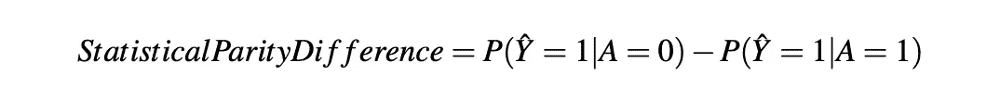
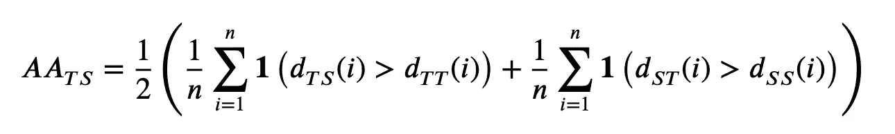

# 超越准确性：探索机器学习模型全面评估的异域指标

> 原文：[`towardsdatascience.com/beyond-accuracy-exploring-exotic-metrics-for-holistic-evaluation-of-machine-learning-models-8a093875dcc9?source=collection_archive---------12-----------------------#2023-04-27`](https://towardsdatascience.com/beyond-accuracy-exploring-exotic-metrics-for-holistic-evaluation-of-machine-learning-models-8a093875dcc9?source=collection_archive---------12-----------------------#2023-04-27)

 [Adrien Pavao](https://adrienpavao.medium.com/?source=post_page-----8a093875dcc9--------------------------------)

·

[关注](https://medium.com/m/signin?actionUrl=https%3A%2F%2Fmedium.com%2F_%2Fsubscribe%2Fuser%2F9a9236d5c7a&operation=register&redirect=https%3A%2F%2Ftowardsdatascience.com%2Fbeyond-accuracy-exploring-exotic-metrics-for-holistic-evaluation-of-machine-learning-models-8a093875dcc9&user=Adrien+Pavao&userId=9a9236d5c7a&source=post_page-9a9236d5c7a----8a093875dcc9---------------------post_header-----------) 发布于 [Towards Data Science](https://towardsdatascience.com/?source=post_page-----8a093875dcc9--------------------------------) ·12 min read·2023 年 4 月 27 日

--

机器学习无疑已成为当今数据驱动世界中的强大工具，但我们真的充分利用了它的全部潜力吗？传统的评估指标如准确性、精确度和召回率长期以来一直备受关注，但在衡量模型的实际影响时，还有许多其他因素需要考虑。在本文中，我们将探讨那些较少为人知的、非常规的评估指标，这些指标正在重塑我们评估机器学习模型的方式。从公平性、隐私和校准，到能源消耗、数据消耗，甚至心理和行为测试，这些创新的评估技术将改变你对模型性能的看法，并为机器学习提供一种更负责任、更全面的方法。

图片来源：pexels.com

# 公平性

即使机器学习模型的数学定义本身不一定包含不公平或偏见的元素，训练出的模型也可能不公平，这取决于输入数据的质量或训练过程。基于偏见数据学习的模型不仅可能导致不公平和不准确的预测，还可能严重不利于某些子群体，从而导致不公平性。

换句话说，模型的公平性概念描述了模型在数据的某些子群体上可能表现不同的问题。这个问题在涉及到由性别、年龄、种族或宗教信仰等因素定义的人口统计组时尤为重要。随着机器学习在社会中的应用越来越广泛，这个问题受到了更多的关注和研究 [1, 2, 3, 4, 5]。量化机器学习中的公平性仍然存在争议。一些有趣的公平性测量方式包括：

**人口统计公平性**：该指标检查预测类别在不同人口统计组中是否均匀分布。其公式如下：

其中 *A* 是一个受保护属性（例如种族或性别），*Y* 是目标变量（例如批准或拒绝），*Ŷ* 是对 *Y* 的预测值。人口统计公平性是一个需要实现的条件，即预测与受保护属性在统计上独立。

**统计公平差异**：该指标测量不同人口统计组之间的正分类率是否相等。公式如下：

**差异影响**：计算受保护组的正分类率与另一个组的正分类率的比率。

值为 1 表示两个组的正分类率相同，表明公平性。值大于 1 表示* A=0*组的正分类率较高，而值小于 1 则表明* A=1*组的正分类率较高。

然而，需要注意的是，差异影响是一个有限的公平性衡量标准，不应孤立使用。例如，如果某一组在训练数据中代表性不足，则可能有理由提高该组的正分类率。此外，差异影响没有考虑其他因素，如假阳性和假阴性率，这些可能提供更全面的公平性视角。

这些只是用于量化机器学习中公平性的一些指标。需要注意的是，公平性是一个复杂的问题，这些指标不应孤立使用。相反，它们应该在特定问题和期望结果的背景下进行考虑。

# 校准

如[6, 7]中定义的那样，误校准的概念表示算法返回的置信水平（或概率）与实际表现之间的期望差异。

换句话说，校准测量回答了以下问题：算法对其自身预测的置信度是否正确？

在潜在危险的决策问题中，如疾病检测或蘑菇识别，促进良好校准模型是重要的。

校准测量的重要性在于，必须清楚了解算法对其预测的置信水平。一个校准良好的算法会产生准确反映预测正确可能性的置信水平。相反，一个校准不良的算法会过高或过低估计其预测的置信度，从而导致不正确或不可靠的结果。

在决策错误后果可能严重的应用中，拥有一个良好校准的算法至关重要。疾病的误诊可能导致错误的医疗处理和对患者的伤害。类似地，蘑菇的误识别可能会导致严重的健康后果。在这些情况下，良好校准的模型可以帮助确保根据可靠的预测做出正确的决策。

可以使用**期望校准误差**（ECE）来计算：该分数测量平均预测概率与在预测概率区间中的准确度（即正样本的比例）之间的差异。ECE 的公式如下：

其中*M*是区间的数量，*Bm*是第*m*个区间中的样本集合，*n*是测试数据中的样本总数，*accm*是第*m*个区间的准确度，*confm*是第*m*个区间的平均预测概率。

# 方差

方差本身可以作为一个次要的目标度量。我们希望最小化算法性能的变异性。它可以通过**标准差 σ**来简单计算。它也可以定义为**收敛速率**：当重新训练 *n* 次时，算法有多少次收敛到一个令人满意的解决方案？将这些计算作为次要目标度量并不是在排名模型时考虑分数的误差条，而是基于*方差*对模型进行排名，或者至少通过给予更稳定的候选模型来打破平局。

机器学习模型性能的方差是一个重要的次要目标度量，不应被忽视。算法性能的变异性可能导致不可靠和不一致的结果。最小化这种变异性对于确保模型的稳定性和鲁棒性至关重要。

有几种方法可以测量机器学习模型的方差。一种常见的方法是计算模型在多次运行或折叠中的平均分数的标准差。这提供了性能在平均值周围的分布度量，并表明在不同情况下性能可能的变化程度。

模型平均分数的标准差公式为：

其中 *n* 是运行或折叠的次数，*xi* 是模型在第 *i* 次运行或折叠中的性能分数，*x̄*（x 平均值）是所有运行或折叠中的平均性能分数。

# 可解释性和解释能力

可解释性和解释能力是机器学习中相关但不同的概念。

**可解释性**指的是人类理解模型预测原因的程度。它指的是理解模型内部工作原理及其如何做出决策的能力。

**解释能力**是指提供人类可理解的模型决策过程解释的能力。它关注于以易于理解的形式向人类展示预测背后的原因，例如，通过特征重要性、决策树等方式。

总结来说，可解释性侧重于模型本身的透明度，而解释能力则关注于将模型行为传达给人类观众。

[8] 提出了关于可解释性的广泛调查。他们强调了可解释性在某方面极其宝贵，但另一方面却**难以定义**。另一种自动解释算法的方法是敏感性分析 [9]。敏感性分析是一种确定模型或系统的输入变量变化如何影响输出或感兴趣结果的技术。

# 隐私

隐私应在候选算法为生成模型、建模潜在机密数据的情况下进行衡量。在这种情况下，目标是使用生成模型创建足够接近实际数据的人工数据，以便在实际应用中使用，但又不至于泄露私人信息。一个准确计算这个的指标是**对抗准确度** [10]。这是它的定义：

其中指标函数**1**在其参数为真时取值 1，否则取值 0，*T*和*S*分别是真实数据和合成数据。

基本上这是一个 1 最近邻分类器的准确度，但我们追求的分数不是 1（完美分类准确度），而是 0.5。确实，完美分数意味着每个生成的数据点在真实数据中有其最近邻，这意味着两个分布过于接近。0 的分数意味着两个分布过于不同，因此效用低。因此，0.5 的分数，即每个数据点的最近邻可以是虚假或真实的概率相同，保证了良好的隐私。

这种方法的一个限制是需要适当的距离度量。这也是一个优点，因为它意味着该方法是通用的，可以通过选择合适的距离度量应用于不同领域。

# 时间和内存消耗

简单而有用的次要目标指标是模型的时间、内存和能源消耗。有两种主要方法来考虑这些：**限制资源**和**跟踪资源使用**。

**训练和推理时间**、**模型的大小**、**过程中的内存使用**甚至**能源消耗**都是可以通过设计进行限制或测量的变量。

方法的代码行数或字符数也可以作为**简洁性和实用性**的指标。然而，显然，这个指标很容易被通过调用外部包来欺骗，可能需要人工审查。

解决任务的最简单模型是更可取的，因为它们对环境更友好、成本更低、可以部署在较弱的设备上，并且更易于解释。

生产相同结果但时间更短的模型更为理想，因为这减少了所需的计算资源，并且可以节省成本。这在当前的生态危机背景下尤为重要，因为减少计算中的能源消耗可以对降低技术的碳足迹产生显著影响。此外，更快训练和预测的模型更具可扩展性，可以实时应用，进一步提升其效用。因此，优化时间消耗是开发高效且环保的机器学习模型的关键因素。

# 数据消耗

数据消耗，或者说机器学习算法所需的训练数据量，在比较不同模型时是另一个关键指标。正如俗语所说，“数据是新石油”，但并非每种情况都允许使用大规模数据集。在许多实际应用中，收集足够的标记数据可能耗时、昂贵，甚至是不可能的。因此，追踪和限制数据消耗是模型评估的一个重要方面。

监控数据消耗可以帮助识别在有限数据下表现良好的算法，使其更适合数据稀缺或更快速部署的场景。另一方面，限制可用训练数据的数量可以鼓励开发能够更高效地从较小样本中学习的模型。这通常称为少样本学习。这就是元学习技术如 k-shot n-way 方法发挥作用的地方。在这种方法中，模型被训练以仅使用每个类别 n 中的有限数量的示例*k*来快速适应新任务。

通过有意限制数据消耗，元学习促进了能够从较小数据集中更好地泛化的模型的发展，从而提高了它们在各种情况下的效用和适应性。

# 以人为本的方法

除了前面讨论的定量评估指标之外，在评估机器学习模型时，考虑更多“人”的评估技术至关重要。这些方法强调定性方面和主观解释，为评估过程增添了人文色彩。例如，在文本生成图像算法中，对生成的图像进行手动评估可以帮助确定结果在视觉上是否吸引人、连贯和相关性是否适当。类似地，大型语言模型可以接受心理或行为测试，评估者根据连贯性、移情和伦理考虑等因素评价模型的响应。这些以人为中心的评估方法可以揭示出纯数值指标可能忽视的见解，从而更全面地理解模型的优势和劣势。通过将这些面向人的技术融入我们的评估工具箱，我们可以确保我们的机器学习模型不仅在解决问题时有效，而且能够与复杂多面的人类体验和期望相 resonant。

遵循这一思路，一个明显的例子是如何测试生成式预训练转换器（GPT），即著名的大型语言模型，使用心理学测试，高中测试和数学测试。

# 结论

总之，评估机器学习模型远远超出了传统的准确性指标。通过采用整体方法，我们可以更好地理解模型性能的各个维度及其对现实世界的影响。通过探索如公平性、隐私、能源消耗、校准、时间、内存和数据消耗等非常规指标，我们可以推动开发更负责任、高效和适应性强的模型，解决我们今天面临的各种挑战。

认识到没有一刀切的解决方案对于机器学习至关重要。通过扩展我们的评估标准并揭示这些鲜为人知的指标，我们可以促进该领域的创新，确保我们的模型不仅表现良好，还符合伦理考虑和实际限制。在我们继续推动机器学习的边界时，让我们努力创造既能解决复杂问题，又以负责任、公平和关注我们生活的世界的方式解决问题的模型。

感谢您的阅读！

# 参考文献

[1] Philipp Benz, Chaoning Zhang, Adil Karjauv, 和 In So Kweon。*鲁棒性可能与公平性相悖：关于类别精度的实证研究*。2020\. URL [`arxiv.org/abs/2010.13365`](https://arxiv.org/abs/2010.13365)。

[2] Mariya I. Vasileva。*机器学习算法的黑暗面：它们如何以及为什么会利用偏见，以及如何追求算法公平性*。在第 26 届 ACM SIGKDD 知识发现与数据挖掘会议，虚拟会议，加州，美国。ACM，2020\. URL [`doi.org/10.1145/3394486.3411068`](https://doi.org/10.1145/3394486.3411068)。

[3] Alexandra Chouldechova 和 Aaron Roth。*机器学习中的公平性前沿*。2018\. URL [`arxiv.org/abs/1810.08810`](http://arxiv.org/abs/1810.08810)。

[4] Irene Y. Chen, Fredrik D. Johansson, 和 David A. Sontag。*为什么我的分类器具有歧视性？* 在 2018 年神经信息处理系统（NeurIPS），加拿大蒙特利尔。URL [`proceedings.neurips.cc/paper/2018/hash/1f1baa5b8edac74eb4eaa329f14a0361-Abstract.html`](https://proceedings.neurips.cc/paper/2018/hash/1f1baa5b8edac74eb4eaa329f14a0361-Abstract.html)。

[5] Ludovico Boratto, Gianni Fenu, 和 Mirko Marras。*上采样与正则化在推荐系统中对提供者公平性的相互作用*。用户模型。用户适应。互动，2021\. URL [`doi.org/10.1007/s11257–021–09294–8`](https://doi.org/10.1007/s11257–021–09294–8)。

[6] Mahdi Pakdaman Naeini, Gregory F. Cooper, 和 Milos Hauskrecht。*使用贝叶斯分箱获得良好校准的概率*。在《第二十九届美国人工智能会议论文集》，2015 年，德克萨斯州奥斯汀，美国。URL [`www.aaai.org/ocs/index.php/AAAI/AAAI15/paper/view/9667`](http://www.aaai.org/ocs/index.php/AAAI/AAAI15/paper/view/9667)。

[7] Chuan Guo, Geoff Pleiss, Yu Sun 和 Kilian Q. Weinberger. *现代神经网络的校准问题*。发表于第 34 届国际机器学习会议（ICML 2017），澳大利亚悉尼，PMLR 2017 年第 70 卷。URL [`proceedings.mlr.press/v70/guo17a.html`](http://proceedings.mlr.press/v70/guo17a.html)。

[8] Diogo V. Carvalho, Eduardo M. Pereira 和 Jaime S. Cardoso. *机器学习可解释性：方法与指标综述*。MDPI Electronics，2019\. URL [`www.mdpi.com/2079–9292/8/8/832/pdf`](https://www.mdpi.com/2079–9292/8/8/832/pdf)。

[9] Bertrand Iooss, Vincent Chabridon 和 Vincent Thouvenot. *基于方差的重要性度量用于机器学习模型可解释性*。发表于 2022 年会议录。URL [`hal.archives-ouvertes.fr/hal-03741384`](https://hal.archives-ouvertes.fr/hal-03741384)。

[10] Andrew Yale, Saloni Dash, Ritik Dutta, Isabelle Guyon, Adrien Pavao 和 Kristin P. Bennett. *隐私保护的合成健康数据*。发表于第 27 届欧洲人工神经网络研讨会（ESANN）2019，比利时布鲁日。URL [`www.elen.ucl.ac.be/Proceedings/esann/esannpdf/es2019–29.pdf`](http://www.elen.ucl.ac.be/Proceedings/esann/esannpdf/es2019–29.pdf)。

[11] OpenAI. *GPT-4 技术报告。* 2023\. URL [`doi.org/10.48550/arXiv.2303.08774`](https://doi.org/10.48550/arXiv.2303.08774)。

[12] Kadir Uludag 和 Jiao Tong. *测试 ChatGPT 在心理学中的创造力：与 ChatGPT 的访谈*。预印本，2023。

[13] Xingxuan Li, Yutong Li, Linlin Liu, Lidong Bing 和 Shafiq R. Joty. *GPT-3 是心理变态者吗？从心理学角度评估大型语言模型*。2022\. URL [`doi.org/10.48550/arXiv.2212.10529`](https://doi.org/10.48550/arXiv.2212.10529)。

[14] Joost de Winter. *ChatGPT 能否通过高中英语语言理解考试？* 预印本，2023。

[15] Simon Frieder, Luca Pinchetti, Ryan-Rhys Griffiths, Tommaso Salvatori, Thomas Lukasiewicz, Philipp Christian Petersen, Alexis Chevalier 和 Julius Berner. *ChatGPT 的数学能力*。URL [`doi.org/10.48550/arXiv.2301.13867`](https://doi.org/10.48550/arXiv.2301.13867)。
