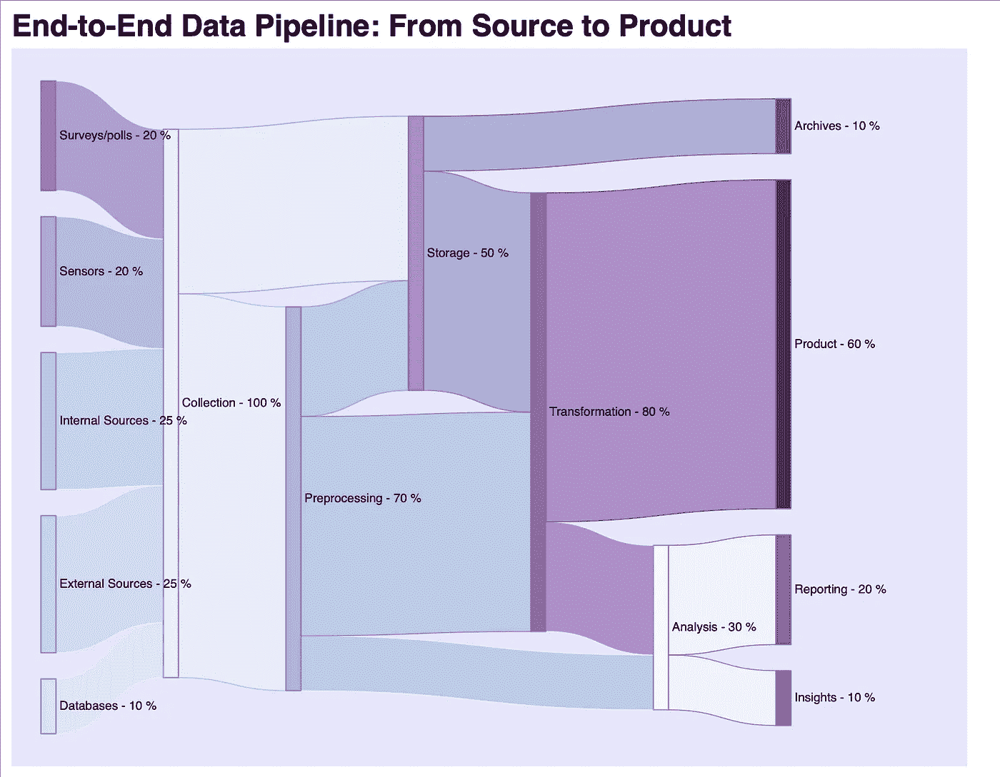
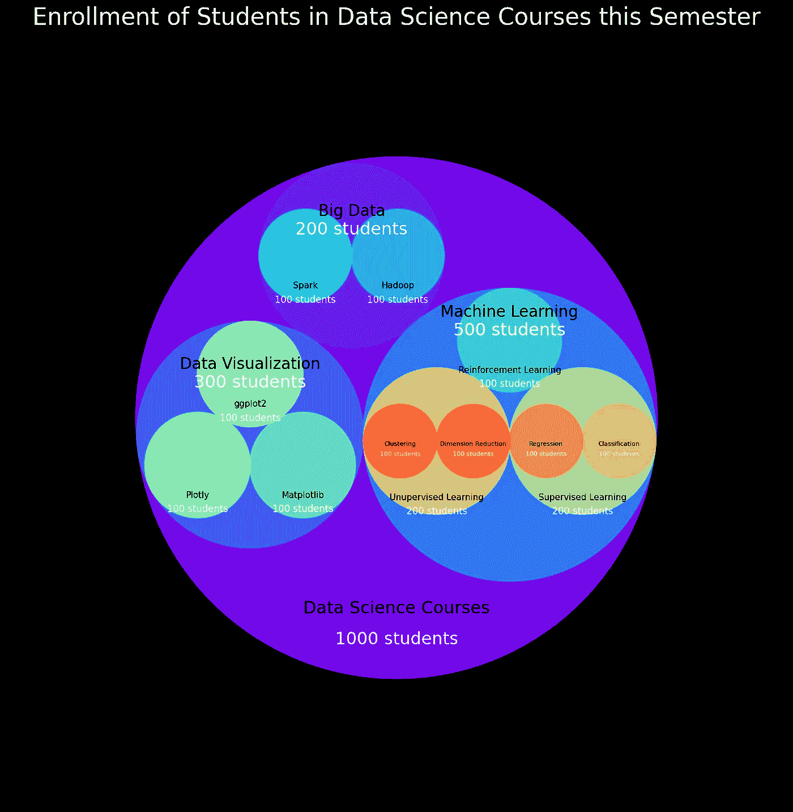
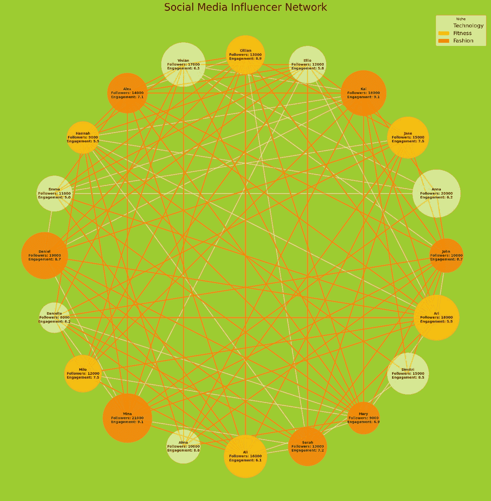

# 超越条形图：桑基图、圆形打包和网络图中的数据

> 原文：[`towardsdatascience.com/beyond-bar-charts-data-with-sankey-circular-packing-and-network-graphs-fd1d50478b68`](https://towardsdatascience.com/beyond-bar-charts-data-with-sankey-circular-packing-and-network-graphs-fd1d50478b68)

## 非传统可视化：何时使用及何时不使用它们的力量

[](https://medium.com/@MahamsMultiverse?source=post_page-----fd1d50478b68--------------------------------)[](https://towardsdatascience.com/?source=post_page-----fd1d50478b68--------------------------------) [Maham Haroon](https://medium.com/@MahamsMultiverse?source=post_page-----fd1d50478b68--------------------------------)

·发表于[Towards Data Science](https://towardsdatascience.com/?source=post_page-----fd1d50478b68--------------------------------) ·12 分钟阅读·2023 年 8 月 26 日

--


由[Firmbee.com](https://unsplash.com/@firmbee?utm_source=unsplash&utm_medium=referral&utm_content=creditCopyText)提供的照片，发布在[Unsplash](https://unsplash.com/photos/jrh5lAq-mIs?utm_source=unsplash&utm_medium=referral&utm_content=creditCopyText)上

你好！

如果你已经深入探讨了数据分析的世界，你可能对条形图、折线图、散点图和饼图等图表的力量非常熟悉。这些可视化不仅使数据更易于理解，还提升了对不同受众的洞察力——无论是利益相关者、客户，还是你自己，寻求从数据中获取见解。然而，在数据复杂性要求更精细和引人入胜的展示时，有些情况就需要更复杂和吸引人的展示方式。

想象一下这样的场景：你正扮演着我们虚构公司 MM Awesome Data Inc.的一名初级数据科学家。管理层正在努力将新的数据源整合到现有的数据框架中，他们确实需要理解全貌。虽然饼图可能满足部分需求，但想象一下呈现一个流程图，如引人注目的桑基图或动态流图的影响和魅力。

本文围绕这样的场景展开。在广阔的数据可视化领域中，有一些隐藏的瑰宝常常被忽视。鉴于我们无法在一篇文章中讨论所有这些精彩的可视化方法，我们将在这里重点介绍其中的三个。所以，让我们深入探讨一下吧。

# 桑基图

让我们首先探索一下迷人的桑基图世界。

桑基图是一种非常酷的方式来可视化数据流动。它们提供了一种独特的方式来查看事物如何从一个阶段转移到另一个阶段。想象一下了解一个产品从诞生到最终结果的过程，或不同类别如何汇聚或分离。桑基图在这些方面表现得最为出色。

然而，值得一提的是，这些图表最适合用于跟踪流动的场景，比如我们提到的例子。在其他情况下，它们可能不是最佳选择。所以，让我们深入探索，揭开它们的魔力吧！



图片作者

在我们进入代码并探讨我们刚刚看到的图表的实际实现之前，让我们讨论一下使用案例。

**适合桑基图的场景**

如果你的情况属于以下任何类别，桑基图是一个很棒的选择：

1.  **数据流分析：** 这涉及到展示各种资源、数量或一般数据的分布、转化和过渡。它们有助于突出系统中的主要贡献者、路径和损失。

1.  **识别资源瓶颈：** 桑基图是评估资源利用效率的宝贵工具。它们在识别瓶颈和建议优化区域方面表现出色。

**不适合桑基图的场景**

尽管桑基图是强大的工具，但在某些情况下它们可能不是最佳选择：

1.  **数值精度：** 桑基图优先考虑流动的定性和相对表示。如果需要精确的数值，其他可视化方法可能更为合适。

1.  **处理大量数据：** 如果你的数据集涉及多个节点和连接，桑基图可能会迅速变得杂乱且难以解读。为克服这一问题，可以考虑简化数据或探索网络图或层次图等替代可视化方法。

**类似使用案例的替代可视化**

从我的经验来看，我发现流图、平行坐标图和流程图与桑基图有类似的目的。此外，一些人可能会认为网络图与桑基图的功能很相似。

现在我们对何时使用桑基图以及何时考虑其他选项有了更清晰的认识，让我们深入探讨一下这个令人印象深刻的可视化背后的代码吧！

**深入探讨桑基图的 Python 实现**

现在让我们把注意力转向将桑基图变为现实的 Python 代码。

我的目标是创建一个功能全面的桑基图，使其能够轻松适应各种复杂程度。

以下示例深入分析了组织的数据管道。它追踪了数据从源头到最终转化为产品或报告的过程。需要注意的是，这里使用的数据完全是合成的。因此，虽然此可视化作为制作引人注目的 Sankey 图的优秀指南，但建议不要推断出超出其制作迷人视觉效果的教学价值。

我使用了 holoview 进行演示，而 holoview 特别有趣的是它生成基于 HTML 的 [交互式图表](https://holoviews.org/gallery/demos/bokeh/dropdown_economic.html) 的能力。这绝对是一个值得探索的功能。

```py
import holoviews as hv
from holoviews import opts, dim
hv.extension('bokeh')

# Define the data for the Sankey diagram
data = {
    ('Sensors', 'Collection'): 20,
    ('External Sources', 'Collection'): 25,
    ('Databases', 'Collection'): 10,
    ('Surveys/polls', 'Collection'): 20,
    ('Internal Sources', 'Collection'): 25,

    ('Collection', 'Preprocessing'): 70,
    ('Collection', 'Storage'): 30,

    ('Preprocessing', 'Storage'): 20,
    ('Preprocessing', 'Transformation'): 40,
    ('Preprocessing', 'Analysis'): 10,

    ('Storage', 'Transformation'): 40,
    ('Storage', 'Archives'): 10,

    ('Transformation', 'Analysis'): 20,
    ('Transformation', 'Product'): 60,

    ('Analysis', 'Insights'): 10,
    ('Analysis', 'Reporting'): 20,

}

# Define a dimension for the data
value_dim = hv.Dimension('Percentage', unit='%')

# Create a Sankey diagram using Holoviews and configure options
sankey_diagram = hv.Sankey(data, ['From', 'To'], vdims = [value_dim]).opts(
    # edge specs
    edge_color = dim('From').str(),
    edge_line_color = dim('To').str(),
    edge_alpha = 0.6,
    edge_line_width = 1,
    # node specs
    node_line_color = 'gray',
    node_alpha = 0.9,
    node_width = 20,
    node_line_width = 1,
    # title, font and figure specs
    title = 'End-to-End Data Pipeline: From Source to Product',
    fontsize = {'title': 20},
    cmap = 'BuPu',
    bgcolor = 'lavender',
    label_position = 'right',
    width = 900,
    height = 700,
    iterations = 2,
)

# Display the Sankey diagram
hv.output(widget_location='bottom')

# displaying plot
sankey_diagram
```

# 圆形打包

**圆形打包**为传统的树形图提供了一种时尚的变体，老实说，这种方法非常赏心悦目。此技巧涉及将圆圈嵌套在圆圈中以展示层次数据，虽然你可以深入到所需的任何层次，但我必须承认，经过两到三层后，事情可能会变得相当复杂——当然，除非你考虑的是一个覆盖整个墙面的可视化！

当你希望展示数据集中的层次和比例时，圆形打包是理想选择。



作者提供的图片

现在，让我们探索一些圆形打包真正能发挥作用的场景：

**适合圆形打包的场景**

在考虑圆形打包的适用场景时，值得注意的是，它本质上可以充当简单条形图的角色。然而，在这些场景中，条形图确实更好用。让我们揭示圆形打包真正发挥最佳作用的场景：

1.  **层次数据：**圆形打包是展示最多 2 到 3 级层次结构的绝佳选择。它能够非常美丽地展示类别或组之间的嵌套关系。

1.  **比例表示：**当目标是展示每个层次级别中的比例时，圆形打包表现优异。每个圆圈的面积直接对应于它所代表的值，提供了一种简单的方式来比较相对大小。

**不适合圆形打包的场景**

1.  **空间限制：**如果你的可视化空间有限，圆形打包可能会变得杂乱且难以解读——尤其是在处理多个层次或小数据点值时，这在某种程度上也在插图中有所体现。在这种情况下，像树形图或条形图这样的替代方案可能会提供更清晰的见解。

1.  **精确值：**就像 sankey 图一样，这种表示方式对于精确的定量值效果不佳。即使有注释，从圆圈中估计精确值也可能是直观且复杂的。

1.  **比较多个集合：** 这点延续了前一点，当目标涉及将多个层级结构并排比较时，圆形打包可能会导致混淆。虽然它可以提供一个概览，但得出有意义的结论可能会很困难。在这些情况下，条形图、折线图或分组条形图可能更合适。

**类似使用场景的替代可视化方法**

根据使用情况，分组条形图、树图、树形图甚至饼图都可以作为圆形打包图的替代方案。

现在我们已经讨论了使用场景，让我们深入代码：

**深入探讨圆形打包的 Python 实现**

对于圆形打包的实际实现，我选择了使用由[Jerome Lecomte](https://github.com/elmotec)开发的 circlify 包，该包可以在[GitHub](https://github.com/elmotec/circlify)上轻松获取。让我们探讨一下我如何使用这个包展示圆形打包。

在这个插图中，我以一个特定的场景作为例子。这个例子和合成数据围绕在某个学期中，各个领域如机器学习、大数据和数据可视化中注册的数据科学课程的学生人数展开。这个场景只有 3 层，但你可以观察到，即使在第三层级，圆形打包也变得有些难以解释，因此我不得不对代码做几次手动调整以保持视觉清晰度。

尽管存在挑战，这种表示法仍然是一种非常酷的可视化，我个人觉得它非常容易理解。

```py
import matplotlib.pyplot as plt
from matplotlib.patches import Circle
import circlify as circ
import matplotlib as mpl
import numpy as np

cmap = mpl.colormaps['rainbow']

# data for 1000 students enrolled in various data science courses normalized to 1
data = [
    {'id' :  'Machine Learning', 'datum': 0.5, 'level': 1, 'children' : [
        {'id': 'Supervised Learning', 'datum': 0.2, 'level': 2, 'children' : [
            {'id': 'Classification', 'datum': 0.1, 'level': 3},
            {'id': 'Regression', 'datum': 0.1, 'level': 3},
        ]},
        {'id': 'Unupervised Learning', 'datum':0.2, 'level': 2, 'children' : [
            {'id': 'Dimension Reduction', 'datum':0.1, 'level': 3},
            {'id': 'Clustering', 'datum':0.1, 'level': 3},
        ]},
        {'id': 'Reinforcement Learning', 'datum': 0.1 , 'level': 2}
    ]},
    {'id' :  'Data Visualization', 'datum': 0.3, 'level': 1,'children' : [
        {'id': 'Matplotlib', 'datum': 0.1, 'level': 2},
        {'id': 'Plotly', 'datum': 0.1, 'level': 2},
        {'id': 'ggplot2', 'datum': 0.1, 'level': 2}
    ]},
    {'id' :  'Big Data', 'datum': 0.2, 'level': 1, 'children' : [
        {'id': 'Hadoop', 'datum': 0.1, 'level': 2},
        {'id': 'Spark', 'datum': 0.1, 'level': 2}
    ]}
]

filtered_data = [item for item in data if isinstance(item, dict) and 'datum' in item]
circles = circ.circlify(filtered_data, show_enclosure=True)
fig, ax = plt.subplots(figsize = (18, 18))

value_color = 'white'
label_color = 'black'
num_colors = len(circles)
for i, circle in enumerate(circles):
    circle_patch = Circle((circle.x, circle.y), 
                          circle.r, fill=True, 
                          color=cmap(i / num_colors), 
                          linewidth=2, alpha = 0.9)
    ax.add_patch(circle_patch)
    try:
        level = circle.ex["level"]
        if level == 1:
            label_y = circle.y + circle.ex["datum"]
            label_y_val = label_y - 0.1
        elif level == 3:
            label_y = circle.y
            label_y_val = label_y - 0.05
        else:
            label_y = circle.y - circle.ex["datum"]
            label_y_val = label_y - 0.07

        label = circle.ex["id"]
        ax.text(circle.x, label_y, label, 
                ha = 'center', va = 'top', 
                fontsize = int(18/level)+2, 
                color = label_color)

        value = str(int(circle.ex["datum"]*1000)) + ' students'
        ax.text(circle.x, label_y_val, value, 
                ha = 'center', va = 'center', 
                fontsize = int(20/level)+2, 
                color = value_color)
    except:
        label = 'Data Science Courses'
        ax.text(circle.x, circle.y - 0.7, label, 
                ha = 'center', va = 'top', 
                fontsize = 22, 
                color = label_color)
        value = '1000 students'
        ax.text(circle.x, circle.y - 0.85, value, 
                ha = 'center', va = 'top', 
                fontsize = 22, 
                color = value_color)

ax.set_aspect('equal', adjustable='datalim')
plt.xlim(-1.5, 1.5)
plt.ylim(-1.5, 1.5)
plt.gca().set_axis_off()

fig.patch.set_facecolor('black')
fig.patch.set_alpha(0.9)

plt.title("Enrollment of Students in Data Science Courses this Semester", fontsize=30, color = 'White')
plt.savefig('ds_circularpack.png', bbox_inches='tight')
plt.show()
```

# 网络图

网络图提供了一种强大的方式来直观地描绘实体之间的关系——这些实体被称为节点，以及连接它们的关系——称为边。

网络图的应用范围非常广泛，以至于一个帖子无法完全捕捉它们的潜力。此外，当处理网络图时，事情往往变得相当复杂。

本质上，网络图在数据关系不是从点 A 到点 B 的简单路径时非常有用。每当出现复杂连接的网络时，网络图作为一种有用的可视化工具，可以以直观的方式揭示复杂的关系。



作者提供的图片

所以首先让我们看看网络图的使用场景

**最适合网络图的场景**

尽管网络图在许多场景中非常有用，但有一些例子如下。

1.  **社会网络分析：** 它们可以用来可视化各种实体之间的关系，例如社会连接、通信网络或协作网络。

1.  **影响力和中心性：** 当你想要分析网络中节点的影响力或中心性时，节点属性可以帮助突出基于特定特征的关键实体。

1.  **社区集群：** 网络图可以帮助识别数据集中的集群或社区。节点属性可以用来标记和区分不同的集群。

1.  **识别依赖关系：** 在实体代表任务或过程，边表示依赖关系的场景中，节点属性可以提供有关每个任务的持续时间、资源、状态或依赖项的信息。

**不适合网络图的场景**

尽管网络图功能强大，但它们可能不是每种情况的最佳选择。以下是一些网络图表现不佳的情况：

1.  **简单层级：** 如果数据涉及明确的层级和简单的父子关系，其他可视化方法如层次树状图可能提供更直接的表示。

1.  **数值精度：** 和我们之前的两个可视化一样，这不是用于传达数据精度的表示，尽管你可以将数据添加到你的图中，但它比一些更合适的可视化方法需要更高的审慎。

1.  **许多节点和边：** 大型和复杂的网络可能会变得杂乱且难以解释。如果数据集有太多节点和边，表示数据的一个子集将是更好的选择。

**类似用例的替代可视化**

一些相关但并不完全相同的可视化方法包括层次树状图，它们在更顺序的层级关系中提供了更大的清晰度。蜂巢图是另一种可行的替代方案，特别适用于数据中某些类型的关系。此外，和弦图可以优雅地模拟 networkx 的`circular_layout`可视化中的圆形布局。

**深入了解网络图的 Python 实现**

对于网络图可视化，我的目标是模拟一个社会网络分析场景，使用合成生成的数据。这个设置包括 20 位影响者，每位都专注于时尚、健身和科技等不同领域。这些影响者拥有不同数量的追随者和互动水平。

在图形表示中，边表示影响者之间的连接。相同领域的连接用深灰色阴影表示，而不同领域之间的连接用深橙色阴影表示。目标是评估关注度最高的影响者的行为，并可能从他们与同行的互动中获得洞察。

需要注意的是，代码本身不会产生任何洞察，因为连接是随机分配的，网络的密度选择也是精准的。

我在这里使用了 networkx 包，并投入了一些精力来优化布局和注释，以确保对一部分简单场景具有更广泛的适应性。

```py
import networkx as nx
import matplotlib.pyplot as plt
import matplotlib as mpl
import matplotlib.patches as mpatches
import random

cmap = mpl.colormaps['Wistia']

# Create a graph
G = nx.Graph()

# Add nodes with attributes

influencers = [
    (1, {'label': 'John', 'niche': 'Fashion', 'followers': 10000, 'engagement': 8.7}),
    (2, {'label': 'Anna', 'niche': 'Technology', 'followers': 20000, 'engagement': 6.2}),
    (3, {'label': 'Jane', 'niche': 'Fitness', 'followers': 15000, 'engagement': 7.5}),
    (4, {'label': 'Kai', 'niche': 'Fashion', 'followers': 18000, 'engagement': 9.1}),
    (5, {'label': 'Ellio', 'niche': 'Technology', 'followers': 12000, 'engagement': 5.8}),
    (6, {'label': 'Cillian', 'niche': 'Fitness', 'followers': 13000, 'engagement': 8.9}),
    (7, {'label': 'Vivian', 'niche': 'Technology', 'followers': 17000, 'engagement': 6.3}),
    (8, {'label': 'Alex', 'niche': 'Fashion', 'followers': 14000, 'engagement': 7.1}),
    (9, {'label': 'Hannah', 'niche': 'Fitness', 'followers': 9000, 'engagement': 5.9}),
    (10, {'label': 'Emma', 'niche': 'Technology', 'followers': 11000, 'engagement': 5.0}),
    (11, {'label': 'Daniel', 'niche': 'Fashion', 'followers': 19000, 'engagement': 8.7}),
    (12, {'label': 'Danielle', 'niche': 'Technology', 'followers': 8000, 'engagement': 6.2}),
    (13, {'label': 'Milo', 'niche': 'Fitness', 'followers': 12000, 'engagement': 7.5}),
    (14, {'label': 'Mina', 'niche': 'Fashion', 'followers': 21000, 'engagement': 9.1}),
    (15, {'label': 'Alina', 'niche': 'Technology', 'followers': 10000, 'engagement': 8.8}),
    (16, {'label': 'Ali', 'niche': 'Fitness', 'followers': 16000, 'engagement': 6.1}),
    (17, {'label': 'Sarah', 'niche': 'Fashion', 'followers': 13000, 'engagement': 7.2}),
    (18, {'label': 'Mary', 'niche': 'Fashion', 'followers': 9000, 'engagement': 6.9}),
    (19, {'label': 'Dimitri', 'niche': 'Technology', 'followers': 15000, 'engagement': 8.5}),
    (20, {'label': 'Ari', 'niche': 'Fitness', 'followers': 18000, 'engagement': 5.5}),
]

G.add_nodes_from(influencers)

# In absence of actual connection we generate random connections
# i.e. about density percent of actual connections depending on wanted density
density = 0.3

all_possible_connections = [(node1, node2) for node1 in G.nodes for node2 in G.nodes if node1 != node2]
num_connections = int(density * len(all_possible_connections)) 

random_connections = random.sample(all_possible_connections, num_connections)

# Add edges (interactions) with colors

interactions = []
edge_colors = []

for edge in random_connections:
    node1, node2 = edge
    # the influencers are connected to other influencers either in same niche or different niche
    # we want to visually see that
    color = 'darkgray' if G.nodes[node1]['niche'] == G.nodes[node2]['niche'] else 'darkorange'
    edge_colors.append(color)
    interactions.append((node1, node2))

G.add_edges_from(interactions)

# Extract node attributes
node_labels = {node: f"{data['label']}\nFollowers: {data['followers']}\nEngagement: {data['engagement']}" for node, data in G.nodes(data=True)}
node_sizes = [data['followers'] for _, data in G.nodes(data=True)]
node_niches = [data['niche'] for _, data in G.nodes(data=True)]

# Create a mapping from niche names to numerical values 
niche_to_num = {niche: i for i, niche in enumerate(set(node_niches))}
node_colors = [niche_to_num[niche] for niche in node_niches]

fig = plt.figure(figsize=(20, 20))

layout = nx.circular_layout(G)
nx.draw(G, 
        alpha = 0.6, 
        pos = layout, 
        labels = node_labels, 
        node_size = node_sizes, 
        node_color = node_colors,
        cmap = cmap, 
        font_color = 'black', 
        font_size = 10, 
        font_weight = 'bold', 
        with_labels = True, 
        edge_color = edge_colors, 
        width = 3)

fig.patch.set_facecolor('yellowgreen')
fig.patch.set_alpha(0.1)

plt.title("Social Media Influencer Network", fontsize=30)

legend_handles = [mpatches.Patch(color = cmap(i / (len(niche_to_num) - 1)), 
                                 label = niche) for niche, i in niche_to_num.items()]

plt.legend(handles = legend_handles, 
           title = 'Niche', 
           bbox_to_anchor = (1, 1), 
           loc = 'upper right', 
           fontsize = 16)

plt.savefig('sni-network.png', bbox_inches = 'tight')

plt.show()
```

# 总结

当我们接近故事的结尾时，我真诚地希望你从这些可视化中获得了宝贵的见解，并且现在对它们的最佳应用场景有了更清晰的了解。

随时分享你的想法，并提出你遇到过的或想了解更多的其他可视化类型。
