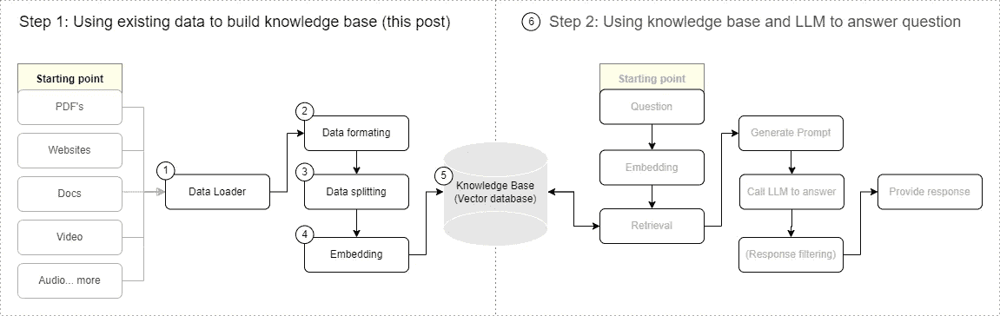
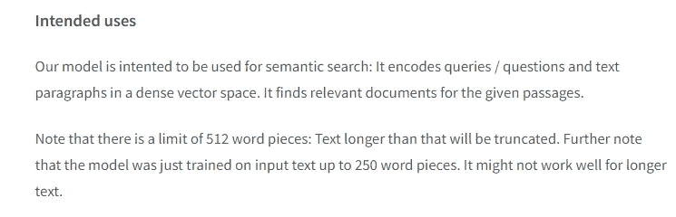
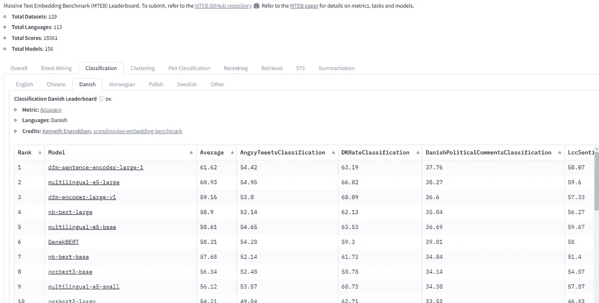

# 超越英语：实现多语言 RAG 解决方案

> 原文：[`towardsdatascience.com/beyond-english-implementing-a-multilingual-rag-solution-12ccba0428b6?source=collection_archive---------0-----------------------#2023-12-20`](https://towardsdatascience.com/beyond-english-implementing-a-multilingual-rag-solution-12ccba0428b6?source=collection_archive---------0-----------------------#2023-12-20)

## 实施非英语检索增强生成（RAG）系统时的注意事项

[](https://medium.com/@jalkestrup?source=post_page-----12ccba0428b6--------------------------------)[](https://towardsdatascience.com/?source=post_page-----12ccba0428b6--------------------------------) [Jesper Alkestrup](https://medium.com/@jalkestrup?source=post_page-----12ccba0428b6--------------------------------)

·

[阅读](https://medium.com/m/signin?actionUrl=https%3A%2F%2Fmedium.com%2F_%2Fsubscribe%2Fuser%2F84e00f9ebe19&operation=register&redirect=https%3A%2F%2Ftowardsdatascience.com%2Fbeyond-english-implementing-a-multilingual-rag-solution-12ccba0428b6&user=Jesper+Alkestrup&userId=84e00f9ebe19&source=post_page-84e00f9ebe19----12ccba0428b6---------------------post_header-----------) 在 [Towards Data Science](https://towardsdatascience.com/?source=post_page-----12ccba0428b6--------------------------------) 发布 · 18 分钟阅读 · 2023 年 12 月 20 日

--

[](https://medium.com/m/signin?actionUrl=https%3A%2F%2Fmedium.com%2F_%2Fbookmark%2Fp%2F12ccba0428b6&operation=register&redirect=https%3A%2F%2Ftowardsdatascience.com%2Fbeyond-english-implementing-a-multilingual-rag-solution-12ccba0428b6&source=-----12ccba0428b6---------------------bookmark_footer-----------)

RAG，一个无所不知的同事，全天候提供服务（图片由作者使用 Dall-E 3 生成）

## TLDR

这篇文章介绍了在开发非英语 RAG 系统时应考虑的因素，并提供了具体的示例和技术。关键点包括：

+   在数据加载过程中优先保持句法结构，因为这对有意义的文本分割至关重要。

+   使用简单分隔符如\n\n 来格式化文档，以促进高效的文本拆分。

+   选择基于规则的文本分割器，因为在多语言环境中，基于 ML 的语义分割器计算强度大且性能较差。

+   在选择嵌入模型时，考虑其多语言能力和不对称检索性能。

+   对于多语言项目，通过大语言模型 (LLM) 微调嵌入模型可以提高性能，可能需要以实现足够的准确性。

+   强烈推荐实施基于 LLM 的检索评估基准，以有效微调 RAG 系统的超参数，并且可以利用现有框架轻松完成。

RAG 成为 2023 年搜索技术中最流行的术语也就不足为奇了。检索增强生成 (RAG) 正在改变组织利用其大量现有数据来推动智能聊天机器人的方式。这些能够进行自然语言对话的机器人，可以利用组织的集体知识，充当一个始终可用的内部专家，提供基于经验证数据的相关答案。虽然有大量资源可用于构建 RAG 系统，但大多数资源针对的是英语，较小语言的资源仍有缺口。

> 这份易于遵循的 6 步指南将引导你了解在为非英语语言创建 RAG 系统时的注意事项。

## RAG 结构，简要回顾

本文假设读者对嵌入、向量和标记等概念有一定了解。对于需要简要回顾 RAG 系统架构的人来说，它们主要由两个核心组件组成：

1.  索引阶段（本文的重点）：这一初始阶段涉及处理输入数据。数据首先被加载、适当格式化，然后进行拆分。之后，数据通过嵌入技术进行向量化，最终存储在知识库中以便将来检索。

1.  生成阶段：在此阶段，用户的查询被输入到检索系统中。该系统随后从知识库中提取相关信息片段。利用大语言模型 (LLM)，系统解释这些数据以制定连贯的自然语言响应，有效地解答用户的询问。



现在让我们开始吧！

*免责声明：*

*本指南并不旨在成为使用任何特定工具的详尽手册。相反，其目的是阐明应指导工具选择的总体决策。实际上，我强烈建议利用已建立的框架来构建系统基础。对于构建 RAG 系统，我个人推荐 LlamaIndex，因为它们提供了详细的指南和专注于索引和检索优化的功能。*

*此外，本指南假设我们处理的是使用拉丁字母并从左向右阅读的语言。这包括德语、法语、西班牙语、捷克语、土耳其语、越南语、挪威语、波兰语以及其他一些语言。其他语言可能有不同的需求和考虑因素。*

# 1\. 数据加载器：关键在于细节


一个外观酷炫的多模态数据加载器（图像由作者使用 Dall-E 3 生成）

RAG 系统的第一步是使用数据加载器处理各种格式，从文本文件到多媒体，提取所有相关内容以供进一步处理。对于基于文本的格式，数据加载器通常在不同语言间表现一致，因为它们不涉及特定语言的处理。然而，随着多模态 RAG 系统的出现，了解语音转文本模型在与其英语对应模型相比性能降低的情况非常重要。像[Whisper v3](https://github.com/openai/whisper)这样的模型展示了令人印象深刻的多语言能力，但最好查看它们在[Mozilla Common Voice](https://commonvoice.mozilla.org/en/datasets)或[Fleurs](https://huggingface.co/datasets/google/fleurs)数据集上的表现，并且最好在自己的基准上进行评估。

本文其余部分将集中讨论基于文本的输入。

## 保留句法结构为何重要

> 数据加载的一个关键方面是保持原始数据的句法完整性。丢失诸如标题或段落结构的元素可能会影响后续信息检索的准确性。对于非英语语言，这种担忧尤为突出，因为基于机器学习的分段工具的可用性有限。

句法信息发挥着至关重要的作用，因为 RAG 系统在提供有意义答案的效果部分取决于它们将数据拆分为语义准确的子部分的能力。

为了突出保留结构的数据加载方法与不保留结构的方法之间的区别，举一个使用基础 HTML 数据加载器与 PDF 加载器对[medium article](https://blog.llamaindex.ai/boosting-rag-picking-the-best-embedding-reranker-models-42d079022e83)的例子。像[LangChain](https://python.langchain.com/docs/modules/data_connection/document_loaders/html)和[LlamaIndex](https://llamahub.ai/l/web-beautiful_soup_web)这样的库都依赖于完全相同的库，但只是将函数封装在各自的文档类中（Web 用 Requests+BS4，PDF 用 PyPDF2）。

**HTML 数据加载器：此方法保留了内容的句法结构。**

```py
import requests
from bs4 import BeautifulSoup
url = "https://medium.com/llamaindex-blog/boosting-rag-picking-the-best-embedding-reranker-models-42d079022e83"
soup = BeautifulSoup(requests.get(url).text, 'html.parser')
filtered_tags = soup.find_all(['h1', 'h2', 'h3', 'h4', 'p'])
filtered_tags[:14]
```

```py
<p class="be b dw dx dy dz ea eb ec ed ee ef dt"><span><a class="be b dw dx eg dy dz eh ea eb ei ec ed ej ee ef ek el em eo ep eq er es et eu ev ew ex ey ez fa bl fb fc" data-testid="headerSignUpButton" href="https://medium.com/m/signin?operation=register&amp;redirect=https%3A%2F%2Fblog.llamaindex.ai%2Fboosting-rag-picking-the-best-embedding-reranker-models-42d079022e83&amp;source=post_page---two_column_layout_nav-----------------------global_nav-----------" rel="noopener follow">Sign up</a></span></p>
<p class="be b dw dx dy dz ea eb ec ed ee ef dt"><span><a class="af ag ah ai aj ak al am an ao ap aq ar as at" data-testid="headerSignInButton" href="https://medium.com/m/signin?operation=login&amp;redirect=https%3A%2F%2Fblog.llamaindex.ai%2Fboosting-rag-picking-the-best-embedding-reranker-models-42d079022e83&amp;source=post_page---two_column_layout_nav-----------------------global_nav-----------" rel="noopener follow">Sign in</a></span></p>
<p class="be b dw dx dy dz ea eb ec ed ee ef dt"><span><a class="be b dw dx eg dy dz eh ea eb ei ec ed ej ee ef ek el em eo ep eq er es et eu ev ew ex ey ez fa bl fb fc" data-testid="headerSignUpButton" href="https://medium.com/m/signin?operation=register&amp;redirect=https%3A%2F%2Fblog.llamaindex.ai%2Fboosting-rag-picking-the-best-embedding-reranker-models-42d079022e83&amp;source=post_page---two_column_layout_nav-----------------------global_nav-----------" rel="noopener follow">Sign up</a></span></p>
<p class="be b dw dx dy dz ea eb ec ed ee ef dt"><span><a class="af ag ah ai aj ak al am an ao ap aq ar as at" data-testid="headerSignInButton" href="https://medium.com/m/signin?operation=login&amp;redirect=https%3A%2F%2Fblog.llamaindex.ai%2Fboosting-rag-picking-the-best-embedding-reranker-models-42d079022e83&amp;source=post_page---two_column_layout_nav-----------------------global_nav-----------" rel="noopener follow">Sign in</a></span></p>
<h1 class="pw-post-title gp gq gr be gs gt gu gv gw gx gy gz ha hb hc hd he hf hg hh hi hj hk hl hm hn ho hp hq hr bj" data-testid="storyTitle" id="f2a9">Boosting RAG: Picking the Best Embedding &amp; Reranker models</h1>
<p class="be b iq ir bj"><a class="af ag ah ai aj ak al am an ao ap aq ar is" data-testid="authorName" href="https://ravidesetty.medium.com/?source=post_page-----42d079022e83--------------------------------" rel="noopener follow">Ravi Theja</a></p>
<p class="be b iq ir dt"><span><a class="iv iw ah ai aj ak al am an ao ap aq ar eu ix iy" href="https://medium.com/m/signin?actionUrl=https%3A%2F%2Fmedium.com%2F_%2Fsubscribe%2Fuser%2F60738cbbc7df&amp;operation=register&amp;redirect=https%3A%2F%2Fblog.llamaindex.ai%2Fboosting-rag-picking-the-best-embedding-reranker-models-42d079022e83&amp;user=Ravi+Theja&amp;userId=60738cbbc7df&amp;source=post_page-60738cbbc7df----42d079022e83---------------------post_header-----------" rel="noopener follow">Follow</a></span></p>
<p class="be b bf z jh ji jj jk jl jm jn jo bj">LlamaIndex Blog</p>
<p class="be b du z dt"><span class="lq">--</span></p>
<p class="be b du z dt"><span class="pw-responses-count lr ls">5</span></p>
<p class="be b bf z dt">Listen</p>
<p class="be b bf z dt">Share</p>
<p class="pw-post-body-paragraph nl nm gr nn b no np nq nr ns nt nu nv nw nx ny nz oa ob oc od oe of og oh oi gk bj" id="4130"><strong class="nn gs">UPDATE</strong>: The pooling method for the Jina AI embeddings has been adjusted to use mean pooling, and the results have been updated accordingly. Notably, the <code class="cw oj ok ol om b">JinaAI-v2-base-en</code> with <code class="cw oj ok ol om b">bge-reranker-large</code>now exhibits a Hit Rate of 0.938202 and an MRR (Mean Reciprocal Rank) of 0.868539 and with<code class="cw oj ok ol om b">CohereRerank</code> exhibits a Hit Rate of 0.932584, and an MRR of 0.873689.</p>
<p class="pw-post-body-paragraph nl nm gr nn b no np nq nr ns nt nu nv nw nx ny nz oa ob oc od oe of og oh oi gk bj" id="8267">When building a Retrieval Augmented Generation (RAG) pipeline, one key component is the Retriever. We have a variety of embedding models to choose from, including OpenAI, CohereAI, and open-source sentence transformers. Additionally, there are several rerankers available from CohereAI and sentence transformers.</p>
```

**PDF 数据加载器，句法信息丢失的示例**（将文章保存为 PDF 后重新加载）

```py
from PyPDF2 import PdfFileReader
pdf = PdfFileReader(open('data/Boosting_RAG_Picking_the_Best_Embedding_&_Reranker_models.pdf','rb'))
pdf.getPage(0).extractText()
```

```py
'Boosting RAG: Picking the Best\nEmbedding & Reranker models\n
Ravi Theja·Follow\nPublished inLlamaIndex Blog·7 min read·Nov 3\n
389 5\nUPDATE: The pooling method for the Jina AI embeddings has been adjusted\n
to use mean pooling, and the results have been updated accordingly.\n
Notably, the JinaAI-v2-base-en with bge-reranker-largenow exhibits a Hit\n
Rate of 0.938202 and an MRR (Mean Reciprocal Rank) of 0.868539 and\n
withCohereRerank exhibits a Hit Rate of 0.932584, and an MRR of 0.873689.\n
When building a Retrieval Augmented Generation (RAG) pipeline, one key\n
component is the Retriever. We have a variety of embedding models to\n
choose from, including OpenAI, CohereAI, and open-source sentence\n
Open in app\nSearch Write\n'
```

初步检查显示，PDF 数据加载器的输出看起来更可读，但仔细检查后发现丢失了结构信息——如何区分标题和节的结束？相比之下，HTML 文件保留了所有相关的结构。

理想情况下，你希望在数据加载器中保留所有原始格式，并且仅在下一步决定过滤和重新格式化。然而，这可能涉及为你的使用案例构建自定义数据加载器，并且在某些情况下可能是不可能的。我建议你从标准数据加载器开始，但花几分钟仔细检查加载的数据示例，并了解丢失了哪些结构。

了解丢失的语法结构是至关重要的，因为它指导了系统下游检索性能需要改进的潜在方向，允许进行有针对性的优化。

# 2. 数据格式化：无聊……但重要


文档分块（图像由作者使用 Dall-E 3 生成）

第二步，格式化，其主要目的是以统一的方式整理来自数据加载器的数据，以便为下一步的文本拆分做准备。如以下章节所述，将输入文本划分为无数较小的块是必要的。成功的格式化将文本设置成提供最佳条件以将内容划分为语义上有意义的块。简单来说，你的目标是将从 html 或 markdown 文件中检索到的潜在复杂语法结构转换为带有基本分隔符的纯文本文件，如 /n（换行）和 /n/n（节结束），以指导文本拆分器。

一个简单的函数将 BS4 HTML 对象格式化为包含标题和文本的字典，如下所示：

```py
def format_html(tags):
    formatted_text = ""
    title = ""

    for tag in tags:
        if 'pw-post-title' in tag.get('class', []):
            title = tag.get_text()
        elif tag.name == 'p' and 'pw-post-body-paragraph' in tag.get('class', []):
            formatted_text += "\n"+ tag.get_text()
        elif tag.name in ['h1', 'h2', 'h3', 'h4']:
            formatted_text += "\n\n" + tag.get_text()

    return {title: formatted_text}

formatted_document = format_html(filtered_tags)
```

```py
{'Boosting RAG: Picking the Best Embedding & Reranker models': "\n
UPDATE: The pooling method for the Jina AI embeddings has been adjusted to use mean pooling, and the results have been updated accordingly. Notably, the JinaAI-v2-base-en with bge-reranker-largenow exhibits a Hit Rate of 0.938202 and an MRR (Mean Reciprocal Rank) of 0.868539 and withCohereRerank exhibits a Hit Rate of 0.932584, and an MRR of 0.873689.\n
When building a Retrieval Augmented Generation (RAG) pipeline, one key component is the Retriever. We have a variety of embedding models to choose from, including OpenAI, CohereAI, and open-source sentence transformers. Additionally, there are several rerankers available from CohereAI and sentence transformers.\n
But with all these options, how do we determine the best mix for top-notch retrieval performance? How do we know which embedding model fits our data best? Or which reranker boosts our results the most?\n
In this blog post, we’ll use the Retrieval Evaluation module from LlamaIndex to swiftly determine the best combination of embedding and reranker models. Let's dive in!\n
Let’s first start with understanding the metrics available in Retrieval Evaluation\n\n
... }
```

对于复杂的 RAG 系统，其中相对于上下文可能有多个正确答案，将文档标题或标题等附加信息存储为文本块的元数据是有益的。这些元数据可以在之后用于过滤，如果可用，格式化元素如标题应影响你的分块策略。像 LlamaIndex 这样的库本地处理与元数据和文本一起封装在 Node 对象中的概念，我强烈推荐使用这个或类似的框架。

现在我们已经正确地完成了格式化，让我们深入探讨文本拆分的关键方面吧！

# 3: 文本拆分：大小重要


拆分文本，简单的方法（图像由作者使用 Dall-E 3 生成）

在为 RAG 系统准备数据以进行嵌入和检索时，将文本拆分为适当大小的块是至关重要的。这个过程受两个主要因素的指导：模型约束和检索有效性。

## **模型约束**

嵌入模型对输入的最大 token 长度有一个限制；超出此限制的内容会被截断。了解所选择模型的限制，并确保每个数据块不超过此最大 token 长度。

> 多语言模型，特别是，与其英文对应模型相比，通常具有较短的序列限制。例如，广泛使用的 Paraphrase multilingual MiniLM-L12 v2 模型的最大上下文窗口仅为 128 个 token。

此外，还要考虑模型的训练文本长度——一些模型虽然在技术上可以接受更长的输入，但其训练数据却较短，这可能会影响对较长文本的性能。例如，[SBERT 的 Multi QA 基础模型](https://huggingface.co/sentence-transformers/multi-qa-mpnet-base-dot-v1) 如下所示，



## **检索效果**

虽然将数据拆分到模型的最大长度似乎是合理的，但这可能并不总是能带来最佳的检索结果。较大的块为 LLM 提供了更多的上下文，但可能会掩盖关键细节，使得精确匹配更加困难。相反，较小的块可以提高匹配准确性，但可能缺乏获取完整答案所需的上下文。混合方法使用较小的块进行搜索，但在查询时包括周围的上下文以保持平衡。

尽管关于块大小没有确切的答案，但块大小的考虑在多语言项目和英语项目中是一致的。我建议进一步阅读相关资源，如 [使用 Llamaindex 评估 RAG 系统的理想块大小](https://blog.llamaindex.ai/evaluating-the-ideal-chunk-size-for-a-rag-system-using-llamaindex-6207e5d3fec5) 或 [为生产环境构建基于 RAG 的 LLM 应用程序](https://www.anyscale.com/blog/a-comprehensive-guide-for-building-rag-based-llm-applications-part-1?utm_source=gradientflow&utm_medium=newsletter#chunk-data)。

## **文本拆分：文本拆分的方法**

文本可以通过各种方法进行拆分，主要分为两类：基于规则的（注重字符分析）和基于机器学习的模型。机器学习方法，从简单的 NLTK 和 Spacy 分词器到先进的 transformer 模型，通常依赖于语言特定的训练，主要是英语。尽管像 NLTK 和 Spacy 这样的简单模型支持多种语言，但它们主要处理句子拆分，而非语义划分。

> *由于基于机器学习的句子拆分器目前在大多数非英语语言中效果不佳且计算密集，我建议从简单的基于规则的拆分器开始。如果你保留了原始数据的相关句法结构，并正确地格式化了数据，结果将会质量良好。*

一种常见而有效的方法是递归字符文本分割器，例如在 [LangChain](https://python.langchain.com/docs/modules/data_connection/document_transformers/text_splitters/recursive_text_splitter) 或 LlamaIndex 中使用的，它通过在优先序列中找到最近的分隔字符（例如 \n\n, \n, ., ?, !）来缩短段落。

使用前一部分格式化文本的示例，使用 LangChain 的递归字符分割器如下所示：

```py
from langchain.text_splitter import RecursiveCharacterTextSplitter
from transformers import AutoTokenizer

tokenizer = AutoTokenizer.from_pretrained("intfloat/e5-base-v2")

def token_length_function(text_input):
  return len(tokenizer.encode(text_input, add_special_tokens=False))

text_splitter = RecursiveCharacterTextSplitter(
    # Set a really small chunk size, just to show.
    chunk_size = 128,
    chunk_overlap  = 0,
    length_function = token_length_function,
    separators = ["\n\n", "\n", ". ", "? ", "! "]
)

split_texts = text_splitter(formatted_document['Boosting RAG: Picking the Best Embedding & Reranker models'])
```

在这里，需要注意的是，应该将分词器定义为拟使用的嵌入模型，因为不同模型对词汇的计数方式不同。函数现在将按照优先顺序，首先通过我们在段落末尾引入的 \n\n 拆分任何超过 128 个标记的文本，如果不可能，则通过 \n 分隔的段落末尾，依此类推。前三个块将是：

```py
Token of text: 111 

UPDATE: The pooling method for the Jina AI embeddings has been adjusted to use mean pooling, and the results have been updated accordingly. Notably, the JinaAI-v2-base-en with bge-reranker-largenow exhibits a Hit Rate of 0.938202 and an MRR (Mean Reciprocal Rank) of 0.868539 and withCohereRerank exhibits a Hit Rate of 0.932584, and an MRR of 0.873689.

-----------

Token of text: 112 

When building a Retrieval Augmented Generation (RAG) pipeline, one key component is the Retriever. We have a variety of embedding models to choose from, including OpenAI, CohereAI, and open-source sentence transformers. Additionally, there are several rerankers available from CohereAI and sentence transformers.
But with all these options, how do we determine the best mix for top-notch retrieval performance? How do we know which embedding model fits our data best? Or which reranker boosts our results the most?

-----------

Token of text: 54 

In this blog post, we’ll use the Retrieval Evaluation module from LlamaIndex to swiftly determine the best combination of embedding and reranker models. Let's dive in!
Let’s first start with understanding the metrics available in Retrieval Evaluation
```

现在我们已经成功地以语义上有意义的方式拆分了文本，可以进入最终阶段，即将这些块嵌入以便存储。

# **4\. 嵌入模型：在丛林中导航**


嵌入模型将文本转换为向量（图片由作者使用 Dall-E 3 生成）

选择正确的嵌入模型对于检索增强生成（RAG）系统的成功至关重要，这比英语语言的情况复杂得多。比较模型的一个全面资源是 [Massive Text Embedding Benchmark (MTEB)](https://huggingface.co/spaces/mteb/leaderboard)，其中包含超过 100 种语言的基准。

> 你选择的模型必须是多语言的，或专门针对你正在使用的语言（单语言）定制的。请记住，最新的高性能模型通常以英语为中心，可能不适用于其他语言。



如果有相关资源，请参考与你的任务相关的语言特定基准。例如，在分类任务中，有超过 50 个语言特定的基准，帮助选择最有效的模型，适用于从丹麦语到西班牙语的语言。然而，重要的是要注意，这些基准可能不会直接指示模型在 RAG 系统中检索相关信息的效率，因为检索与分类、聚类或其他任务不同。任务是找到训练用于不对称搜索的模型，因为那些没有针对这一特定任务训练的模型可能会不准确地优先考虑较短的段落而非较长且更相关的段落。

> 该模型应在[非对称检索](https://www.sbert.net/examples/applications/semantic-search/README.html)中表现出色，将短查询匹配到较长的文本块。原因在于，在 RAG 系统中，你通常需要将简短的查询匹配到更长的段落中以提取有意义的答案。与非对称检索相关的 MTEB 基准列在检索部分。一个挑战是截至 2023 年 11 月，MTEB 的检索基准仅包括英语、中文和波兰语。

在处理像挪威语这样的语言时，可能没有特定的检索基准，你可能会想知道是否应该选择分类基准中表现最好的模型，还是选择一个在英语检索方面表现出色的通用多语言模型？

对于实际建议，简单的经验法则是选择 MTEB 检索基准中表现最好的多语言模型。注意，检索评分本身仍然基于英语，因此需要在你自己的语言上进行基准测试以验证性能（第 6 步）。截至 2023 年 12 月，E5-多语言系列是开源模型的一个强有力的选择。该模型经过针对非对称检索的微调，通过在嵌入前将文本标记为“查询”或“段落”，它通过考虑输入的性质优化了检索过程。这种方法确保了查询与知识库中相关信息之间的更有效匹配，从而提升了 RAG 系统的整体性能。根据基准测试，cohere-embed-multilingual-v3.0 可能表现更佳，但需付费。

嵌入步骤通常作为存储文档到向量数据库的一部分完成，但使用 E5 系列对所有分割句子进行嵌入的简单示例如下，使用了 Sentence Transformer 库。

```py
from sentence_transformers import SentenceTransformer
model = SentenceTransformer('intfloat/e5-large')

prepended_split_texts = ["passage: " + text for text in split_texts]
embeddings = model.encode(prepended_split_texts, normalize_embeddings=True)

print(f'We now have {len(embeddings)} embeddings, each of size {len(embeddings[0])}')
```

```py
We now have 12 embeddings, each of size 1024
```

如果现成的嵌入在你的特定检索领域中表现不够理想，不用担心。随着 LLM 的出现，现在可以从现有语料库中自动生成训练数据，并通过在你自己的数据上微调现有嵌入提高性能，提升幅度可达 5–10%。[LlamaIndex 在这里提供了一个指南](https://blog.llamaindex.ai/fine-tuning-embeddings-for-rag-with-synthetic-data-e534409a3971) 或 [SBERTs GenQ 方法](https://www.sbert.net/examples/unsupervised_learning/query_generation/README.html#bi-encoder-training)，其中主要是 Bi-Encoder 训练部分相关。

# **5\. 向量数据库：嵌入的家园**


嵌入存储在数据库中以供检索（图像由作者通过 Dall-E 3 生成）

在加载、格式化、拆分数据并选择嵌入模型之后，RAG 系统设置的下一步是嵌入数据并存储这些向量嵌入以供检索。大多数平台，包括 LangChain 和 LlamaIndex，都提供了集成的本地存储解决方案，使用像 Qdrant、Milvus、Chroma DB 这样的向量数据库，或者直接与基于云的存储选项如 Pinecone 或 ActiveLoop 集成。向量存储的选择通常不受数据语言（英语或其他语言）的影响。为了全面了解存储和搜索选项，包括向量数据库，我推荐你探索现有资源，例如这个详细介绍：关于向量数据库及其如何增强你的 LLM 应用程序的全部知识。这个指南将为你提供有效管理 RAG 系统存储方面的必要见解。

到目前为止，你已经成功创建了作为检索系统“大脑”的知识库。


生成响应（图像由作者 w. Dall-E 3 生成）

# 6. 生成阶段：去其他地方阅读 😉

RAG 系统的第二部分，生成阶段，在确保解决方案成功方面同样重要。严格来说，这是一个搜索优化问题，上面加上了一些 LLM，考虑因素较少依赖语言。这意味着针对英语的检索优化指南通常也适用于其他语言，因此在此未包含。

在最简单的形式中，生成阶段涉及一个直接的过程：获取用户的问题，使用第 4 步中选择的嵌入模型进行嵌入，在新创建的数据库中执行向量相似度搜索，然后将相关的文本块提供给 LLM。这使得系统能够用自然语言回应查询。然而，要实现高性能的 RAG 系统，需要在检索方面进行若干调整，如重新排序、过滤等。有关更多见解，我建议你探索一些文章，例如 提升检索增强生成系统性能的 10 种方法 或 通过混合搜索改进 RAG 管道中的检索性能。

# **结语：评估你的 RAG 系统**


正确的选择是什么？（图像由作者 w. Dall-E 3 生成）

那么你接下来该做什么？针对你的具体问题和语言，正确的配置是什么？

现在可能已经很清楚，决定 RAG 系统的最佳设置可能是一项复杂的任务，因为涉及的变量众多。定制的查询和上下文基准对于评估不同配置至关重要，特别是因为针对你特定的多语言数据集和用例的现有基准非常不可能存在。

幸运的是，凭借大型语言模型（LLMs），创建定制的基准数据集已变得可行。检索系统的基准通常包括搜索查询及其对应的上下文（我们在第 4 步中拆分的文本块）。如果你拥有原始数据，LLMs 可以自动生成与数据集相关的虚构查询。[像 LlamaIndex 这样的工具提供了内置功能来实现这一目的](https://docs.llamaindex.ai/en/stable/examples/evaluation/retrieval/retriever_eval.html)。通过生成自定义查询，你可以系统地测试嵌入模型、块大小或数据格式的调整对你特定场景下检索性能的影响。

创建一个具有代表性的评估基准涉及许多注意事项，2024 年初我将跟进一篇关于如何创建一个表现良好的检索基准的单独文章——敬请期待！

感谢你抽出时间阅读这篇文章，希望你觉得这篇文章对你有所帮助。

**如果内容对你有帮助，请记得点赞👏👏👏，如有问题或评论，请随时与我联系。**

**参考文献：**

+   [使用 Llamaindex 评估 RAG 系统的理想块大小](https://blog.llamaindex.ai/evaluating-the-ideal-chunk-size-for-a-rag-system-using-llamaindex-6207e5d3fec5)

+   [构建基于 RAG 的 LLM 应用程序以投入生产](https://www.anyscale.com/blog/a-comprehensive-guide-for-building-rag-based-llm-applications-part-1?utm_source=gradientflow&utm_medium=newsletter#chunk-data)

+   如何分块文本数据的比较分析

+   [大规模文本嵌入基准 (MTEB)](https://huggingface.co/spaces/mteb/leaderboard)

+   [SBERT 在非对称检索中的应用](https://www.sbert.net/examples/applications/semantic-search/README.html)

+   [使用 LlamaIndex 微调嵌入](https://blog.llamaindex.ai/fine-tuning-embeddings-for-rag-with-synthetic-data-e534409a3971)

+   [使用 SBERT 的 GenQ 方法微调嵌入](https://www.sbert.net/examples/unsupervised_learning/query_generation/README.html#bi-encoder-training)

+   关于向量数据库及其如何增强你的 LLM 应用程序的所有信息

+   提高检索增强生成系统性能的 10 种方法

+   通过混合搜索提高 RAG 管道中的检索性能

+   [使用 LlamaIndex 评估 RAG 系统的检索性能](https://docs.llamaindex.ai/en/stable/examples/evaluation/retrieval/retriever_eval.html)
