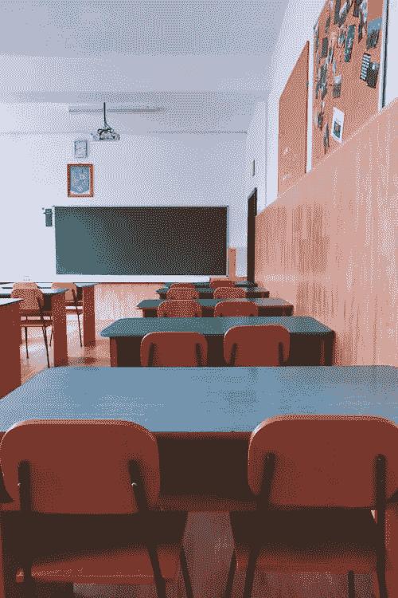

# 如何利用 AI 预测和解释学生表现？

> 原文：[`towardsdatascience.com/beyond-grades-using-ai-to-forecast-and-explain-student-performance-23580747e8b0?source=collection_archive---------5-----------------------#2023-09-18`](https://towardsdatascience.com/beyond-grades-using-ai-to-forecast-and-explain-student-performance-23580747e8b0?source=collection_archive---------5-----------------------#2023-09-18)

## 能否利用 AI 来降低年度重修率并提升教育质量？

 [Christian Galea](https://medium.com/@chrisgalea?source=post_page-----23580747e8b0--------------------------------)

·

[关注](https://medium.com/m/signin?actionUrl=https%3A%2F%2Fmedium.com%2F_%2Fsubscribe%2Fuser%2Fa9be78db0c9b&operation=register&redirect=https%3A%2F%2Ftowardsdatascience.com%2Fbeyond-grades-using-ai-to-forecast-and-explain-student-performance-23580747e8b0&user=Christian+Galea&userId=a9be78db0c9b&source=post_page-a9be78db0c9b----23580747e8b0---------------------post_header-----------) 发表在 [Towards Data Science](https://towardsdatascience.com/?source=post_page-----23580747e8b0--------------------------------) ·27 分钟阅读·2023 年 9 月 18 日

--

图片由 [Dids](https://www.pexels.com/@didsss/) 提供，来自 [Pexels](https://www.pexels.com/photo/photo-of-empty-class-room-2675061/)

# 👋 介绍

机器学习（ML）通过使计算机能够从数据中学习和做出决策，显著改变了各行业。从电子商务网站上推荐产品到诊断医疗状况，ML 和人工智能（AI）的应用既多样又有深远的影响。

机器学习在应用于音频、图像和视频时也非常有用。比如面部识别和图像质量提升，后者在我之前的两篇文章中有所涉及：

 ## 什么是“图像超分辨率”，我们为什么需要它？

### 对这一领域的介绍、应用及当前问题

towardsdatascience.com  ## 图像超分辨率：当前研究状态的概述

### 对流行技术和尚待解决挑战的综述

towardsdatascience.com

最近出现的大型语言模型（LLMs），例如[ChatGPT](https://chat.openai.com/)，展示了机器学习的强大力量…
