# 超越 LLaMA：开源 LLMs 的力量

> 原文：[`towardsdatascience.com/beyond-llama-the-power-of-open-llms-cef807a54a4f`](https://towardsdatascience.com/beyond-llama-the-power-of-open-llms-cef807a54a4f)

## LLaMA 如何让开源再次变得酷炫

 [Cameron R. Wolfe, Ph.D.](https://wolfecameron.medium.com/?source=post_page-----cef807a54a4f--------------------------------)

·发表于 [Towards Data Science](https://towardsdatascience.com/?source=post_page-----cef807a54a4f--------------------------------) ·18 min read·2023 年 7 月 18 日

--

（图片由 [Paz Arando](https://unsplash.com/@pazarando?utm_source=unsplash&utm_medium=referral&utm_content=creditCopyText) 提供，来源于 [Unsplash](https://unsplash.com/s/photos/llama?utm_source=unsplash&utm_medium=referral&utm_content=creditCopyText)）

尽管大型语言模型（LLMs）近期取得了进展，但许多最强大的模型仍然只能通过 [付费 API](https://console.anthropic.com/docs/api) 访问，并且使用大量的 [专有数据](https://openai.com/research/gpt-4) 进行训练，从而限制了研究社区对这些模型的访问或复制。这一趋势引发了严重的担忧，即 LLMs 是否将主要由少数几个集中化的组织控制，这些组织迫使他人支付费用以与这些模型互动。这种情况严格阻止了大多数研究人员直接访问或自行改进 LLMs。

> “[许多] LLMs 需要巨大的计算资源进行训练，而且通常使用大型且专有的数据集。这表明未来，高能力的 LLMs 将主要由少数几个组织控制。” *— 摘自 [5]*

鉴于训练和托管大型语言模型（LLMs）的计算负担，我们可能会质疑开源这些模型对研究社区是否真的有帮助。如果我们不是拥有大量计算资源的大型组织的一部分，*我们甚至能用 LLMs 进行有意义的研究吗？* 如果不能，也许我们注定要面对一个中央控制和访问 LLMs 的世界。这些模型似乎具有过强的“引力”（即需要大量的数据和计算资源），让大多数人很难轻松使用它们。

[LLaMA](https://cameronrwolfe.substack.com/p/llama-llms-for-everyone) 的提议（以及随后向公众泄露）通过开源一套强大的（但较小的）LLM，走向了相反的方向。在 LLaMA 向公众发布之后，我们见证了一波大规模的 LLM 开放研究。这些研究产生了各种不同的模型，其中一些与 ChatGPT 的质量相当。然而，最显著的是，这些模型的生产成本极低（即，大多数情况下低于 $500）且计算资源 modest（即，部分模型可在普通 macbook 上运行！）。在这里，我们将调查一些最近提出的后 LLaMA 模型，并探索开源 LLM 研究如何使这一主题变得更易接触。

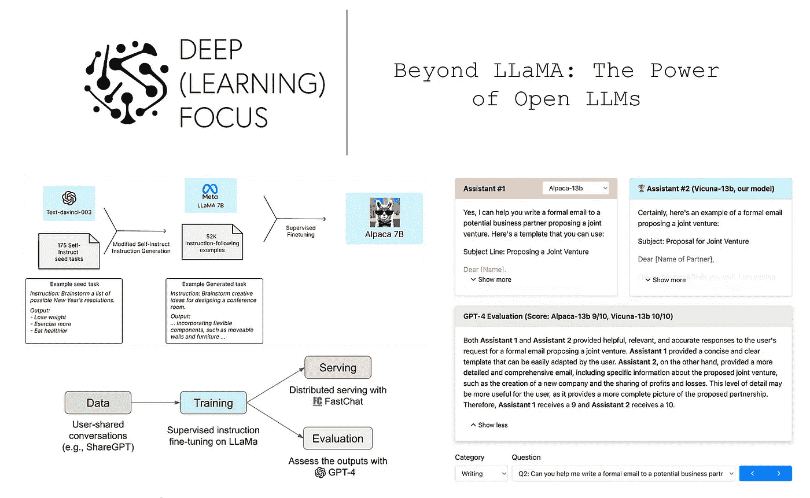

（来自 [3, 4, 5]）

# 核心概念

在 [之前的一篇文章](https://cameronrwolfe.substack.com/p/llama-llms-for-everyone)中，我们了解了 LLaMA，这是一套开源的高性能 LLM，具有多种规模。LLaMA 模型仅在公共数据上进行训练，使其与开源兼容，并且无需访问专有数据即可重复生成。然而，LLaMA 的故事并未止步于此！这些模型最近已成为深度学习的热门话题。在本概述中，我们将探讨 LLaMA 使研究得以进行的原因，并了解这些模型为何以及如何变得流行。首先，我们将提供更多有关 LLaMA 的背景信息，然后概述本概述所需理解的重要思想。

## LLaMA 是如何（或未能）开源的……

深度学习社区已经接受了开源一段时间，某些研究领域仍然如此（例如，请参见 [Stable Diffusion](https://stability.ai/blog/stable-diffusion-public-release)）。然而，LLM 领域却大相径庭，因为最受欢迎/强大的模型仅通过付费 API 提供（例如，[GPT-4](https://openai.com/research/gpt-4) [6]、[Claude](https://www.anthropic.com/index/introducing-claude) 和 [Cohere](https://cohere.ai/)）。[LLaMA](https://cameronrwolfe.substack.com/p/llama-llms-for-everyone) [1] 的开源，即一套质量卓越的较小 LLM 基础模型，打破了这一趋势。然而，LLaMA 并没有 *完全* 开源……故事要复杂一些。

首先，LLaMA 被 [Meta](https://ai.facebook.com/blog/large-language-model-llama-meta-ai/) 公布，详细信息包括深入、有用的 [出版物](https://arxiv.org/abs/2302.13971)、申请访问 LLaMA 的表单以及一个 [简单的仓库](https://github.com/facebookresearch/llama)，在获得模型访问权限后可用于运行推理和标记化。为了获得模型访问权限，必须同意一系列要求，例如不将 LLaMA 用于商业目的，并确保用 LLaMA 创建的任何 [衍生模型](https://www.law.cornell.edu/wex/derivative_work) 遵循相同的许可证。但这些要求都被抛到一边了，因为在发布大约一周后，所有 LLaMA 模型的权重被公开发布到 4chan，任何人都可以下载。

尽管 LLaMA 的共享方式出乎意料（且可以说是有害的），但它引发了数千次下载，并且随后促进了大量的开放研究。鉴于 LLaMA 由更小的模型组成，这些模型对于没有大量计算资源的研究人员来说更为可及，这些模型非常适合这种情况。在几周内，大量令人惊叹的深度学习研究人员投入工作，利用 LLaMA 开展了各种项目，从在 Macbook 上托管多亿参数的 LLM 到用不到 $500 复现 ChatGPT。

## 指令微调

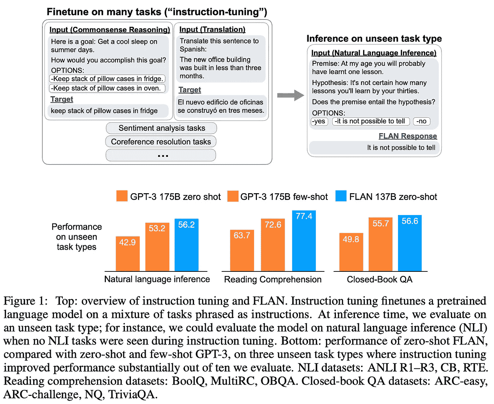

（来自 [10]）

我们在本概述中看到的许多模型都是基于指令微调（或简称为指令调优）的思想。指令微调最初由 [FLAN](https://ai.googleblog.com/2021/10/introducing-flan-more-generalizable.html) [10] 提出，它是一种训练形式，使语言模型在解决语言相关任务方面表现更好，而不仅仅是单一任务；见上文。实际上，这通过在一组“指令”上对语言模型进行微调来实现，这些指令包括与任务描述结合的微调示例。通过这种方法，我们可以通过使用不同的任务模板进行文本提示，微调语言模型以解决各种不同的任务；见下文。

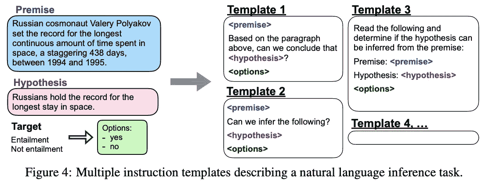

（来自 [10]）

当前，指令微调的一个最受欢迎的变体是通过对话示例对 LLM 进行微调，这些示例可以来自人类或由聊天机器人生成。鉴于许多最近的聊天机器人专门用于遵循指令并执行信息寻求对话，这些模型、它们的输出，甚至用于训练它们的数据都包含丰富的指令跟随示例和行为，可以直接用于指令微调。

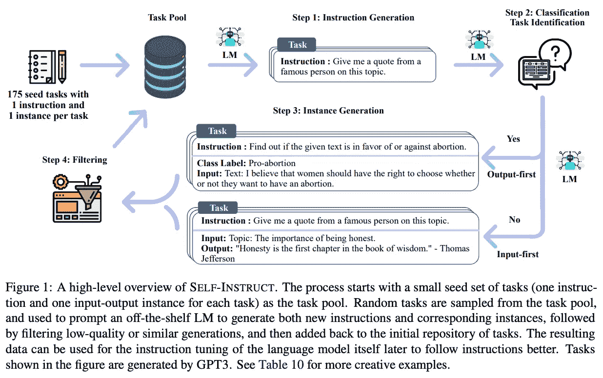

（来自 [2]）

**自我指导。** 与本工作相关的一种指令调整形式是自我指导框架[2]，它通过生成用于微调的指令来减少对人工编写指令的依赖。特别地，这一过程从一小部分指令数据开始，并迭代地*（i）* 使用 LLM 生成新数据和*（ii）* 过滤低质量数据；见上文。这种技术能以最少的人力注释工作生成高质量的指令调整数据。

## 知识蒸馏

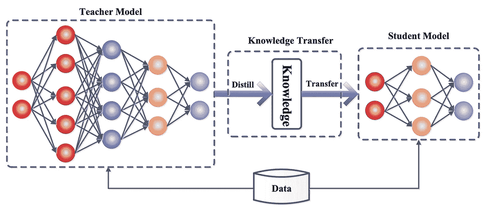

（来源于 [12]）

在[11]中提出，知识蒸馏使用一个（大型）完全训练好的神经网络作为另一个（小型）神经网络的训练信号；见上文。虽然存在许多不同类型的知识蒸馏，但其背后的理念保持不变。即，如果我们使用*（i）* 普通训练数据和*（ii）* 一个更大、更强大的神经网络对这些数据的输出来训练一个神经网络，那么通常会比仅使用数据来训练神经网络得到更好的结果。通过将其输出作为训练目标，我们可以将一些信息从更大的网络“蒸馏”到正在训练的小型“学生”网络中。有关知识蒸馏及其众多变体的更多信息，请查看[这里](https://arxiv.org/abs/2006.05525)的链接。

# 其他内容……

除了以上涵盖的信息，我们还需要对大型语言模型（LLMs）及其工作原理有一个基础的理解。要了解这些知识，请查看以下资源。

+   语言建模定义 [[链接](https://cameronrwolfe.substack.com/i/85568430/language-modeling)]

+   语言建模简要概述 [[链接](https://cameronrwolfe.substack.com/i/91134599/a-primer-on-language-modeling)]

+   仅解码器变换器 [[链接](https://twitter.com/cwolferesearch/status/1640446111348555776?s=20)]

+   LLM 如何工作 [[链接](https://twitter.com/cwolferesearch/status/1635693551584522256?s=20)]

+   LLM 扩展定律 [[链接](https://cameronrwolfe.substack.com/i/88082618/scaling-laws-for-neural-language-models)]

+   LLM 中的自注意力 [[链接](https://twitter.com/cwolferesearch/status/1644773244786941952?s=20)]

在概述中，我们还会提到 OpenAI 目录中的一些具体模型的名称（例如，`text-davinci-003`）。查看[这里](https://platform.openai.com/docs/models)可以找到提供的模型列表（及其相关描述），这些模型包含在[OpenAI API](https://openai.com/blog/openai-api)中。

# [Alpaca: 一个指令跟随的 LLaMA 模型](https://crfm.stanford.edu/2023/03/13/alpaca.html) [3]

> “在学术界研究指令跟随模型一直很困难，因为没有一个容易获得的模型在能力上接近于封闭源模型，如 OpenAI 的 text-davinci-003。” *— 来源于 [3]*

Alpaca [3] 是 LLaMA-7B [1] LLM 的一个微调版本，其性能类似于 OpenAI 的`text-davinci-003`（即，[GPT-3.5](https://platform.openai.com/docs/models/gpt-3-5)）。Alpaca 的微调过程基于 self-instruct [2]，其中从表现更好的 LLM（即`text-davinci-003`）收集指令跟随数据，并用于 SFT。简而言之，Alpaca 表明，在[指令跟随背景](https://openai.com/research/instruction-following)中，通过高质量数据的微调可以显著提高小型开源 LLM 的质量。此外，整个 Alpaca 的微调过程费用仅为$600（包括数据收集和微调），使得这种指令跟随 LLM 易于且便宜地复制用于研究目的。

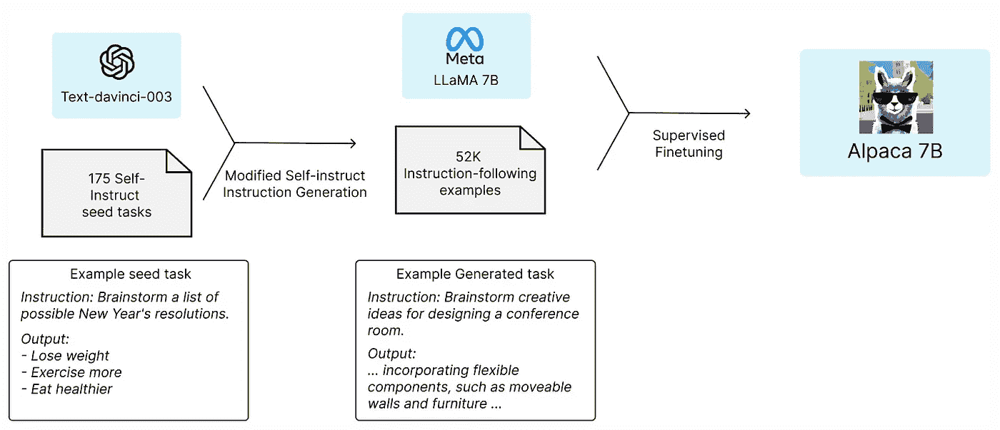

创建 Alpaca LLM（来自[3]）

**方法。** 要通过 SFT 创建一个指令跟随的 LLM，我们需要 *i)* 一个高质量的预训练语言模型和 *ii)* 用于 SFT 的指令跟随数据。幸运的是，最近发布的 LLaMA 提供了易于访问的预训练语言模型。获得指令跟随数据要复杂一些，但一种方法是使用 self-instruct [2]。从高层次来看，self-instruct [bootstraps](https://carpentries-incubator.github.io/machine-learning-novice-python/07-bootstrapping/index.html#:~:text=In%20statistics%20and%20machine%20learning,our%20resampled%20dataset%20multiple%20times.) LLM 生成的输出进行进一步训练。在 Alpaca 的案例中，我们使用`text-davinci-003`通过以下方式生成指令跟随数据：

1.  从[self-instruct 的种子集](https://github.com/yizhongw/self-instruct/blob/main/data/seed_tasks.jsonl)开始，使用 175 个指令和输出对。

1.  提示 LLM 生成更多指令，使用种子集作为上下文示例进行少量学习。

[3]的作者也采用了一些[技巧](https://github.com/tatsu-lab/stanford_alpaca#data-generation-process)（例如，修改过的提示和更高效的解码/生成过程），使数据生成过程比原始 self-instruct [2]更便宜、更高效。总体而言，通过 OpenAI API 生成指令跟随数据的费用不到$500，用于 52K 个指令跟随示例。

LLaMA-7B 模型随后使用基于 HuggingFace 的训练框架在这些数据上进行微调。通过使用[完全分片的数据并行 (FSDP)](https://engineering.fb.com/2021/07/15/open-source/fsdp/)和[混合精度训练](https://cameronrwolfe.substack.com/i/73746315/what-can-we-use-in-practice)技术，微调过程在 8 个 A100 GPU 上缩短至 3 小时，成本低于 $100。用于创建 Alpaca 的代码/数据[在线获取](https://github.com/tatsu-lab/stanford_alpaca)。然而，Alpaca 的商业使用被禁止，因为 *i)* LLaMA（Alpaca 基于的模型）具有非商业许可证，*ii)* OpenAI [禁止](https://openai.com/policies/terms-of-use) 使用其模型来训练竞争的 LLM。

**结果。** Alpaca 在用于 self-instruct 的评估集上的指令（即，大多与电子邮件、社交媒体和生产力相关的任务）和由作者手工编写的开放领域指令上进行评估。在这些任务中，Alpaca 的表现类似于 `text-davinci-003`（即，在测试的约 180 个案例中，表现最佳的占 50%）。尽管这种评估显然范围有限，*考虑到 Alpaca 比 GPT-3.5 小得多且相对容易复制，其性能仍然非常令人印象深刻*。

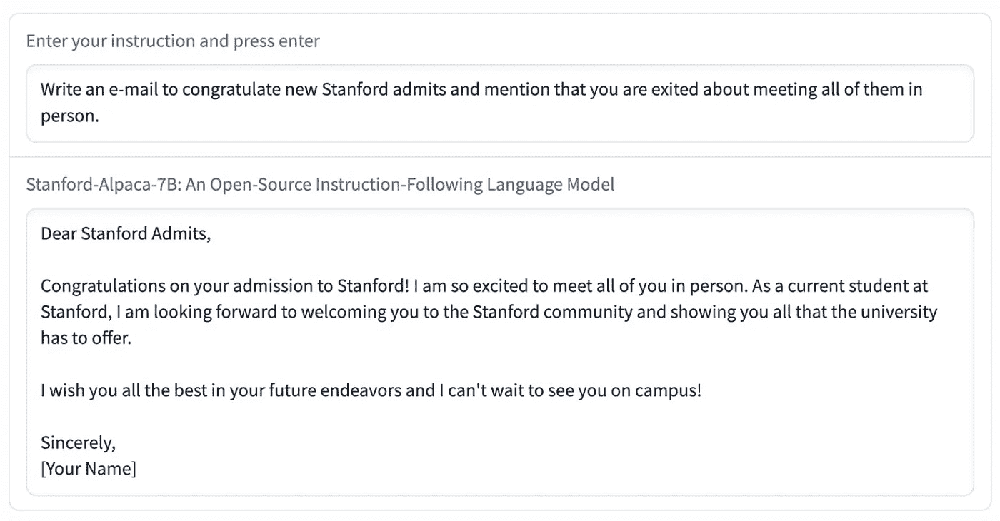

Alpaca 输出示例（来自 [3]）

类似于 `text-davinci-003`，Alpaca 的输出通常比 ChatGPT 的要短。换句话说，模型的风格反映了用于生成指令跟随数据的 LLM 的风格。

# [Vicuna: 一种具有 90% ChatGPT 质量的开源聊天机器人](https://vicuna.lmsys.org/) [4]

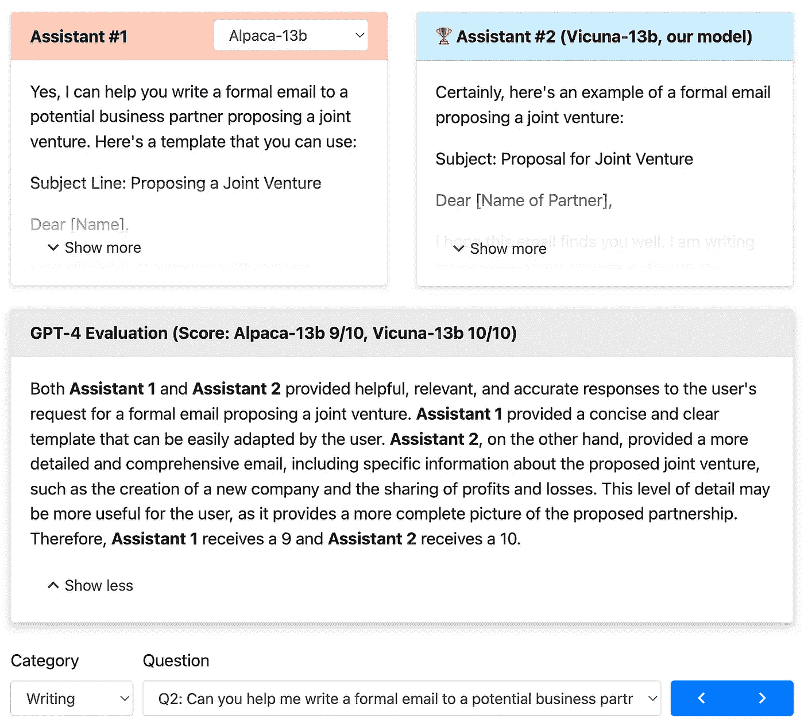

（来自 [4]）

信息检索对话代理（或聊天机器人）如 ChatGPT 很出色，但此类模型的训练框架和架构未知，这阻碍了开源研究。作为解决方案，[4] 的作者提出了 Vicuna，一种通过微调 LLaMA — 13B [1]（即，一个与 [GPT-3](https://cameronrwolfe.substack.com/i/88082618/language-models-are-few-shot-learners) 性能相当的小型 LLM）创建的开源聊天机器人。Vicuna 的微调数据是与 ChatGPT 进行的用户对话示例，整个微调过程可以以不到 $300 的成本复制，从而使聊天机器人在研究中更加可及。与 Alpaca 相比，Vicuna 更加接近 ChatGPT，生成的答案更具细节和结构。

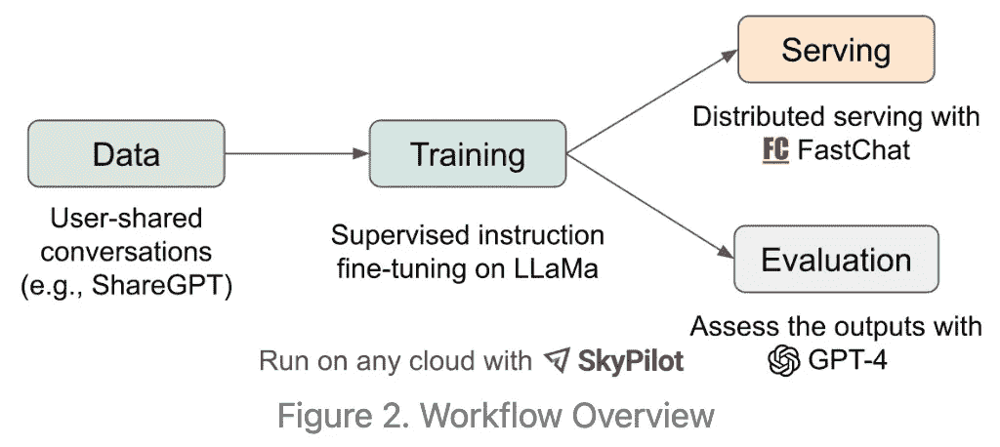

（来自 [4]）

**方法。** 用于 Vicuna 的 SFT 数据通过[ShareGPT](https://sharegpt.com/)的公共 API 下载，该平台允许用户分享与 ChatGPT 的对话。在微调之前，作者会过滤不适当和低质量的数据，并将较长的对话分割成适合 LLaMA-13B 最大上下文长度的较短片段。总共收集了 70K 个对话。类似于 Alpaca，该模型在 8 个 A100 GPU 上使用 FSDP（经过一些修改以降低成本和处理长序列）进行训练，约需一天时间；见上文。作者公开了[代码](https://github.com/lm-sys/FastChat)，用于训练[和托管](https://arxiv.org/abs/2302.11665) Vicuna。下表提供了 Vicuna 与开源 LLM LLaMA 和 Alpaca 的更全面的比较。我们将接下来讨论 Vicuna 的评估方法。

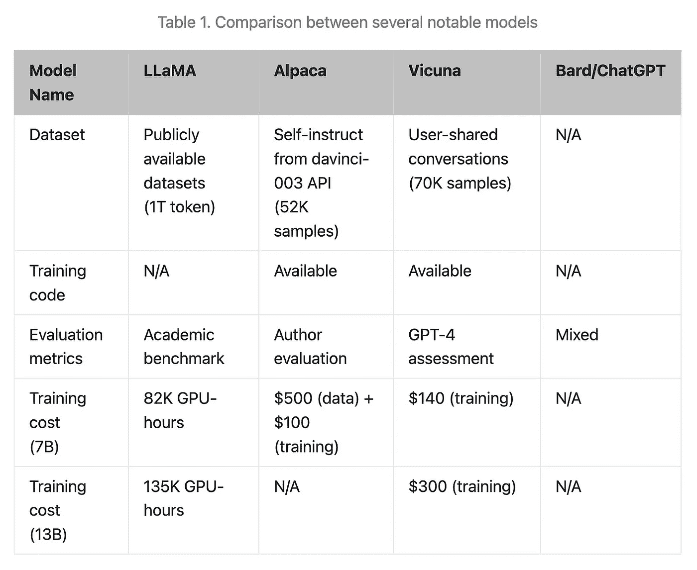

（摘自 [4]）

**结果。** 准确评估聊天机器人非常困难，随着聊天机器人质量的提高，这种困难会加剧。例如，[4]的作者声称，自我指导评估集（用于评估 Alpaca）已被近期聊天机器人有效解决，这使得模型之间的差异难以分辨。鉴于现有基准的局限性和创建新的全面评估集的难度，[4]的作者选择了另一种策略：*使用 LLMs 进行评估*。

> “随着 GPT-4 的最新进展，我们很好奇其能力是否已经达到类似人类的水平，这种水平是否可以支持一个自动化的评估框架用于基准生成和性能评估。” *— 摘自 [4]*

此时，我们可能会认为这实际上不可能奏效。*聊天自指？* 然而，令人惊讶的是，基于最近提出的[GPT-4 模型](https://openai.com/research/gpt-4) [6]形成的评估框架效果良好。首先，[4]的作者设计了八类问题（例如，角色扮演场景和数学任务）。然后，GPT-4 被提示在每个类别中生成多样化的问题。有趣的是，GPT-4 被发现能够生成近期聊天机器人难以回答的难题。

特别是，GPT-4 用于在每个类别中生成十个问题，并评估五种不同聊天机器人的输出（即 LLaMA-13B、Alpaca-13B、Vicuna-13B、Bard 和 ChatGPT）。进一步说，每个模型输出的质量通过要求 GPT-4 根据详细程度、帮助性、相关性和准确性对答案质量进行评分来判断。虽然以这种方式进行评估可能看起来有些牵强，但 GPT-4 对模型的排名相当一致，甚至[解释了其推理过程](https://vicuna.lmsys.org/eval/)。

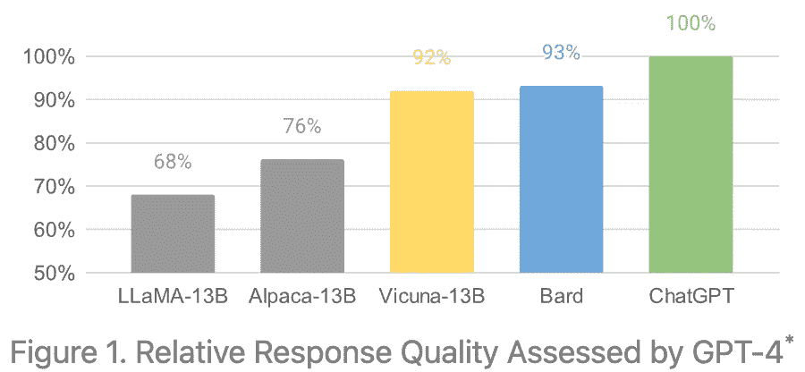

（摘自 [4]）

根据 GPT-4 的判断，Vicuna 的输出质量相对于 ChatGPT 为 92%；见上文。这个比例是通过让 GPT-4 为每个模型的输出分配分数来实现的。然后，通过计算所有问题的总质量分数来评估模型之间的相对表现。尽管这种评估方法并不严格，但它相当有趣、相对一致，并迫使我们思考 LLM 领域未来会如何演变。

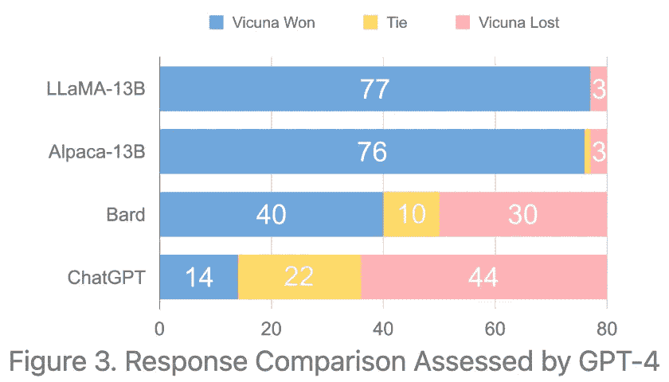

（来自 [4]）

与其他开源模型相比，我们看到 GPT-4 更倾向于 Vicuna 的输出。此外，Vicuna 在 45% 的问题上产生的输出质量超过或匹配 ChatGPT。*这种质量水平对于一个只需 $300 即可微调的模型来说相当令人印象深刻！*

# [Koala: 一个用于学术研究的对话模型](https://bair.berkeley.edu/blog/2023/04/03/koala/) [5]

> “足够小到可以在本地运行的模型，如果经过精心挑选的数据训练，可以捕捉到其较大同行的大部分性能。”*— 来自 [5]*

在这一点上，我们可能开始怀疑是否会用尽用于为 LLM 命名的动物。尽管如此，Koala 与 Vicuna 和 Alpaca 类似，因为它继续致力于缩小专有和开源 LLM 之间的质量差距。更具体地说，Koala 是 LLaMA-13B 的一个版本，经过在各种来源的对话数据上进行微调，从公共数据集到与互联网上其他高质量 LLM 的对话。

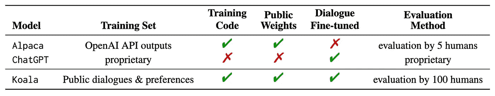

Koala 与相关 LLM 的比较（来自 [5]）

在真实世界的提示上进行评估时，Koala-13B 被发现相较于 ChatGPT 表现出具有竞争力的性能，甚至超过了相关的 Alpaca 模型。因此，Koala 的结果继续支持我们在所有 LLaMA 后续工作中看到的趋势。即，我们看到较小的模型在获得正确的数据进行微调后可以取得令人印象深刻的质量。这样的发现可能会让我们想知道：*我们是否过于关注模型规模，而对数据质量关注不够？*

**方法。** Koala 使用来自公共数据集和互联网的对话数据进行微调。然而，[5]中的作者强调了为微调策划高质量数据集的重要性。用于微调 Koala 的数据大致可以分为蒸馏基础（即，来自其他 LLM 的对话）或开源数据（即，公开数据集中可用）两类，包括来自[ShareGPT](https://sharegpt.com/)、[HC3](https://huggingface.co/datasets/Hello-SimpleAI/HC3)、[OIG](https://laion.ai/blog/oig-dataset/)、[Anthropic HH](https://huggingface.co/datasets/Anthropic/hh-rlhf)和 OpenAI [WebGPT](https://huggingface.co/datasets/openai/webgpt_comparisons)/[Summarization](https://huggingface.co/datasets/openai/summarize_from_feedback)的数据。此外，微调集甚至包括用于训练 Alpaca [3]模型的数据。

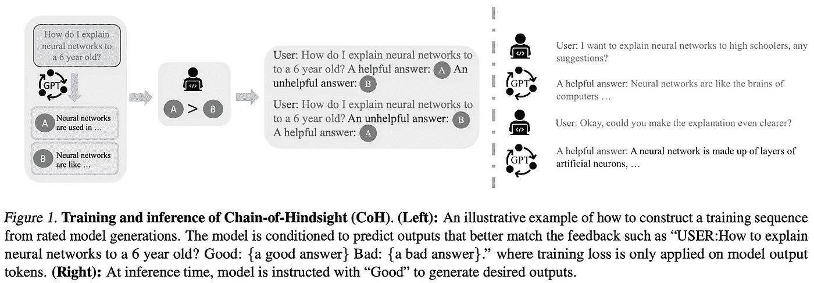

（见[8]）

所有这些数据都是基于对话的。然而，需要注意的是，一些数据集包含多个对话或对每个问题的响应，这些响应被评为好或坏。有趣的是，我们可以借鉴先前的技术[8]，将这些信息纳入 LLM 的微调过程中。特别地，这是通过条件训练来完成的，我们可以简单地将数据条件化，通过人类偏好标记来训练 LLM（例如，只需附加有关对话是否好的文本信息）；见上文。这种方法可以提高性能，并使我们能够使用即使是低质量的对话进行模型训练。

[5]中的作者使 Koala 的训练和托管框架[公开可用](https://github.com/young-geng/EasyLM)。该模型使用八个 V100 GPU 训练两个时期，耗时约 6 小时。总的来说，训练该模型的计算成本低于$100（假设我们可以使用[可抢占/临时实例](https://cloud.google.com/compute/docs/instances/preemptible#what_is_a_preemptible_instance)），这意味着 Koala 是迄今为止我们见过的模型中最便宜的再现模型！

**结果。** [5]中的作者训练了两种不同类型的 Koala 模型：

+   *Koala-distill*：仅在蒸馏数据上进行微调（即，来自其他聊天机器人的对话示例）

+   *Koala-all*：使用上述所有数据进行微调。

根据人类试验和反馈，这些 Koala 模型的质量与 Alpaca 和 ChatGPT 进行比较。评估中使用了来自 Alpaca [3]评估集的问题和来自互联网的真实用户查询集。作者选择增加更多问题到评估集中，因为 Alpaca 的评估集与其训练数据非常相似（即，两者均源自[self-instruct](https://github.com/yizhongw/self-instruct) [2]）。

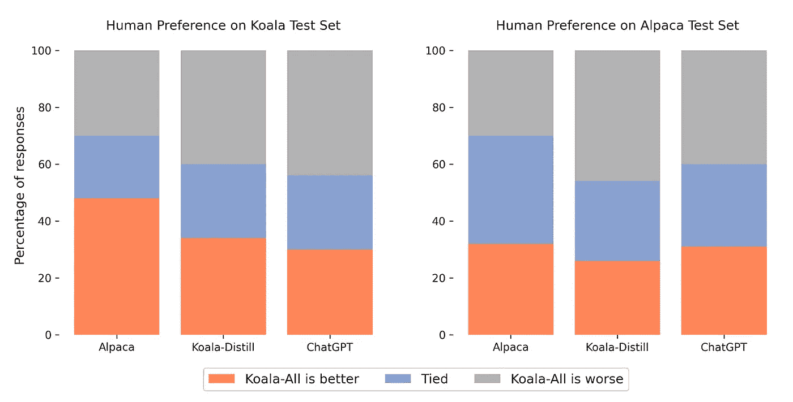

（见[5]）

当人们在质量和正确性方面评估不同 LLM 的输出时，发现 Koala-all 通常超越了 Alpaca 的表现，并在许多情况下达到或超过了 ChatGPT 的质量。此外，我们看到 Koala-distill 实际上表现优于 Koala-all。这有点违反直觉，因为 Koala-distill 的微调数据集较小（即仅包含来自 ChatGPT 的示例对话），但这告诉我们，微调所用数据的类型和质量极为重要。也就是说，使用来自更大、更好的 LLM 生成的对话进行微调是非常有效的。

> “构建强大对话模型的关键可能在于策划高质量、多样化的用户查询对话数据”*— 来自[5]*

# 进一步探索…

尽管 LLaMA 提出的时间相对较短，但 Alpaca、Vicuna 和 Koala 并不是唯一受到 LLaMA 启发或支持的显著模型。以下是最近发布的其他开源语言模型的列表。

+   [Lit-LLaMA](https://github.com/Lightning-AI/lit-llama): 一个基于 LLaMA 的开源复现项目，遵循[Apache-2.0 许可证](https://snyk.io/learn/apache-license/)（允许商业使用）。

+   [ChatLLaMA](https://github.com/nebuly-ai/nebullvm/tree/main/apps/accelerate/chatllama): 使用 LLaMA、你自己的数据以及尽可能少的计算资源来制作个性化版本的 ChatGPT。

+   [FreedomGPT](https://freedomgpt.com/): 一个开源的对话型聊天机器人（基于 Alpaca），强调没有审查。

+   [ColossalChat](https://medium.com/@yangyou_berkeley/colossalchat-an-open-source-solution-for-cloning-chatgpt-with-a-complete-rlhf-pipeline-5edf08fb538b): 一个开源的 ChatGPT 复制品，配备了一个完全实现的（且公开的）[RLHF 管道](https://github.com/hpcaitech/ColossalAI/tree/main/applications/Chat)，基于 LLaMA（包括数据收集、监督微调、奖励模型训练和强化学习微调；详见下文）。

+   [StackLLaMA](https://huggingface.co/blog/stackllama): 提供了一个基于 RLHF 的微调开源实现和讨论，用于生成强大的聊天机器人（具体使用 LLaMA 作为起点）。

+   [GPT4All](https://github.com/nomic-ai/gpt4all): 用于训练基于 LLaMA 和 GPT-J 的开源 LLM 的演示、数据和代码（拥有 Apache-2.0 许可证！）。

+   [Baize](https://github.com/project-baize/baize-chatbot): 一个基于 LLaMA 的开源聊天机器人，使用[LoRA](https://github.com/microsoft/LoRA)（一种参数高效的微调方法）进行微调。

+   [Galpaca](https://huggingface.co/GeorgiaTechResearchInstitute/galpaca-30b): 一个[Galactica](https://cameronrwolfe.substack.com/i/93578656/galactica-a-large-language-model-for-science)（科学语言模型）版本，已在与 Alpaca 相同的数据集上进行了微调。

+   [Dolly 2.0](https://www.databricks.com/blog/2023/04/12/dolly-first-open-commercially-viable-instruction-tuned-llm): 该模型不基于 LLaMA，但是一款开源聊天机器人，经过指令微调以达到类似 ChatGPT 的质量，并开放商业使用。

+   [Open Assistant](https://github.com/LAION-AI/Open-Assistant): 一个开源聊天机器人（与 ChatGPT 相当），能够理解任务、与第三方系统互动并检索信息。

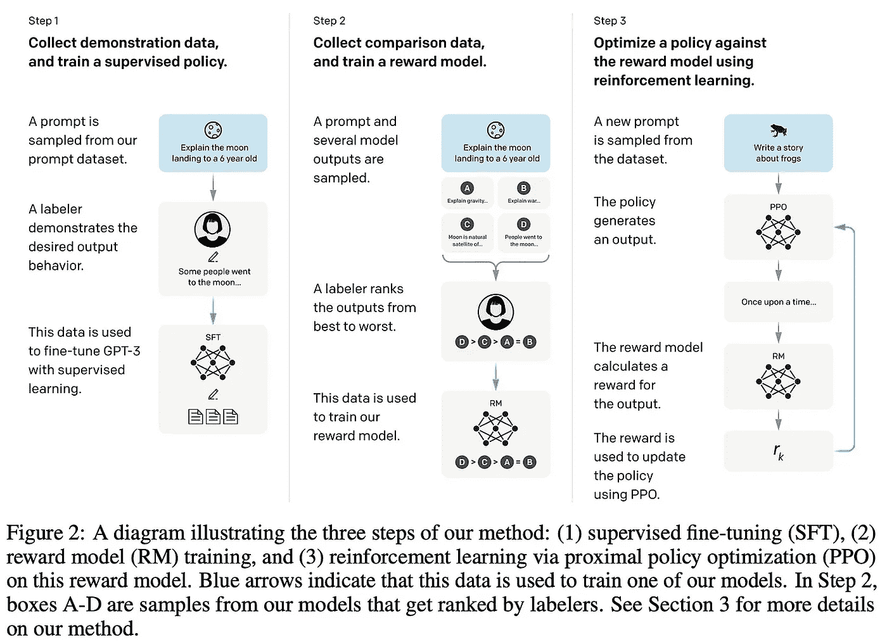

(来自 [9])

除了提出的各种模型，LLM 的研究和使用也因为 LLaMA 而变得更加可及。LLaMA-13B 已经可以仅用一个 GPU 运行，但现在我们甚至可以在本地（例如，在 macbook 上）完成这个操作！

+   [Alpaca.cpp](https://github.com/antimatter15/alpaca.cpp): 本地运行 Alpaca 的开源复刻版本。

+   [GPTQ-4-LLaMA](https://github.com/qwopqwop200/GPTQ-for-LLaMa): 一个 [4-bit 量化](https://cameronrwolfe.substack.com/p/quantized-training-with-deep-networks-82ea7f516dc6) 的 LLaMA 版本。

+   [LLaMA.cpp](https://github.com/ggerganov/llama.cpp): 几个开源 LLM 的 4-bit 量化推理，这使得本地托管成为可能（例如，在 macbook 上）。

看起来 LLMs 很快将比以往更多地向公众开放。

# 要点

我们可以从这项工作中推断出的主要观点是 *i)* LLaMA 激发了大量开源 LLM 研究和 *ii)* 围绕 LLM 的研究/使用因为 LLaMA 而变得显著更为可及。如果一个月前你告诉我，我可以在我的 macbook 上运行接近 ChatGPT 性能的 LLM，我是不会相信的。这是令人兴奋的时刻，我很感激能成为这样一个了不起的社区中的一员！以下列出了几个基本要点。

**LLMs 适合所有人。** 如果之前我们对此有所质疑，现在我们知道研究社区确实可以在 LLMs 上进行有价值的研究。几周前，我们大多数人认为由于极高的数据和计算需求，LLMs 并不容易获得。然而，现在我们可以用几百美元训练出 ChatGPT 级别的模型（或至少接近的模型），甚至可以在我们的笔记本电脑上使用这些模型进行对话！

**较小的模型是否足够？** 长期以来，模型规模一直是高性能 LLM 的一个重要组成部分（连同大规模的预训练数据集）。然而，像 Koala 和 Vicuna 这样的模型告诉我们，较小的 LLM 实际上可以表现得非常出色（甚至在某些情况下与强大的 LLM 如 ChatGPT 的表现相匹配）。这样的发现突显了数据质量的重要性。在我们看到的工作中，最有效的技术往往使用较大 LLM 的输出作为训练数据，这表明知识蒸馏可能是创建小而强大的 LLM 的重要组成部分。

**商业上可行？** 尽管这些技术都很酷，但在商业应用中使用它们却很困难。例如，OpenAI 禁止使用 ChatGPT（或任何其他 API 模型）来训练竞争模型，从而阻止了基于 OpenAI API 的知识蒸馏方法。此外，即便是 LLaMA 本身也禁止商业使用。因此，像 Alpaca、Koala 和 Vicuna 这样的模型仅在研究层面上具有兴趣，它们的方法不能用于任何商业用途的模型。然而，随着像 [Lit-LLaMA](https://github.com/Lightning-AI/lit-llama) 这样的提案出现，这些模型的商业可行版本可能会逐渐出现。

## 结语

非常感谢您阅读本文。我是 [Cameron R. Wolfe](https://cameronrwolfe.me/)，[Rebuy](https://www.rebuyengine.com/) 的 AI 总监。我研究深度学习的经验和理论基础。您还可以查看我在 medium 上的 [其他文章](https://medium.com/@wolfecameron)！如果您喜欢这篇文章，请关注我的 [twitter](https://twitter.com/cwolferesearch) 或订阅我的 [Deep (Learning) Focus 新闻通讯](https://cameronrwolfe.substack.com/)，在其中我通过对流行论文的易懂概述帮助读者深入理解 AI 研究中的主题。

## 参考文献

[1] Touvron, Hugo 等人。“Llama：开放且高效的基础语言模型。” *arXiv 预印本 arXiv:2302.13971* (2023)。

[2] Wang, Yizhong 等人。“Self-Instruct：将语言模型与自生成的指令对齐。” *arXiv 预印本 arXiv:2212.10560* (2022)。

[3] Taori, Rohan 等人。“斯坦福 Alpaca：一个遵循指令的 LLaMA 模型。” (2023)。

[4] Chiang, Wei-Lin 等人。“Vicuna：一个开源聊天机器人，令人印象深刻的 GPT-4 质量达到 90%* ChatGPT。” (2023)。

[5] Geng, Xinyang 等人。“Koala：一个用于学术研究的对话模型。” (2023)。

[6] OpenAI (2023)。“GPT-4 技术报告。” *ArXiv, abs/2303.08774*。

[7] Guo, Biyang 等人。“ChatGPT 与人类专家有多接近？比较语料库、评估和检测。” *arXiv 预印本 arXiv:2301.07597* (2023)。

[8] Liu, Hao 等人。“事后链将语言模型与反馈对齐。” *arXiv 预印本 arXiv:2302.02676* (2023)

[9] Ouyang, Long 等人。“通过人类反馈训练语言模型以遵循指令。” *神经信息处理系统进展* 35 (2022)：27730–27744。

[10] Wei, Jason 等人。“微调语言模型是零样本学习者。” *arXiv 预印本 arXiv:2109.01652* (2021)。

[11] Hinton, Geoffrey, Oriol Vinyals 和 Jeff Dean。“在神经网络中蒸馏知识。” *arXiv 预印本 arXiv:1503.02531* (2015)。

[12] Gou, Jianping 等人。“知识蒸馏：综述。” *国际计算机视觉期刊* 129 (2021)：1789–1819。
