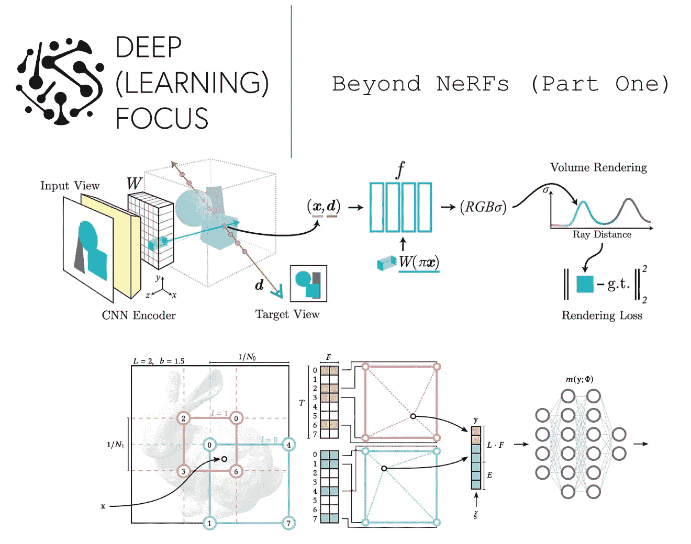

# 超越 NeRFs（第一部分）

> 原文：[`towardsdatascience.com/beyond-nerfs-part-one-7e84eae816d8?source=collection_archive---------9-----------------------#2023-06-07`](https://towardsdatascience.com/beyond-nerfs-part-one-7e84eae816d8?source=collection_archive---------9-----------------------#2023-06-07)

## 提高 NeRF 训练速度 100 倍或更多…

 [Cameron R. Wolfe, Ph.D.](https://wolfecameron.medium.com/?source=post_page-----7e84eae816d8--------------------------------)

·

[关注](https://medium.com/m/signin?actionUrl=https%3A%2F%2Fmedium.com%2F_%2Fsubscribe%2Fuser%2F28aa6026c553&operation=register&redirect=https%3A%2F%2Ftowardsdatascience.com%2Fbeyond-nerfs-part-one-7e84eae816d8&user=Cameron+R.+Wolfe%2C+Ph.D.&userId=28aa6026c553&source=post_page-28aa6026c553----7e84eae816d8---------------------post_header-----------) 发表在 [Towards Data Science](https://towardsdatascience.com/?source=post_page-----7e84eae816d8--------------------------------) · 15 分钟阅读 · 2023 年 6 月 7 日 

--

（图片来源：[Mathew Schwartz](https://unsplash.com/@cadop?utm_source=unsplash&utm_medium=referral&utm_content=creditCopyText) 于 [Unsplash](https://unsplash.com/s/photos/speed?utm_source=unsplash&utm_medium=referral&utm_content=creditCopyText)）

正如我们在之前的概述中所看到的，[神经辐射场（NeRFs）](https://cameronrwolfe.substack.com/p/understanding-nerfs) [4] 的提出是神经场景表示领域的一次突破。通过给定一些场景的图像，我们可以训练一个 NeRF 以高分辨率生成该场景的任意视角。简而言之，NeRFs 利用深度学习提供逼真的 3D 场景渲染。

不过，它们存在一些显著的问题。在本概述中，我们将特别关注 NeRF 的两个局限性：

1.  训练一个能够准确渲染新视角的 NeRF 需要许多关于底层场景的图像。

1.  使用 NeRF 进行训练（和渲染）的过程比较缓慢。

针对这些问题的解决方案，我们将概述 NeRF 方法的两个显著扩展：PixelNeRF [1] 和 InstantNGP [2]。在了解这些方法的过程中，我们将看到，大多数 NeRF 面临的问题可以通过制作更高质量的输入数据和利用深度神经网络在新场景中泛化已学模式的能力来解决。

（来自 [1, 2]）

# 背景
