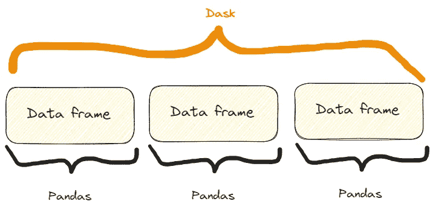

# 超越 Numpy 和 Pandas：释放鲜为人知的 Python 库的潜力

> 原文：[`towardsdatascience.com/beyond-numpy-and-pandas-unlocking-the-potential-of-lesser-known-python-libraries-86d2bdc4d230`](https://towardsdatascience.com/beyond-numpy-and-pandas-unlocking-the-potential-of-lesser-known-python-libraries-86d2bdc4d230)

## 3 个数据专业人员应该了解的 Python 科学计算库

[](https://federicotrotta.medium.com/?source=post_page-----86d2bdc4d230--------------------------------)[](https://towardsdatascience.com/?source=post_page-----86d2bdc4d230--------------------------------) [Federico Trotta](https://federicotrotta.medium.com/?source=post_page-----86d2bdc4d230--------------------------------)

·发表于 [Towards Data Science](https://towardsdatascience.com/?source=post_page-----86d2bdc4d230--------------------------------) ·阅读时间 12 分钟·2023 年 7 月 6 日

--


图片由 [OrMaVaredo](https://pixabay.com/it/users/ormavaredo-14515736/?utm_source=link-attribution&utm_medium=referral&utm_campaign=image&utm_content=5826755) 提供，来源于 [Pixabay](https://pixabay.com/it//?utm_source=link-attribution&utm_medium=referral&utm_campaign=image&utm_content=5826755)

Python 是世界上使用最广泛的编程语言之一，为开发者提供了广泛的库。

无论如何，当涉及数据处理和科学计算时，我们通常会想到 `Numpy`、`Pandas` 或 `SciPy` 等库。

在这篇文章中，我们介绍了 3 个你可能感兴趣的 Python 库。

# 1\. Dask

## 介绍 Dask

Dask 是一个灵活的并行计算库，使大规模数据处理的分布式计算和并行处理成为可能。

那么，我们为什么要使用 Dask 呢？正如他们在 [他们的网站](https://www.dask.org/) 上所说：

> Python 已经成长为数据分析和通用编程领域的主导语言。这一增长得益于像 NumPy、pandas 和 scikit-learn 这样的计算库。然而，这些包并未设计用于超越单机的规模。Dask 的开发旨在将这些包及其生态系统本地扩展到多核机器和分布式集群，当数据集超出内存时。

因此，Dask 的一个常见用途是 [如他们所说](https://docs.dask.org/en/latest/dataframe.html)：

> Dask DataFrame 在 pandas 常用的情况下使用，通常是当 pandas 因数据大小或计算速度而失败时：
> 
> - 操作大数据集，即使这些数据集无法完全加载到内存中
> 
> - 通过使用多个核心加速长时间计算
> 
> - 在大型数据集上进行分布式计算，使用标准 pandas 操作，如 groupby、join 和时间序列计算

所以，当我们需要处理巨大的 Pandas 数据框时，Dask 是一个不错的选择。这是因为 Dask：

> 允许用户在笔记本电脑上处理 100GB+ 的数据集，或在工作站上处理 1TB+ 的数据集

这是一项相当令人印象深刻的结果。

在幕后发生的情况是：

> Dask 数据框协调许多按索引排列的 pandas 数据框/系列。Dask 数据框是按*行*分区的，通过按索引值分组行以提高效率。这些 pandas 对象可能存储在磁盘上或其他机器上。

所以，我们可以得到类似这样的结果：



Dask 和 Pandas 数据框之间的区别。图像由作者提供，灵感来自于已引用的 Dask 网站上的图像。

## Dask 的一些功能展示

首先，我们需要安装 Dask。我们可以通过`pip`或`conda`来完成，方法如下：

```py
$ pip install dask[complete]

or

$ conda install dask
```

**功能一：打开 CSV 文件**

我们可以展示的第一个 Dask 特性是如何打开 CSV 文件。我们可以这样做：

```py
import dask.dataframe as dd

# Load a large CSV file using Dask
df_dask = dd.read_csv('my_very_large_dataset.csv')

# Perform operations on the Dask DataFrame
mean_value_dask = df_dask['column_name'].mean().compute()
```

所以，正如我们在代码中看到的，使用 Dask 的方式与 Pandas 非常相似。特别是：

+   我们使用`read_csv()`方法，就像在 Pandas 中一样。

+   我们以完全相同的方式截取列，就像在 Pandas 中一样。实际上，如果我们有一个名为`df`的 Pandas 数据框，我们会这样截取列：`df['column_name']`。

+   我们对截取的列应用`mean()`方法，类似于 Pandas，但这里我们还需要添加`compute()`方法。

此外，即使打开 CSV 文件的方法与 Pandas 相同，在幕后 Dask 也在轻松处理超出单台机器内存容量的大型数据集。

这意味着我们看不到任何实际差异，除了一个事实，那就是大型数据框在 Pandas 中无法打开，但在 Dask 中可以。

**功能二：扩展机器学习工作流**

我们还可以使用 Dask 创建一个包含大量样本的分类数据集。然后，我们可以将其拆分为训练集和测试集，用 ML 模型拟合训练集，并为测试集计算预测结果。

我们可以这样做：

```py
import dask_ml.datasets as dask_datasets
from dask_ml.linear_model import LogisticRegression
from dask_ml.model_selection import train_test_split

# Load a classification dataset using Dask
X, y = dask_datasets.make_classification(n_samples=100000, chunks=1000)

# Split the data into train and test sets
X_train, X_test, y_train, y_test = train_test_split(X, y)

# Train a logistic regression model in parallel
model = LogisticRegression()
model.fit(X_train, y_train)

# Predict on the test set
y_pred = model.predict(X_test).compute()
```

这个例子强调了 Dask 处理庞大数据集的能力，即使在机器学习问题的情况下，通过将计算分布到多个核心上。

具体来说，我们可以使用方法`dask_datasets.make_classification()`创建一个用于分类的“Dask 数据集”，并且我们可以指定样本数量和块（甚至非常庞大！）。

和之前一样，预测结果是通过`compute()`方法获得的。

```py
**NOTE:** 
in this case, you may need to intsall the module dask_ml.
You can do it like so:

$ pip install dask_ml
```

**功能三：高效的图像处理**

Dask 利用的并行处理能力也可以应用于图像。

具体来说，我们可以打开多个图像，调整其大小，并保存调整后的图像。我们可以这样做：

```py
import dask.array as da
import dask_image.imread
from PIL import Image

# Load a collection of images using Dask
images = dask_image.imread.imread('image*.jpg')

# Resize the images in parallel
resized_images = da.stack([da.resize(image, (300, 300)) for image in images])

# Compute the result
result = resized_images.compute()

# Save the resized images
for i, image in enumerate(result):
    resized_image = Image.fromarray(image)
    resized_image.save(f'resized_image_{i}.jpg')
```

所以，这里是处理流程：

1.  我们用方法`dask_image.imread.imread("image*.jpg")`打开当前文件夹中的所有“.jpg”图像（或者是一个你可以指定的文件夹中的图像）。

1.  我们用`da.stack()`方法中的列表推导式将它们调整到 300x300。

1.  我们使用方法`compute()`来计算结果，就像以前一样。

1.  我们用 for 循环保存所有调整大小的图像。

# 2\. SymPy

## 介绍 Sympy

如果你需要进行数学计算和运算，并且希望坚持使用 Python，你可以尝试 Sympy。

确实：为何使用其他工具和软件，当我们可以使用我们喜爱的 Python 呢？

根据他们在[网站](https://www.sympy.org/en/index.html)上的描述，Sympy 是：

> 一个用于符号数学的 Python 库。它旨在成为一个功能齐全的计算机代数系统（CAS），同时保持代码尽可能简单，以便易于理解和扩展。SymPy 完全用 Python 编写。

但为什么使用 SymPy？他们建议：

> SymPy 是...
> 
> **- 免费：** 根据 BSD 许可证，SymPy 既是免费的（在言论上），也是免费的（在酒精上）。
> 
> **- 基于 Python：** SymPy 完全用 Python 编写，并且使用 Python 作为其语言。
> 
> **- 轻量级：** SymPy 仅依赖于 mpmath，一个用于任意浮点运算的纯 Python 库，使其易于使用。
> 
> **- 一个库：** 除了作为交互工具使用外，SymPy 可以嵌入到其他应用程序中，并通过自定义函数进行扩展。

所以，它基本上具备了 Python 爱好者喜欢的所有特点！

现在，让我们看看它的一些功能。

## SymPy 的某些功能展示

首先，我们需要安装它：

```py
$ pip install sympy
```

```py
**PAY ATTENTION:**

if you write *$ pip install* *simpy* you'll install another (completely
different!) library.

So, the second letter is a "y", not an "i".
```

**特性一：解决代数方程**

如果我们需要解决代数方程，可以像这样使用 SymPy：

```py
from sympy import symbols, Eq, solve

# Define the symbols
x, y = symbols('x y')

# Define the equation
equation = Eq(x**2 + y**2, 25)

# Solve the equation
solutions = solve(equation, (x, y))

# Print solution
print(solutions)

>>>

[(-sqrt(25 - y**2), y), (sqrt(25 - y**2), y)]
```

所以，这就是过程：

1.  我们使用`symbols()`方法定义方程的符号。

1.  我们用`Eq`方法编写代数方程。

1.  我们用`solve()`方法解决方程。

当我在大学时，我使用过不同的工具来解决这些问题，我不得不说，正如我们所见，SymPy 非常易读且用户友好。

但确实：它是一个 Python 库，那会有什么不同呢？

**特性二：计算导数**

计算导数是我们在数据分析中可能需要的另一项任务。通常，我们可能需要进行计算，SymPy 确实简化了这个过程。实际上，我们可以这样做：

```py
from sympy import symbols, diff

# Define the symbol
x = symbols('x')

# Define the function
f = x**3 + 2*x**2 + 3*x + 4

# Calculate the derivative
derivative = diff(f, x)

# Print derivative
print(derivative)

>>>

3*x**2 + 4*x + 3
```

所以，正如我们所见，过程非常简单且自解释：

1.  我们使用`symbols()`定义我们要导出的函数的符号。

1.  我们定义函数。

1.  我们用`diff()`计算导数，指定函数和我们计算导数的符号（这是绝对导数，但对于具有`x`和`y`变量的函数，我们也可以进行偏导数计算）。

如果我们测试它，我们会看到结果在 2 到 3 秒内到达。所以，它也相当快。

**特性三：计算积分**

当然，如果 SymPy 可以计算导数，它也可以计算积分。让我们来做一下：

```py
from sympy import symbols, integrate, sin

# Define the symbol
x = symbols('x')

# Perform symbolic integration
integral = integrate(sin(x), x)

# Print integral
print(integral)

>>>

-cos(x)
```

所以，在这里我们使用方法 `integrate()`，指定要积分的函数和积分变量。

难道不更简单吗？！

# 3. Xarray

## 介绍 Xarray

Xarray 是一个 Python 库，它扩展了 NumPy 的功能和特性，使我们能够使用标签数组和数据集。

正如[他们的网站](https://docs.xarray.dev/en/stable/)上所说的：

> Xarray 使得在 Python 中处理带标签的多维数组变得简单、高效且有趣！

以及[也](https://docs.xarray.dev/en/stable/getting-started-guide/why-xarray.html)：

> Xarray 在原始的类似 NumPy 的多维数组之上引入了标签，如维度、坐标和属性，从而允许更直观、更简洁且错误更少的开发体验。

换句话说，它通过为数组维度添加标签或坐标来扩展 NumPy 数组的功能。这些标签提供了元数据，并使得对多维数据进行更高级的分析和操作成为可能。

例如，在 NumPy 中，数组是通过基于整数的索引进行访问的。

在 Xarray 中，每个维度可以有一个关联的标签，使得基于有意义的名称理解和操作数据变得更容易。

例如，在 Xarray 中，我们可以使用 `arr.sel(x=0, y=1, z=2)` 来代替 `arr[0, 1, 2]`，其中 `x`、`y` 和 `z` 是维度标签。

这使得代码更加可读！

所以，让我们看看 Xarray 的一些功能。

## Xarray 的一些功能示例

一如既往，要安装它：

```py
$ pip install xarray
```

**功能一：处理带标签的坐标**

假设我们想创建一些与温度相关的数据，并希望用坐标如纬度和经度来标记这些数据。我们可以这样做：

```py
import xarray as xr
import numpy as np

# Create temperature data
temperature = np.random.rand(100, 100) * 20 + 10

# Create coordinate arrays for latitude and longitude
latitudes = np.linspace(-90, 90, 100)
longitudes = np.linspace(-180, 180, 100)

# Create an Xarray data array with labeled coordinates
da = xr.DataArray(
    temperature,
    dims=['latitude', 'longitude'],
    coords={'latitude': latitudes, 'longitude': longitudes}
)

# Access data using labeled coordinates
subset = da.sel(latitude=slice(-45, 45), longitude=slice(-90, 0))
```

如果我们打印它们，我们得到：

```py
# Print data
print(subset)

>>>
<xarray.DataArray (latitude: 50, longitude: 25)>
array([[13.45064786, 29.15218061, 14.77363206, ..., 12.00262833,
        16.42712411, 15.61353963],
       [23.47498117, 20.25554247, 14.44056286, ..., 19.04096482,
        15.60398491, 24.69535367],
       [25.48971105, 20.64944534, 21.2263141 , ..., 25.80933737,
        16.72629302, 29.48307134],
       ...,
       [10.19615833, 17.106716  , 10.79594252, ..., 29.6897709 ,
        20.68549602, 29.4015482 ],
       [26.54253304, 14.21939699, 11.085207  , ..., 15.56702191,
        19.64285595, 18.03809074],
       [26.50676351, 15.21217526, 23.63645069, ..., 17.22512125,
        13.96942377, 13.93766583]])
Coordinates:
  * latitude   (latitude) float64 -44.55 -42.73 -40.91 ... 40.91 42.73 44.55
  * longitude  (longitude) float64 -89.09 -85.45 -81.82 ... -9.091 -5.455 -1.818 
```

所以，让我们一步步来看这个过程：

1.  我们已经创建了一个温度值的 NumPy 数组。

1.  我们已经将纬度和经度值定义为 NumPy 数组。

1.  我们已经使用方法 `DataArray()` 将所有数据存储在一个 Xarray 数组中。

1.  我们使用方法 `sel()` 选择了纬度和经度的一个子集，这个方法选择了我们想要的子集值。

结果也很容易读取，因此标签在很多情况下确实很有帮助。

**功能二：处理缺失数据**

假设我们正在收集一年中的温度数据。我们想知道数组中是否有一些空值。方法如下：

```py
import xarray as xr
import numpy as np
import pandas as pd

# Create temperature data with missing values
temperature = np.random.rand(365, 50, 50) * 20 + 10
temperature[0:10, :, :] = np.nan  # Set the first 10 days as missing values

# Create time, latitude, and longitude coordinate arrays
times = pd.date_range('2023-01-01', periods=365, freq='D')
latitudes = np.linspace(-90, 90, 50)
longitudes = np.linspace(-180, 180, 50)

# Create an Xarray data array with missing values
da = xr.DataArray(
    temperature,
    dims=['time', 'latitude', 'longitude'],
    coords={'time': times, 'latitude': latitudes, 'longitude': longitudes}
)

# Count the number of missing values along the time dimension
missing_count = da.isnull().sum(dim='time')

# Print missing values
print(missing_count)

>>>

<xarray.DataArray (latitude: 50, longitude: 50)>
array([[10, 10, 10, ..., 10, 10, 10],
       [10, 10, 10, ..., 10, 10, 10],
       [10, 10, 10, ..., 10, 10, 10],
       ...,
       [10, 10, 10, ..., 10, 10, 10],
       [10, 10, 10, ..., 10, 10, 10],
       [10, 10, 10, ..., 10, 10, 10]])
Coordinates:
  * latitude   (latitude) float64 -90.0 -86.33 -82.65 ... 82.65 86.33 90.0
  * longitude  (longitude) float64 -180.0 -172.7 -165.3 ... 165.3 172.7 180.0
```

于是我们得到有 10 个空值。

同样，如果我们仔细看看代码，我们可以看到可以将 Pandas 的方法应用于 Xarray，如 `isnull.sum()`，在这个例子中，这个方法计算了缺失值的总数。

**功能一：处理和分析多维数据**

当我们有可能给数组加标签时，处理和分析多维数据的诱惑很大。那么，为什么不试试呢？

例如，假设我们仍在收集与特定纬度和经度相关的温度数据。

我们可能希望计算均值、最大值和中位数温度。我们可以这样做：

```py
import xarray as xr
import numpy as np
import pandas as pd

# Create synthetic temperature data
temperature = np.random.rand(365, 50, 50) * 20 + 10

# Create time, latitude, and longitude coordinate arrays
times = pd.date_range('2023-01-01', periods=365, freq='D')
latitudes = np.linspace(-90, 90, 50)
longitudes = np.linspace(-180, 180, 50)

# Create an Xarray dataset
ds = xr.Dataset(
    {
        'temperature': (['time', 'latitude', 'longitude'], temperature),
    },
    coords={
        'time': times,
        'latitude': latitudes,
        'longitude': longitudes,
    }
)

# Perform statistical analysis on the temperature data
mean_temperature = ds['temperature'].mean(dim='time')
max_temperature = ds['temperature'].max(dim='time')
min_temperature = ds['temperature'].min(dim='time')

# Print values 
print(f"mean temperature:\n {mean_temperature}\n")
print(f"max temperature:\n {max_temperature}\n")
print(f"min temperature:\n {min_temperature}\n")

>>>

mean temperature:
 <xarray.DataArray 'temperature' (latitude: 50, longitude: 50)>
array([[19.99931701, 20.36395016, 20.04110699, ..., 19.98811842,
        20.08895803, 19.86064693],
       [19.84016491, 19.87077812, 20.27445405, ..., 19.8071972 ,
        19.62665953, 19.58231185],
       [19.63911165, 19.62051976, 19.61247548, ..., 19.85043831,
        20.13086891, 19.80267099],
       ...,
       [20.18590514, 20.05931149, 20.17133483, ..., 20.52858247,
        19.83882433, 20.66808513],
       [19.56455575, 19.90091128, 20.32566232, ..., 19.88689221,
        19.78811145, 19.91205212],
       [19.82268297, 20.14242279, 19.60842148, ..., 19.68290006,
        20.00327294, 19.68955107]])
Coordinates:
  * latitude   (latitude) float64 -90.0 -86.33 -82.65 ... 82.65 86.33 90.0
  * longitude  (longitude) float64 -180.0 -172.7 -165.3 ... 165.3 172.7 180.0

max temperature:
 <xarray.DataArray 'temperature' (latitude: 50, longitude: 50)>
array([[29.98465531, 29.97609171, 29.96821276, ..., 29.86639343,
        29.95069558, 29.98807808],
       [29.91802049, 29.92870312, 29.87625447, ..., 29.92519055,
        29.9964299 , 29.99792388],
       [29.96647016, 29.7934891 , 29.89731136, ..., 29.99174546,
        29.97267052, 29.96058079],
       ...,
       [29.91699117, 29.98920555, 29.83798369, ..., 29.90271746,
        29.93747041, 29.97244906],
       [29.99171911, 29.99051943, 29.92706773, ..., 29.90578739,
        29.99433847, 29.94506567],
       [29.99438621, 29.98798699, 29.97664488, ..., 29.98669576,
        29.91296382, 29.93100249]])
Coordinates:
  * latitude   (latitude) float64 -90.0 -86.33 -82.65 ... 82.65 86.33 90.0
  * longitude  (longitude) float64 -180.0 -172.7 -165.3 ... 165.3 172.7 180.0

min temperature:
 <xarray.DataArray 'temperature' (latitude: 50, longitude: 50)>
array([[10.0326431 , 10.07666029, 10.02795524, ..., 10.17215336,
        10.00264909, 10.05387097],
       [10.00355858, 10.00610942, 10.02567816, ..., 10.29100316,
        10.00861792, 10.16955806],
       [10.01636216, 10.02856619, 10.00389027, ..., 10.0929342 ,
        10.01504103, 10.06219179],
       ...,
       [10.00477003, 10.0303088 , 10.04494723, ..., 10.05720692,
        10.122994  , 10.04947012],
       [10.00422182, 10.0211205 , 10.00183528, ..., 10.03818058,
        10.02632697, 10.06722953],
       [10.10994581, 10.12445222, 10.03002468, ..., 10.06937041,
        10.04924046, 10.00645499]])
Coordinates:
  * latitude   (latitude) float64 -90.0 -86.33 -82.65 ... 82.65 86.33 90.0
  * longitude  (longitude) float64 -180.0 -172.7 -165.3 ... 165.3 172.7 180.0
```

我们达到了我们想要的结果，并且方式也很清晰易读。

再次如前所述，我们通过 Pandas 的函数应用于一个数组来计算最大值、最小值和均值。

# 结论

在这篇文章中，我们展示了三种用于科学计算的库。

虽然 SymPy 可以替代其他工具和软件，让我们有可能使用 Python 代码进行数学计算，但 Dask 和 Xarray 扩展了其他库的功能，帮助我们在遇到其他最知名的 Python 数据分析和处理库的困难时应对。


费德里科·特罗塔

嗨，我是费德里科·特罗塔，我是一名自由职业的技术作家。

想与我合作？[联系我](https://bio.link/federicotrotta)。
