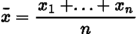
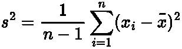
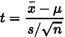
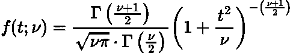
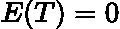
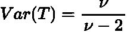
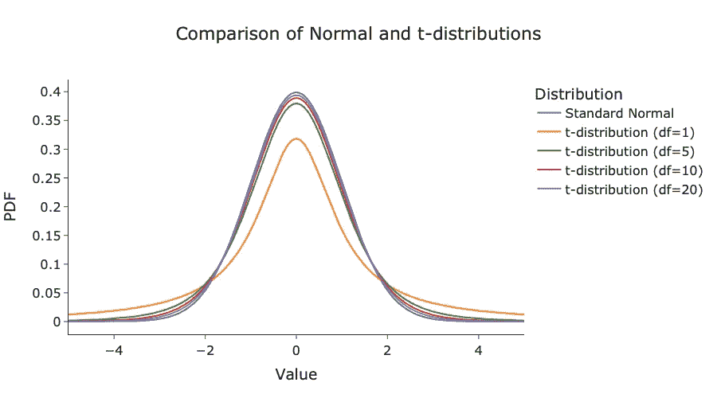

# 什么是 t 分布

> 原文：[`towardsdatascience.com/beyond-the-bell-curve-an-introduction-to-the-t-distribution-87a7cf5b3e40`](https://towardsdatascience.com/beyond-the-bell-curve-an-introduction-to-the-t-distribution-87a7cf5b3e40)

## 探索著名 t 分布的起源、理论和应用

[](https://medium.com/@egorhowell?source=post_page-----87a7cf5b3e40--------------------------------)[](https://towardsdatascience.com/?source=post_page-----87a7cf5b3e40--------------------------------) [Egor Howell](https://medium.com/@egorhowell?source=post_page-----87a7cf5b3e40--------------------------------)

·发布于[Towards Data Science](https://towardsdatascience.com/?source=post_page-----87a7cf5b3e40--------------------------------) ·6 分钟阅读·2023 年 9 月 2 日

--


图片由[Agence Olloweb](https://unsplash.com/@olloweb?utm_source=medium&utm_medium=referral)提供，来源于[Unsplash](https://unsplash.com/?utm_source=medium&utm_medium=referral)

# 什么是 t 分布？

[**t 分布**](https://en.wikipedia.org/wiki/Student%27s_t-distribution)**，**是一种连续概率分布，与[**正态分布**](https://en.wikipedia.org/wiki/Normal_distribution)**，**非常相似，但有以下关键差异：

+   **尾部更重**：*其概率质量更多地集中在极端值（较高的* [***峰度***](https://www.scribbr.com/statistics/kurtosis/#:~:text=Kurtosis%20is%20a%20measure%20of,(thin%20tails)%20are%20platykurtic.)*）上。这意味着它更有可能产生远离均值的值。*

+   **一个参数**：*t 分布只有一个参数，即* [***自由度***](https://en.wikipedia.org/wiki/Degrees_of_freedom_(statistics))*, 因为它用于当我们不知道总体方差时。*

关于 t 分布的一个有趣事实是，它有时被称为“学生 t 分布”。这是因为分布的发明者，[**威廉·西利·高斯特**](https://en.wikipedia.org/wiki/William_Sealy_Gosset)，是一位英国统计学家，他使用化名“学生”发布了该分布，以保持其身份匿名，因此得名“学生 t 分布”。

附加视频。

# 理论与定义

让我们深入了解分布背后的理论，以建立一些数学直觉。

## 起源

t 分布的起源来自于在不知道数据总体方差的情况下对正态分布数据进行建模的思想。

例如，假设我们从正态分布中抽取了 ***n*** 个数据点，则该样本的均值和方差分别如下：



由作者提供的 LaTeX 方程。



由作者提供的 LaTeX 方程。

其中：

+   ***x̄*** *是样本均值。*

+   ***s*** *是样本标准差。*

结合上述两个方程，我们可以构造以下随机变量：



由作者提供的 LaTeX 方程。

这里 ***μ*** 是总体均值，***t*** 是属于 t 分布的 t 统计量！

> 更多详细推导请见 [这里](https://www.statlect.com/probability-distributions/student-t-distribution)。

## 概率密度函数

如上所述，t 分布仅由一个值——自由度*ν*——进行参数化，其 [**概率密度函数**](https://en.wikipedia.org/wiki/Probability_density_function) 如下所示：



由作者提供的 LaTeX 方程。

其中：

+   ***t*** *是随机变量（t 统计量）。*

+   ***ν*** *是自由度，等于* ***n−1****，其中* ***n*** *是样本大小。*

+   ***Γ(z)*** *是* [***伽玛函数***](https://en.wikipedia.org/wiki/Gamma_function)***，它是****:***


由作者提供的 LaTeX 方程。

不用过于担心这些复杂的数学（我肯定也不会！），但需要知道的关键点是：

+   *PDF 是对称的，整体呈钟形。*

+   *与 [***标准正态分布***](https://www.scribbr.co.uk/stats/the-standard-normal-distribution/) *变量非常相似，均值为 0，方差为 1，只是稍微浅一点，宽一点。*

+   *当* ***ν*** *增加时，t 分布逐渐接近标准正态分布。*

## 特性

+   对于 ***ν > 1***，均值定义如下：



由作者提供的 LaTeX 方程。

+   对于 ***ν > 2***，方差定义如下：



由作者提供的 LaTeX 方程。

# 示例图

下面是 t 分布随不同自由度变化的示例图，并与标准正态分布进行比较：

```py
 # Import packages
import numpy as np
from scipy.stats import t, norm
import plotly.graph_objects as go

# Generate data
x = np.linspace(-5, 5, 1000)
normal_pdf = norm.pdf(x, 0, 1)

# Create plot
fig = go.Figure()

# Add standard normal distribution to plot
fig.add_trace(go.Scatter(x=x, y=normal_pdf, mode='lines', name='Standard Normal'))

# Add t-distributions to plot for various degrees of freedom
for df in [1, 5, 10, 20]:
    t_pdf = t.pdf(x, df)
    fig.add_trace(go.Scatter(x=x, y=t_pdf, mode='lines', name=f't-distribution (df={df})'))

fig.update_layout(title='Comparison of Normal and t-distributions',
                  xaxis_title='Value',
                  yaxis_title='PDF',
                  legend_title='Distribution',
                  font=dict(size=16),
                  title_x=0.5,
                  width=900,
                  height=500,
                  template="simple_white")
fig.show()
```



由作者用 Python 生成的图。

注意，自由度 ***df*** 越来越大时，t 分布就越接近正态分布。当 ***df=30*** 时，我们可以说这两种分布足够相似。

# 应用

以下是 t 分布在数据科学和机器学习中的最常见和频繁应用：

+   **t 检验**：*t 分布最著名的应用是* [***假设检验***](https://en.wikipedia.org/wiki/Statistical_hypothesis_testing) *，通过使用 t 检验来衡量两个样本均值之间的统计差异。您可以在这里查看我之前的博客：*

[](/statistical-t-test-simply-explained-b510045d69e?source=post_page-----87a7cf5b3e40--------------------------------) [## 统计 t 检验简单解释

### 对学生 t 分布和学生 t 检验的介绍

[统计 t 检验简单解释](https://towardsdatascience.com/statistical-t-test-simply-explained-b510045d69e?source=post_page-----87a7cf5b3e40--------------------------------)

+   **置信区间**：*对于小样本量（通常小于 30），用于计算该统计量的* ***置信区间****，以应对不确定性增加。您可以在这里阅读更多关于置信区间的信息：*

[](/confidence-intervals-simply-explained-58b0b11e985f?source=post_page-----87a7cf5b3e40--------------------------------) [## 置信区间简单解释

### 置信区间的简要解释。

[置信区间简单解释](https://towardsdatascience.com/confidence-intervals-simply-explained-58b0b11e985f?source=post_page-----87a7cf5b3e40--------------------------------)

+   **回归**：*t 分布用于确定我们是否应将某些协变量添加到回归模型中，并计算其系数的显著性假设检验。*

+   **贝叶斯统计**：*t 分布有时作为* [***贝叶斯推断***](https://en.wikipedia.org/wiki/Bayesian_inference)***的先验分布，这在所有数据科学领域都可以应用，特别是强化学习。更多信息请见：*

[](/bayesian-updating-in-python-8bbd0e7e30cc?source=post_page-----87a7cf5b3e40--------------------------------) [## Python 中的贝叶斯更新

### 如何使用 Numpy 在 Python 中进行贝叶斯更新的简单演示。

[贝叶斯更新 Python 实现](https://towardsdatascience.com/bayesian-updating-in-python-8bbd0e7e30cc?source=post_page-----87a7cf5b3e40--------------------------------)

+   **定量金融**：*在金融中，资产和衍生品往往具有过度峰态，因此使用具有重尾的 t 分布进行建模。这对金融领域的数据科学家非常有用。*

# 概述与进一步思考

t 分布是一种有用的统计分布，非常类似于正态分布，但具有更重的尾部。这使它在未知总体方差的情况下成为一个重要的工具。它由一个参数进行参数化：自由度，随着自由度的增加，t 分布趋向于类似于正态分布。它在数据科学领域有各种应用，包括使用 t 检验进行假设检验，为小数据集构建置信区间，以及辅助回归建模。

本文中使用的代码可以在我的 GitHub 上找到：

[## Medium-Articles/Statistics/Distributions/t_dist.py at main · egorhowell/Medium-Articles](https://github.com/egorhowell/Medium-Articles/blob/main/Statistics/Distributions/t_dist.py?source=post_page-----87a7cf5b3e40--------------------------------)

### 我在我的中等博客/文章中使用的代码。通过在…上创建一个帐户来贡献 egorhowell/Medium-Articles 的开发

[github.com](https://github.com/egorhowell/Medium-Articles/blob/main/Statistics/Distributions/t_dist.py?source=post_page-----87a7cf5b3e40--------------------------------)

# 参考资料与进一步阅读

+   [*关于 t 分布的更多信息。*](https://www.freecodecamp.org/news/the-t-distribution-a-key-statistical-concept-discovered-by-a-beer-brewery-dbfdc693184/)

+   [*分布的详细数学推导。*](https://probabilityandstats.wordpress.com/tag/students-t-distribution/)

+   [*分布背后的更多数学。*](https://www.statlect.com/probability-distributions/student-t-distribution)

# 另一个事物！

我有一个免费的新闻通讯，[**数据揭秘**](https://dishingthedata.substack.com/)，在其中我分享成为更好的数据科学家的每周技巧。没有“废话”或“点击诱饵”，只有来自实践数据科学家的纯粹可操作见解。

[## Dishing The Data | Egor Howell | Substack](https://newsletter.egorhowell.com/?source=post_page-----87a7cf5b3e40--------------------------------)

### 如何成为更好的数据科学家。点击阅读《数据揭秘》，作者 Egor Howell，Substack 出版的…

[newsletter.egorhowell.com](https://newsletter.egorhowell.com/?source=post_page-----87a7cf5b3e40--------------------------------)

# 与我联系！

+   [**YouTube**](https://www.youtube.com/@egorhowell)

+   [**LinkedIn**](https://www.linkedin.com/in/egor-howell-092a721b3/)

+   [**Twitter**](https://twitter.com/EgorHowell)

+   [**GitHub**](https://github.com/egorhowell)
