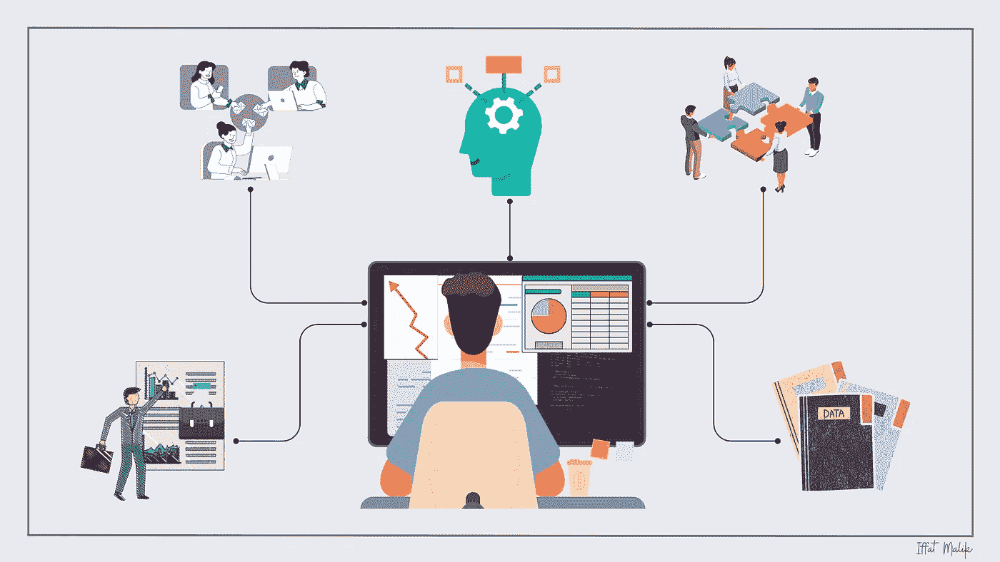
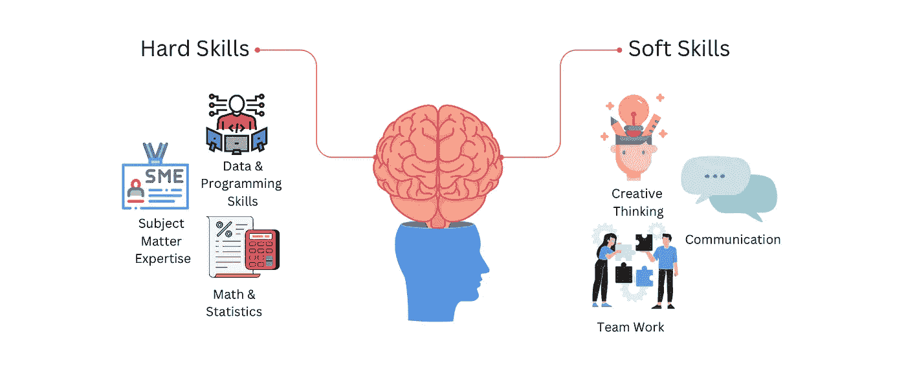
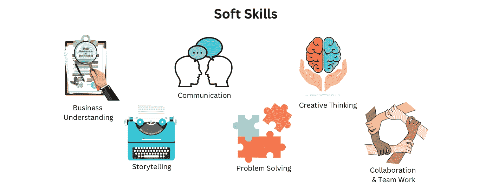
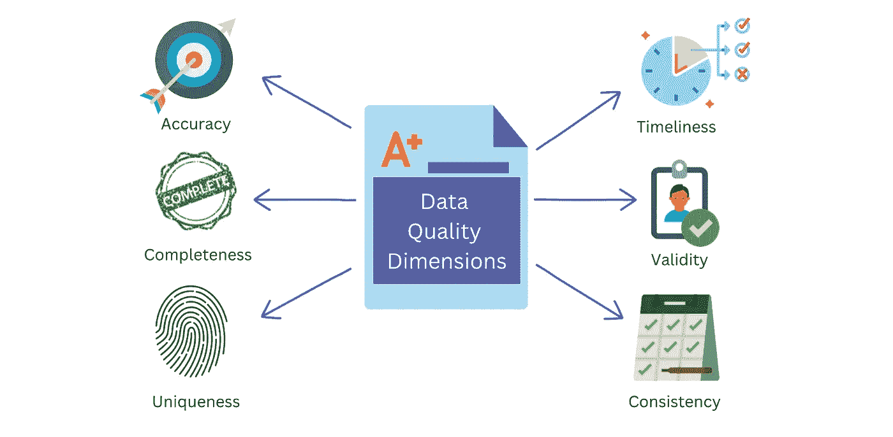

# 超越数字：软技能在数据分析中的关键作用

> 原文：[`towardsdatascience.com/beyond-the-numbers-the-crucial-role-of-soft-skills-in-data-analysis-30eb26aa8834`](https://towardsdatascience.com/beyond-the-numbers-the-crucial-role-of-soft-skills-in-data-analysis-30eb26aa8834)

## **利用人类品质在数据世界中脱颖而出**

 [Iffat Malik](https://iffatm.medium.com/?source=post_page-----30eb26aa8834--------------------------------)

·发表于 [Towards Data Science](https://towardsdatascience.com/?source=post_page-----30eb26aa8834--------------------------------) ·9 分钟阅读·2023 年 6 月 24 日

--

作者提供的图片

在今天的就业经济中，建立和维持坚实的技术技能基础无疑至关重要；然而，同样重要的是认识到，令人印象深刻的软技能是你技术专长的不可或缺的补充。它在支持和提升你整体职业能力方面发挥着重要作用。

在大数据和先进分析的时代，数据分析已成为所有行业企业决策过程中的重要组成部分。虽然这被认可了，但在组织内的数据分析常常面临挑战。你知道为什么吗？虽然很少被公开承认，但事实是数据往往在组织的不同业务部门中是碎片化和分散的。拥有卓越的软技能不仅能帮助你找到这些数据，还能获得访问权限，导航组织内部数据治理政策的复杂性。

## 软技能和硬技能是什么？

软技能和硬技能是两种不同的技能类别。

作者提供的图片

硬技能指的是通过教育、培训或在特定领域或行业的经验获得的具体技术能力和知识。它们通常可以通过认证或学位量化并展示。

软技能包括一系列促进有效沟通、协作和团队合作、解决问题和批判性思维的人际和个人特质。它们使我们能够在复杂的数据环境中导航，处理冲突，适应变化，并不断学习和发展。

在本文中，我们将探讨软技能在数据分析领域的重要性以及它们如何助力于在这一快速发展的数据领域取得成功。

作者提供的图片

## 理解业务

在我的职业生涯中，我反复收到的反馈是我对了解业务复杂性的好奇心和深厚兴趣。我坚信，尽管技术可以通过课程和培训随时学习，但商业知识的意义超越了短期优势。与技术不同，技术可以通过结构化学习获得，而商业知识则是逐渐积累的专长，随着时间的推移而增长。

对业务流程的基础方面进行全面理解，能够提供关于组织核心内部运作的宝贵见解。它不仅让你深刻理解组织的运作方式，还揭示了特定产品或服务背后的详细机制。

下面是我个人用来提升业务理解的一些方法：

+   通过积极参与业务的日常运营，与利益相关者互动，参加会议并观察关键流程。这将让你直接接触业务动态，并帮助你获得对各个职能领域的见解。

+   与业务利益相关者合作，了解他们的目标、挑战，以及数据分析如何支持他们的决策过程。

+   积极倾听是一项被低估的技能，但它具备促进深刻业务理解的卓越能力。它使你能够提出相关问题，以了解数据分析请求背后的业务目标，并深入挖掘潜在的问题或机会。提出有见地的问题将引导出更有意义的分析和可行的建议。

+   我经常花时间研究和学习我的组织所在的行业，了解市场趋势、竞争格局和影响业务的监管因素。这种更广泛的行业知识将为数据分析提供更多背景和宝贵的见解。

+   通过阅读书籍、文章和收听播客，保持对商业概念、原则和实践的最新了解。拓展你在自己领域之外的知识。这种跨学科的方法将增强对业务中不同职能如何相互连接的理解。

+   最后，一个始终促进我成长的重要实践是积极寻求利益相关者对我分析的价值和影响的反馈。了解他们的观点，并利用他们的反馈来完善和改进工作。这一迭代过程不仅会增强对业务的理解，还会提升可信度和管理期望。

## 沟通艺术和数据讲故事

数据分析不仅仅是处理数据；它涉及提取有意义的洞察并以引人入胜的方式呈现。

在信息泛滥的数据环境中，拥有扎实的理解至关重要，并以简单而引人入胜的方式向更广泛的团队呈现这种理解，简直是一项福尔摩斯式的任务。

这里有一些我喜欢的窍门：

+   我经常与技术和非技术同事合作。我通常根据同事的背景、知识水平和需求调整我的语言、语气和技术细节。

+   数据分析经常涉及棘手的概念和技术术语。为了有效沟通这些复杂的思想，有必要将其简化并以易于理解的术语呈现。我多年来收到的另一个常见反馈是我能够以更简单的方式向不同的业务利益相关者传达复杂概念。我是如何做到的？

> 我常用的策略是利用视觉效果、类比和现实生活中的例子来使我的观点更清晰。

+   作为一个数据可视化背景的从业者，我利用它以视觉上吸引人且易于理解的方式呈现信息。我是如何做到的？通过仔细选择最合适的图表、图形和图示，以有效传达关键信息并促进数据的解读。

    相信我，这种方法非常有效。我不仅为工作相关的事务创建视觉效果，还喜欢为所有文章制作插图。

+   作为人类，我们天生对叙事感兴趣，讲故事是数据分析中的一种强大工具。可视化在讲故事中至关重要，因为它们提供了一个框架，帮助故事在上下文中展开。这种视觉和叙事的强大结合不仅能吸引观众，还能使洞察更具相关性。

    与其费力解读二维视觉信息，不如利用讲故事和视觉效果使数据栩栩如生，增强理解。

## 合作与团队协作

数据分析很少是孤立进行的。数据相关项目通常需要多个背景和专业领域不同的团队合作。这些团队通常由产品经理、数据工程师、项目经理、BI 开发人员、数据分析师和业务分析师等组成。

以下是我发现有价值的一些方法：

+   毫无疑问，我最喜欢的一点是将我的队友视为个体，而不仅仅是同事。我们都经历生活的起伏，而考虑到我们在工作中花费了大量时间，重要的是要认识到每个人由于个人情况和承诺，处理工作负荷的能力会有所波动。通过关注我队友的可用性并在困难时期支持他们，我可以有效地重新分配任务，确保项目里程碑仍能按时完成。

+   这是一个根植于心理学的基本原则，即人们本能地期望你优先倾听他们的观点。我父亲在我大学期间送给我一本[*高效能人士的七个习惯*](https://www.amazon.co.uk/Habits-Highly-Effective-People-Powerful/dp/0743269519)的书。我花了几年时间才真正内化并将这一原则融入到我的生活中。*习惯 5*，正如斯蒂芬·柯维所阐述的，仍然具有深远的相关性：

> “首先寻求理解，然后再寻求被理解。”

这也是与业务利益相关者和更广泛团队进行对话的有效方式。

+   每个项目对所有团队成员来说都是一个学习的经历。为了满足项目需求，掌握新技能并不罕见。因此，当有人在学习和实施新技能的过程中时，保持一点耐心是至关重要的。然而，同样重要的是在需要时主动向队友寻求帮助，而不是等待他们来救援。根据我的经验，大多数人愿意加入 Teams 电话会议一起排除故障，这显著加快了调试过程。

+   为有兴趣的参与者设置定期的团队交流电话会议，以便知识共享。虽然这可能有点挑战，因为并不是每个人都感兴趣，但仍然可以安排这些会议。在这些电话会议中，团队成员可以轮流每隔几天向其他团队成员传授他们自信的知识。例如，如果有人擅长 SQL，他们可以为大家进行一个关于一些快速技巧的简短讲解。同样，如果另一位团队成员拥有某个项目的宝贵领域知识或专业技能，他们可以与更广泛的团队分享。这将增强集体知识基础。

## 批判性思维和解决问题

我们经常听到数据专业人士必须具备批判性思维和解决问题的能力。然而，我们真的理解它们是什么以及为什么它们被认为是重要技能吗？仅仅阅读博客、参加课程或在线解决几个问题不足以培养这些技能。重要的是要意识到，单纯的被动参与在培养批判性思维能力时是不够的。

那么应该怎么做呢？保持好奇。好奇心在发展批判性思维和提高解决问题技能方面是一个重要因素。

> 好奇心是我们探索、学习和理解周围世界的自然倾向。

单纯在工作中激活你的批判性思维能力是不够的。将其融入你的日常生活并使其成为你思维过程的自然部分，无论是在专业还是个人生活中，都至关重要。

> 我没有特殊的才能。我只是充满了热情的好奇心。
> 
> ~ 阿尔伯特·爱因斯坦

这里是一些我喜欢的小窍门：

+   提问。我发现质疑假设、挑战现有知识并探索替代视角是非常有价值的。当你提出问题时，你可以*深入*探讨问题并找出潜在解决方案。然而，重要的是要记住这一点：

> 在提出相关问题和通过提出不必要的问题无谓地消耗大家时间之间，需要保持微妙的平衡。

+   更新你的领域知识。深入了解你所工作的领域或行业是至关重要的。通过熟悉该领域的具体挑战、目标和术语，你可以提出更相关和有洞察力的问题。这种知识帮助你把握数据的背景，识别影响数据分析和决策的关键因素。

    例如。如果你想深入了解银行业的贷款操作，试着了解其关键概念、操作、法规、行业趋势和最佳实践。

+   脏数据挑战：在深入数据分析之前，彻底评估数据的质量和可靠性至关重要。数据分析的终极目标是将信息转化为可操作的洞察。然而，这个过程很少是线性和直接的。分析数据涉及审查数据的准确性、相关性和来源，以及解决任何潜在的假设、缺口、错误或偏见。

> 实际上，数据的价值在于它能够回答相关的业务问题。

组织优先考虑的数据不仅仅是视觉上令人愉悦的仪表盘，还要解决他们特定的问题并促进潜在的增长。

作者提供的图像

通过利用[数据质量维度](https://www.experian.co.uk/business/glossary/data-quality-dimensions/#:~:text=A%20Data%20Quality%20Dimension%20is,unit%2C%20company%20or%20product%20range.)，你可以建立一个框架，确保后续分析建立在可靠和重要的数据基础上，从而得到更准确和有根据的洞察。

+   在数据的世界里，每个问题都是不同的，没有固定的规则可以轻松解决问题。在我看来，最重要的是从一开始就清晰地阐述问题或问题陈述。同样重要的是确保团队成员对问题陈述及其相关期望达成一致。从这里开始，你可以着手识别和收集启动项目所需的相关信息。

+   接受可能出错的可能性。数据往往是复杂和混乱的。正如我们已经讨论过的，质疑数据本身的可靠性至关重要，特别是因为决策依赖于它。在数据分析过程中，你的初步观点很可能是错误的。接受这个事实，并在后续分析中进行调整。

    你如何实现这一目标？通过从不同的角度审视数据，发现模式、检测异常并得出可能不立即显现的见解。这将帮助你在形成观点之前，更深入地理解你试图解决的问题。

## 结论

在不断发展的数据分析领域，卓越不仅仅需要技术专长。从个人层面来看，我自己在软技能上的提升改变了我处理数据分析的方式，我变得更加擅长展示我的发现和与利益相关者互动，赢得了他们的信任和支持。总的来说，软技能使你能够弥合数据与决策者之间的差距，理解数据使用的背景，最终提高洞察的质量和相关性。

[*成为会员并阅读 Medium 上的所有故事*](https://medium.com/@iffatm/membership)*.*

祝学习愉快！
