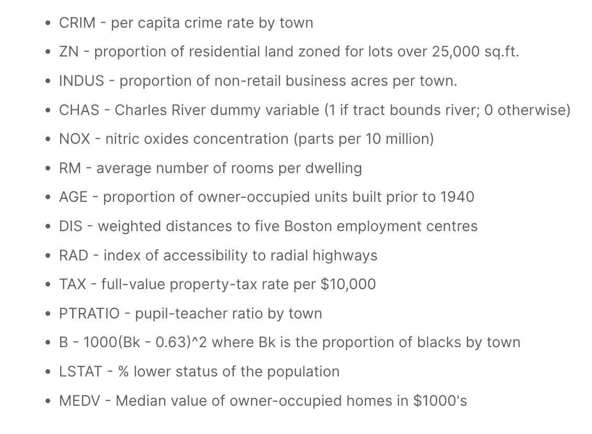
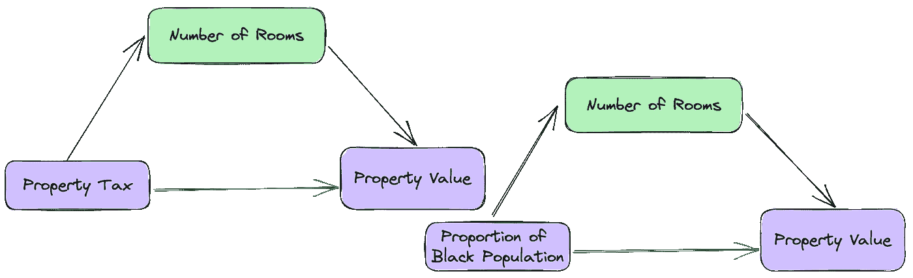

# 超越 VIF：用于偏差缓解和预测准确性的共线性分析

> 原文：[`towardsdatascience.com/beyond-the-vif-collinearity-analysis-for-bias-mitigation-and-predictive-accuracy-18fbba3f7aa2?source=collection_archive---------5-----------------------#2023-07-31`](https://towardsdatascience.com/beyond-the-vif-collinearity-analysis-for-bias-mitigation-and-predictive-accuracy-18fbba3f7aa2?source=collection_archive---------5-----------------------#2023-07-31)

[](https://goodrobotsai.medium.com/?source=post_page-----18fbba3f7aa2--------------------------------)[](https://towardsdatascience.com/?source=post_page-----18fbba3f7aa2--------------------------------) [Good Robots](https://goodrobotsai.medium.com/?source=post_page-----18fbba3f7aa2--------------------------------)

·

[关注](https://medium.com/m/signin?actionUrl=https%3A%2F%2Fmedium.com%2F_%2Fsubscribe%2Fuser%2F3abbfbfa9c59&operation=register&redirect=https%3A%2F%2Ftowardsdatascience.com%2Fbeyond-the-vif-collinearity-analysis-for-bias-mitigation-and-predictive-accuracy-18fbba3f7aa2&user=Good+Robots&userId=3abbfbfa9c59&source=post_page-3abbfbfa9c59----18fbba3f7aa2---------------------post_header-----------) 发表在 [Towards Data Science](https://towardsdatascience.com/?source=post_page-----18fbba3f7aa2--------------------------------) ·12 分钟阅读·2023 年 7 月 31 日[](https://medium.com/m/signin?actionUrl=https%3A%2F%2Fmedium.com%2F_%2Fvote%2Ftowards-data-science%2F18fbba3f7aa2&operation=register&redirect=https%3A%2F%2Ftowardsdatascience.com%2Fbeyond-the-vif-collinearity-analysis-for-bias-mitigation-and-predictive-accuracy-18fbba3f7aa2&user=Good+Robots&userId=3abbfbfa9c59&source=-----18fbba3f7aa2---------------------clap_footer-----------)

--

[](https://medium.com/m/signin?actionUrl=https%3A%2F%2Fmedium.com%2F_%2Fbookmark%2Fp%2F18fbba3f7aa2&operation=register&redirect=https%3A%2F%2Ftowardsdatascience.com%2Fbeyond-the-vif-collinearity-analysis-for-bias-mitigation-and-predictive-accuracy-18fbba3f7aa2&source=-----18fbba3f7aa2---------------------bookmark_footer-----------)

在机器学习中，共线性是一个复杂的难题，无论是经验丰富的专家还是新手都面临挑战。机器学习（ML）算法的优化侧重于预测准确性，而非对目标的解释。此外，处理共线性的多数解决方案，如‘[***方差膨胀因子***](https://www.statisticshowto.com/variance-inflation-factor/)***’***和‘[***皮尔逊交叉相关分析***](http://pubs.sciepub.com/ajams/8/2/1/index.html)’，在预处理阶段可能会导致大量信息丢失。

大多数机器学习算法会选择最佳的特征组合以优化预测准确性。因此，即使存在共线性，只要训练中观察到的相关性在实际世界中仍然成立，共线性在机器学习中也不是问题。然而，对于模型的可解释性来说，共线性的 unchecked 效果是潜在的偏差来源。


图 1: 波士顿住房数据集中的共线性概览

***共线性***指的是数据集中独立变量（**IVs**）之间的高相关性，通常在回归模型的解释中提出独特的挑战。特别是，它干扰了确定数据中关系的真实原因，这可能导致偏颇的解释和不公平的决策。例如，在图 1 中，独立变量 (TAX)、(B) 和 (RAD) 是共线性 IVs，同时也是因变量 (MEDV) 的良好预测因子。虽然 ML 算法会选择最佳的预测因子组合，但它们可能无法考虑将另一个共线性变量 (RM) 添加到这些三个变量中的任何一个模型的效果。

为了鼓励机器学习者将共线性分析作为预处理步骤认真对待，必须有一种方法来平衡***保持共线性变量的膨胀成本***和***去除它们的预测成本***。

# 理解共线性

为了展示 unchecked 共线性如何导致无意的偏差，让我们使用“*如何不收集数据*”的警示故事： [***波士顿住房数据集***](https://github.com/Good-Robots/Collinearity-Analysis/blob/main/housing.csv)***。*** 该数据集已经被揭穿并从公开使用中撤回，因为它包含了一个 [“不可逆](https://medium.com/@docintangible/racist-data-destruction-113e3eff54a8)” 变量 “B”。独立变量 “B”、“RM” 和 “TAX” 之间的共线性关系是虚假相关如何压制 IVs 之间真实关系的典型案例。对 “B” 的 [‘不可逆](https://www.sciencedirect.com/science/article/abs/pii/0095069678900062)’ 转换，（*一个伪装成连续 IV 的二元 IV*）引入了一种可能不会被 ML 算法检测到的调节偏差。



图 2: IVs — 波士顿住房数据集

考虑波士顿住房数据集中的 13 个***独立变量（IVs）***，以城镇中的自有住房中位值（MEDV）作为因变量（***DV***）。某些特征可能看起来是结果的强预测因子，但这种影响在于它们的方差在很大程度上由其他预测因子解释。


图 2: 交叉相关分析 — 波士顿住房数据集

在独立变量与因变量之间的双变量关系中，当引入新的自变量时，有以下四种可能性：

1.  **虚假膨胀**：引入第三个自变量显著增加了第一个自变量对因变量的影响。

1.  **掩盖或抑制**：新的自变量掩盖或抑制了初始自变量对因变量的影响。

1.  **调节或改变**：新变量改变了自变量对因变量的原始关系的方向，适用于所有或某些观察值。

1.  **没有影响**：第三个自变量没有提供新信息，对自变量和因变量没有影响。

对于机器学习者来说，现成的共线性解决方案往往会导致预测能力丧失、过拟合模型和偏差。因此，减轻信息损失的解决方案至关重要。

# 评估共线性

如果两个或更多自变量高度相关（如 RAD 和 TAX），共线性的直观解释是，它们可能提供了关于某个“潜在”概念（如大郊区房屋/城市公寓）对因变量（如房地产价值）影响的完全相同的信息。在存在“物业税”的情况下，通往辐射高速公路的可达性对房地产价值没有提供新的信息（反之亦然）。当自变量之间毫无意义地高度相关时，回归模型的系数会变得很大，从而导致对某些因素对结果影响的过度估计。

目前，有两种处理共线性的方法，但都没有考虑到因变量。

1.  **成对相关**：有多少自变量彼此“高度”相关。‘高度相关’特征的相关系数的阈值是主观的。然而，[普遍共识](https://onlinelibrary.wiley.com/doi/full/10.1111/j.1600-0587.2012.07348.x)是，当相关系数达到+/- 0.7 时，共线性成为一个严重问题。

```py
def dropMultiCorrelated(cormat, threshold):
    ##Define threshold to remove pairs of features with 
    #correlation coefficient greater than 0.7 or -0.7
    threshold = 0.7

    # Select upper triangle of correlation matrix
    upper = cormat.abs().where(np.triu(np.ones(cormat.shape), k=1).astype(np.bool))

    # Find index of feature columns with correlation greater than threshold
    to_drop = [column for column in upper.columns if any(upper[column] > threshold)]
    for d in to_drop:
        print("Dropping {}....".format(d))
    return to_drop"
```

**2\. 方差膨胀**：虽然相关系数确认了两个自变量之间的变化程度，但它对***自变量的重要性***了解甚少。这是因为，在多元关系中，自变量在其对因变量的影响上并不真正***独立***（参见图 1），它们的真实***影响显著性***是在其他**自变量**的组合存在下才显现出来。

方差膨胀评分是由于自变量之间的相互依赖而对回归系数的影响大小。VIF 采用***“留一法”***方法，处理每一个***“留出”***作为因变量，所有***“留在”***作为自变量。因此，所有自变量变成因变量，每个模型生成一个(***R2***)值。这个 R2 值表示了***“留出”***自变量的方差百分比由***“留在”***自变量解释。VIF 评分估算如下：


图 4：变量膨胀估计 — 波士顿住房数据集

根据上述 VIF 估计，我们需要剔除 13 个 IV 中的 11 个，以彻底解决共线性问题。这不仅会导致大量信息丢失，还可能产生过度拟合或欠拟合的模型，这些模型在实际应用中表现不佳。

> 在机器学习中，成对的多重相关性和 VIF 分数不应作为丢弃或保留特征的唯一标准。

尽管特征具有高相关性和 VIF 分数，但某些特征仍可能提供显著的预测价值或有助于模型解释。

# 膨胀成本与预测成本在共线性特征选择中的对比

为了减轻信息损失，我们可以比较两个值来衡量 ***保留共线性特征的膨胀成本*** 和 ***丢弃它们的预测成本***。请注意，VIF 分析是独立于结果变量的，因此未完全考虑单个 IV 对因变量的独立影响。

```py
## Build Multiple Linear Regression models to access true independent influence on the outcome
fs = []
for feature in X_train.columns:
  model =  sm.OLS(Y_train, sm.add_constant(X_train[feature])).fit()
  fs.append((feature, model.params[feature]/ model.pvalues[feature]))

## Extract and Store Values
c1 = pd.DataFrame(coefs, columns = ['Feature', 'VarianceEx']).sort_values("VarianceEx")
```

第一个指标是 IV 对因变量的独立影响，即由 IV（R_squared）***独立地***解释的因变量方差。为了保持一致性，我们还将根据这个 R_squared 值估算 VIF 分数，并称之为 VIF(IY) —— 独立重要性。第二个指标是在所有 IV 存在的情况下，独立变量对因变量的影响，即上述估算的 VIF。我们称之为 VIF(IX) —— 集体重要性。


图 5：估算特征对 ML 模型的膨胀成本与预测成本

现在，我们可以自信地估算通过丢弃一个共线性特征你将放弃的真正“惊讶”量。在下图中，X 轴代表每个 IV 解释的 Y 方差（对预测的潜在“有用性”度量），而 Y 轴代表其他 IV 解释的 IV 方差（对模型的潜在“偏差”度量）。子图 1 中的气泡大小是将这些变量保留在模型中的膨胀成本，而子图 2 中则是丢弃它们的预测成本。

由于这是一个预处理步骤，我们将对 VIF(IX) 因子的 20（红线）和 VIF(IY) 的 1.15（蓝线）使用非常宽松的“临界值”。这样，红线以下的特征由其他 IV 解释最少，而蓝线后的特征无法独立预测（Y）。


图 6：特征的膨胀成本与预测成本

该图总结了 IV 的独立预测能力 **VS** 其潜在偏差。

+   ***象限 1 — 潜在真实共线性变量***：这些特征 (NOX, PTRATIO) 是由模型中某些 IV 的线性组合解释的，不能独立预测因变量（它们可能依赖于其他一组 IV 才能有效）。此外，它们可能的预测能力可能被其他 IV 的线性组合所抵消（子图 2）。它们的影响被添加的其他 IV(s) 显著抑制。

+   ***象限 2 — 潜在偏差者***：这些变量与因变量和其他独立变量有关。特征 (RM, TAX, B) 似乎能独立预测 (Y)，但它们的方差也由其他独立变量组合解释。它们对 (Y) 的所谓独立预测能力不能孤立于其他 (IVs) 考虑。当解释它们对结果的重要性时，它们可能是极其强大的预测变量或成为偏差来源。

+   ***象限 3 — 依赖变量***：虽然它们并不是对 (Y) 的独立预测，但丢弃其中一些变量的预测成本很高。这是因为它们包含的独特信息是其他 IV 所无法解释的。这种‘独特’信息对预测 (Y) 的有用性只能与其他 IV(s) 结合考虑。

+   ***象限 4 — 真实独立预测变量***：这些变量能独立预测 (Y)。这些变量还包含其他 IV 所无法解释的独特信息（比象限 3 更多）。这种‘独特’信息对预测 (Y) 的有用性独立于其他 IV(s)。然而，其他 IV 的线性组合可能比它们的独立预测能力具有更高的预测能力。

```py
O = Y_train
# To estimate the effect the addition/removal of a feature C
# has on the relationship between an independent feature I and an outcome O

conf = []
for I in X_train.columns:
    # build a baseline model for the  effect of I on  O
    model = sm.OLS(O, sm.add_constant(X_train[I])).fit()
    IO_coef, IO_sig = model.params[I], model.pvalues[I]

    ## Access the effect of 
    for C in X_train.columns:
        if C != I:
            # build an auxilliary model adding C to the relationship between I and O
            model2 = sm.OLS(O, sm.add_constant(X_train[[I, C]])).fit()
            ico_preds = model2.predict()
            ICO_coef, ICO_sig = model2.params[I], model2.pvalues[I]

            # build a baseline model for the effect of C on  O
            model3 = sm.OLS(O, sm.add_constant(X_train[C])).fit()
            CO_coef, CO_sig = model3.params[C], model3.pvalues[C]

            corr_IC, _ = pearsonr(X_train[I], X_train[C]) # CORR The independent vs the control
            corr_IO, _ = pearsonr(X_train[I], O) #CORR The independent vs the outcome
            corr_CO, _ = pearsonr(X_train[C], O) #CORR The control vs the outcome
            conf.append({"I_C":f"{I}_{C}",
                                "IO_coef":IO_coef, "IO_sig":IO_sig,
                                "CO_coef":CO_coef, "CO_sig":CO_sig,
                                "ICO_sig":ICO_sig, "ICO_coef": ICO_coef,
                                "corr_IC":corr_IC,
                                "corr_IO":corr_IO,
                                "corr_CO":corr_CO})

cc = pd.DataFrame(conf)
corr_ic = (cc['corr_IC'] > 0.5) | (cc['corr_IC'] < -0.5) # I is correlated with C
corr_co = (cc['corr_CO'] > 0.5) | (cc['corr_CO'] < -0.5) # C is correlated with O
corr_io = (cc['corr_IO'] > 0.5) | (cc['corr_IO'] < -0.5) # C is correlated with O

## C and O are significantly correlated
co_sig = (cc['CO_sig'] < 0.01) # The C is independetly predictive of O
io_sig = (cc['IO_sig'] < 0.01)

cc[corr_ic & corr_io & corr_co & co_sig & io_sig]
```

变量 ***B***、***TAX*** 和 RM 彼此之间具有显著的预测关系，同时也独立预测结果。这可能是最能预测 DV (***MEDV***) 的 IV 线性组合。或者，这些 IV 中任意两个的预测相关性可能因第三个 IV 的存在而被夸大或抑制。为了调查这一点，应将每个变量依次从包含所有独立变量的基线模型中移除。


图 7：IV 丢弃对基线模型的影响

随后，剩余变量对结果的显著性变化应以百分比形式量化。这一过程将有助于揭示被其他 IV 解释的 IV，假装自己很重要。

# 红线以上，去除共线性偏差

三个主要的影响（关注点）是，位于红线以上的共线性变量可能对其他 IV(s) 和因变量之间的关系产生的影响。它们可能会中介（抑制）、混淆（夸大）或调节（改变）。

调节变量、中介变量和混杂变量的概念在机器学习中并没有真正讨论。这些概念通常留给“社会科学家”，毕竟，他们是需要“解释”他们的系数的人。然而，这些概念解释了共线性如何对机器学习模型引入偏差。

> 请注意，这些效应在没有深入因果分析的情况下无法真正确定，但作为去除偏差的预处理步骤，我们可以使用这些概念的简单定义来过滤这些关系。



图 8：波士顿住房数据集中调解关系

***中介变量***解释了自变量和因变量是如何相关的，即它们之间相关的过程。一个中介变量必须满足三个标准：

a) 对第一个自变量具有显著预测能力，b) 对因变量具有显著预测能力，c) 在第一个自变量存在的情况下，对因变量具有显著预测能力。

它“调解”是因为它的包含不会改变第一个自变量和因变量之间的关系方向。如果从模型中移除一个中介变量，第一个自变量和因变量之间的关系强度应该会变强，因为中介变量确实解释了部分效果。

```py
## finding mediators
cc = pd.DataFrame(conf)
co_sig = (cc['CO_sig'] < 0.01) # The C is independetly predictive of Y
io_sig = (cc['IO_sig'] < 0.01) # The I is independetly predictive of Y
icoi_sig = (cc['ICO_I_sig'] < 0.01) # The I  and C are predictive of Y
icoc_sig = (cc['ICO_C_sig'] < 0.05) # The C is independetly predictive of Y in the presence of I
icoci_sig = (cc['IO_sig'] > cc['ICO_I_sig']) # Direct relationship between I and O should be stronger without C
```

例如，在（RM）、（TAX）和（MEDV）之间的关系中，房间数量可能解释了物业税与其物业价值的关系。

***混杂变量***是难以捉摸的，因为很难用相关性和显著性来定义它们。混杂变量是一个与因变量和自变量都相关的外部变量，因此可能会扭曲它们之间的感知关系。与中介变量不同，第一个自变量和因变量之间的关系没有意义。也没有保证移除混杂变量会削弱或增强第一个自变量和因变量之间的关系。

房间数量可以调解或混淆黑人人口比例与物业价值之间的关系。根据[这篇论文](https://www.ncbi.nlm.nih.gov/pmc/articles/PMC2819361/#:~:text=Mediation%20involves%20a%20distinctly%20causal,examine%20undistorted%20estimates%20of%20effects.)，这取决于（B）和（RM）之间的关系。如果（RM <-> MEDV）和（RM <-> B）之间的关系是***相同方向的***，移除（RM）应该会削弱（B）对（MEDV）的影响。然而，如果（RM <-> MEDV）和（RM <-> B）之间的关系是***相反方向的***，移除（RM）应该会增强（B）。

（RM <—> MEDV）和（RM <-> B）是相同方向的（图 1 的子图 3），然而，移除（RM）增强了（B）的效果。

但请参见下图，其中我们看到在第一个自变量与因变量之间的关系中，第三个自变量有一个良好的决策边界。这表明根据(B)的值，(RM)与(TAX)之间存在不同类型的关系。


图 9：调节回归

有了***调节变量***，第一个自变量与因变量之间的关系会根据调节变量的值有所不同。你可以期望对价值$100,000 的房子支付多少物业税？这取决于该镇的黑人比例和房间数量。事实上，有一组城镇的物业税保持一致，无论房间数量如何，只要(B)保持在某个阈值以下。


图 10：调节关系 波士顿住房数据集

调节变量通常是数据中的类别特征或组。常规的预处理步骤为每个组标签创建虚拟变量。这[可能解决](https://www.researchgate.net/post/Do-you-need-to-dummy-code-sex-to-run-it-as-a-moderator-variable-in-moderated-multiple-regression)来自该组对因变量的任何调节效应。然而，排名变量或具有低方差的连续变量(B)也可以是调节变量。

# 结论

总之，虽然共线性是回归建模中的一个挑战性问题，但通过仔细评估和管理，可以增强机器学习模型的预测能力和可靠性。能够考虑信息损失，提供了一个有效的特征选择框架，平衡了解释性和预测准确性。
