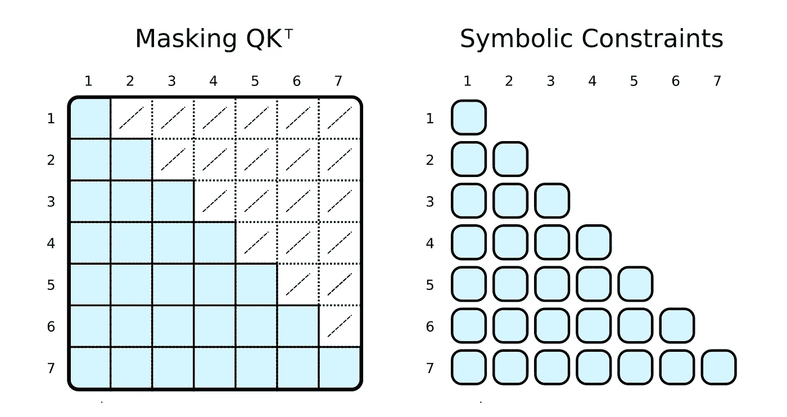

# 超越变压器：PyNeuraLogic 的未来

> 原文：[`towardsdatascience.com/beyond-transformers-with-pyneuralogic-10b70cdc5e45?source=collection_archive---------6-----------------------#2023-02-07`](https://towardsdatascience.com/beyond-transformers-with-pyneuralogic-10b70cdc5e45?source=collection_archive---------6-----------------------#2023-02-07)

## 深度关系学习的前行 [DEEP RELATIONAL LEARNING](https://medium.com/tag/deep-relational-learning)

## 展示神经符号编程的力量

[](https://medium.com/@lukaszahradnik?source=post_page-----10b70cdc5e45--------------------------------)[](https://towardsdatascience.com/?source=post_page-----10b70cdc5e45--------------------------------) [Lukáš Zahradník](https://medium.com/@lukaszahradnik?source=post_page-----10b70cdc5e45--------------------------------)

·

[关注](https://medium.com/m/signin?actionUrl=https%3A%2F%2Fmedium.com%2F_%2Fsubscribe%2Fuser%2Ffcee2c9fb760&operation=register&redirect=https%3A%2F%2Ftowardsdatascience.com%2Fbeyond-transformers-with-pyneuralogic-10b70cdc5e45&user=Luk%C3%A1%C5%A1+Zahradn%C3%ADk&userId=fcee2c9fb760&source=post_page-fcee2c9fb760----10b70cdc5e45---------------------post_header-----------) 刊登于 [Towards Data Science](https://towardsdatascience.com/?source=post_page-----10b70cdc5e45--------------------------------) ·8 分钟阅读·2023 年 2 月 7 日[](https://medium.com/m/signin?actionUrl=https%3A%2F%2Fmedium.com%2F_%2Fvote%2Ftowards-data-science%2F10b70cdc5e45&operation=register&redirect=https%3A%2F%2Ftowardsdatascience.com%2Fbeyond-transformers-with-pyneuralogic-10b70cdc5e45&user=Luk%C3%A1%C5%A1+Zahradn%C3%ADk&userId=fcee2c9fb760&source=-----10b70cdc5e45---------------------clap_footer-----------)

--

[](https://medium.com/m/signin?actionUrl=https%3A%2F%2Fmedium.com%2F_%2Fbookmark%2Fp%2F10b70cdc5e45&operation=register&redirect=https%3A%2F%2Ftowardsdatascience.com%2Fbeyond-transformers-with-pyneuralogic-10b70cdc5e45&source=-----10b70cdc5e45---------------------bookmark_footer-----------)

从一个标记的角度可视化注意力计算图，展示了标记之间的可见关系。图片由作者提供。

在过去几年中，我们看到基于 Transformer¹的模型在许多领域取得了成功应用，如自然语言处理或计算机视觉。本文将探讨一种简洁、可解释且可扩展的方式来表达深度学习模型，特别是 transformers，作为一种混合架构，即将深度学习与符号人工智能结合。为此，我们将在一个名为[PyNeuraLogic](https://github.com/LukasZahradnik/PyNeuraLogic/)的 Python 神经符号框架中实现这些模型*（作者是该框架的共同作者）*。

> “我们不能在没有混合架构、丰富的先验知识和复杂的推理技术三者结合的情况下，以充分自动化的方式构建丰富的认知模型。”
> 
> — Gary Marcus²

将符号表示与深度学习结合起来，填补了当前深度学习模型中的空白，例如开箱即用的可解释性或缺乏推理技术。也许，提高参数数量并不是实现这些期望结果的最佳方法，就像增加相机的像素数量并不一定能拍出更好的照片一样。


由 PyNeuraLogic 实现的神经符号概念 Lifted Relational Neural Networks³ (LRNN)的高级可视化。在这里，我们展示了一个简单的模板（逻辑程序），其中包括一个线性层，后跟一个求和聚合。对于每个（输入）样本，都会构建一个独特的神经网络。图片由作者提供。

PyNeuraLogic 框架基于逻辑编程，但有所不同——逻辑程序包含可微分的参数。该框架非常适合较小的结构化数据，如分子，以及复杂模型，如 Transformers 和图神经网络。另一方面，PyNeuraLogic 并不是处理非关系型和大张量数据的最佳选择。

该框架的关键组件是一个可微分的逻辑程序，我们称之为模板。模板由定义神经网络结构的逻辑规则组成——我们可以将模板视为模型架构的蓝图。然后将模板应用于每个输入数据实例，通过生成和神经化过程产生一个对输入样本独特的神经网络。这一过程与其他具有预定义架构的框架完全不同，后者无法根据不同的输入样本进行调整。有关框架的更详细介绍，可以参考，例如，从图神经网络的角度出发的上一篇文章。

# 符号 Transformers


变换器架构由两个模块组成——编码器（左）和解码器（右）。这两个模块有相似之处——解码器是扩展的编码器，因此我们只关注编码器，因为解码器的实现类似。图像由作者提供，灵感来自于 [1]。

我们通常倾向于将深度学习模型实现为对批处理成一个大张量的输入标记进行的张量操作。这是有道理的，因为深度学习框架和硬件（如 GPUs）通常优化为处理较大的张量，而不是多个形状和大小各异的小张量。变换器（Transformers）也不例外，将单个标记向量表示批处理成一个大矩阵，并将模型表示为对这些矩阵的操作。然而，这种实现方式隐藏了单个输入标记之间的关系，这可以通过变换器的注意力机制来演示。

# 注意力机制

注意力机制构成了所有变换器模型的核心。具体来说，它的经典版本使用了所谓的多头缩放点积注意力。让我们将一个头的缩放点积注意力分解成一个简单的逻辑程序（为了清晰起见）。


缩放点积注意力方程

注意力机制的目的是决定网络应该关注输入的哪些部分。注意力机制通过计算值 *V* 的加权和来实现这一点，其中权重表示输入键 *K* 和查询 *Q* 的兼容性。在这个特定版本中，权重是通过查询 *Q* 和键 *K* 的点积的 softmax 函数计算的，并除以输入特征向量维度 *d_k* 的平方根。

```py
(R.weights(V.I, V.J) <= (R.d_k, R.k(V.J).T, R.q(V.I))) | [F.product, F.softmax_agg(agg_terms=[V.J])],
(R.attention(V.I) <= (R.weights(V.I, V.J), R.v(V.J)) | [F.product]
```

在 PyNeuraLogic 中，我们可以通过上述逻辑规则完全捕捉注意力机制。第一条规则表示权重的计算——它计算维度的逆平方根与转置的 *j* 第 *j* 个键向量和 *i* 第 *i* 个查询向量的乘积。然后我们对给定的 *i* 和所有可能的 *j* 使用 softmax 聚合所有结果。

第二条规则计算了这个权重向量与相应的 *j* 第 *j* 个值向量之间的乘积，并对每个各自的 *i* 第 *i* 个标记的不同 *j* 的结果进行求和。

## 注意力掩码

在训练和评估过程中，我们通常限制输入标记可以关注的内容。例如，我们想限制标记向前看并关注即将出现的单词。流行框架（如 PyTorch）通过掩码实现这一点，即通过将缩放点积结果的某些子集设置为非常低的负数来实现。这些数字强制 softmax 函数为相应的标记对分配零作为权重。

```py
(R.weights(V.I, V.J) <= (
    R.d_k, R.k(V.J).T, R.q(V.I), R.special.leq(V.J, V.I)
)) | [F.product, F.softmax_agg(agg_terms=[V.J])],
```

使用我们的符号表示，我们可以通过简单地添加一个作为约束的主体关系来实现这一点。在计算权重时，我们限制 *j* 索引小于或等于 *i* 索引。与掩码不同，我们仅计算所需的缩放点积。



常规深度学习框架通过掩码来限制注意力（左侧）。首先，计算整个 QK^T 矩阵，然后通过用低值（白色交叉单元）覆盖值来掩盖，从而模拟仅关注相关的标记（蓝色单元）。在 PyNeuraLogic 中，我们通过应用符号约束（右侧）仅计算所需的标量值——因此没有冗余计算。这个好处在随后的注意力版本中更加显著。图片由作者提供。

## 超越标准注意力聚合

当然，符号“掩码”可以是完全任意的。我们中的大多数人听说过 *GPT-3⁴*（或其应用，如 *ChatGPT*），基于稀疏 Transformer。稀疏 Transformer 的注意力（分段版本）有两种类型的注意力头：

+   一种只关注前 *n* 个标记 *(0* ≤ *i* − *j* ≤ *n*)

+   一种只关注每 *n* 个前一个标记（*(i* − *j) % n = 0*）

两种类型的头的实现再次只需少量更改（例如，对于 *n = 5*）。

```py
(R.weights(V.I, V.J) <= (
    R.d_k, R.k(V.J).T, R.q(V.I),
    R.special.leq(V.D, 5), R.special.sub(V.I, V.J, V.D),
)) | [F.product, F.softmax_agg(agg_terms=[V.J])],
```

```py
(R.weights(V.I, V.J) <= (
    R.d_k, R.k(V.J).T, R.q(V.I),
    R.special.mod(V.D, 5, 0), R.special.sub(V.I, V.J, V.D),
)) | [F.product, F.softmax_agg(agg_terms=[V.J])],
```


关系注意力方程

我们可以进一步推广图形（关系）输入的注意力机制，就像在关系注意力中一样。这种类型的注意力机制在图上操作，其中节点仅关注其邻居（由边连接的节点）。查询 *Q*、键 *K* 和值 *V* 然后是边的嵌入，与节点向量嵌入相加。

```py
(R.weights(V.I, V.J) <= (R.d_k, R.k(V.I, V.J).T, R.q(V.I, V.J))) | [F.product, F.softmax_agg(agg_terms=[V.J])],
(R.attention(V.I) <= (R.weights(V.I, V.J), R.v(V.I, V.J)) | [F.product],

R.q(V.I, V.J) <= (R.n(V.I)[W_qn], R.e(V.I, V.J)[W_qe]),
R.k(V.I, V.J) <= (R.n(V.J)[W_kn], R.e(V.I, V.J)[W_ke]),
R.v(V.I, V.J) <= (R.n(V.J)[W_vn], R.e(V.I, V.J)[W_ve]),
```

在我们的情况下，这种类型的注意力几乎与之前展示的缩放点积注意力相同。唯一的区别是增加了额外的项来捕捉边。将图作为输入馈送到注意力机制中似乎相当自然，这也并不令人惊讶，考虑到 Transformer 是一种[图神经网络](https://medium.com/towards-data-science/beyond-graph-neural-networks-with-pyneuralogic-c1e6502c46f7)，作用于全连接图（当没有应用掩码时）。在传统的张量表示中，这并不那么明显。

# Transformer 编码器

现在，当我们展示注意力机制的实现时，构建整个 transformer 编码器块的缺失部分相对简单。

## 嵌入

我们已经在关系注意力中看到如何实现嵌入。对于传统的 Transformer，嵌入会非常相似。我们将输入向量投影到三个嵌入向量——键、查询和值。

```py
R.q(V.I) <= R.input(V.I)[W_q],
R.k(V.I) <= R.input(V.I)[W_k],
R.v(V.I) <= R.input(V.I)[W_v],
```

## 跳跃连接、归一化和前馈网络

查询嵌入通过跳跃连接与注意力的输出相加。得到的向量随后被归一化并传递到多层感知机（MLP）。

```py
(R.norm1(V.I) <= (R.attention(V.I), R.q(V.I))) | [F.norm],
```

对于 MLP，我们将实现一个具有两个隐藏层的全连接神经网络，这可以优雅地表示为一个逻辑规则。

```py
(R.mlp(V.I)[W_2] <= (R.norm(V.I)[W_1])) | [F.relu],
```

最后一层跳跃连接的归一化与前一层相同。

```py
(R.norm2(V.I) <= (R.mlp(V.I), R.norm1(V.I))) | [F.norm],
```

## 将一切结合起来

我们已经构建了所有必要的部分来构造一个变换器编码器。解码器利用相同的组件，因此，其实现也会类似。让我们将所有模块组合成一个可微分的逻辑程序，可以嵌入到 Python 脚本中，并使用 PyNeuraLogic 编译为神经网络。

```py
R.q(V.I) <= R.input(V.I)[W_q],
R.k(V.I) <= R.input(V.I)[W_k],
R.v(V.I) <= R.input(V.I)[W_v],

R.d_k[1 / math.sqrt(embed_dim)],
(R.weights(V.I, V.J) <= (R.d_k, R.k(V.J).T, R.q(V.I))) | [F.product, F.softmax_agg(agg_terms=[V.J])],
(R.attention(V.I) <= (R.weights(V.I, V.J), R.v(V.J)) | [F.product],

(R.norm1(V.I) <= (R.attention(V.I), R.q(V.I))) | [F.norm],
(R.mlp(V.I)[W_2] <= (R.norm(V.I)[W_1])) | [F.relu],
(R.norm2(V.I) <= (R.mlp(V.I), R.norm1(V.I))) | [F.norm],
```

# 结论

在这篇文章中，我们分析了变换器架构，并展示了其在一个称为 [PyNeuraLogic](https://github.com/LukasZahradnik/PyNeuraLogic/) 的神经符号框架中的实现。通过这种方法，我们能够仅通过对代码进行微小的更改来实现各种类型的变换器，展示了每个人都可以快速调整并开发新颖的变换器架构。它还指出了各种版本的变换器和变换器与图神经网络之间的明显相似性。

[1]: Vaswani, A., Shazeer, N., Parmar, N., Uszkoreit, J., Jones, L., Gomez, A., Kaiser, L., & Polosukhin, I.. (2017). 注意力机制即你所需的一切。

[2]: Marcus, G.. (2020). 人工智能的下一个十年：迈向强健人工智能的四个步骤。

[3]: Gustav Šourek, Filip Železný, & Ondřej Kuželka (2021). 超越图神经网络：提升关系神经网络*。机器学习, 110(7), 1695–1738*。

[4]: Brown, T., Mann, B., Ryder, N., Subbiah, M., Kaplan, J., Dhariwal, P., Neelakantan, A., Shyam, P., Sastry, G., Askell, A., Agarwal, S., Herbert-Voss, A., Krueger, G., Henighan, T., Child, R., Ramesh, A., Ziegler, D., Wu, J., Winter, C., Hesse, C., Chen, M., Sigler, E., Litwin, M., Gray, S., Chess, B., Clark, J., Berner, C., McCandlish, S., Radford, A., Sutskever, I., & Amodei, D.. (2020). 语言模型是少样本学习者。

[5]: Child, R., Gray, S., Radford, A., & Sutskever, I.. (2019). 生成稀疏变换器的长序列。

[6]: Diao, C., & Loynd, R.. (2022). 关系注意力：为图结构任务推广变换器。

*作者感谢* [*Gustav Šír*](https://medium.com/@sir.gustav) *校对了本文并提供了宝贵的反馈。如果你想了解更多关于逻辑与深度学习结合的内容，请查看* [*Gustav 的文章系列*](https://medium.com/tag/deep-relational-learning)*。*
