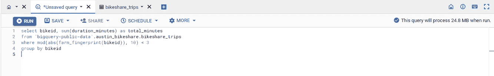

# BigQuery 最佳实践：释放数据仓库的全部潜力

> 原文：[`towardsdatascience.com/bigquery-best-practices-unleash-the-full-potential-of-your-data-warehouse-334a0a9adef2`](https://towardsdatascience.com/bigquery-best-practices-unleash-the-full-potential-of-your-data-warehouse-334a0a9adef2)

## 用这 6 个最佳实践超级提升你的 BigQuery 体验

[](https://niczky12.medium.com/?source=post_page-----334a0a9adef2--------------------------------)[](https://towardsdatascience.com/?source=post_page-----334a0a9adef2--------------------------------) [Bence Komarniczky](https://niczky12.medium.com/?source=post_page-----334a0a9adef2--------------------------------)

·发表于 [Towards Data Science](https://towardsdatascience.com/?source=post_page-----334a0a9adef2--------------------------------) ·5 分钟阅读·2023 年 6 月 1 日

--


照片由 [charlesdeluvio](https://unsplash.com/@charlesdeluvio?utm_source=medium&utm_medium=referral) 提供，来源于 [Unsplash](https://unsplash.com/?utm_source=medium&utm_medium=referral)

Google BigQuery 是一个强大的无服务器数据仓库，已经成为许多组织数据分析和机器学习管道的基石。为了充分发挥其潜力并确保高效且具有成本效益的体验，遵循一些最佳实践至关重要。在本文中，我们将深入探讨**六个关键最佳实践，帮助你优化 BigQuery 的性能和使用**。

# 1 关注成本估算

BigQuery 的定价模型基于你查询处理的数据量。在运行复杂或大规模查询之前，明智的做法是查看成本估算，以确保你保持在预算范围内。通过了解查询的成本影响，你可以做出明智的决策，避免意外的账单惊喜。

不要选择超过需要的列。如果可能的话，BigQuery 会将你的选择推到计算的最前面，但如果你使用`select *`，你就是在自掘坟墓，因为 BigQuery 需要处理查询中的所有列，这会产生额外的费用。

在你按下 `RUN` 之前，瞄一眼右上角，为自己节省一些💰。



你需要查看查询处理的 GB/MB 数量 — 作者截图

# 2 机器学习的抽样

BigQuery 中的机器学习成本是查询的 50 倍（$250/TB 对比 $5/TB），因此**减少你处理的数据量**尤为重要。通过对数据进行抽样，你可以显著减少处理的数据量，从而加快模型训练并降低成本。使用 BigQuery 的 `FARM_FINGERPRINT()` 函数生成可复现的随机样本，以用于你的机器学习管道。

查看这篇文章了解如何在 BigQuery 中进行机器学习和可复现的抽样：

towardsdatascience.com ## 端到端 BigQuery 机器学习

### 使用 Google Cloud BigQuery 参加 Kaggle 比赛

[towardsdatascience.com

# 3 利用 Parquet 进行数据上传

在将数据上传到 BigQuery 时，考虑使用 Parquet 文件格式。Parquet 是一种列式存储格式，针对分析工作负载进行了优化，提供了更好的压缩和编码方案。以 Parquet 格式上传数据可以**减少麻烦和加快加载时间**，因为所有列信息都嵌入在文件中。

这里是如何将文件加载到 BigQuery 以及为何 Parquet 更快：

[](/loading-files-into-bigquery-6de1ff63df35?source=post_page-----334a0a9adef2--------------------------------) ## 将文件加载到 BigQuery

### 使用 Python 将 Parquet 和 CSV 文件导入 GCP BigQuery

[towardsdatascience.com [](/load-files-faster-into-bigquery-94355c4c086a?source=post_page-----334a0a9adef2--------------------------------) ## 更快地将文件加载到 BigQuery

### 对 CSV、GZIP、AVRO 和 PARQUET 文件类型进行基准测试

[towardsdatascience.com

# 4 生成数组以进行更强大的实验

BigQuery 允许你**通过多次查询数据生成数组以进行快速且廉价的实验**。使用 `GENERATE_ARRAY()` 和 `UNNEST()` 函数对数据进行交叉连接以测试参数。

例如，如果你有一 TB 的数据，但你想测试 100 个不同的实验参数，不要对数据进行 100 次查询，因为那样会查询 100TB 数据，账单将高达 500 美元！相反，**如果你将数据与 100 个参数进行交叉连接，你只会为查询那一 TB 数据而产生费用**，所以账单是 5 美元。

这是一个虚拟的示例，用于寻找 `min_price`、`min_quantity` 和 `max_delivery_time` 参数的最佳值，以在满足客户期望的同时最大化利润：

```py
WITH
  orders AS (
  SELECT
    1 AS order_id,
    1 AS product_id,
    100 AS price,
    10 AS quantity,
    50 AS shipping_cost,
    3 AS delivery_time
  UNION ALL
  SELECT
    2 AS order_id,
    2 AS product_id,
    200 AS price,
    20 AS quantity,
    100 AS shipping_cost,
    5 AS delivery_time
  UNION ALL
  SELECT
    3 AS order_id,
    3 AS product_id,
    300 AS price,
    30 AS quantity,
    150 AS shipping_cost,
    7 AS delivery_time
  ),
  parameters AS (
  SELECT
    min_price,
    min_quantity,
    max_delivery_time
  FROM
    UNNEST(GENERATE_ARRAY(100, 300, 100)) AS min_price,
    UNNEST(GENERATE_ARRAY(10, 30, 10)) AS min_quantity,
    UNNEST(GENERATE_ARRAY(3, 7, 2)) AS max_delivery_time
  )
SELECT
  min_price,
  min_quantity,
  max_delivery_time,
  SUM(price * quantity) AS total_revenue,
  SUM(price * quantity - shipping_cost) AS total_profit,
  SAFE_DIVIDE(SUM(price * quantity - shipping_cost), SUM(price * quantity)) AS profit_margin
FROM
  orders,
  parameters
WHERE
  price >= min_price
  AND quantity >= min_quantity
  AND delivery_time <= max_delivery_time
GROUP BY
  min_price,
  min_quantity,
  max_delivery_time
ORDER BY
  profit_margin DESC;
```

如果你想要一个更复杂的示例，可以查看这篇文章：

[](/advanced-random-sampling-in-bigquery-sql-7d4483b580bb?source=post_page-----334a0a9adef2--------------------------------) ## BigQuery SQL 中的高级随机采样

### 学习如何以可重现的方式从 BigQuery 表中采样行

towardsdatascience.com

# 5 利用 `WITH` 语句的强大功能

BigQuery 的 `WITH` 语句，也称为**公共表表达式**（CTE），可以使你的查询更加可读和易于维护。通过使用 `WITH` 语句，你可以**将复杂的查询分解成更小的、可重用的组件，使理解和调试查询变得更容易**。此外，CTE 还能通过防止相同的子查询被多次执行来提高性能。

你可以根据需要使用这些功能，并且你甚至可以从已经定义的 CTE 创建新的 CTE：

```py
with myTable as (
  select id, x, y
  from machineLearning.table1
), trainSample as (
  select id, x, y
  from myTable
  where mod(abs(farm_fingerprint(id)) < 70)
), testSample as (
  select id, x, y
  from myTable
  where mod(abs(farm_fingerprint(id)) >=70)
)

select ...
// do your training here
```

# 6 在自定义函数中利用参数

在 BigQuery 中创建自定义函数时，利用参数来创建可重用和灵活的函数。**通过向函数传递参数，你可以构建模块化和易于维护的代码**。这种做法能够使代码更简洁、更高效，从而简化开发过程。

想了解 BigQuery 自定义函数吗？很高兴你问了，看看这个：

[](/bigquery-udfs-complete-guide-181cbdaea55b?source=post_page-----334a0a9adef2--------------------------------) ## BigQuery UDFs 完整指南

### 关于 Google Cloud BigQuery 用户定义函数的所有信息

towardsdatascience.com

想在 GitHub 上通过 CI/CD 管道部署这些功能？别再找了：

[](https://levelup.gitconnected.com/deploying-bigquery-custom-functions-with-github-actions-d76c118e0abf?source=post_page-----334a0a9adef2--------------------------------) [## 使用 GitHub Actions 部署 BigQuery 自定义函数

### 利用 GitHub Actions 自动化来简化你的 BigQuery 自定义函数部署。

levelup.gitconnected.com](https://levelup.gitconnected.com/deploying-bigquery-custom-functions-with-github-actions-d76c118e0abf?source=post_page-----334a0a9adef2--------------------------------)

# 查询愉快！

掌握这些最佳实践将帮助你充分利用 BigQuery 的功能，同时保持成本效益并提升性能。通过监控成本估算、使用 `FARM_FINGERPRINT()` 进行数据采样、使用 Parquet 格式、生成数组、利用 `WITH` 语句以及在自定义函数中使用参数，你将能够自信地应对任何 BigQuery 挑战。查询愉快！💻
