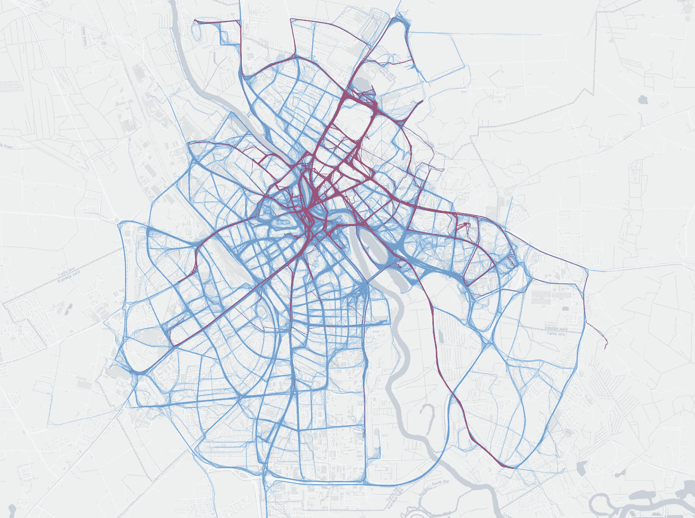
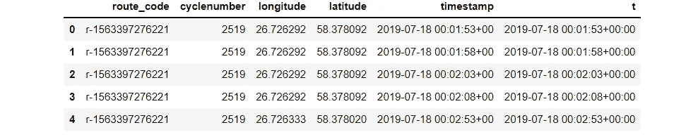
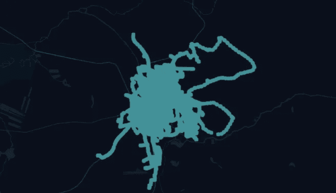
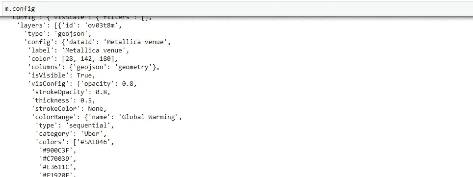
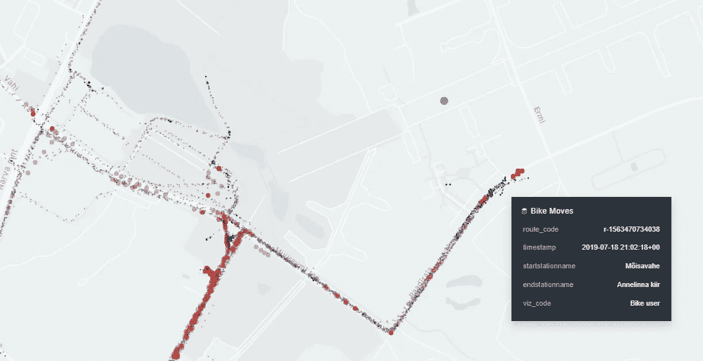

# 自行车共享系统在塔尔图的 Metallica 音乐会中的运作

> 原文：[`towardsdatascience.com/bike-sharing-system-movements-to-the-metallica-concert-in-tartu-estonia-1af8361bc6f`](https://towardsdatascience.com/bike-sharing-system-movements-to-the-metallica-concert-in-tartu-estonia-1af8361bc6f)

## 使用 Movingpandas 和 KeplerGl 进行 GPS 追踪可视化 — 教程

[](https://bryanvallejo16.medium.com/?source=post_page-----1af8361bc6f--------------------------------)[](https://towardsdatascience.com/?source=post_page-----1af8361bc6f--------------------------------) [Bryan R. Vallejo](https://bryanvallejo16.medium.com/?source=post_page-----1af8361bc6f--------------------------------)

·发表在 [Towards Data Science](https://towardsdatascience.com/?source=post_page-----1af8361bc6f--------------------------------) ·9 分钟阅读·2023 年 1 月 4 日

--


作者提供的图片。共享单车系统移动到 Metallica 音乐会的自行车站。2019 年 7 月 18 日，塔尔图，爱沙尼亚

# 介绍

[塔尔图的 Metallica 音乐会](https://www.metallica.com/tour/2019-07-18-tartu-estonia.html)（爱沙尼亚）于 2019 年 7 月 18 日在爱沙尼亚国家博物馆（ERM）背后的拉迪机场举行。该活动吸引了 60,000 人到场（[ERR, 2019](https://news.err.ee/963069/gallery-metallica-gives-sold-out-show-in-tartu)）。市政府建议游客使用包括共享单车系统在内的公共交通工具，并在活动期间改善城市流动性，共享单车系统增加了一个虚拟码头站点，名为“Metallica parkla”，游客可以在靠近场馆的地方停放他们的自行车。

> [共享单车动态的网络地图在这里](https://bryanvallejo16.github.io/bike-moves-metallica/root/metallica_moves.html)
> 
> [代码库](https://github.com/bryanvallejo16/bike-moves-metallica)

塔尔图的共享单车系统在智能出行方面取得了成功。自行车高效且使城市移动变得轻松。订阅费用实惠，500/750 辆自行车是电动的。车站遍布城市各处，让你可以随时移动。系统于 2019 年 6 月推出，在使用一个月后，它被用来改善一个有 6 万人参与的活动的流动性。该系统提供用户锁车和解锁车的实时数据。毫无疑问，塔尔图的共享单车系统是成功的。如果你想了解更多关于这个系统的信息，可以查看 [塔尔图智能自行车](https://ratas.tartu.ee/) 网站。

我对自行车共享系统的数据是什么样子感到好奇，所以开始寻找它。当我找到它并经过快速探索后，发现 2019 年 7 月 18 日的数据可用让我感到惊讶。我毫不犹豫地检查了 Metallica 音乐会期间自行车共享系统的工作情况，这也是这篇故事被写下来的原因。

# 目标

+   为了在 2019 年 7 月 18 日可视化自行车共享系统的动态，突出显示 Metallica 音乐会的移动情况

# 数据

## ***自行车共享系统跟踪数据***

2019 年 7 月 18 日的自行车共享系统使用数据可以在[爱沙尼亚开放数据](https://avaandmed.eesti.ee/datasets/tartu-linnavalitsuse-andmekogud-rattaringlus)门户网站找到，并且对公众开放。实际上，它提供了更多的 7 月天数据，数据以两个不同的文件形式提供：**locations**用于 GPS 跟踪数据，**routes**用于自行车站点之间的起点-终点。文件格式为.csv。

- **许可证 -**

数据在[Creative Commons Attribution-ShareAlike 3.0 许可下](https://creativecommons.org/licenses/by-sa/3.0/)。

[未授权（CC-BY-SA 3.0）](https://creativecommons.org/licenses/by-sa/3.0/)，我们可以自由分享、复制、再分发、改编、混合，甚至用于商业目的。

# 成果

1.  使用 KeplerGl 的网络地图显示到 Metallica 音乐会的自行车站点的自行车移动情况


图片由作者提供。自行车共享系统移动到 Metallica 音乐会的自行车站点。2019 年 7 月 18 日，塔尔图-爱沙尼亚

1.  使用 QGIS 显示到 Metallica 音乐会的自行车站点的静态地图



图片由作者提供。自行车移动到 Metallica 音乐会的“Metallica parkla”作为终点站

## 加入我的故事

如果你想查看更多我的教程，请在 Medium 上关注我：

> [加入并成为会员，获取我的教程](https://bryanvallejo16.medium.com/membership)

# 分析

要开始这个 Python 工作流，请首先克隆这个包含必要数据的仓库。它包含一个空的笔记本作为模板，你可以用来跟随这个实践。

> ***克隆这个仓库***：
> 
> [github.com/bryanvallejo16/bike-moves-metallica](https://github.com/bryanvallejo16/bike-moves-metallica)

在这个实践中，我使用的是[Anaconda](https://www.anaconda.com/products/distribution)的免费版本。请确保你的环境中安装了所需的库。我在这次分析中使用了：geopandas 0.9.0，movingpandas 0.8rc1，keplergl 0.3.2，以及 NumPy 1.21.5。

让我们导入这些库

```py
# for geospatial analysis
import geopandas as gpd
import pandas as pd
import numpy as np

# for trajectories visualization
import movingpandas as mpd

# for visualization
from keplergl import KeplerGl

# for Folders
import os

import warnings
warnings.filterwarnings('ignore')
```

现在，让我们为最终地图和输出创建一个文件夹

```py
if not os.path.exists('root'):
    os.makedirs('root')

if not os.path.exists('output'):
    os.makedirs('output')
```

## 可视化 GPS 跟踪数据

我们将开始读取自行车用户的 GPS 跟踪文件。

```py
# reading the locations file
locations = pd.read_csv(r'data/locations_20190718.csv')

locations.head()
```

当你检查`locations['coord_date'].unique()`时，你会发现 7 月 18 日的数据包含了更多的天数。因此，我们需要去除那些额外的天数，因为我们只对 18 号感兴趣。

```py
# filter only the desired date
locations = locations[locations['coord_date'] == '2019-07-18']
```

如果你再次检查`locations['coord_date'].unique()`，你会发现现在只有 7 月 18 日的数据。

然后，我们需要设置一个名为 `t` 的时间戳列，库 movingpandas 将使用它来创建轨迹。

```py
# Arrange timestamp column
locations['timestamp'] = locations['coord_date'] + ' ' + locations['coord_time']

# Create timestamp type
locations['t'] = pd.to_datetime(locations['timestamp'], utc=True)
```

为了确保路线 ID 不会与数字混淆，并且突然出现小数，我们将把路线代码更改为字符串。

```py
# add string code to bike
locations['route_code'] = ['r-' + str(code) for code in locations['route_code']]
```

然后，我们将选择仅需要的列，获得一个干净的表格。

```py
# Get the needed columns
locations = locations[['route_code', 'longitude', 'latitude', 'timestamp', 't']]
```

我们将快速检查是否存在需要删除的 nan 值。幸运的是，这里没有 nan 值。

```py
locations.isna().sum()
```

然后，快速查看 `locations.head()`



作者提供的图像。位置表已准备好。

让我们打印一些关于数据的信息。

```py
# some info

print('There are in total {} unique bike routes'.format(locations['route_code'].nunique()))
print('The first bike was used at {}'.format(locations['timestamp'].astype(str).min()))
print('The last bike was used at {}'.format(locations['timestamp'].astype(str).max()))
```

## 使用 Movingpandas 创建轨迹

首先，我们将创建一个新的 GeoDataFrame，添加一个几何对象。

```py
# create a geodataframe
locations_gdf = gpd.GeoDataFrame(locations, geometry = gpd.points_from_xy(locations.longitude, locations.latitude, crs="EPSG:4326"))

locations_gdf.head()
```

然后，我们将用我们的 GPS 跟踪 GeoDataFrame 创建一个 TrajectoryCollection 对象。

```py
%%time

# Create a Trajectory Collection 
bike_collection = mpd.TrajectoryCollection(locations_gdf, traj_id_col='route_code', t='t')

type(bike_collection)
```

## 添加站点信息

我们的下一步是为 GPS 跟踪中的每个位置添加站点名称。为了实现目标，我们需要突出显示以“Metallica parkla”结尾的轨迹，这对应于 Metallica 举办演唱会的新场馆车站。

首先，读取我们的路线信息。

```py
# read the route info
route_info = pd.read_csv(r'data/routes_20190718.csv', encoding='utf-8')

route_info.head()
```

确保我们只有一天的数据，可以使用 `print(route_info['unlockedat'].unique())` 来检查。

然后，我们将仅选择所需的列，并且像处理 GPS 跟踪一样更改路线代码，从数字更改为字符串。

```py
# get the needed columns
bike_route_info = route_info[['route_code', 'startstationname', 'endstationname']]

# add the route id as our workflow
bike_route_info['route_code'] = ['r-'+ str(code) for code in bike_route_info['route_code']]

bike_route_info.head()
```

## 添加到轨迹

在这里，我们将创建一个名为 `bike_moves` 的新 GeoDataFrame，其中添加了包含站点信息的 GPS 跟踪。链接是通过我们从数字转换为字符串的路线代码完成的。

逻辑是从 TrajectoryCollection 中获取每个轨迹，然后将它们发送到我们的 `bike_moves` GeoDataFrame。

```py
%%time

# adding bike route info to every GPS tracking

# bike-route-metallica
bike_moves = gpd.GeoDataFrame()

# total routes
total = locations_gdf.route_code.nunique()

n = 0 

# loop in every trajectory by bike route id
for traj in bike_collection.trajectories:
    n = n+1

    # info
    print(f'Adding info {n}/{total}\n')

    # join bike route info
    traj_moves_info = traj.df.merge(bike_route_info, on='route_code', how='left')

    # add to bike moves
    bike_moves = bike_moves.append(traj_moves_info, ignore_index=True)

# let's check the result    
bike_moves.head()
```

你将看到 5253 条轨迹的处理过程。

我们还将从 GPS 跟踪中创建 LineStrings 以便在 QGIS 中可视化。我们将使用 Movingpandas 中的 `to_traj_gdf()` 函数。

```py
%%time

# bike-routes-metallica
bike_lines = gpd.GeoDataFrame(crs=4326)

# total routes
total = locations_gdf.route_code.nunique()

n = 0 

# loop in every trajectory by bike route id
for traj in bike_collection.trajectories:
    n = n+1

    # info
    print(f'Adding info {n}/{total}\n')

    # creating a LineTrajectory
    traj_line = traj.to_traj_gdf()

    # join bike route info
    traj_moves_info = traj_line.merge(bike_route_info, left_on='id', right_on='route_code', how='left')

    # add to bike moves
    bike_lines = bike_lines.append(traj_moves_info, ignore_index=True)

# remove a duplicate
del bike_lines['id']

# let's check the result    
bike_lines.head()
```

该文件已准备好在 QGIS 中进行可视化。我们将保存它以便稍后制作地图。

```py
# save the result
bike_lines.to_file(r'output/bike_routes_metallica_concert.gpkg', driver='GPKG')
```

## 准备可视化的数据集

我们将创建两个函数，一个用于突出显示 Metallica 的移动，另一个用于为大小设置权重。

```py
# add code for those involved in Metallica concert
# function that defines the "Metallica parkla" as end

def metallica_code(station_name):
    '''
    Evaluates if station_name is metallica parkla and return a code
    station_name <str>
    '''

    if station_name=='Metallica parkla': 
        return 'Metallica'

    else:
        return 'Bike user'

def metallica_weight(station_name):
    '''
    Evaluates if station_name is metallica parkla and return a code
    station_name <str>
    '''

    if station_name=='Metallica parkla':
        return 5

    else:
        return 1
```

然后，我们将仅对终点站使用这些函数。我们感兴趣的是查看前往演唱会的移动情况。如果我们也将“Metallica parkla”作为起点，可能会导致可视化过载。

```py
# apply function
# end
bike_moves['viz_code'] = bike_moves.apply(lambda row: metallica_code(row['endstationname']), axis=1)
bike_moves['weight'] = bike_moves.apply(lambda row: metallica_weight(row['endstationname']), axis=1)
```

一旦添加了可视化属性，我们可以通过 `print(bike_moves['viz_code'].unique())` 来检查它。

## 添加场馆位置

我们将创建一个新的 GeoDataFrame，其中包含 Metallica 演唱会场地的位置。

首先，让我们从 shapely 导入 Point 几何对象。

```py
from shapely.geometry import Point
```

然后，GDF。

```py
# create the venue location
venue = gpd.GeoDataFrame(columns = ['name', 'geometry'], geometry = 'geometry', crs = 4326)
venue.at[0, 'name'] = 'Metallica venue'
venue.at[0, 'geometry'] = Point(58.397144, 26.752595)

venue.head()
```

## 使用 KeplerGl 进行可视化

我们将使用 KeplerGl 进行 Jupiter 笔记本，以可视化我们的空间和时间数据。

让我们开始创建一个实例。

```py
# create and instance
m = KeplerGl(height = 600)
```

让我们添加数据。我建议将数据分成两个不同的单元格。

```py
# add the data
m.add_data(bike_moves, 'Bike Moves')
```

```py
m.add_data(venue, 'Metallica venue')
```

我们将从仓库中包含的`configuration.py`文件导入地图配置。配置是用于样式化 KeplerGl 中地图可视化的一堆细节。我在.py 文件中添加了我自己的创作以供本故事使用。

```py
from configuration import config
```

然后，我们将简单地保存文件。

```py
m.save_to_html(file_name='root/metallica_moves.html', config=config)
```

一旦打开，我们将得到最终的地图


作者提供的图像。前往 Metallica 音乐会的自行车移动。“Metallica parkla”作为终点站

## 如何将自己的配置添加到 KeplerGL？

在将数据添加到地图实例后，请在 Jupyter notebook 中打开它。

```py
m
```

你将看到你数据的默认可视化。



作者提供的图像。自行车共享系统移动的原始可视化。KeplerGl

按照你的需求在 KeplerGl 中进行配置。然后，在新单元格中检查配置。

```py
m.config
```



作者提供的图像。Jupyter notebook 中当前地图的配置。

然后，请复制并粘贴配置，并在`m.save_to_html()`函数中使用它，就像我们之前做的那样。

## QGIS 中的可视化

我们已经在`output`文件夹中保存了一个包含轨迹的文件。简单地打开 QGIS，拖动文件，制作你自己的地图。

如果你突出显示终点站“Metallica parkla”，它应该看起来像这样


作者提供的图像。自行车移动到 Metallica 音乐会。“Metallica parkla”作为终点站

# 讨论

需要指出的是，我们的可视化展示了从其他站点开始并在“Metallica parkla”场馆站点结束的移动。但这并不一定意味着他们是去音乐会的唯一人群。还有一个“ERM”站点也在场馆附近，因此很可能许多人也将自行车留在了那里。此外，可视化显示了即使是以其他站点为终点的移动也更接近场馆。



作者提供的图像。靠近场馆的移动，但以不同于 Metallica parkla 的站点为终点

可视化只是给出了虚拟停靠站在城市音乐会期间运作的一个概念。

# 结论

虚拟站点“Metallica parkla”的传播可以快速了解在 Metallica 音乐会期间自行车共享系统站点在塔尔图的运作情况。我们可以清楚地看到，在晚上活动时段，“Metallica parkla”站点的使用量达到了峰值。这个虚拟站点对那些希望能够进入音乐会的人群来说是完全可用的。

可视化并不一定只展示了去音乐会的人，因为也有可能他们中的一些人在其他场馆站点“ERM”留下了自行车。仍然有许多可能性，包括不仅仅是“ERM”和“Metallica parkla”，但这些在本故事中没有被讨论。

如果你有问题，请不要犹豫，在这里留言。

> 在 LinkedIn 上联系我: [Bryan R. Vallejo](https://www.linkedin.com/in/bryanrvallejo/)
> 
> 访问我的教程请点击这里: [加入我的故事](https://bryanvallejo16.medium.com/membership)
