# 黑箱化学过程优化

> 原文：[`towardsdatascience.com/black-box-chemical-process-optimization-5d7cbb9be0cf?source=collection_archive---------8-----------------------#2023-10-24`](https://towardsdatascience.com/black-box-chemical-process-optimization-5d7cbb9be0cf?source=collection_archive---------8-----------------------#2023-10-24)

## 智能化化学系统

## 依赖决策支持来决定下一步进行哪个实验。

[](https://gtancev.medium.com/?source=post_page-----5d7cbb9be0cf--------------------------------)[](https://towardsdatascience.com/?source=post_page-----5d7cbb9be0cf--------------------------------) [Georgi Tancev](https://gtancev.medium.com/?source=post_page-----5d7cbb9be0cf--------------------------------)

·

[关注](https://medium.com/m/signin?actionUrl=https%3A%2F%2Fmedium.com%2F_%2Fsubscribe%2Fuser%2F54224776d918&operation=register&redirect=https%3A%2F%2Ftowardsdatascience.com%2Fblack-box-chemical-process-optimization-5d7cbb9be0cf&user=Georgi+Tancev&userId=54224776d918&source=post_page-54224776d918----5d7cbb9be0cf---------------------post_header-----------) 发表在 [Towards Data Science](https://towardsdatascience.com/?source=post_page-----5d7cbb9be0cf--------------------------------) · 12 分钟阅读 · 2023 年 10 月 24 日 [](https://medium.com/m/signin?actionUrl=https%3A%2F%2Fmedium.com%2F_%2Fvote%2Ftowards-data-science%2F5d7cbb9be0cf&operation=register&redirect=https%3A%2F%2Ftowardsdatascience.com%2Fblack-box-chemical-process-optimization-5d7cbb9be0cf&user=Georgi+Tancev&userId=54224776d918&source=-----5d7cbb9be0cf---------------------clap_footer-----------)

--

[](https://medium.com/m/signin?actionUrl=https%3A%2F%2Fmedium.com%2F_%2Fbookmark%2Fp%2F5d7cbb9be0cf&operation=register&redirect=https%3A%2F%2Ftowardsdatascience.com%2Fblack-box-chemical-process-optimization-5d7cbb9be0cf&source=-----5d7cbb9be0cf---------------------bookmark_footer-----------)

图片由 [国家癌症研究所](https://unsplash.com/@nci?utm_source=medium&utm_medium=referral) 提供，来源于 [Unsplash](https://unsplash.com/?utm_source=medium&utm_medium=referral)

# 介绍

设计和优化化学过程是过程工程中的主要任务之一。在设立一个有大量**设计参数**的化学系统（例如，一个单元操作）时，如何快速获得最佳设计常常成为一个问题。如果有一个系统模型，可以通过数值方法解决这个问题，即根据指定的指标（例如，产率、材料性质、成本等）进行优化。然而，这通常是不可能的，因为关系（例如，动力学、物理现象）未被完全理解——甚至可能完全未知。因此，无法制定方程。

在这种情况下，唯一的选择是通过经验**模型**和从**实验**中获得的**数据**来寻找最佳设计。例如，传统上可以参考[**响应面**](https://en.wikipedia.org/wiki/Response_surface_methodology)和[**中央复合设计**](https://en.wikipedia.org/wiki/Central_composite_design)来[确定最佳操作条件](https://www.sciencedirect.com/science/article/abs/pii/S0960852416317515?via%3Dihub=)。[这些方法利用局部二阶近似和梯度上升/下降来找到最佳配置](https://n.ethz.ch/~kahans/doe2020/ch-rsm.html#sequential-experiments)。

然而，本文致力于一种替代策略，即[**贝叶斯优化**](https://arxiv.org/abs/1807.02811)，它与强化学习相关，并已成功应用于[材料](https://link.springer.com/chapter/10.1007/978-3-319-23871-5_3)、[化学反应](https://www.nature.com/articles/s43586-023-00266-3)和[药物](https://pubs.rsc.org/en/content/articlehtml/2019/sc/c9sc04026a)。它提供了如**模型更高灵活性**和处理**多保真度**信息等优点。后者指的是可以利用来自不同来源的混合质量数据进行优化，例如当物理模型至少有初步可用时。

# 问题定义

## 多臂老虎机

你可能会问，为什么我们还需要另一种优化方法？让我通过以下情境来回答这个问题。你发现自己面前有一台**老虎机**，它有*k*个臂，也就是说，你有*k*个臂可以拉动，每个臂*i*有一个概率*pᵢ*给你奖励*rᵢ*。显然，你的目标是最大化你的总奖励*R*，但你只有有限的尝试次数（或预算）*T*。这就是所谓的[**多臂老虎机**](https://en.wikipedia.org/wiki/Multi-armed_bandit) **问题**。

这个问题很困难，因为我们最初不知道概率或奖励。通过我们的 *T* 次尝试，我们必须同时**探索**以“学习” *pᵢ* 和 *rᵢ*，但也必须**利用**有奖励的臂（即，尽可能频繁地拉动具有高预期奖励 *pᵢrᵢ* 的臂）以便积累它们。[这就是探索-开发困境](https://en.wikipedia.org/wiki/Exploration-exploitation_dilemma)。

一方面，我们需要实验并尝试不同的臂，另一方面，我们必须坚持相同的、有前景的臂 —— 由于预算有限，我们必须小心平衡这两个目标。同样，我们需要找到最优的设计设置。我们需要通过实验尽可能多地了解我们的目标函数，但也要保持在有前景的最大化器附近。当我们从具有 *k* 臂的 **离散** 设置转向具有无限臂的 **连续** 设置时，我们就进入了贝叶斯优化的领域。

## 贝叶斯优化

大致来说，这个想法是逐步学习我们希望在感兴趣的领域 𝒳 上优化的函数 *f*(x)，并朝着其最大值 xᵒᵖᵗ 移动，

xᵒᵖᵗ = arg max *f*(x)，使得 x ∈ 𝒳。

通常，贝叶斯优化适用于维度少于 20 的连续领域优化，并且它可以容忍函数评估中的随机噪声。该方法有两个主要“成分”：[**高斯过程**](http://gaussianprocess.org) 和 **采集函数**。

## 高斯过程

贝叶斯优化的第一个成分是高斯过程，这最好通过从 [**贝叶斯线性回归**](https://en.wikipedia.org/wiki/Bayesian_linear_regression) 推导来理解。[**贝叶斯统计**](http://www.stat.columbia.edu/~gelman/book/) 是统计学领域的另一种理论，基于概率的贝叶斯解释，其中概率表示对事件的 **信念** 或 **信息**（即知识）的程度。这与频率学派解释的概率视为事件在多次试验后的相对频率的极限不同。

让我们假设我们要最大化的函数 *f*(x) 遵循一个模型

y= *f*(x) + *ϵ* = *β*ᵀx *+ ϵ*，其中 x ∈ ℝ*ᵈ*。

尽管这个模型在参数上是线性的，但 **X** 中的基向量也可以通过 **基扩展** 表示非线性。此外，我们将 *n* 个数据点/样本堆叠在矩阵 **X** =[x₁ᵀ, …, xₙᵀ] 和 **y** = [y₁, …, yₙ] 中。

贝叶斯统计围绕着 [**贝叶斯定理**](https://en.wikipedia.org/wiki/Bayes%27_theorem)，其声明

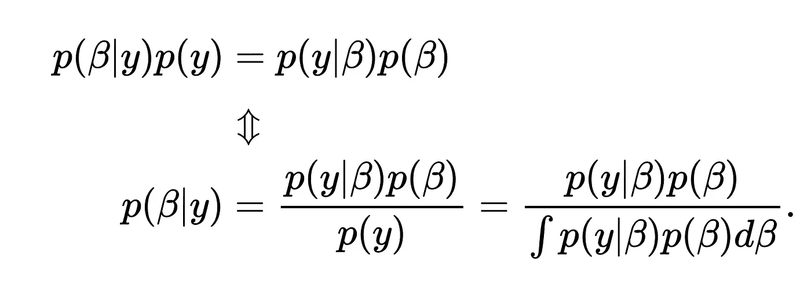

尽管没有明确说明，但一些分布也依赖于数据实现**X**。特别地，我们对**后验分布**p(*β*|*y*)感兴趣，给定我们的**先验知识**p(*β*)和**数据分布**p(*y*|*β*)。先验表示我们在看到数据之前的知识，而后验则是在看到数据之后的知识。在贝叶斯统计的解释中，后验分布的参数实现本质上是众多可能模型中的一个。如果将模型解释为理论，那么先验是“所有可能的理论”，但数据会更支持某些理论，从而使某些理论或参数组合的后验概率更高。

如果我们对参数假设正态（即高斯）先验 p(*β*) = 𝒩(0, **I**)，并且对数据有正态似然 p(*y*|*β*) = 𝒩(**X***β,* σₙ²)，则解析解也将是正态的，多元后验分布 p(*β*|*y*) = 𝒩(μ*ᵦ,* Σ*ᵦ*)变为

μ*ᵦ* = (**X**ᵀ**X** + σₙ²**I**)⁻¹**X**ᵀ**y**，

Σ*ᵦ* = (σₙ⁻²**X**ᵀ**X** + I**)⁻¹。

如果我们取**X**中的样本，就会得到输出向量的**后验预测分布**。

p(**y**|**X**) = 𝒩(**X**μ*ᵦ*, **X**Σ*ᵦ***X**ᵀ + σₙ²**I**).

图 1 展示了一个简单示例（一个四次多项式函数）在一维情况下。注意实际值被包含在预测区间中。

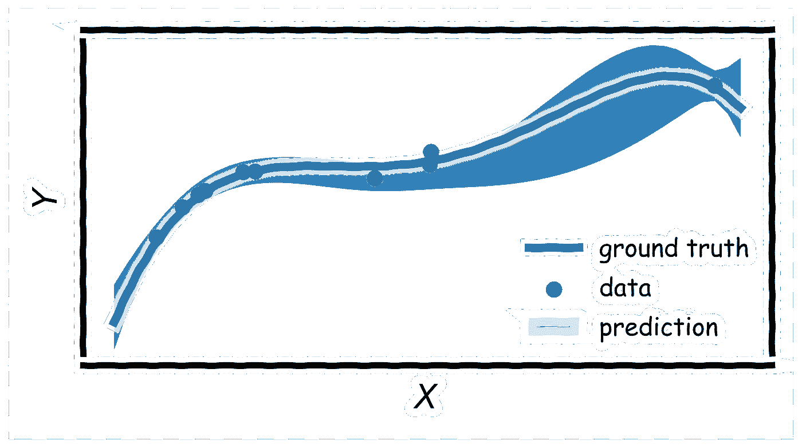

**图 1:** 预测后验分布（μ ± 2σ）。© Georgi Tancev。

图显示了随着距离数据的增加，**不确定性**是如何增加的。总体不确定性包括一个**认识论**部分（**X**ᵀ**X** + σₙ²**I**）随着数据量的增加而减少（项**X**ᵀ**X**中的元素随着数据的增加而增加，其逆矩阵减少，Σ*ᵦ*也减少），以及一个**随机**部分（σₙ²**I**），无论如何保持不变。此外，这种不确定性很关键，因为它表明知识缺失的地方，也可能是最大值的地方，因此我们可以在领域𝒳中的这些位置进行新的测量。

注意到 p(**y**|**X**)是**输出**值的联合分布，它捕捉了它们之间的协方差（或相似性）。通常，彼此距离较近的点会有比距离较远的点更相似的*y*值。关键的见解是，我们可以通过一个[**核函数**](https://en.wikipedia.org/wiki/Kernel_method#Mathematics:_the_kernel_trick)（或协方差）函数*k*(x₁, x₂)直接操作函数值（而不是参数值），该函数测量样本（即数据点）之间的相似性，例如，具有尺度参数σₛ的**线性**核函数。

*k*(x₁, x₂) = σₛ⋅ x₁ᵀx₂。

然而，还有更具表现力/灵活性的核函数，如**指数**核函数

*k*(x₁, x₂) = σₛ⋅ exp(-*γ* ⋅ ‖x₁ *-* x₂‖²)。

一个核必须是**对称的**和**正半定的**——就像协方差矩阵一样。此外，更复杂的核是通过**核工程**获得的。例如，对于两个核 *k*₁(x₁, x₂) 和 *k*₂(x₁, x₂)，它们的和与积也是核。利用这样的核，可以构造具有成对相似性的核矩阵 **K**。这就是高斯过程的由来。

高斯过程 *y* ∼ 𝒢𝒫(*μ*, *k*) 被定义为**随机**过程，其中每一个**有限**的**随机变量**集合具有多元正态分布。简单来说，核矩阵“捕捉”了个体点之间的相关性，以及这些相关性如何映射到（新的）函数值上。

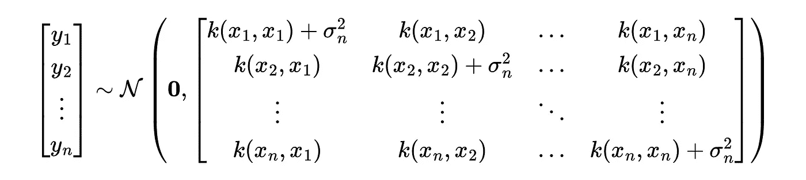

通常假设（先验）均值函数为零。这可以通过标准化输出值（即，减去经验平均值）来轻松确保。为了获得新测试点 x* 的值，我们只需对已知数据 𝒟 = {**X**，**y**} 进行条件化。

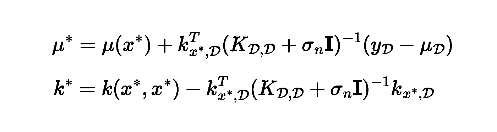

一个重要的观察是，这种方法基于记忆数据进行推断。在其他方法中，损失函数必须首先被优化。然而，核超参数（例如，σₛ，*γ*，σₙ）需要被固定，这可以通过最大化**边际似然** p(*y*) 来完成，这本身也是一种优化方法。

## 获取函数

使用之前的数据，我们现在可以拟合一个包含对角噪声项的指数核高斯过程（图 2）。

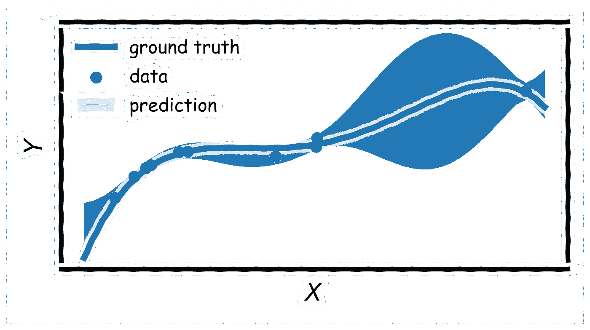

**图 2：** 使用高斯过程的预测后验分布 (μ ± 2σ)。© Georgi Tancev.

不确定性或置信带在我们领域的不同位置建议了合理的函数值。观察到不确定性比图 1 中要大，因为指数核通过[包含更多基础函数](https://en.wikipedia.org/wiki/Radial_basis_function_kernel)提供了更大的灵活性，使得更多的函数值变得合理。

我们要问的是在领域中我们认为最大值的位置。特别是，**上置信界**的最大值提供了有关领域中可以期待的最高函数值的信息。使用这个上置信界

x′ = arg max μ*(x) + *θₜ* √k*(x, x), s.t. x ∈ 𝒳,

作为一种获取函数，我们可以获得 *f*(x) 的合理最大化点，即我们相信（或期望）*f*(x) 的最优点 x′——基于我们当前对 *f*(x) 的知识。因子 *θₜ* 平衡了探索与利用。一方面，如果我们过于偏向利用（低 *θₜ*），我们可能会陷入局部最优，即之前发现的最大值附近。另一方面，如果我们过于偏向探索（高 *θₜ*），我们将会减少对之前识别出的最优点的信息使用。

[理论结果建议调度器如 *θₜ* ∝ √log t 以获得最佳性能，尽管这会导致过度探索](https://arxiv.org/abs/2302.01511)。另一种选择是保持 *θₜ* 不变；为了避免陷入局部最优，可以偶尔进行随机实验，而不是执行获取函数建议的实验。

## 示例

下面的代码块中展示了一个示例；“GP”指的是高斯过程模型实例，无论是来自[*scikit-learn*](https://scikit-learn.org/stable/modules/generated/sklearn.gaussian_process.GaussianProcessRegressor.html#sklearn.gaussian_process.GaussianProcessRegressor)、[*GPy*](https://gpy.readthedocs.io/en/deploy/GPy.models.html#module-GPy.models.gp_regression) 还是 [*GPflow*](https://gpflow.org)。

```py
# Import.
from scipy.optimize import minimize

# Define function.
def aquisition(x, model, theta=1.0):
    x = np.asarray(x)
    y_pred, y_std = model.predict(x.reshape(-1, 1), return_std=True)
    return -(y_pred + theta * y_std)

x0 = 0.0 # initial value for optimization
domain = [[-10, 10]] # (safe) region of interest
res = minimize(acquisition, x0, args=GP, bounds=domain)
x_proposed = res.x # retrieve solution
```

由于这不是一个凸优化问题，强烈建议多次运行优化，并选择最佳解决方案。在第二步中，我们在条件 x′ 下进行实验，将新收集的数据 {x′, y′} 添加到数据集 𝒟 中，𝒟 ← 𝒟 ∪ {x′, y′}，然后重新拟合我们的模型（图 3）。我们可以看到，在进行一次这样的迭代后，我们尚未达到最优，但我们对 *f*(x) 有了更多了解。如果我们重复相同的过程并要求新的实验条件，我们可能已经完成。

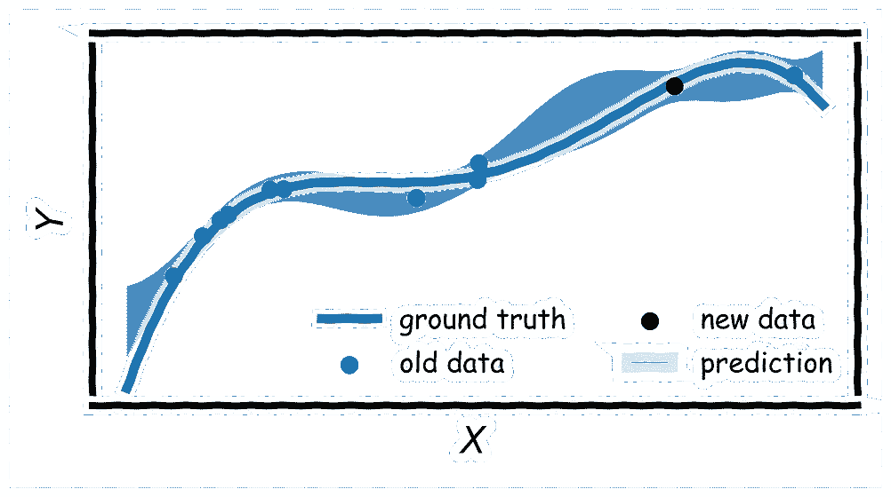

**图 3：** 预测后验分布（μ ± 2σ）和更新后的预测后验分布（μ ± 2σ），使用高斯过程。© Georgi Tancev。

让我们来看另一个数据集，即来自同一分布的实例，在获取新数据点之前和之后（图 4）。

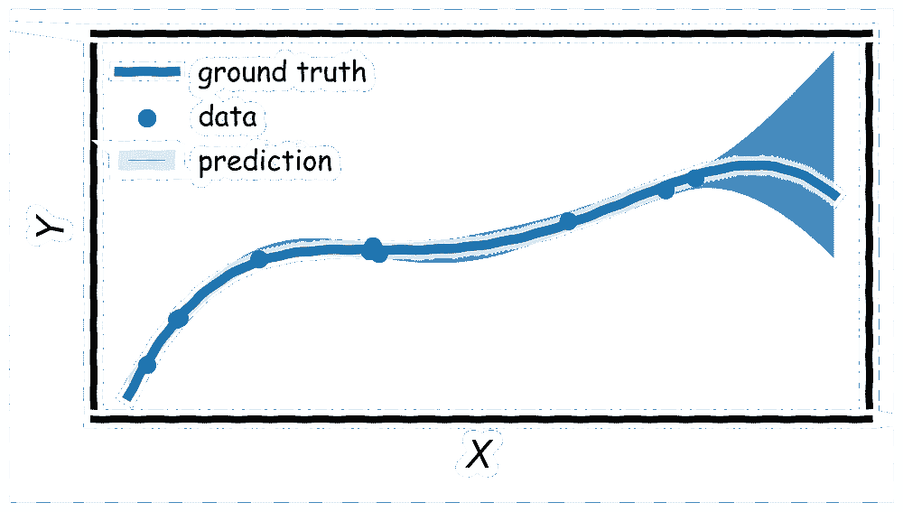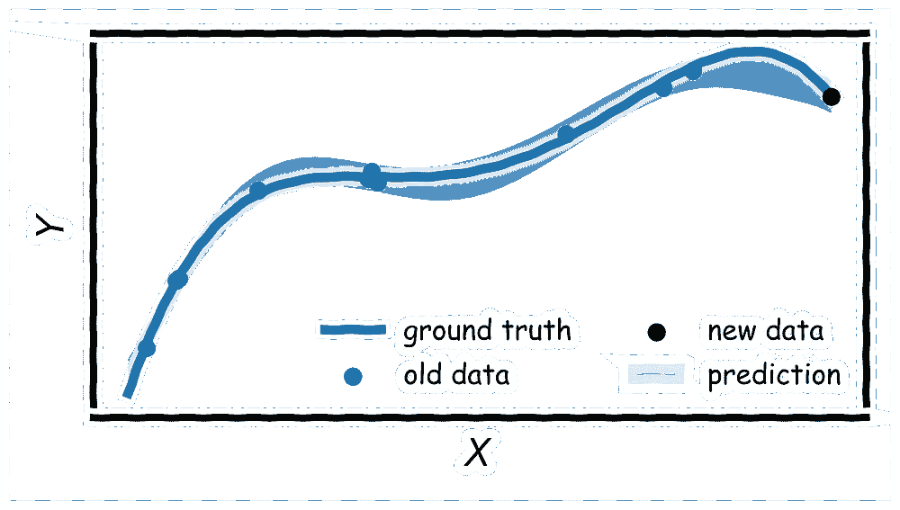

**图 4：** 预测后验分布（μ ± 2σ）和更新后的预测后验分布（μ ± 2σ），使用高斯过程。© Georgi Tancev。

在这个例子中，获取函数建议 *f*(x) 的最大值位于域的边界。进行此实验后，我们发现情况似乎并非如此。然而，我们通过这个实验获得了更多信息，在接下来的实验中，我们将识别 *f*(x) 的最大值点。我们可以用最终数据集（图 5）来展示这一点。

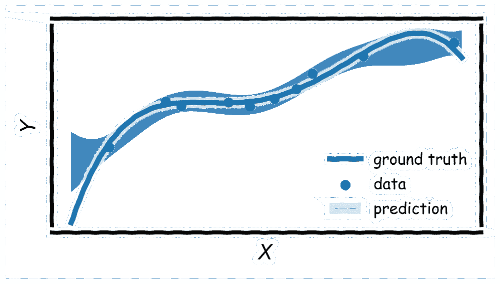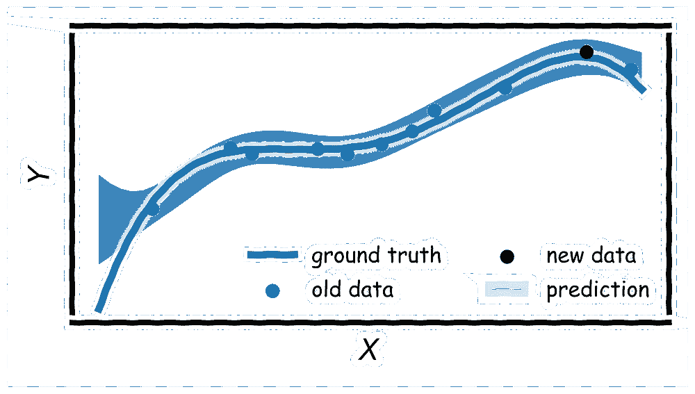

**图 5：** 预测后验分布（μ ± 2σ）和更新后的预测后验分布（μ ± 2σ），使用高斯过程。© Georgi Tancev。

[上置信界并不是唯一可用的获取函数](https://proceedings.neurips.cc/paper_files/paper/2018/hash/498f2c21688f6451d9f5fd09d53edda7-Abstract.html)。其他流行的选择包括 **汤普森采样**、**改进概率** 或 **期望改进**。它们在平衡探索和开发方面有所不同。我们最终识别（即收敛到）最大值的速度也取决于 *θₜ* 的序列和正确的模型规格（即核选择）。

这只是关于高斯过程、获取函数和贝叶斯优化的非常简短的总结。显然，许多细节被省略了。对于其他主题（核工程、核参数优化等），值得查看相关文献。接下来，我们将转到关于多保真信息的简短案例研究。

# 多保真信息

在实践中，我们可能对系统有部分了解，即来自简单模型的数据，或例如数值模拟，或者包含潜在效应子集的数学模型。这些信息在实验设计中纳入将是明智的。

假设一个数据点可能来自模型或实验，从而产生多保真数据。此外，我们还需要对来自实验的数据点纠正模型。[因此，我们引入了一个新的变量 *w* 来追踪数据点的来源；如果样本来自实验，*w* = 1，否则 *w* = 0](https://arxiv.org/abs/1703.01250)。然后，我们可以如下分解我们的函数。

*f* = *fₘ* + *w* ⋅ *fᵣ*

*fₘ* 指的是我们简单模型的贡献，而 *fᵣ* 是一个修正项，只在实验室实验中存在（*w* = 1）。通过要求 **独立性**（即正交性）在 *fₘ* 和 *fᵣ* 之间，[得到的核函数将会是](https://www.cs.toronto.edu/~duvenaud/cookbook/)。

*k*(x₁, x₂) = *kₘ*(x₁, x₂) + *w*₁*w*₂ ⋅ *kᵣ*(x₁, x₂)。

在 *GPy* 中，我们可以如下定义（假设 *w* 在长度为 2 的数组的最后一个维度中）：

```py
# Import GPy.
import GPy as gp

# Define kernel.
k_m = gp.kern.RBF(input_dim=1, active_dims=[0])
k_w = gp.kern.Linear(input_dim=1, active_dims=[1])
k_w.constrain_fixed(1.0) # fix the scale parameter of the linear kernel
k_f = gp.kern.RBF(input_dim=1, active_dims=[0])
k = k_m + k_w * k_f

# Define model.
model = gp.models.GPRegression(X_model, 
                               Y_model,
                               kernel=k,
                               normalizer=True)

# Optimize hyperparameters.
model.optimize(ipython_notebook=True)
```

噪声由 *GPRegression* 类处理；除非我们期望实验和模型有不同的噪声项，否则不需要指定。图 6 说明了一个仅在某些模型数据上训练的高斯过程示例。显然，我们的知识在领域边界处失效，因为真实情况偏离了我们的简单模型和得到的低保真数据。

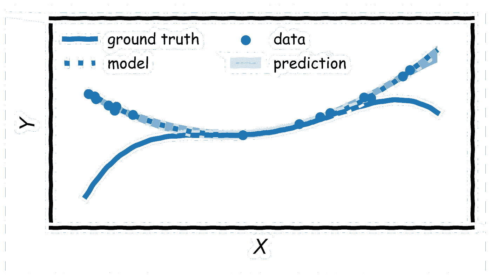

**图 6：** 多保真数据。© Georgi Tancev。

我们现在准备进行实验。我们查询获取函数以获得建议。这在下面的模拟（图 7）中显示了两个不同的 *θₜ*。

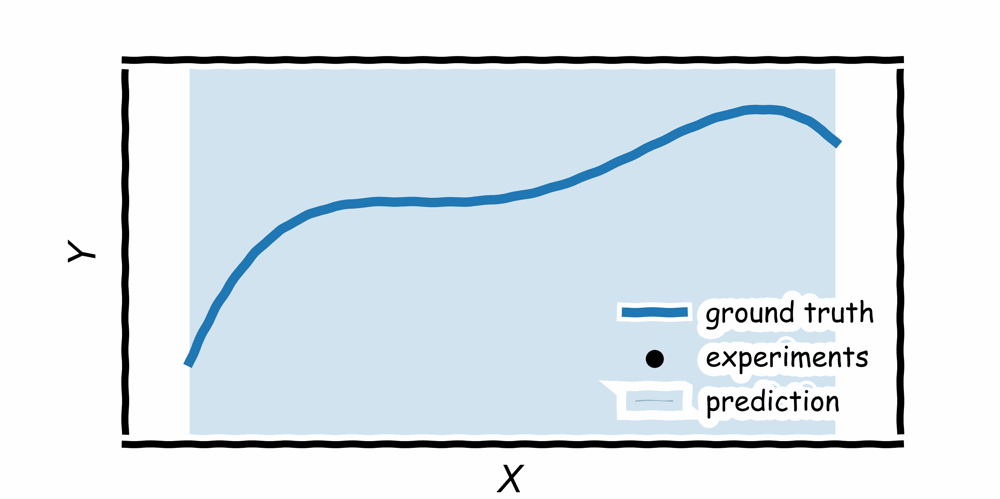

**图 7**：具有多保真度数据的贝叶斯优化；**左**：*θₜ=0.75,* ***右***：*θₜ=0.95*。© Georgi Tancev。

获取过程直接从领域边界开始，因为根据我们低保真数据的行为（图 6），我们期望最大值出现在这个位置。在这两种情况下，我们都相对较快地找到最大值。如果我们注意到连续实验之间的距离相对较近，我们可以假设实验已经完成，可以停止—即使在我们耗尽预算之前。

# 结论

到达文章末尾，我相信我已经能够让你信服贝叶斯优化的优点，这在当前是一个大型研究领域。我个人认为，这些工具在未来决策支持中将具有广泛的应用，特别是在实验科学和工程领域，因为它们能够处理来自不同来源的知识。通过这种方式，可以节省时间和金钱，产生新的想法，例如以前从未有人想到的实验。
