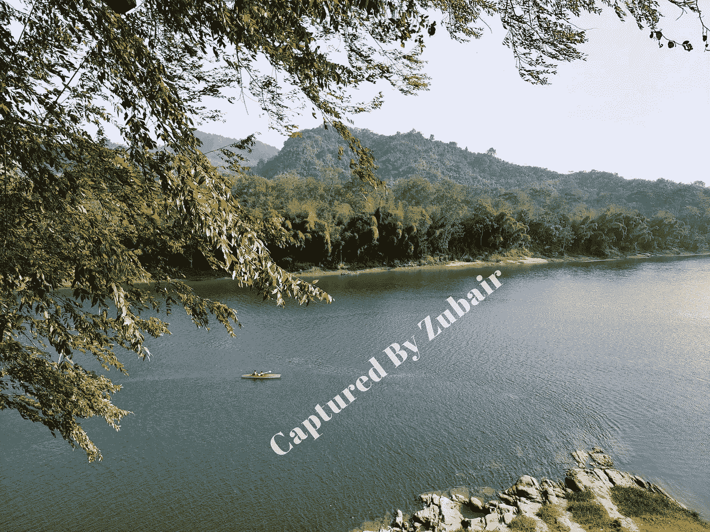
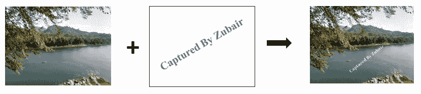
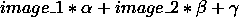
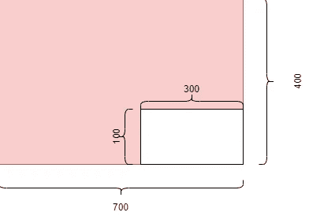
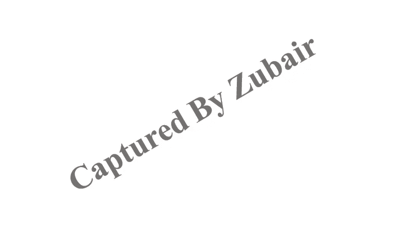

# 图像融合的最简明指南 (CV-03)

> 原文：[`towardsdatascience.com/blend-images-and-create-watermark-with-opencv-d24381b81bd0`](https://towardsdatascience.com/blend-images-and-create-watermark-with-opencv-d24381b81bd0)

## 计算机视觉中的图像融合与粘贴的最简明指南

 [Md. Zubair](https://zubairhossain.medium.com/?source=post_page-----d24381b81bd0--------------------------------)

·发布于 [Towards Data Science](https://towardsdatascience.com/?source=post_page-----d24381b81bd0--------------------------------) ·阅读时间 6 分钟 ·2023 年 4 月 13 日

--

孟加拉国的卡普泰湖（图片由作者提供）

## 动机

在现代世界中，有成千上万的工具可以轻松地对图像进行编辑、调整大小、修改、添加不同效果等操作。但我们很少关心这些操作如何在后台工作。本文将讨论一种重要的图像处理技术，称为***图像融合和粘贴***。这种知识对图像处理和计算机视觉都至关重要。尽管这些技术很简单，但它们是计算机视觉的核心基础之一。

如果你是图像处理和计算机视觉的初学者，本文可能对你有帮助。

`[注意：本文是我计算机视觉系列文章的一部分。你还可以阅读我之前的文章，分别是[**NumPy 和 OpenCV 基础**](https://medium.com/towards-data-science/getting-started-with-numpy-and-opencv-for-computer-vision-555f88536f68)和[**颜色表示**](https://medium.com/towards-data-science/how-color-is-represented-and-viewed-in-computer-vision-b1cc97681b68)。]`

## 目录

1.  `**什么是图像融合？**`

1.  `**什么时候图像融合很重要？**`

1.  `**逐步实施 OpenCV**`

## 什么是图像融合和粘贴？

根据牛津词典，***‘blend’*** 意味着 ***“不同物质或其他事物的混合。”*** 这个词在图像处理和计算机视觉中也有类似的意思。它是一种将两张或更多图像结合起来以创建新图像的技术。输出图像包含输入图像的元素。

图像融合（图片由作者提供）

***无论图像大小相同还是不同，融合都是可能的。*** 两种方法将在实施部分中讨论。

***粘贴***一张图像意味着将图像的像素复制到另一张图像上。

## 什么时候混合很重要？

我们通常需要将两张或多张图像合成一张。一般来说，我们可以使用图像编辑软件来完成。在计算机视觉中，我们需要开发自动化的图像混合过程。在这种情况下，手动编辑是不可能的。因此，这种情况下需要实践知识。

## 使用 OpenCV 的逐步实现

当——我们可以混合图像

1.  `***混合后图像大小相同***`

1.  `***图像大小不同***`

*让我们导入必要的库。*

现在是使用**OpenCV**读取图像的时候了。`cv2.imread()`函数帮助我们读取图像。

先查看第一张图像。

在可视化之前，我将颜色通道从`BGR 到 RGB`进行了转换，因为`OpenCV`以`BGR`格式读取图像。另一方面，matplotlib 以`RGB`格式工作。因此，我通过`c2.COLOR_BGR2RGB`进行了颜色通道的转换。

现在，查看第二张图像。

我们将这两张图像结合起来，在第一张图像上创建水印。

+   **对于相同的图像大小**

在混合相同大小的图像时，图像的形状必须相等。让我们找出图像的形状。

两张图像的形状不同。现在，我们需要重新塑造图像以重塑这些图像。

我们成功地将这两张图像调整为相同的大小。

***我们已到达最后一步来混合图像。***

在图像混合中，我们使用数学公式将两张或多张图像的像素值组合成一张新图像。用于混合的公式是：

在这里，`image_1`和`image_2`是我们要混合的两张图像。**Alpha**和**beta**是混合权重，用于确定每张图像对最终输出的贡献。**Gamma**是一个标量值，添加到结果中以在输出图像中创建噪声。

**alpha、beta 和 gamma**值可以调整以控制输出图像的外观。例如，增加**alpha**值将增加`image_1`对输出的贡献，从而使最终图像更接近于`image_1`。类似地，增加**beta**值将增加`image_2`对输出的贡献，使最终图像更接近于`image_2`。

*下面的代码可以完成这个任务。*

我们使用了`cv2.addWeighted()`函数来按照混合公式混合图像。我们将**alpha 0.4 和 beta 0.6**的值设置为，这意味着第二张图像对最终结果的贡献大于第一张图像。我们将 gamma 的值设置为 0，这意味着结果中没有添加标量值。

最后，我们使用`plt.imshow()`函数显示输出图像。我们发现图像二比图像一更为明显。正如我们使用的，**beta**值大于**alpha**值。

我们成功地混合了大小相同的图像。

> 我们通常需要混合不同大小的图像。没有直接的方法来做到这一点。我们需要遵循一些技巧和过程来实现。在下一节中，我将展示具体实现。

+   **不同大小图像的混合**

导入库和图像后，我们将调整这两张图像的大小，以简化实现。

**创建感兴趣区域（ROI）**

感兴趣区域（ROI）是图像的一部分，你希望单独选择和处理，而不是图像的其余部分。ROI 可以使用坐标或矩形、 polygons 等形状来定义。例如，在图像中的人脸检测中，可以在预期的人脸位置周围选择 ROI，从而提高算法的准确性和效率。以下图形表示展示了其工作原理。

感兴趣区域（作者提供的图像）

在上图中，我们想从大图像（400, 700）中切出一个宽度和高度为（100,300）的小白色区域。我们为任务做了同样的操作。

我们首先选择了一个大图像的部分，其形状与小图像相等，并将其放置在右下角。

这些代码行定义了 **x_off 和 y_off** 作为从图像创建 **ROI** 的水平和垂直偏移量。第一张图像的宽度为 *2400* 像素，高度为 *2000* 像素；第二张图像的宽度和高度为 *1400* 像素。我们希望在第一张图像的右下角创建 ROI，因为我们想将第二张图像粘贴到第一张图像的右下角。

上面的图像是我们将粘贴第二张图像的提取区域。现在是将第二张图像（版权图像）粘贴到提取区域上的时候了。

**创建一个掩模图像以添加水印**

图像掩模技术是选择图像的重要部分并隐藏其余部分。在我们的例子中，我们只想提取以下版权图像中的字母。

作者提供的图片

这是一张有三种颜色通道的图像。让我们将其转换为灰度图像；否则我们将很难进行进一步的操作。

在这里，我们看到文本 ***‘Capture By Zubair,’*** 是黑色的。我们需要保持这部分不变，而改变其他部分。

我们需要创建一个 **掩模** 来分隔图像的前景和背景。在混合图像时，我们需要创建一个表示前景物体形状的掩模，以便我们可以将其隔离并与背景图像混合。

*让我们反转图像像素，将白色变成黑色，将黑色变成白色。*

现在，我们将对反转后的掩模图像执行按位 **OR** 操作，以提取掩模区域的主要颜色。

`[注意：如果你想了解更多关于 OpenCV 的按位 OR 操作，请阅读 [这篇文章](https://dontrepeatyourself.org/post/bitwise-operations-and-image-masking-opencv/)。]`

我们已经成功将版权图像的颜色提取到遮罩区域。接下来，我们将对提取的***ROI 图像***执行按位或操作。

让我们将完整的背景图像与上述图像合并。

我们刚刚用被遮罩的 ROI 图像替换了背景图像的像素。最后，我们在最终图像上添加了水印。

## 结论

我尽力以最简单的方式展示了混合过程。这些知识是计算机视觉的基础之一。

*我为你挑选了一些文章。*

[## 使用 NumPy 和 OpenCV 开始计算机视觉](https://towardsdatascience.com/how-color-is-represented-and-viewed-in-computer-vision-b1cc97681b68?source=post_page-----d24381b81bd0--------------------------------)

### 使用 Python 开始你的计算机视觉编程

[## 计算机视觉中的颜色表示综合指南](https://towardsdatascience.com/getting-started-with-numpy-and-opencv-for-computer-vision-555f88536f68?source=post_page-----d24381b81bd0--------------------------------) 

### 颜色空间和颜色模型详细解释

[## 如何在计算机视觉中表示和查看颜色](https://towardsdatascience.com/how-color-is-represented-and-viewed-in-computer-vision-b1cc97681b68?source=post_page-----d24381b81bd0--------------------------------)
