# 通过有效的特征工程技术提升机器学习模型性能

> 原文：[`towardsdatascience.com/boost-machine-learning-model-performance-through-effective-feature-engineering-techniques-3f176605ec78?source=collection_archive---------11-----------------------#2023-02-22`](https://towardsdatascience.com/boost-machine-learning-model-performance-through-effective-feature-engineering-techniques-3f176605ec78?source=collection_archive---------11-----------------------#2023-02-22)

## 学习适用于信用卡欺诈检测问题的正确特征工程技术，以提高机器学习模型的整体准确性

 [Suhas Maddali](https://suhas-maddali007.medium.com/?source=post_page-----3f176605ec78--------------------------------)

·

[关注](https://medium.com/m/signin?actionUrl=https%3A%2F%2Fmedium.com%2F_%2Fsubscribe%2Fuser%2F2a74f90399ae&operation=register&redirect=https%3A%2F%2Ftowardsdatascience.com%2Fboost-machine-learning-model-performance-through-effective-feature-engineering-techniques-3f176605ec78&user=Suhas+Maddali&userId=2a74f90399ae&source=post_page-2a74f90399ae----3f176605ec78---------------------post_header-----------) 发表于 [数据科学前沿](https://towardsdatascience.com/?source=post_page-----3f176605ec78--------------------------------) ·10 分钟阅读·2023 年 2 月 22 日

--

图片由 [Tierra Mallorca](https://unsplash.com/ja/@tierramallorca?utm_source=medium&utm_medium=referral) 提供，发布在 [Unsplash](https://unsplash.com/?utm_source=medium&utm_medium=referral)

**机器学习**和数据科学在大量行业中得到应用。数据科学最受欢迎的应用之一是在金融领域。许多公司试图自动化任务，例如决定是否向借款人提供贷款或判断交易是否欺诈。此外，还有如客户细分和信用评分等领域，这些领域用于金融中学习客户的各种行为特征，并确定他们的总体信用评分。

虽然技术在**自动化**各种任务方面令人印象深刻，但未能对用于训练机器学习模型的数据集进行正确的特征工程，往往会导致在测试集（模型未见过的数据）上表现不佳。因此，必须在特征工程领域采取有效且高效的策略，以确保模型在测试和生产阶段都能表现良好。

本文主要集中在对信用卡欺诈检测数据集上实施机器学习模型**（xgboost）**，并旨在确定在进行特征工程前后的模型性能差异。通过这种方式，我们可以了解特征工程的重要性，以获得最佳的模型预测。我们将遵循一系列迭代步骤，如读取数据、执行探索性数据分析（EDA）、训练一个没有特征工程的 ML 模型，最后执行特征工程，以观察特征工程对 ML 模型性能的提升。现在让我们逐步介绍这些步骤，并在每个步骤中突出一些关键见解。

# 读取数据

第一步是读取用于欺诈分析的数据集。大多数时候，数据以**‘csv’**格式记录。因此，Python 中有一个名为‘pandas’的库，用于读取‘csv’文件。我们将使用这个库来读取数据，如下所示。

**注意：** 数据集下载自 [`www.kaggle.com/datasets/kartik2112/fraud-detection`](https://www.kaggle.com/datasets/kartik2112/fraud-detection)，许可证为 [CC0: Public Domain](https://creativecommons.org/publicdomain/zero/1.0/)。

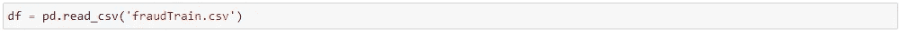

现在数据已被读取，我们查看了一个**列**及其**非空**值的列表。存在如**‘Unnamed: 0’**和**‘trans_num’**这样的列，它们对我们机器学习模型判断交易是否欺诈没有太大意义。在后续部分，我们将采取步骤移除不重要的特征。

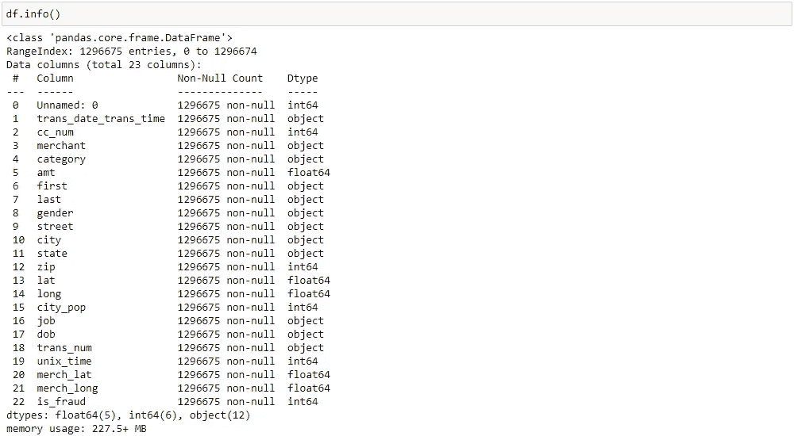

数据信息（图片由作者提供）

从数据中可以看出，没有缺失值，并且每个特征具有不同的数据类型，这在执行特征工程时必须考虑。

# 执行探索性数据分析（EDA）

这一过程是为了更彻底地理解和分析数据。因此，我们能够发现数据中的**缺失值**和**异常值**。如果不去除这些数据，结果可能会出现大量偏斜，并且机器学习模型的性能显著下降。此外，还有**偏差**等问题影响模型，因为模型可能过度学习这些数据点而无法具备泛化能力。正如下面的代码单元所示，我们查看了每一个步骤以及执行探索性数据分析（EDA）所生成的输出。

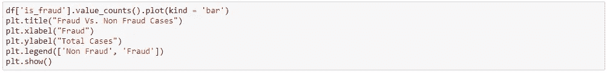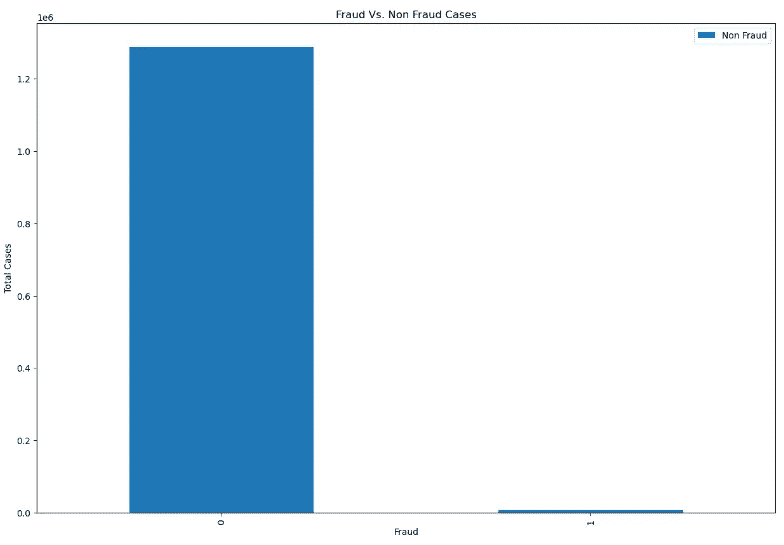

欺诈与非欺诈的计数图（图像作者提供）

从以上可以看出，相较于欺诈交易，非欺诈交易的案例数量更多。这是因为在现实生活中，信用卡欺诈的发生率远低于非欺诈交易的发生率。

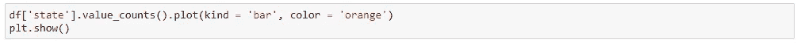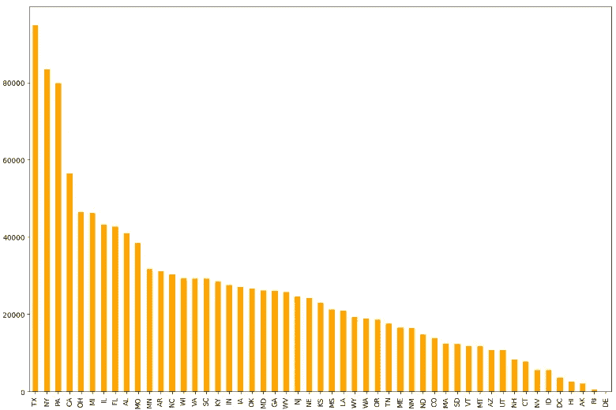

州级计数图（图像作者提供）

我们看到大量交易数据来自**德克萨斯州（TX）**，其次是**纽约州（NY）**及其他州。在进行特征工程时，我们可以计算每个州的平均交易金额，以判断交易是否为欺诈交易。此外，还可以在特征工程中加入最小和最大交易金额等其他特征，以提高机器学习模型的性能。

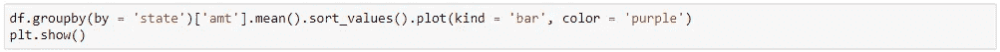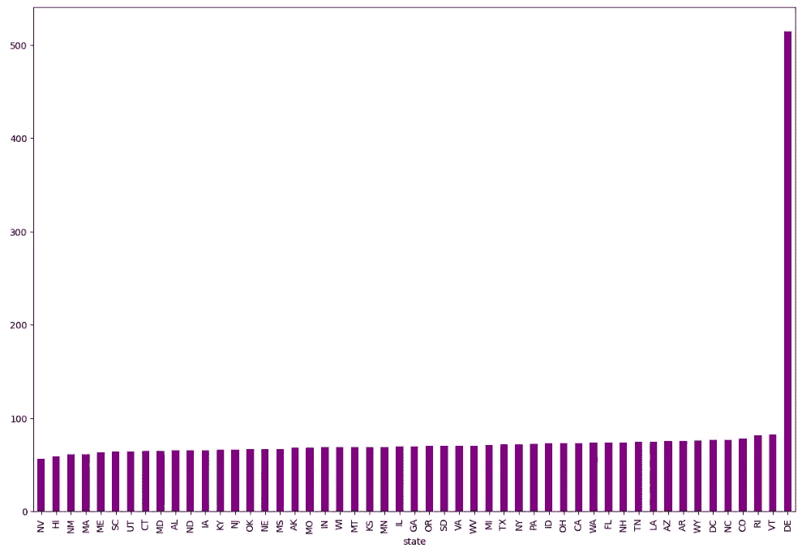

每州平均交易金额图（图像作者提供）

在按州分组数据、计算平均交易金额并进行排序后，**特拉华州**的交易金额明显较高。这清楚地表明我们在特拉华州的数据中存在异常。因此，必须采取措施去除那些包含明显较高或较低值的类别。

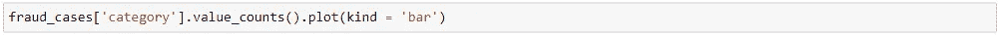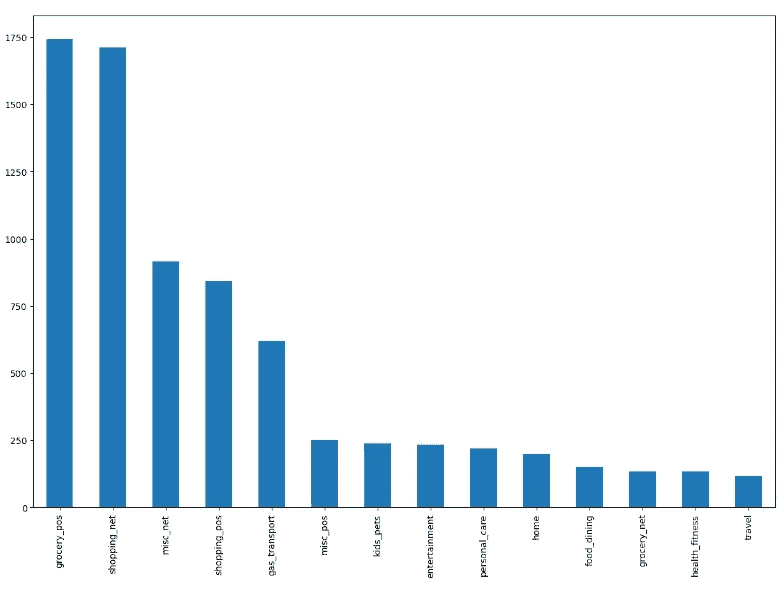

欺诈交易图的分类（图像作者提供）

从图中可以看出，在欺诈案例中，涉及杂货的类别出现频率较高。换句话说，欺诈交易通常以杂货购买的形式出现。这在我们的特征工程中会很有用，因为它帮助机器学习模型基于购买类型判断欺诈的可能性。

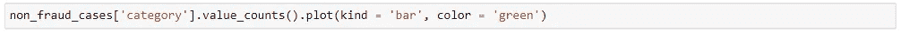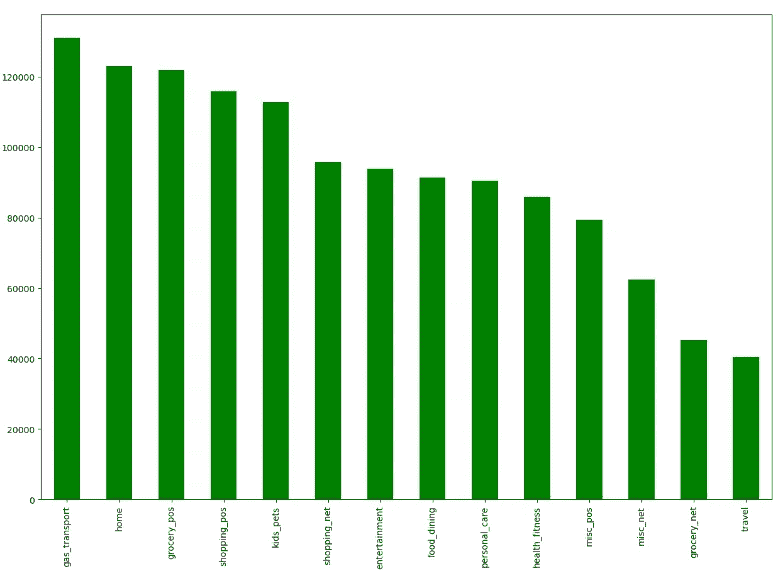

非欺诈交易图的分类（图像作者提供）

另一方面，非欺诈案件主要发生在类别为‘gas_transport’时。其次是‘home’以及其他类别。通过查看上述两个图，我们可以对每个列出的类别的总欺诈和非欺诈交易进行计数，这将为我们的机器学习模型提供对组织欺诈的不同类别的良好理解。

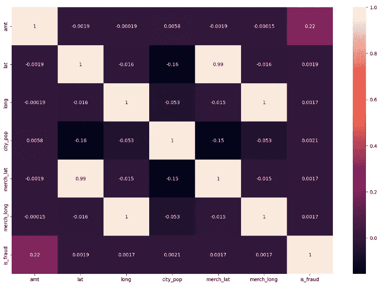

相关性热图（图像由作者提供）

在相关性图中显示，大多数欺诈交易与提取的总金额有很高的相关性。因此，这一特征在我们的模型预测欺诈交易发生时可能非常有用。

# 特征编码

现在我们已经彻底探索并理解了数据，接下来是进行必要的特征工程策略。由于某些数据列中包含字符串值，我们不能直接将其输入到模型中。因此，我们采用一些特征工程策略，如**独热编码**，将这些类别转换为特征。

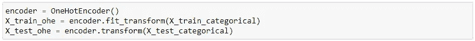

在将分类特征转换为数值之后，接下来是删除之前包含字符串值的分类特征，如上面的代码单元所示。

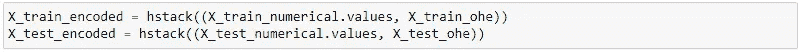

我们**堆叠**了训练集和测试集的编码值，如图所示。需要注意的是，还有其他编码策略，如 TFIDF、Word2Vec 等，但目前我们专注于词袋模型表示特征类别的编码。

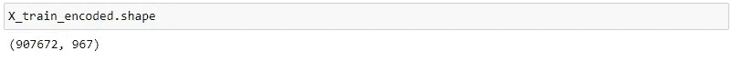

通过检查数据的形状，我们发现由于对分类特征进行了一次热编码，附加了额外的列。

# 在没有特征工程的情况下训练机器学习模型

现在，分类特征已被转换为数值特征并附加到原始数据集中，接下来是应用机器学习模型（xgboost）来预测交易是否欺诈的可能性。

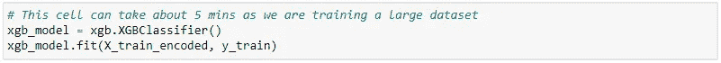

在训练模型时，我们首先初始化模型，并使用**‘.fit’**属性通过提供输入和输出数据来训练模型。我们会得到一组不同的默认超参数来训练模型。

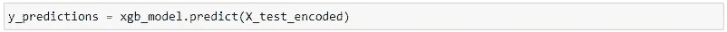

从**测试集**生成的预测结果与为测试模型性能而留出的实际输出进行比较。

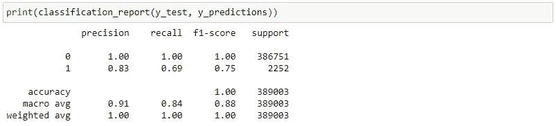

分类报告（图像由作者提供）

可以看出，在非欺诈案件中准确度很高，而在欺诈案件中，整体 f1-score 约为 0.75。因此，我们可以采取正确的步骤，通过使用各种方法来提高欺诈案件的**样本数量**。但目前，算法在进行预测时表现得相当不错。

# 使用特征工程训练 ML 模型

我们可以探索一系列特征工程策略，以提高模型性能。我们常用的最常见方法是标准化和归一化。这确保了特征的尺度与其他特征类似，以便 ML 算法不会优先考虑具有高标准差的特征。

除此之外，还可以基于现有特征集生成更多特征，从而提高模型性能。这样，模型可以学习重要的表示，帮助它确定交易是欺诈还是非欺诈。让我们在本节中详细探讨每一个步骤。

## **缩放**

这是一个操作，其中具有不同尺度的输入特征被转换为所有特征权重相等的形式。在数据集中，可以看到特征‘city_pop’和‘amt’具有不同的尺度，因为 city_pop 只是一个计数，而‘amt’以美元（$）为单位。缩放操作确保所有具有不同尺度的特征在转换后没有尺度差异。

有两种流行的缩放方法：标准化和归一化。让我们应用每种方法，并表格化 ML 模型在这些情况下的表现。

## **标准化**

它将特征的值缩放到使得结果的**均值**为 0，**标准差**为 1 的形式。这个转换是通过从数据点中减去特征的均值，并用特征的标准差除以结果来完成的。

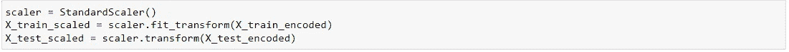

**StandardScaler** 是一个流行的库，用于执行标准化操作。在导入库后，采取步骤来转换训练集和测试集。

## **归一化**

归一化也是特征工程中的一个常用选项。在这种方法中，考虑数据框中的最大值和最小值，然后进行操作。确定这些信息后，将个别特征的值转换为具有最小值 0 和最大值 1 的可能值。

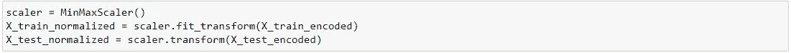

我们使用“normalize”来确保值在 0 到 1 的范围内。同样的操作也在测试集上执行。需要注意的是，最小值和最大值是从训练集中取的，而不是测试集，以避免数据泄漏，导致性能虚高。

## **创建新特性**

现在是时候添加可能提升模型性能的新特性了。为了提高性能，添加对模型最相关的特性将会有用。拥有**领域专业知识**可以在很大程度上帮助基于现有特性添加这些特性。根据我们的知识，我们来添加一些可以提升性能的特性。

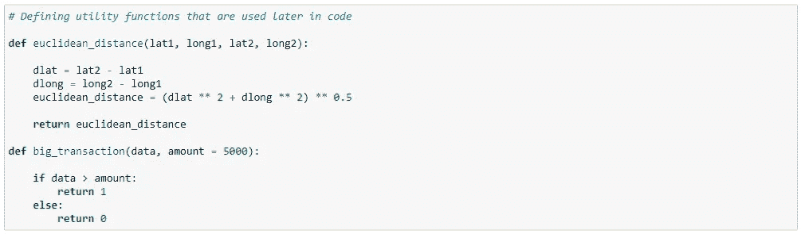

我们添加了**‘euclidean_distance’**特性，因为这将使算法对商家和买家之间的经纬度信息有更好的理解。

此外，我们还在基于交易金额的数据转换上进行处理，并判断是否为大额交易。

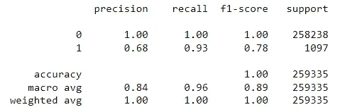

分类报告（图片来自作者）

通过添加如欧几里得距离和标记交易金额的高低等特性，我们通常会看到模型在正类（欺诈交易）的**F1-score**有所提升。

# 结论

在阅读本文后，你应该对特征工程在提升模型性能中的重要性有一个坚定的理解。虽然特征工程在这个问题上产生了良好的影响，但也可能有其他问题不需要大量特征工程，而是需要更多的数据或更好的机器学习模型来预测目标变量。因此，选择特征工程的类型在很大程度上取决于所使用的数据集及特征与目标变量之间的关系。

*以下是你可以联系我或查看我工作的方式。*

***GitHub:***[*suhasmaddali (Suhas Maddali ) (github.com)*](https://github.com/suhasmaddali)

***YouTube:***[*https://www.youtube.com/channel/UCymdyoyJBC_i7QVfbrIs-4Q*](https://www.youtube.com/channel/UCymdyoyJBC_i7QVfbrIs-4Q)

***LinkedIn:***[*(1) Suhas Maddali, Northeastern University, Data Science | LinkedIn*](https://www.linkedin.com/in/suhas-maddali/)

***Medium:*** [*Suhas Maddali — Medium*](https://suhas-maddali007.medium.com/)
