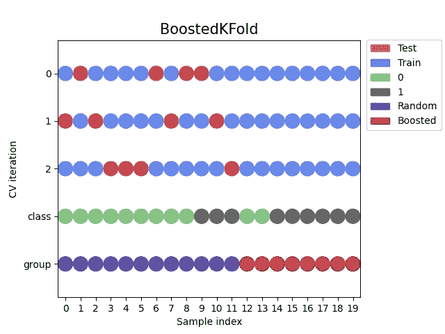

# 处理交叉验证中的提升样本数据

> 原文：[`towardsdatascience.com/boosted-sample-data-in-cross-validation-7ee589460238?source=collection_archive---------16-----------------------#2023-04-18`](https://towardsdatascience.com/boosted-sample-data-in-cross-validation-7ee589460238?source=collection_archive---------16-----------------------#2023-04-18)

排除提升样本数据的交叉验证。图像由 @leddebruijn 提供。

## 一个用于提升样本数据的交叉验证的 Python 实现，以防止数据泄漏和过高估计模型性能

 [Louis de Bruijn](https://medium.louisdebruijn.com/?source=post_page-----7ee589460238--------------------------------)

·

[关注](https://medium.com/m/signin?actionUrl=https%3A%2F%2Fmedium.com%2F_%2Fsubscribe%2Fuser%2Feb6696b15003&operation=register&redirect=https%3A%2F%2Ftowardsdatascience.com%2Fboosted-sample-data-in-cross-validation-7ee589460238&user=Louis+de+Bruijn&userId=eb6696b15003&source=post_page-eb6696b15003----7ee589460238---------------------post_header-----------) 发表在 [Towards Data Science](https://towardsdatascience.com/?source=post_page-----7ee589460238--------------------------------) · 6 分钟阅读 · 2023 年 4 月 18 日 

--

本文介绍了针对提升（上采样）采样策略数据的交叉验证以及在 Python 中的实现。

提升采样通常用于针对（高度）不平衡数据集中少数类标签。如果在交叉验证中未加以考虑，将提升采样数据包含在测试集中，将会增加机器学习模型准确性的偏差。

这个故事帮助我们理解这种偏差，并提供了一个在 Python 中考虑增强样本数据的交叉验证实现。涉及以下主题：

+   不平衡分类

+   随机和增强抽样

+   数据泄露

+   一个不平衡数据示例

+   Python 实现

+   结论

# 不平衡分类

不平衡分类问题是目标变量分布存在偏差或偏斜的分类问题，少数类别的实例很少，而多数类别的实例很多…
