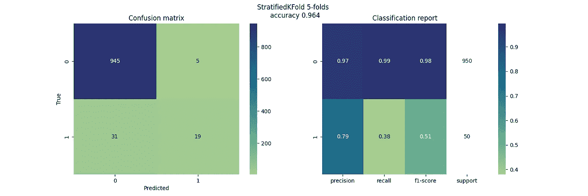

# 处理交叉验证中的增强样本数据

> 原文：[`towardsdatascience.com/boosted-sample-data-in-cross-validation-7ee589460238`](https://towardsdatascience.com/boosted-sample-data-in-cross-validation-7ee589460238)


在交叉验证中排除增强样本数据的测试折叠。图像由 @leddebruijn 提供。

## 防止数据泄漏和过度估计模型性能的增强样本数据交叉验证的 Python 实现

[](https://medium.louisdebruijn.com/?source=post_page-----7ee589460238--------------------------------)[](https://towardsdatascience.com/?source=post_page-----7ee589460238--------------------------------) [Louis de Bruijn](https://medium.louisdebruijn.com/?source=post_page-----7ee589460238--------------------------------)

·发布于 [Towards Data Science](https://towardsdatascience.com/?source=post_page-----7ee589460238--------------------------------) ·阅读时间 6 分钟·2023 年 4 月 18 日

--

本文介绍了增强（上采样）采样策略数据的交叉验证及其在 Python 中的实现。

增强采样通常用于针对（高度）不平衡数据集中的少数类标签。如果在交叉验证中没有考虑，测试集包含增强采样数据将导致机器学习模型的准确性出现偏差。

本文帮助我们理解这种偏差，并提供了考虑增强样本数据的交叉验证的 Python 实现。涉及以下主题：

+   不平衡分类

+   随机和增强采样

+   数据泄漏

+   一个不平衡数据示例

+   Python 实现

+   结论

# 不平衡分类

不平衡分类问题是指目标变量分布有偏或倾斜的问题，其中少数类实例较少，而多数类实例较多。

许多现实世界的问题是不平衡的。例如，互联网购物退货远少于购买，垃圾邮件远少于正常邮件（尽管有时看起来并非如此）。

不平衡分类对监督机器学习模型构成挑战，因为这可能导致模型的预测性能较差，尤其是对少数类。由于目标类的不平衡，算法倾向于分类实例更多的类，即多数类。这引入了对模型准确性的错误感知。

# 随机和增强采样

处理不平衡数据集的一种方法是在数据收集期间平衡目标类别，通常通过一组启发式或业务规则来增强少数类标签采样。

在随机抽样技术中，每个样本被选择的概率是相等的。增强或上采样是一种采样技术，其中一些样本更有可能被选择。它可以人工地采样少数类样本，以平衡不平衡数据集中的类别标签。

例如，抽样年龄在 30 岁以下的人，因为他们比年长的人更频繁地退货。或者抽样包含 *guarantee*、*dollar* 和 *price* 等词的电子邮件，这些都是增强抽样的例子。

# 数据泄露

我们知道，在分割测试集之前进行上采样会导致数据泄露，因为上采样数据现在也出现在我们的测试集中，使得我们的模型更容易预测数据。

然而，当我们有一个包含上采样数据的监督机器学习模型的数据样本时，该怎么做？

我们希望使用这些数据在更平衡的数据集上训练我们的模型，以学习少数类样本的模式（尽管它们本质上有偏）。但我们不希望使用这些数据来测试我们的模型或进行超参数调优。我们如何在所有数据上进行训练，但仅在我们数据的随机抽样子集上进行测试？


在 CV 测试折叠中排除增强样本数据的交叉验证。图像由 @leddebruijn 提供。

`BoostedKFold` 允许在交叉验证折叠的所有训练数据上进行训练，但排除由 `-1` 定义在 `split` 函数的 `groups` 参数中的增强样本数据。如下面的图像所示，训练折叠的索引是独立于组索引抽取的，但测试折叠的索引则来自随机抽样的组，而不是来自增强样本组。

# 一个不平衡数据的例子

让我们看一个例子，使用 `sklearn.make_classification` 二分类数据集，共 1000 个样本，95% 为多数类，5% 为少数类。30% 的少数类标签是通过增强采样技术获得的，其他 70% 是随机抽取的。

在下面的可视化中，你可以看到 `StratifiedKFold` 的 5 折交叉验证的混淆矩阵和分类报告。交叉验证是通过 `cross_val_predict` 在所有测试标签上执行的。正类少数标签 `1` 总共有 50 个样本，包括增强样本数据和随机样本数据。



用于不平衡数据集的 StratifiedKFold。图像由 @leddebruijn 提供。

现在将其与下面的`BoostKFold`实现进行比较。通过自定义`_cross_val_predict`函数在所有测试标签上进行交叉验证，因为`cross_val_predict`无法处理真实 Y 标签中测试集大小的差异。少数类正标签`1`共有 35 个样本，包括随机抽取的样本数据，排除了增强的样本数据。


适用于不平衡数据集的 BoostedKFold。图片来自@leddebruijn。

少数类正类的评估指标显著低于以前的`StratifiedKFold`实现，提供了模型在未见（生产）数据上的更真实表现。这部分由于实例较少（35 比 50），使得少数类更难预测。

然而，性能的下降不能完全用这个来解释。F1 分数下降了一半，而少数类实例仅下降了 30%。性能的剩余下降可以通过去除容易预测的上采样实例来解释，因为模型在训练阶段已经见过类似的上采样数据。

# Python 实现

`BoostedKFold`在内部使用了`StratifiedKFold`和`PredefinedSplit`，这些都在`.split()`方法中实现。我还添加了一个`.plot()`方法，可以可视化在此故事缩略图中显示的分裂。

```py
def split(self, X: np.array, y: np.array, groups: np.array):
    """Generate indices to split data into training and test set, excluding data in groups with value '-1'.

    boosted sample data == '-1' in the ``groups`` parameter
    random sample data != '-1' in the ``groups`` parameter

    Args:
        X (ndarray): array-like of shape (n_samples, n_features)
            Training data, where `n_samples` is the number of samples and `n_features` is the number of features.
        y (ndarray): array-like of shape (n_samples,),
            The target variable for supervised learning problems.
        groups (ndarray): array-like of shape 1d: '-1' for elements to be excluded

    Yields:
        train (ndarray): The training set indices for that split.
        test (ndarray): The testing set indices for that split.
    """
    # separate boosted sample data that have group ``-1``, from random sample data
    boosted_indices = np.where(groups == -1)[0]
    random_indices = np.where(groups != -1)[0]

    skf = StratifiedKFold(n_splits=self.n_splits, shuffle=self.shuffle)
    # split the randomly sampled indices that are to be included in the test-set in ``n_splits`` splits
    stratified_random_splits = skf.split(X[random_indices], y[random_indices])

    random_sampled = [0] * len(random_indices)
    boosted_sampled = [-1] * len(boosted_indices)

    # converts the random stratified split test-set indices to the ``n_splits`` enumeration
    for split_nr, (_, testing_indices) in enumerate(stratified_random_splits):
        # defines which random sample datapoint is in which test-fold
        for test_idx in testing_indices:
            random_sampled[test_idx] = split_nr

    # concatenate the randomly sampled split numbers and the boosted sampling split numbers
    predefined_splits = random_sampled + boosted_sampled
    # boosted samples are not accounted for in the test-fold splits
    ps = PredefinedSplit(test_fold=predefined_splits)

    return ps.split(X)
```

这个实现可以像 scikit-learn 中的其他交叉验证类一样在`sklearn.GridSearchCV`或`sklearn.Pipeline`中使用。有关完整脚本，请访问我的[GitHub 页面](https://github.com/LouisdeBruijn/Medium/tree/master/cross_validation)。

# 结论

上采样数据可以是提升少数类标签的有效方法，这在数据集不平衡的情况下尤为重要。在这个故事中，你了解到数据泄漏的潜在偏差和避免高估分类器性能的方法。

编程愉快！如有任何问题，请随时问我。
